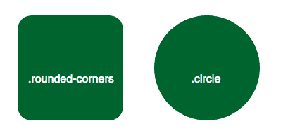
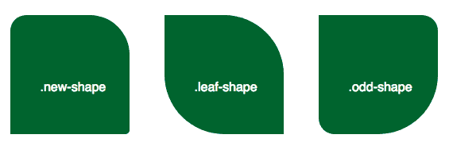
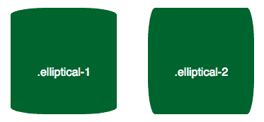
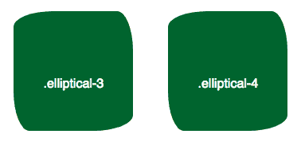

# 如何使用 CSS3 边框半径属性

> 原文：<https://www.freecodecamp.org/news/how-to-use-the-css3-border-radius-property/>

使用 CSS3，您可以通过使用`border-radius`属性给任何元素“圆角”。该值可以是任何有效的 CSS 长度单位。

```
 .rounded-corners {
    border-radius: 20px;
  }

  .circle {
    border-radius: 50%;
  }
```



****注:****`border-radius`属性实际上是`border-top-left-radius`、`border-top-right-radius`、`border-bottom-right-radius`、`border-bottom-left-radius`属性的简称。

如果只提供一个值，所有四个角的边界半径将是相同的，如上面的例子所示。但是您也可以选择为每个角指定不同的值。

```
.new-shape {
  border-radius: 20px 50px 5px 0; /* top left, top right, bottom right, bottom left */
}
```

如果只提供了两个值，第一个值应用于左上角和右下角，第二个值应用于右上角和左下角。

```
.leaf-shape {
  border-radius: 0 50%;
}
```

如果设置了三个值，第一个值再次应用于左上半径，第二个值指示右上和左下，第三个值指示右下角。

```
.odd-shape {
  border-radius: 0 20px 50%;
}
```



拐角的倒圆不必完全对称。您可以使用斜线(“/”)指定水平和垂直半径，以获得椭圆形状的拐角。

```
.elliptical-1 {
  border-radius: 50px/10px; /* horizontal radius / vertical radius */
}
.elliptical-2 {
  border-radius: 10px/50px; 
}
```



因为在上面的例子中只给出了一对值，所以所有的四个角都是相同的。但是，当然，如果您想要一个更复杂的形状，您可以为水平半径提供四个值，为垂直半径提供四个值。

```
.elliptical-3 {
  border-radius: 50px 20px 50px 20px/20px 50px 20px 50px; /* horizontal top-left, horizontal top-right, horizontal bottom-right, horizontal bottom-left / vertical top-left, vertical top-right, vertical bottom-right, vertical bottom-left */
}
```

请注意上面的简写与下面指定单个属性产生的结果是一样的。请注意，当单独设置角时，值是用空格分隔的，而不是用斜杠分隔的。

```
.elliptical-4 {
  border-top-left-radius: 50px 20px; /* horizontal radius, vertical radius */
  border-top-right-radius: 20px 50px;
  border-bottom-right-radius: 50px 20px;
  border-bottom-left-radius: 20px 50px;
}
```



## 关于 CSS 边框半径属性的更多信息:

*   [通过构建计算器学习使用 CSS 边框半径属性](https://www.freecodecamp.org/news/learn-css-border-radius-property-by-building-a-calculator-53497cd8071d/)