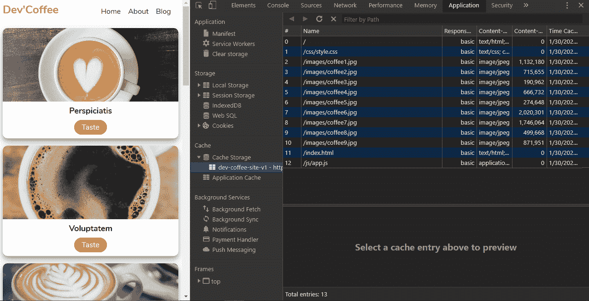

# 如何使用 HTML、CSS 和 JavaScript 从头开始构建 PWA

> 原文：<https://www.freecodecamp.org/news/build-a-pwa-from-scratch-with-html-css-and-javascript/>

渐进式网络应用程序是一种将本地应用程序的感觉带到传统网络应用程序中的方式。借助 PWAs，我们可以利用移动应用功能增强我们的网站，从而提高可用性并提供出色的用户体验。

在本文中，我们将使用 HTML、CSS 和 JavaScript 从头构建一个 PWA。以下是我们将涉及的主题:

*   [什么是渐进式网络应用？](#what-is-a-progressive-web-app)
*   [Markup](#markup)
*   [造型](#styling)
*   [用 JavaScript 显示数据](#show-data-with-javascript)
*   [网络应用清单](#web-app-manifest)
*   [什么是服务人员？](#what-is-a-service-worker)
*   [缓存资产](#cache-the-assets)
*   [获取资产](#fetch-the-assets)
*   [登记服务人员](#register-the-service-worker)
*   [最终想法](#final-thoughts)
*   [接下来的步骤](#next-steps)

那么，让我们从一个重要的问题开始:到底什么是 PWA？

## 什么是渐进式网络应用？

渐进式 web 应用程序是一种通过使用现代 web 功能向用户提供类似应用程序的体验的 Web 应用程序。最终，它只是一个在浏览器中运行的普通网站，只是做了一些改进。它赋予你能力:

*   要将其安装在移动主屏幕上
*   脱机时访问它
*   要使用摄像机
*   获取推送通知
*   进行后台同步

还有更多。

然而，为了能够将我们的传统 web 应用程序转换为 PWA，我们必须通过添加 web 应用程序清单文件和服务工作者来对其进行一点调整。

不要担心这些新术语，我们将在下面介绍它们。

首先，我们必须构建传统的 web 应用程序。所以让我们从标记开始。

## 利润

HTML 文件相对简单。我们将所有东西都包装在`main`标签中。

*   在`index.html`

```
<!DOCTYPE html>
<html lang="en">
  <head>
    <meta charset="UTF-8" />
    <meta name="viewport" content="width=device-width, initial-scale=1.0" />
    <meta http-equiv="X-UA-Compatible" content="ie=edge" />
    <link rel="stylesheet" href="css/style.css" />
    <title>Dev'Coffee PWA</title>
  </head>
  <body>
    <main>
      <nav>
        <h1>Dev'Coffee</h1>
        <ul>
          <li>Home</li>
          <li>About</li>
          <li>Blog</li>
        </ul>
      </nav>
      <div class="container"></div>
    </main>
    <script src="js/app.js"></script>
  </body>
</html> 
```

并创建一个带有`nav`标签的导航栏。然后，带有类`.container`的`div`将保存我们稍后用 JavaScript 添加的卡片。

现在我们已经解决了这个问题，让我们用 CSS 来设计它的样式。

## 式样

这里，像往常一样，我们从导入我们需要的字体开始。然后我们会做一些重置来防止默认行为。

*   在`css/style.css`

```
@import url("https://fonts.googleapis.com/css?family=Nunito:400,700&display=swap");
* {
  margin: 0;
  padding: 0;
  box-sizing: border-box;
}
body {
  background: #fdfdfd;
  font-family: "Nunito", sans-serif;
  font-size: 1rem;
}
main {
  max-width: 900px;
  margin: auto;
  padding: 0.5rem;
  text-align: center;
}
nav {
  display: flex;
  justify-content: space-between;
  align-items: center;
}
ul {
  list-style: none;
  display: flex;
}

li {
  margin-right: 1rem;
}
h1 {
  color: #e74c3c;
  margin-bottom: 0.5rem;
} 
```

然后，我们将`main`元素的最大宽度限制为`900px`，使其在大屏幕上看起来更好。

对于导航栏，我希望徽标在左边，链接在右边。所以对于`nav`标签，在使其成为 flex 容器之后，我们使用`justify-content: space-between;`来对齐它们。

*   在`css/style.css`

```
.container {
  display: grid;
  grid-template-columns: repeat(auto-fit, minmax(15rem, 1fr));
  grid-gap: 1rem;
  justify-content: center;
  align-items: center;
  margin: auto;
  padding: 1rem 0;
}
.card {
  display: flex;
  align-items: center;
  flex-direction: column;
  width: 15rem auto;
  height: 15rem;
  background: #fff;
  box-shadow: 0 10px 20px rgba(0, 0, 0, 0.19), 0 6px 6px rgba(0, 0, 0, 0.23);
  border-radius: 10px;
  margin: auto;
  overflow: hidden;
}
.card--avatar {
  width: 100%;
  height: 10rem;
  object-fit: cover;
}
.card--title {
  color: #222;
  font-weight: 700;
  text-transform: capitalize;
  font-size: 1.1rem;
  margin-top: 0.5rem;
}
.card--link {
  text-decoration: none;
  background: #db4938;
  color: #fff;
  padding: 0.3rem 1rem;
  border-radius: 20px;
} 
```

我们将有几个卡片，所以对于容器元素，它将显示为一个网格。而且，有了`grid-template-columns: repeat(auto-fit, minmax(15rem, 1fr))`，我们现在可以让我们的卡响应迅速，如果有足够的空间，它们至少使用`15rem`宽度(如果没有空间，则使用`1fr`)。

为了让它们看起来更好，我们在`.card`类上加倍阴影效果，在`.card--avatar`上使用`object-fit: cover`来防止图像拉伸。

现在看起来好多了——但是我们仍然没有数据显示。

让我们在下一节中解决它

## 用 JavaScript 显示数据

请注意，我使用了需要一些时间来加载的大图像。这将以最好的方式向你展示服务人员的力量。

前面说过了，`.container`类会握着我们的牌。因此，我们需要选择它。

*   在`js/app.js`

```
const container = document.querySelector(".container")
const coffees = [
  { name: "Perspiciatis", image: "images/coffee1.jpg" },
  { name: "Voluptatem", image: "images/coffee2.jpg" },
  { name: "Explicabo", image: "images/coffee3.jpg" },
  { name: "Rchitecto", image: "images/coffee4.jpg" },
  { name: " Beatae", image: "images/coffee5.jpg" },
  { name: " Vitae", image: "images/coffee6.jpg" },
  { name: "Inventore", image: "images/coffee7.jpg" },
  { name: "Veritatis", image: "images/coffee8.jpg" },
  { name: "Accusantium", image: "images/coffee9.jpg" },
] 
```

然后，我们创建一个带有名字和图像的卡片数组。

*   在`js/app.js`

```
const showCoffees = () => {
  let output = ""
  coffees.forEach(
    ({ name, image }) =>
      (output += `
              <div class="card">
                
                <h1 class="card--title">${name}</h1>
                <a class="card--link" href="#">Taste</a>
              </div>
              `)
  )
  container.innerHTML = output
}

document.addEventListener("DOMContentLoaded", showCoffees) 
```

有了上面的代码，我们现在可以遍历数组并在 HTML 文件中显示它们。为了让一切正常工作，我们要等到 DOM(文档对象模型)内容加载完毕后再运行`showCoffees`方法。

我们已经做了很多，但目前，我们只有一个传统的 web 应用程序。因此，让我们在下一节通过介绍一些 PWA 功能来改变这种情况。


## Web 应用程序清单

web 应用程序清单是一个简单的 JSON 文件，它通知浏览器关于您的 web 应用程序的信息。它告诉当它安装在用户的移动设备或桌面上时应该如何表现。要显示添加到主屏幕提示，需要 web 应用程序清单。

现在我们知道了什么是 web manifest，让我们在根目录下创建一个名为`manifest.json`(必须这样命名)的新文件。然后在下面添加这个代码块。

*   在`manifest.json`

```
{
  "name": "Dev'Coffee",
  "short_name": "DevCoffee",
  "start_url": "index.html",
  "display": "standalone",
  "background_color": "#fdfdfd",
  "theme_color": "#db4938",
  "orientation": "portrait-primary",
  "icons": [
    {
      "src": "/images/icons/icon-72x72.png",
      "type": "image/png", "sizes": "72x72"
    },
    {
      "src": "/images/icons/icon-96x96.png",
      "type": "image/png", "sizes": "96x96"
    },
    {
      "src": "/images/icons/icon-128x128.png",
      "type": "image/png","sizes": "128x128"
    },
    {
      "src": "/images/icons/icon-144x144.png",
      "type": "image/png", "sizes": "144x144"
    },
    {
      "src": "/images/icons/icon-152x152.png",
      "type": "image/png", "sizes": "152x152"
    },
    {
      "src": "/images/icons/icon-192x192.png",
      "type": "image/png", "sizes": "192x192"
    },
    {
      "src": "/images/icons/icon-384x384.png",
      "type": "image/png", "sizes": "384x384"
    },
    {
      "src": "/images/icons/icon-512x512.png",
      "type": "image/png", "sizes": "512x512"
    }
  ]
} 
```

最终，它只是一个带有一些强制和可选属性的 JSON 文件。

名称:当浏览器启动闪屏时，它将是屏幕上显示的名称。

short_name:它将是显示在主屏幕上您的应用程序快捷方式下方的名称。

start_url:这是当你的应用程序打开时显示给用户的页面。

显示:它告诉浏览器如何显示应用程序。有`minimal-ui`、`fullscreen`、`browser`等几种模式。在这里，我们使用`standalone`模式来隐藏与浏览器相关的所有内容。

background_color:当浏览器启动闪屏时，它将是屏幕的背景。

theme_color:它将是我们打开应用程序时状态栏的背景色。

方向:它告诉浏览器显示应用程序时的方向。

图标:当浏览器启动闪屏时，它将是屏幕上显示的图标。在这里，我使用了所有尺寸来适应任何设备的首选图标。但是你可以只用一两个。这取决于你。

现在我们有了一个 web 应用程序清单，让我们将它添加到 HTML 文件中。

*   在`index.html`(头部标签)中

```
<link rel="manifest" href="manifest.json" />
<!-- ios support -->
<link rel="apple-touch-icon" href="images/icons/icon-72x72.png" />
<link rel="apple-touch-icon" href="images/icons/icon-96x96.png" />
<link rel="apple-touch-icon" href="images/icons/icon-128x128.png" />
<link rel="apple-touch-icon" href="images/icons/icon-144x144.png" />
<link rel="apple-touch-icon" href="images/icons/icon-152x152.png" />
<link rel="apple-touch-icon" href="images/icons/icon-192x192.png" />
<link rel="apple-touch-icon" href="images/icons/icon-384x384.png" />
<link rel="apple-touch-icon" href="images/icons/icon-512x512.png" />
<meta name="apple-mobile-web-app-status-bar" content="#db4938" />
<meta name="theme-color" content="#db4938" /> 
```

如您所见，我们将`manifest.json`文件链接到了 head 标签。并添加一些处理 iOS 支持的其他链接来显示图标，并用我们的主题颜色给状态栏着色。

至此，我们现在可以进入最后一部分，介绍服务人员。

## 什么是服务人员？

注意，PWAs 只在 https 上运行，因为服务工作者可以访问请求并处理它。因此，安全性是必需的。

服务工作者是您的浏览器在单独的线程中在后台运行的脚本。这意味着它运行在不同的地方，完全独立于你的网页。这就是它不能操纵你的 DOM 元素的原因。

然而，它超级强大。服务人员可以拦截和处理网络请求，管理缓存以支持离线支持，或者向您的用户发送推送通知。


因此，让我们在根文件夹中创建我们的第一个服务工作者，并将其命名为`serviceWorker.js`(名称由您决定)。但是你必须把它放在根目录中，这样你就不会把它的范围限制在一个文件夹中。

### 缓存资产

*   在`serviceWorker.js`

```
const staticDevCoffee = "dev-coffee-site-v1"
const assets = [
  "/",
  "/index.html",
  "/css/style.css",
  "/js/app.js",
  "/images/coffee1.jpg",
  "/images/coffee2.jpg",
  "/images/coffee3.jpg",
  "/images/coffee4.jpg",
  "/images/coffee5.jpg",
  "/images/coffee6.jpg",
  "/images/coffee7.jpg",
  "/images/coffee8.jpg",
  "/images/coffee9.jpg",
]

self.addEventListener("install", installEvent => {
  installEvent.waitUntil(
    caches.open(staticDevCoffee).then(cache => {
      cache.addAll(assets)
    })
  )
}) 
```

这段代码看起来很吓人，但它只是 JavaScript(所以不要担心)。

我们声明缓存的名称`staticDevCoffee`以及要存储在缓存中的资产。为了执行这个动作，我们需要给`self`附加一个监听器。

`self`就是服务人员本身。它使我们能够倾听生命周期事件，并做一些事情作为回报。

服务工作者有几个生命周期，其中之一是`install`事件。它在安装服务人员时运行。工作者一执行就触发它，每个服务工作者只调用一次。

当`install`事件被触发时，我们运行回调函数，该函数允许我们访问`event`对象。

在浏览器上缓存一些东西可能要花一些时间才能完成，因为它是异步的。

所以要处理它，我们需要使用`waitUntil()`，正如你可能猜到的，它等待动作完成。

一旦缓存 API 准备就绪，我们就可以运行`open()`方法，并通过将其名称作为参数传递给`caches.open(staticDevCoffee)`来创建我们的缓存。

然后它返回一个承诺，帮助我们用`cache.addAll(assets)`将资产存储在缓存中。



希望你还在我身边。


现在，我们已经成功地在浏览器中缓存了我们的资产。下次我们加载页面时，如果我们离线，服务工作者将处理请求并获取缓存。

所以，让我们去取我们的缓存。

### 获取资产

*   在`serviceWorker.js`

```
self.addEventListener("fetch", fetchEvent => {
  fetchEvent.respondWith(
    caches.match(fetchEvent.request).then(res => {
      return res || fetch(fetchEvent.request)
    })
  )
}) 
```

这里，我们使用`fetch`事件来取回我们的数据。回调让我们可以访问`fetchEvent`。然后我们附加`respondWith()`来阻止浏览器的默认响应。相反，它返回一个承诺，因为获取操作可能需要一段时间才能完成。

一旦缓存就绪，我们就应用`caches.match(fetchEvent.request)`。它将检查缓存中的内容是否与`fetchEvent.request`匹配。顺便说一下，`fetchEvent.request`只是我们的阵列资产。

然后，它返回一个承诺。最后，如果结果存在，我们可以返回结果，如果不存在，我们可以返回初始获取。

现在，服务人员可以缓存和获取我们的资产，这大大增加了我们图像的加载时间。

最重要的是，它使我们的应用程序在离线模式下可用。

但是单靠一个服务人员无法完成这项工作。我们需要在我们的项目中注册它。


## 登记服务人员

*   在`js/app.js`

```
if ("serviceWorker" in navigator) {
  window.addEventListener("load", function() {
    navigator.serviceWorker
      .register("/serviceWorker.js")
      .then(res => console.log("service worker registered"))
      .catch(err => console.log("service worker not registered", err))
  })
} 
```

这里，我们首先检查当前的浏览器是否支持`serviceWorker`(因为它仍然不被所有的浏览器支持)。

然后，我们监听页面加载事件，通过将我们的文件名`serviceWorker.js`作为参数传递给`navigator.serviceWorker.register()`来注册我们的服务工作者。

通过此次更新，我们现在已经将常规 web 应用程序转换为 PWA。


## 最后的想法

在这篇文章中，我们已经看到了 PWAs 有多神奇。通过添加一个 web 应用清单文件和一个服务人员，它确实改善了我们传统 web 应用的用户体验。这是因为 pwa 快速、安全、可靠，最重要的是，它们支持离线模式。

现在很多框架都附带了一个已经为我们设置好的服务工作者文件。但是知道如何用普通的 JavaScript 实现它可以帮助你理解 PWAs。

您还可以通过动态缓存资产或限制缓存大小等方式，对服务人员进行更深入的管理。

感谢阅读这篇文章。

你可以在这里现场查看[，源代码在这里](https://devcoffee-pwa.netlify.com/)查看[。](https://github.com/ibrahima92/pwa-with-vanilla-js)

在我的博客上阅读更多我的文章

## 后续步骤

[Web 清单文档](https://developers.google.com/web/fundamentals/web-app-manifest)

[服务人员文档](https://developers.google.com/web/fundamentals/primers/service-workers)

[网页清单生成器](https://app-manifest.firebaseapp.com/)

[浏览器支持](https://caniuse.com/#search=service%20worker)