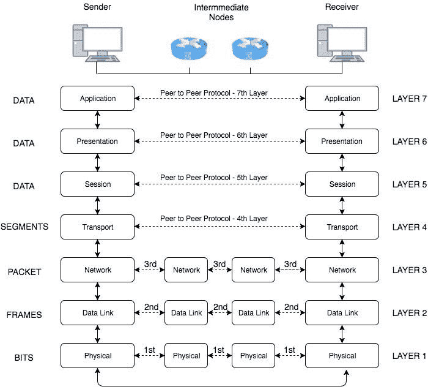

# OSI 层的速成课程

> 原文：<https://www.freecodecamp.org/news/a-crash-course-in-osi-layers/>

### **简介**

你有没有想过数据是如何通过网络从一台机器发送到另一台机器的？如果是，那么开放系统互连模型就是您正在寻找的。

OSI 模型用于帮助标准化和表征数据应该如何从发送方流向接收方，而不考虑端点(发送方、接收方)的底层内部结构。

提出这个模型的组织是国际标准化组织**，因此这个模型被正式称为 ****ISO - OSI**** 。**

### ****架构****

**如下图所示，模型将网络分为 ****7 层**** 。OSI 模型中的数据通信从发送方堆栈的顶层(应用层)开始，沿堆栈向下到达发送方的最低层(物理层)，然后通过物理网络连接到达接收方的底层，最后到达 OSI 模型堆栈。**

**我们采用分层的方法，因为与单一的复杂模型相比，设计具有专用功能的独立层是很容易的。**

****

### ********重要观察********

*   *****端到端层:***** 在上图中，你会注意到协议的上层(应用层-传输层)，发送方和接收方的层通过箭头直接相连。这是因为这些层不知道用于传输数据的中间设备(如交换机和路由器)。这些层似乎彼此直接通信。
*   *****数据单位:***** 在上图中，最左边是每个图层使用的数据单位。传输层(及其下的层)对于从发送方传输到接收方的数据单元有一个唯一的名称。

### ******图层功能******

*   *****第 1 层——物理层:***** 物理层是 OSI 各层中最低也是最复杂的一层。这是因为所使用的底层硬件技术。这一层的功能是定义如何传输比特流而不是逻辑数据包。它处理定义比特将在哪个频率上传输、将使用哪种调制、比特将如何分组以及传输比特所需的其他低层物理参数。
*   *****第二层——数据链路层:***** 数据链路层负责向同一局域网(LAN)上的相邻设备传输数据。这一层也有规定，以确保无错数据从物理层传递到更高层。因此，它包含错误检测和纠正机制，以确保维护数据的完整性。
*   *****第三层——网络层:***** 网络层负责将数据包转发到其他网络。通常，一个网络被划分为多个子网，网络层在路由器的帮助下在这些网络之间转发数据包，以建立广域网(WAN)。
*   *****第 4 层——传输层:***** 传输层确保消息无错、有序、无丢失、无重复地传递。它使更高层协议不必关心它们与对等方之间的数据传输。
*   *****第五层-会话层:***** 会话层允许运行在不同站点上的进程之间建立会话。
*   *****第 6 层——表示层:***** 表示层格式化要呈现给应用层的数据。
*   *****第七层——应用层:***** 应用层作为用户和应用进程访问网络服务的窗口。