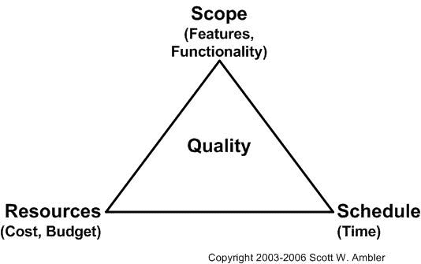

# 铁三角，或者说“挑两个”

> 原文：<https://www.freecodecamp.org/news/the-iron-triangle-or-pick-two/>

软件开发是在实现的特性、特性的质量以及生产需要多长时间之间的一系列权衡。但是，无论投入多少努力，都无法在不增加项目成本的情况下可持续地最大化这三者。

对于软件开发来说，成本通常与分配到项目中工作的人数直接相关。这个概念经常被总结为“挑二:质量、速度、特色”。

质量、功能、速度和成本之间的关系可以通过想象一个体积固定的三角形来说明，体积就是质量。人们可以提高实现和特性的速度，但如果成本不变，保持三角形的体积不变，质量就会受到影响。

通常假设成本是恒定的，因为在大多数情况下，成本是固定的，没有预算来增加更多的人员，也没有人可以从其他项目转移过来。

## 更多信息

*   [破碎的铁三角反格局](http://www.ambysoft.com/essays/brokenTriangle.html)经典散文[斯科特·安布勒](https://en.wikipedia.org/wiki/Scott_Ambler)