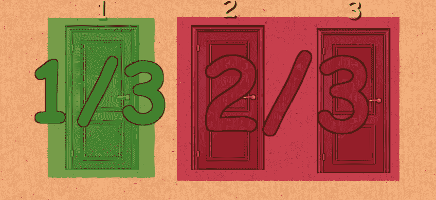
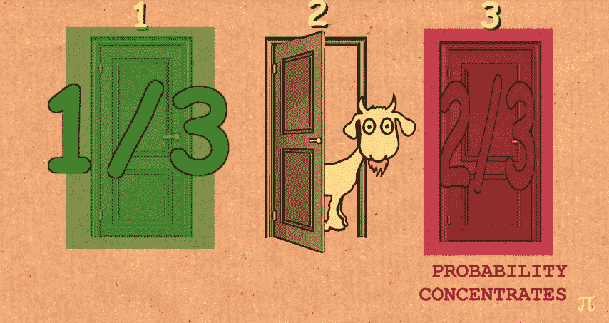
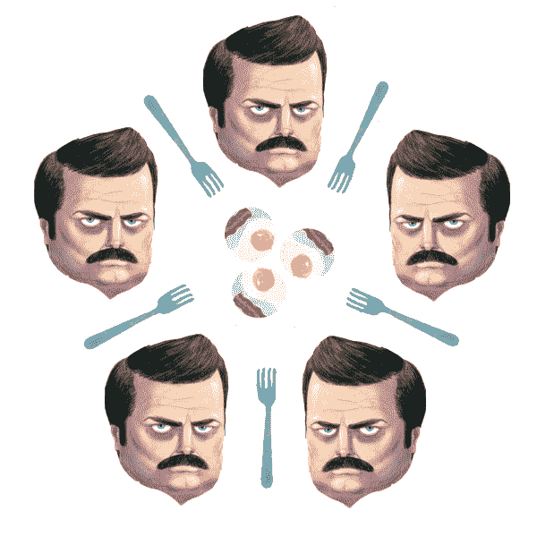
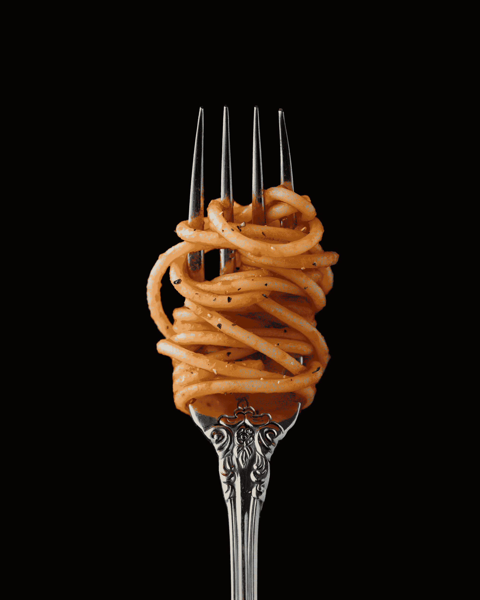

# 常见的逻辑谜题——骑士与无赖、蒙蒂·霍尔和哲学家进餐问题解释

> 原文：<https://www.freecodecamp.org/news/common-logic-puzzles-the-knights-and-knaves-monty-hall-and-dining-philosophers-problems-explained/>

虽然与编程没有严格的联系，但是逻辑谜题是你下一次编程的一个很好的热身。你可能会在下一次技术面试中遇到一个逻辑难题，以此来判断你解决问题的能力，所以这是值得准备的。

在本文中，我们收集了一些著名的逻辑难题及其解答。不偷看答案能解决吗？

## 骑士和无赖

对于这个逻辑难题，假设有两种人，骑士和无赖。骑士只说真话，无赖只说假话。

这个谜题有很多种，但大多数都是问一个问题来判断谁是骑士，谁是无赖。

### 红色和蓝色

有两个人站在你面前，红的和蓝的。蓝色说:“我们都是无赖。”谁是真正的骑士，谁是无赖？

**解**
蓝不可能是骑士。如果布鲁是一名骑士，“我们都是无赖”这句话实际上是一个谎言。因此，蓝色是一个无赖，因为他的声明是一个谎言，红色必须是一个骑士。

### 两条路

你来到了一个岔路口，需要选择正确的道路，通往你的目的地。有两个人站在岔口，你知道一个肯定是骑士，一个肯定是流民。

你会问其中一个人哪个问题来决定正确的路径，A 还是 B？

解决方案
你可以问任何一个人的问题是，“对方会告诉我哪条路是正确的？”答案永远是要走的错误的路，你可以安全地走另一条路。

想象正确的路径是 A.

如果直接问“哪条是正确的路径？”杰克会说 B 是正确的，而骑士会说 a。

然而，当被问及其他*人会说哪条路径是正确的时，杰克会撒谎说骑士会告诉你路径 B 是正确的。与此同时，骑士会告诉杰克的答案，并说杰克会告诉你路径 B 是正确的。

在这两种情况下你都知道那么答案，路径 B，其实是一个谎言，所以你应该走另一条路径。*

## 蒙蒂·霍尔问题

蒙蒂霍尔问题是一个关于概率的谜语，以 70 年代游戏节目主持人的名字命名，它基于*让我们做个交易*。这个特殊的问题是一个[真实悖论](https://en.wikipedia.org/wiki/Paradox)，这意味着有一个解决方案看似违反直觉，但却被证明是正确的。

想象你在一个游戏节目中，有三扇门，每扇门后面都有不同的奖品。三扇门中的一扇门后是一辆汽车。另外两扇门后有山羊。

您必须从三扇门中选择一扇门作为您的奖品。

假设你决定打开 1 号门。知道车在哪里的主人打开了另一扇门，2 号门，里面是一只山羊。然后他问你是否愿意打开 3 号门。

你应该选择门 3 而不是你最初的选择吗？这有关系吗？

**解决方案**
事实证明，你的选择真的很重要，选择 3 号门而不是 1 号门实际上对你有利。原因如下。

当你从三扇紧闭的门中选择了第一扇门时，你有三分之一的机会选对了门。2 号门和 3 号门也有 1/3 的几率后面有车。

另一种思考方式是，2 号门和 3 号门有三分之二的机会有一辆车在后面*合*。

但是当主人打开 2 号门，露出山羊的时候，你突然有了更多关于这个问题的信息。

记住 2 号门和 3 号门有三分之二的时间隐藏汽车。当 2 号门打开时，你知道后面没有车。

但是这种揭示并不改变两扇门的组合概率。这是这里的关键要点！

既然你知道 2 号门有 0/3 的机会藏起汽车，你现在可以说有 2/3 的机会汽车在 3 号门后面。1 号门保持不变——只有 1/3 的车在它后面。

因此，如果你决定换车，找到车的几率从大约 33.33%上升到 66.67%。换句话说，你打开 3 号门，成功的机会就加倍了！

是的，有可能 1 号门一直藏着，主机骗了你。那不重要。你接受这笔交易是在赌博，但你赌得很聪明。你应该根据给你的信息做出最好的决定，然后放手一搏。

从长远来看，你会比选择第一选择的选手表现得更好。虽然不是很明显，但主人实际上是在帮你的忙，给你提供了一个更好的交易。

## **哲学家进餐问题**

哲学家进餐问题是计算机科学中说明同步问题的一个经典例子。它最初是由 Edsger Dijkstra 在 1965 年创建的，他把它作为几台计算机竞争访问共享磁带驱动器的形式展示给他的学生。

想象一下，五个沉默的哲学家围坐在一张桌子旁，每人一碗意大利面条。每对相邻的哲学家之间的桌子上有叉子。

Image courtesy of [adit.io](http://adit.io/posts/2013-05-11-The-Dining-Philosophers-Problem-With-Ron-Swanson.html).

每个哲学家一次只能做一件事:思考和吃饭。然而，一个哲学家只有在左右叉子都有的时候才能吃到意大利面。叉子一次只能被一个哲学家拿着。

在一个哲学家吃完饭后，他们需要放下左右叉子，这样其他人就可以用了。哲学家可以一有叉子就拿走，但是只有当他们有了两把叉子时才能开始吃东西。

哲学家们以他们的胃口而闻名——他们都可以无休止地吃，永远不会饱。最重要的是，不管吃了多少碗意大利面，它们都会神奇地补充营养。

问题是，你怎么能保证没有哲学家会饿死，他们能永远继续吃饭和思考？

### 同步和死锁

简单地说，哲学家进餐问题是对共享资源的同步访问如何导致死锁情况的一个例证。

****同步**** 用于控制对共享资源的并发访问。这在任何情况下都是必要的，在这种情况下，多个独立的参与者可能会竞争使用一个资源，如 forks。因为只有一个资源可用，所以我们使用同步来防止混乱和无序。

一个 ****死锁**** 是一个不可能有进展的系统状态。当强制执行同步时，会发生这种情况，许多进程最终会等待由其他进程占用的共享资源。就像那些陷入吃饭或思考的哲学家一样，这些过程只是一直等待，不再继续执行。

### 解决方法

乍一看，似乎不可能出现所有哲学家要么吃饭要么思考的僵局。例如，每个哲学家应该遵循模式可能是:

> 1:思考到左叉可用；当它是，拿起它；
> 
> 2:思考到右叉可用；当它是，拿起它；
> 
> 3:两把叉子都握着的时候，吃固定量的时间；
> 
> 4:然后，把右叉放下；
> 
> 5:然后，把左叉放下；
> 
> 6:从头重复。
> 
> 来源:[维基百科](https://en.wikipedia.org/wiki/Dining_philosophers_problem)

有许多解决方案可以防止死锁。如果我们仔细观察，上面算法中的一个问题是，所有哲学家获得一个分叉的机会相等(具有相同的优先级)。这阻止了任何人获得两把叉子，整个系统陷入停顿。

以下是一些可能的解决方案:

1.  **优先级**:一些哲学家被赋予更高的优先级，这样获得两个分叉的几率就增加了。
2.  抢占(礼貌):哲学家不吃东西就放弃获得的叉子，以防另一把叉子不可用。
3.  仲裁:调解人分配叉子，确保两个叉子给一个人，而不是一个给许多人。

既然你知道如何解决这些逻辑难题，那就请你吃一碗没完没了的意大利面吧。你应得的。