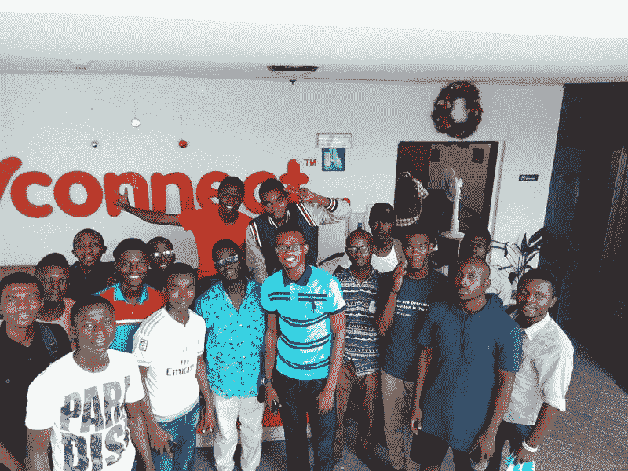

# 370 门免费的在线编程和计算机科学课程，你可以在三月份开始学习

> 原文：<https://www.freecodecamp.org/news/370-free-online-programming-and-computer-science-courses-you-can-start-in-march-75a6dba8277a/>

这里有三个值得你花时间的链接:

1.  370 门免费的在线编程和计算机科学课程你可以在三月份开始学习( [22 分钟阅读](http://bit.ly/2lO5nSC)
2.  unicode 程序员指南( [18 分钟阅读](http://bit.ly/2m8l6gm)
3.  一个像素地图生成器( [1 分钟交互式](http://bit.ly/2lsXfep))

### 想到这一天:

> “让你陷入麻烦的不是你不知道的事情。这是你肯定知道的，但事实并非如此。”——马克·吐温

### 每日一图:

左边是正常的信用卡支付终端，右边是信用卡提款机。这些清除器被小偷放在商店里，用来窃取信用卡信息——有时长达数周而不被发现。

### 今日学习小组:

拉各斯自由代码营

编码快乐！

–昆西·拉森，自由代码营的老师