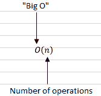
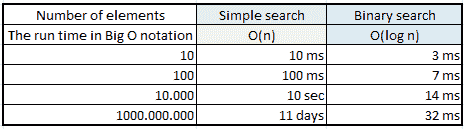
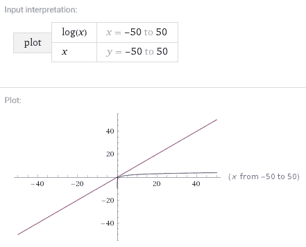

# 举例说明大 O 符号

> 原文：<https://www.freecodecamp.org/news/big-o-notation-explained-with-examples/>

大 O 符号是描述给定算法的速度或复杂度的一种方式。如果您当前的项目需要一个预定义的算法，了解它与其他选项相比有多快或多慢是很重要的。

## 什么是大 O 符号，它是如何工作的？

简单地说，大 O 符号告诉你一个算法将进行的运算次数。它的名字来源于估计操作数前面的“大 O”。

大 O 符号没有告诉你的是算法的速度，以秒为单位。影响算法运行时间的因素太多了。相反，您将使用大 O 符号来比较不同算法的运算次数。

### 大 O 建立了最坏情况下的运行时间

假设你是一名教师，带着一个名叫简的学生。你想找到她的记录，所以你用一个简单的搜索算法来搜索你所在学区的数据库。

你知道简单的搜索需要 O(n)次运行。这意味着，在最坏的情况下，您必须搜索每一条记录(用 n 表示)才能找到 Jane 的记录。

但是当您运行简单的搜索时，您会发现 Jane 的记录是数据库中的第一个条目。你不必看每一个条目——你第一次尝试就找到了。

这个算法花费了 O(n)时间吗？还是因为你第一次尝试就找到了 Jane 的记录，所以花了 O(1)时间？

在这种情况下，0(1)是最好的情况——你很幸运 Jane 的记录在顶部。但是大 O 符号关注的是最坏的情况，对于简单搜索是 0(n)。简单搜索永远不会比 O(n) time 慢，这是一个保证。

### 算法运行时间以不同的速度增长

假设检查学区数据库中的每个元素需要 1 毫秒。

使用简单搜索，如果您必须检查 10 个条目，将需要 10 毫秒来运行。但是使用*二分搜索法算法*，你只需要检查 3 个元素，这需要运行 3 毫秒。

在大多数情况下，您需要搜索的列表或数据库会有成百上千个元素。

如果有 10 亿个元素，使用简单搜索将花费多达 10 亿毫秒，或 11 天。另一方面，使用二分搜索法在最坏的情况下只需要 32 毫秒:

显然，简单搜索和二分搜索法的运行时间并没有以几乎相同的速度增长。随着条目列表变得越来越大，二分搜索法只需要多花一点时间来运行。随着条目列表的增加，简单搜索的运行时间呈指数增长。

这就是为什么知道运行时间如何随着列表大小的增加而增加是如此重要。这正是大 O 符号如此有用的地方。

### 大 O 符号表示运算次数

如上所述，大 O 符号并不显示算法运行的*时间*。相反，它显示它将执行的操作数量。它告诉你一个算法增长有多快，并让你与其他算法进行比较。

以下是一些常见的算法及其运行时间，以大 O 表示法表示:

| 大 O 符号 | 示例算法 |
| --- | --- |
| o(登录号) | 二进位检索 |
| O(n) | 简单搜索 |
| O(n * log n) | 快速分类 |
| 氧气(氮气) | 选择排序 |
| O(n！) | 旅行销售人员 |

现在你已经知道大 O 符号有多危险了。出去开始比较算法。