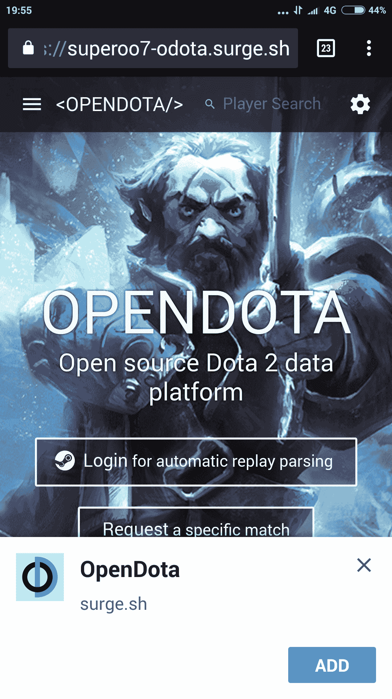
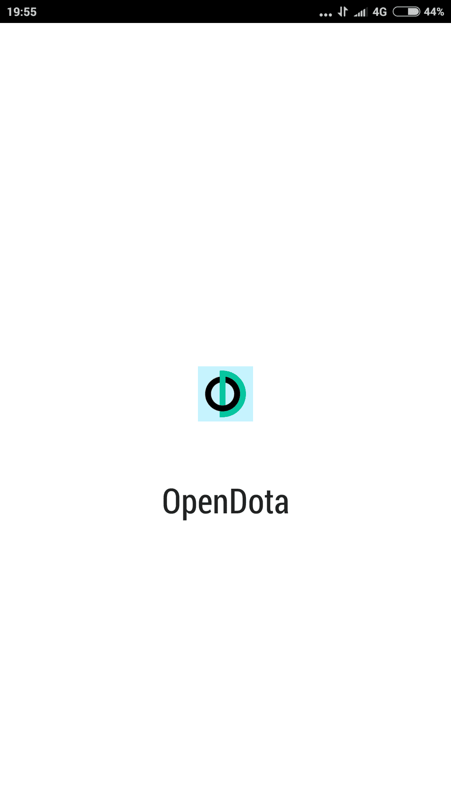

# 如何在渐进式网络应用程序中添加到主屏幕

> 原文：<https://www.freecodecamp.org/news/how-to-add-to-homescreen-in-a-progressive-web-app/>

## **添加到主屏幕**

这里的 web 应用程序安装横幅侧重于 web 应用程序，具有添加到主屏幕的功能。

### **浏览器支持添加到主屏幕**

目前支持添加到主屏幕功能的有:

*   铬
*   iOS Safari

你可以在这里看到浏览器支持该功能[的最新状态。](https://caniuse.com/#feat=web-app-manifest)

### **在安卓系统上**

在 Android 上，如果你满足某些要求，“添加到主屏幕”横幅会自动出现。这是它在 Android 上的外观:

应用程序启动时添加到主屏幕提示



### 要求

包含一个具有以下属性的`manifest.json`文件:

*   `short name`
*   `name`
*   `192x192``png`图标的大小
*   `start_url`
*   包括注册和激活的服务工作者
*   该网站服务于 HTTPS(你仍然可以在没有 HTTPS 的本地主机上尝试)
*   该网站符合 Chrome 定义的参与启发式规则

#### **manifest.json**

```
{
  "name": "FreeCodeCamp",
  "short_name": "FreeCodeCamp",
  "theme_color": "#00FF00",
  "background_color": "#00FF00",
  "display": "standalone",
  "Scope": "/",
  "start_url": "/",
  "icons": [
    {
      "src": "assets/images/icons/icon-72x72.png",
      "sizes": "72x72",
      "type": "image/png"
    },
    {
      "src": "assets/images/icons/icon-96x96.png",
      "sizes": "96x96",
      "type": "image/png"
    },
    {
      "src": "assets/images/icons/icon-128x128.png",
      "sizes": "128x128",
      "type": "image/png"
    },
    {
      "src": "assets/images/icons/icon-144x144.png",
      "sizes": "144x144",
      "type": "image/png"
    },
    {
      "src": "assets/images/icons/icon-152x152.png",
      "sizes": "152x152",
      "type": "image/png"
    },
    {
      "src": "assets/images/icons/icon-192x192.png",
      "sizes": "192x192",
      "type": "image/png"
    },
    {
      "src": "assets/images/icons/icon-384x384.png",
      "sizes": "384x384",
      "type": "image/png"
    },
    {
      "src": "assets/images/icons/icon-512x512.png",
      "sizes": "512x512",
      "type": "image/png"
    }
  ],
  "splash_pages": null
}
```

*   `name`是 web 应用程序的名称。(它将显示在启动屏幕上)
*   `short name`是 web app 的简称。(它将显示在电话菜单图标的下方)
*   `theme_color`是浏览器顶部的颜色。
*   `background_color`是启动屏幕的背景色。
*   `display`是网络应用程序在手机上启动后的显示方式。
*   `start_url`定义网站的起始 url。
*   `icons`是一个数组，存储所有图像的位置、大小和类型。

## 在其他设备上

虽然这种方法在 iOS 和 Windows 上不起作用，但有一种回退方法。

### ios

在 iOS 上，“添加到主屏幕”按钮必须手动添加。将以下 meta 标签添加到 HTML 的 head 部分，以支持 iOS web app 图标。

```
<meta name="apple-mobile-web-app-capable" content="yes">
<meta name="apple-mobile-web-app-status-bar-style" content="green">
<meta name="apple-mobile-web-app-title" content="FreeCodeCamp">
<link rel="apple-touch-icon" href="/assets/images/icons/icon-72x72.png" sizes="72x72">
<link rel="apple-touch-icon" href="/assets/images/icons/icon-96x96.png" sizes="96x96">
<link rel="apple-touch-icon" href="/assets/images/icons/icon-128x128.png" sizes="128x128">
<link rel="apple-touch-icon" href="/assets/images/icons/icon-144x144.png" sizes="144x144">
<link rel="apple-touch-icon" href="/assets/images/icons/icon-152x152.png" sizes="152x152">
<link rel="apple-touch-icon" href="/assets/images/icons/icon-192x192.png" sizes="192x192">
<link rel="apple-touch-icon" href="/assets/images/icons/icon-384x384.png" sizes="384x384">
<link rel="apple-touch-icon" href="/assets/images/icons/icon-512x512.png" sizes="512x512">
```

### Windows 操作系统

在 windows phone 上，将以下 meta 标记添加到 HTML 的 head 部分:

```
<meta name="msapplication-TileImage" content="/assets/images/icons/icon-144x144.png">
<meta name="msapplication-TileColor" content="green">
```