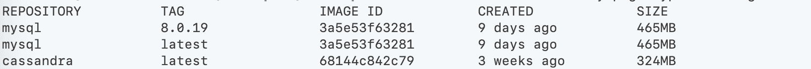
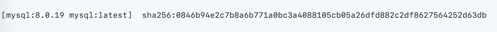
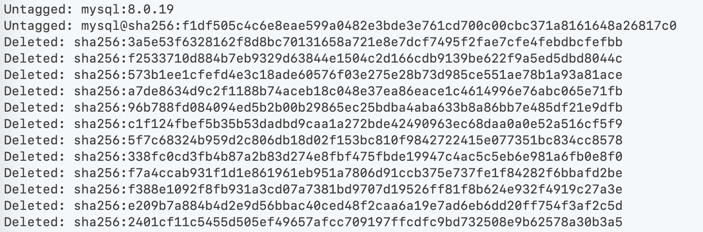
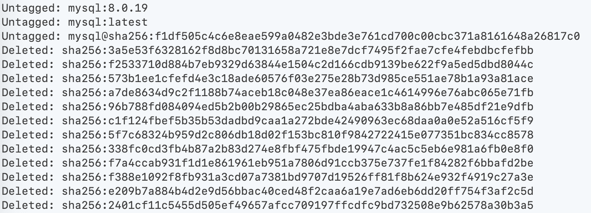
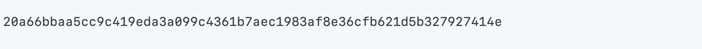
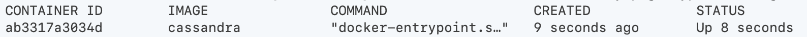

# Docker 映像指南:如何删除 Docker 映像、停止容器和删除所有卷

> 原文：<https://www.freecodecamp.org/news/docker-image-guide-how-to-remove-and-delete-docker-images-stop-containers-and-remove-all-volumes/>

Docker 已经被广泛采用，并且是将应用程序部署到云(或其他一些 Docker 就绪的基础设施)的一个很好的工具。对地方发展也是有用的。您可以快速启动复杂的应用程序，孤立地开发，并且仍然有非常好的性能。

以下是在日常工作中有效使用 Docker 的最重要的命令。

## 列出所有 Docker 图像

```
docker images 
```



在我的例子中，我安装了 3 个映像:

*   MySQL，版本 8.0.19，其中一个标记为最新版本
*   还有卡珊德拉的最新版本。

要获得有关图像的更多信息，您可以检查它:

```
docker inspect mysql:latest
```


这将返回一个信息列表。或者，您也可以使用图像 ID 来获取信息:

```
docker inspect 3a5e53f63281
```

输出可能是压倒性的。因此，有一个方便的选项来过滤某些信息:

```
docker inspect --format='{{.RepoTags}}  {{.Config.Image}}' 3a5e53f63281
```



## 删除 Docker 图像

可以通过以下方式删除单个图像:

```
docker rm mysql:latest
```


在我的例子中，图像仍然标记有 *mysql:8.0.19* 。因此，要完全删除它，我还需要删除另一个版本标记:

```
docker rm mysql:8.0.19
```



要直接删除图像，按图像 id 删除图像更容易:

```
docker image rm 3a5e53f63281 -f
```



选项 **-f** 强制执行，因为如果图像被一个以上的标签引用，你会得到一个错误。

## 启动 Docker 图像

可以通过以下方式在前景中启动图像:

```
docker run cassandra
```

如果图像不存在，那么它将被下载。按下 **CTRL+C** 可以停止执行。您也可以通过添加 **-d** 选项在后台运行它:

```
docker run -d mysql
```



如果容器在后台启动，那么您会收到容器 ID。

默认情况下，容器独立运行。因此，您将无法与它进行任何通信，并且没有文件存储在您的当前目录中。

## 集装箱的前沿港口

例如，您可以通过使用 **-p** 选项将端口转发到从您的容器中公开的页面:

```
docker run -p 8080:80 nginx
```

这个 NGINX 容器在端口 80 上公开了一个 web 服务器。通过使用-p 8080:80，本地端口 8080 被转发到容器端口 80。

## 登录到容器中

有时登录到容器会很有帮助。这只有在容器安装了 shell 的情况下才有可能。如果不是这样，你会得到一个错误。

首先，启动容器分离并给它一个名字:

```
docker run -d --name my_container nginx
```

这将返回一个容器 ID。现在，您可以在容器中执行一个 shell，并通过使用选项 **-i** 和 **-t** 将您的输入和输出附加到它:

```
docker exec -it my_container bash
```

除了容器名，您还可以使用返回的容器 ID 进行所有后续操作。有时，bash 不可用。因此，您也可以尝试启动一个基本的 shell:

```
docker exec -it my_container sh
```

## 列出正在运行的容器

启动容器后，您可以看到所有正在运行的容器都在执行:

```
docker ps
```



通过追加 **-a** ，退出的容器也将被列出:

```
docker ps -a
```


## 与容器共享本地文件夹

有时在容器和本地文件系统之间同步文件是很有用的。你可以通过运行一个容器并使用 **-v** 选项来实现。在 Linux 和 macOS 上，您可以通过以下方式与容器共享本地临时文件夹:

```
docker run --name=my_container -d -v $(pwd)/tmp:/var/log/nginx -p 8080:80 nginx
```

在 windows 上，您可以运行:

```
docker run --name=my_container -d -v %cd%/tmp:/var/log/nginx -p 8080:80 nginx
```

## 停止运行容器

可以通过以下方式停止正在运行的容器:

```
docker stop my_container
```

停止容器会停止所有进程，但会保留文件系统内的更改。

## 启动停止的容器

停止的容器可以通过以下方式启动:

```
docker start my_container
```

## 移走容器

要删除停止的容器，您可以执行:

```
docker rm my_container
```

要在一个命令中停止和移除容器，可以添加强制选项 **-f** 。

```
docker rm -f my_container
```

## 创建一个卷并与多个容器共享

名为 **SharedData** 的独立卷可以通过以下方式创建:

```
docker volume create --name SharedData

docker run --name=my_container -d -v SharedData:/var/log/nginx -p 8080:80 nginx

docker run --name=my_container_2 -d -v SharedData:/var/log/nginx -p 8080:80 nginx
```

两个容器都有一个共享文件夹，文件将在两个容器之间同步。

## 删除卷

要删除卷，需要删除使用该卷的所有容器。

```
docker rm -f my_container
docker rm -f my_container_2
docker volume rm SharedData
```

## 移除停止的容器和未使用的图像

一个安全的整理命令是:

```
docker system prune -a
```

## 移除所有未使用的卷

所有未安装的卷都可以通过以下方式删除:

```
docker volume prune
```

## 结论

创建容器、登录容器、转发端口和共享卷是 Docker 命令行界面中最重要的命令。它们构建了像 Kubernetes 这样的系统的基础，使我们能够独立地创建和运行应用程序。

我希望你喜欢这篇文章。如果你喜欢它，觉得需要一轮掌声，[在 Twitter 上关注我](https://twitter.com/sesigl)。

我是名为[探索世界](https://www.urlaubsbaron.de)的革命性旅程平台的联合创始人。我们是一家位于德国德累斯顿的年轻创业公司，将首先瞄准德国市场。如果您对任何主题有反馈和问题，请联系我。

快乐码头探索:)

参考

*   Docker 命令行文档
    [https://docs . docker . com/engine/reference/command line/docker/](https://docs.docker.com/engine/reference/commandline/docker/)