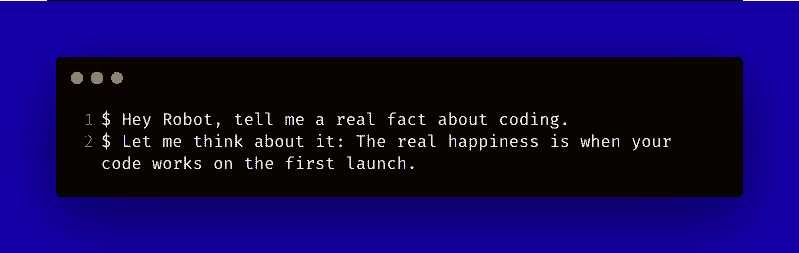

# 如何让编程更刺激、更有趣

> 原文：<https://www.freecodecamp.org/news/how-to-make-programming-more-exciting-and-funnier/>

尽管大多数开发人员都知道为什么编程令人兴奋，但您可能想知道如何让它变得更有趣。

我最近在[HereWeCode 的 Instagram](https://www.instagram.com/gaelgthomas/) 上问了以下问题:“你想在账户上看到什么小教程？”。其中一位关注者回答“如何让编码变得有趣？”。我很惊讶，因为我自己从来没有问过这个问题。

经过几个小时的搜索，我想与你分享使编程更有趣的不同方法。

## 为什么编码令人兴奋

在我看来，它总的来说是令人兴奋的。在我们生活的世界里，电脑是最重要的东西之一。

正如我们所说，编程不是每个人都有的技能。能够开发自己的项目是这个世界给你的一个机会。由于信息技术，一切皆有可能，我们生活在一个没有足够的开发者来满足需求的关键时期。

编码是一种创造性的技能，成为项目的一部分是令人兴奋的。虽然移动应用和网站无处不在，但我和很多不知道它们如何工作的人聊过。

到目前为止，我的演讲可能看起来有点言过其实，但这就是编码让我兴奋的原因。

这也是我如此喜欢创作教育内容的原因之一。

## 如何让它变得更有趣

想了想，虽然编程现在对我来说是一种激情，但我记得它对我来说并不总是有趣的。

大多数情况下，当我开始做的时候，我会在一个问题上坚持好几天。有时我会完全失去希望，说:“这不适合我。我什么都试过了，但还是不行。我没那么好。”

如果你是这种情况，我可以告诉你，每个人都经历过。

这种情况也可能因为许多其他原因而发生。例如，当你对一门语言或一个框架感到厌倦，因为你用得太多了。

反正不用太担心。在这里，我列出了一些建议，在你需要的时候给你一些乐趣。

## 实践

写代码就像打高尔夫。开始的时候，一点都不好玩。你需要学习所有的东西:用哪种发球杆击球，如何定位自己，等等。快乐会随着你的成长而到来，开始理解事物，并开始从中获得乐趣。

## 不要只是读代码，要运行它

当人们开始编程时，仅仅通过阅读代码来学习可能是一个很大的问题。

当你在学习如何编码时，你应该试着自己编写和运行它。花时间去做——你会更好地理解它，并且你会从尝试修改代码来创建你的程序中获得乐趣。

这里还有一个例子:当你在 GitHub 上搜索一个代码的时候，为什么不尝试一下呢？理解他人的工作并能够将其整合到您的项目中可能会很有趣。

## 给你的项目或学徒生涯增添一些乐趣

当你对一项技术感到厌倦，或者想增长知识时，你可以学习一个新的库、框架或语言。这可能是一个有趣的过程，可以帮助你尝试新事物，并从中获得乐趣。

然而，我不建议你只学习和跟随一门课程。如果你这样做，几天后你会感到厌倦。每天或每一个新的篇章，创造小项目来鼓励自己，让你的创造力自由驰骋。

试着找一些有趣的项目来做。例如，假设您正在学习 JavaScript 的基础知识。即使这些技能是最重要的，学习它们也不会是愉快的。一旦您知道如何在控制台中获取用户输入和打印，为什么不尝试创建一个简单的“聊天机器人”来回答用户的问题呢？

Chatbot example

当我做搜索来回答这个问题时，我从一个 Quora 用户那里找到了这个故事，我喜欢它。这是一个很好的例子，说明如何给你的学徒生涯带来乐趣。

> “另一件事——最糟糕的是学习一种新东西——通常很有挑战性，你的进步比你希望的要慢得多。为了好玩，我通常会欺骗我的大脑。例如，当我在学习汇编语言时，我们有一个项目是为一个微小的硬件显示器编程——首先，它非常枯燥。你必须研究硬件手册，它有输入和输出，你所能做到的就是在屏幕上显示几个字母。
> 
> 但是我挑战自己去掌握那个东西，为了做到这一点，我想出了我自己的“特殊锻炼”。我没有仅仅写 10101 来展示，而是想写一些更愚蠢、更幼稚的东西。类似于——现在给我打电话——XXXX——在屏幕上闪烁移动——这比我们在课堂上布置的实际任务要高级得多。我只是用这个愚蠢的事情来激励我自己去学习关于汇编语言的一切，好家伙，这个效果很好！:)"
> 
> ——[马库斯·比尔](https://www.quora.com/How-can-I-make-coding-fun-and-interesting)

## 永远挑战自己

当你是一名开发人员时，你总是需要学习新的东西来跟上时代。一切都在快速进化，你不能落后。当你不再觉得自己在成长或学习时，就会感到厌倦或缺乏乐趣。

为了抵消这种感觉，你可以尝试实现你还没有达到的目标。

比如，如果你从未参与过开源项目，可以在 GitHub 上搜索，第一次投稿。

当你成功地让你的工作在项目中被接受时，你的满足感会增加。也许你会通过解决一个以前没有解决的问题来帮助几十人，甚至几百人。

也可以参加编码比赛或者使用 [HackerRank](https://www.hackerrank.com/home?utm_expid=.2u09ecQTSny1HV02SEVoCg.1&utm_referrer=https%3A%2F%2Fwww.google.com%2F) 、 [CodingGame](https://www.codingame.com/start) ，或者 [Project Euler](https://projecteuler.net/) 等编码网站来挑战自己。

## 从头开始创建个人项目

当你只为你的公司做项目的一小部分时，作为一名开发人员是令人沮丧的。

也许你一直梦想着一个项目，但是你从来没有花时间去做。为什么不试着编码呢？你会发现，开始你梦想中的项目是很有趣的。让你的编程习惯持续下去也是一个有价值的目标。

如果你没有什么想法，试着找一个你喜欢的主题，比如:

*   如果你喜欢电子游戏，你可以尝试创建一个游戏。
*   如果你对教育感兴趣，为什么不围绕代码创建教程呢？
*   如果你热爱硬件和电子产品，为什么不造一个 Arduino 或者一个 raspberry pi 呢？

> "编程就像写作——主题比写作本身重要得多."— [lifeisstillgood](https://news.ycombinator.com/item?id=7669435)

## 定义一个目标

这一点在我所有的生产力文章中都会出现。你必须定义目标。

没有目标，作为一名开发人员，很难感到舒适并享受你所做的事情。

## 找一个导师

如果你不再觉得编程有趣，导师可以激励你。

导师可以给你一个可以遵循的目标，并教你最佳实践。他们还可以帮助你提高编程技能，刺激你的职业生涯。

也许你想知道如何让你的“英雄”成为你的导师。

好吧，只要发个信息，让他们成为你的导师。

是啊是啊，就这么简单。也许，他们会很高兴知道你足够重视他们的技能来指导你。大多数情况下，他们会很乐意陪你发展。

## 多睡觉

当你处于螺旋式下降时，编程就变得不那么有趣了。有时候，你很难在工作中取得进步和成功。

有几天晚上早点睡觉或者早上晚睡几天，一切都会有显著的改善。

## 展示你的作品

作为一名开发者，因为一个人呆在地下室而失去所有希望，还有什么比这更糟糕的呢？这有点老生常谈了，但是，相信我，当你一个人在一个项目上工作了很长时间，并且从来没有给任何人看过，它马上就变得不那么有趣了。

这个技巧和前面的比较接近。一旦你分享了你的作品，人们会提出建议或问题。这对你来说很有挑战性，会帮助你设定新的目标。

## 结论

我试图总结一些基本的技巧来帮助你在编程时获得乐趣。如果你有任何其他意见或建议让它变得更有趣，请随时留下评论或给我发消息。

**你为什么觉得编程很刺激？如何让编程变得更有趣？**

如果你喜欢这篇文章，请随意分享。

如果你想要更多这样的内容，你可以[在 Twitter](https://twitter.com/gaelgthomas/) 上关注我，在那里我会发关于 web 开发、自我完善和我作为一个全栈开发人员的旅程的推文！