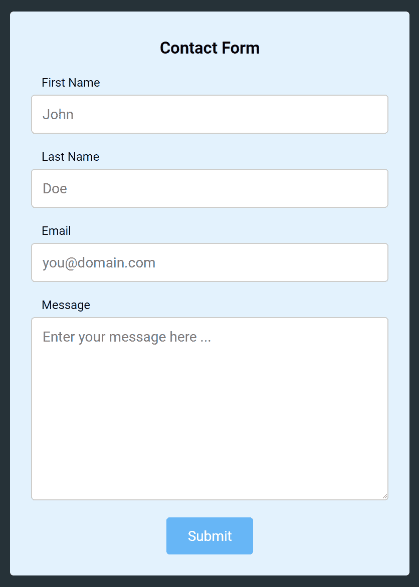

# 如何用 CSS 创建联系人表单

> 原文：<https://www.freecodecamp.org/news/how-to-create-a-contact-form-with-css/>

首先，我们创建 HTML 元素——名、姓、电子邮件的输入字段和消息的文本区域。

稍后，我们应用 CSS 样式使表单在视觉上更具吸引力。

### **HTML 部分**

HTML 部分有一个 div，其类为`container`，标题为`h3`“****联系人表单****

名为 ****contact_form**** 的表单包含以下输入字段:

*   西方人名的第一个字
*   姓
*   电子邮件
*   消息

使用类`center`将项目居中对齐的 div。一个`input`类型的`submit`提交表单。
提交时检查文本字段中的`required`属性的值。

```
<div class="container">
	<h3>Contact Form</h3>
	<form action="#" name="contact_form">
		<label for="first_name">First Name</label>
		<input name="first_name" type="text" required placeholder="John"/>
		<br>
		<label for="last_name">Last Name</label>
		<input name="last_name" type="text" required placeholder="Doe"/>
		<br>
		<label for="email">Email</label>
		<input name="email" type="email" required placeholder="you@domain.com"/>
		<br>
		<label for="message">Message</label><br>
		<textarea name="message" cols="30" rows="10" placeholder="Enter your message here ..." required> </textarea>
		<div class="center">
			<input type="submit" value="Submit">
		</div>
	</form>	
</div>
```

### **CSS 部分**

```
/* Importing the Roboto font from Google Fonts. */
@import url("https://fonts.googleapis.com/css?family=Roboto:400");

/* Set font of all elements to 'Roboto' */
* {
	font-family: 'Roboto', sans-serif;
	font-weight: 400;
}

/* Remove outline of all elements on focus */
*:focus {
	outline: 0;
}

body {
	background: #263238;  /* Set background color to #263238*/
}

h3 {
	text-align: center;
}

/* Add styles to 'container' class */
.container {
	padding: 12px 24px 24px 24px;
	margin: 48px 12px;
	background: #E3F2FD;
	border-radius: 4px;
}

/* Add styles to 'label' selector */
label {
	font-size: 0.85em;
	margin-left: 12px;
}

/* Add styles to 'input' and 'textarea' selectors */
input[type=text],input[type=email], textarea {
    width: 100%;
    padding: 12px;
    border: 1px solid #ccc;
    border-radius: 4px;
    box-sizing: border-box;
    margin-top: 6px;
    margin-bottom: 16px;
    resize: vertical;
}

/* Add styles to show 'focus' of selector */
input[type=text]:focus,input[type=email]:focus, textarea:focus {
	border: 1px solid green;
}

/* Add styles to the submit button */
input[type=submit] {
	background: #64B5F6;
	margin: 0 auto;
	outline: 0;
	color: white;
	border: 0;
	padding: 12px 24px;
	border-radius: 4px;
	transition: all ease-in-out 0.1s;
	position: relative;
	display: inline-block;
	text-align: center;
}

/* Add styles for 'focus' property */
input[type=submit]:focus {
	background: #A5D6A7;
	color: whitesmoke;
}

/* Style 'hover' property */
input[type=submit]:hover {
	background: #2196F3;
}

/* Align items to center of the 'div' with the class 'center' */
.center {
	text-align: center;
}
```

### **输出**



### **更多信息:**

访问 [Codepen.io](https://codepen.io/) 上的 [FreeCodeCamp - Contact Form](https://codepen.io/rakhi2104/pen/QqYOoe/)