# 并发解释:如何构建多线程 iOS 应用程序

> 原文：<https://www.freecodecamp.org/news/ios-concurrency/>

iOS 中的并发性是一个庞大的话题。因此，在本文中，我想放大一个关于队列和大中央调度(GCD)框架的子主题。

特别是，我希望探究串行和并发队列之间的差异，以及同步和异步执行之间的差异。

如果您以前从未使用过 GCD，那么本文是一个很好的起点。如果你对 GCD 有一些经验，但是仍然对上面提到的主题感到好奇，我想你仍然会发现它很有用。我希望你在这个过程中能学到一两件新东西。

我创建了一个 SwiftUI 配套应用程序来直观地演示本文中的概念。该应用程序还有一个有趣的小测验，我鼓励你在阅读本文前后尝试一下。[在这里](https://github.com/almaleh/Dispatcher)下载源代码，或者在这里获取[公测版。](https://testflight.apple.com/join/2tC0CKMO)

我将首先介绍 GCD，然后详细解释同步、异步、串行和并发。之后，我将介绍使用并发时的一些陷阱。最后，我将以一个总结和一些一般性的建议结束。

## 介绍

让我们先简单介绍一下 GCD 和调度队列。如果您已经熟悉这个主题，请随意跳到**同步与异步**部分。

### 并发和大中央调度

并发性让您可以利用您的设备具有多个 CPU 内核这一事实。为了利用这些内核，您需要使用多个线程。然而，线程是一种低级工具，以有效的方式手动管理线程是极其困难的。

[Grand Central Dispatch](https://developer.apple.com/documentation/DISPATCH) 由苹果公司在 10 多年前创建，作为一种抽象，帮助开发人员编写多线程代码，而无需他们自己手动创建和管理线程。

对于 GCD，苹果采取了一种[](https://developer.apple.com/library/archive/documentation/General/Conceptual/ConcurrencyProgrammingGuide/ConcurrencyandApplicationDesign/ConcurrencyandApplicationDesign.html#//apple_ref/doc/uid/TP40008091-CH100-SW8)**的异步设计方法来解决问题。您不用直接创建线程，而是使用 GCD 来调度工作任务，系统将通过充分利用其资源来为您执行这些任务。GCD 将处理创建必要的线程，并将在这些线程上调度您的任务，将线程管理的负担从开发人员转移到系统。**

**GCD 的一个很大的优点是，在编写并发代码时，您不必担心硬件资源。GCD 为您管理一个线程池，它将从单核 Apple Watch 一直扩展到众核 MacBook Pro。**

### **调度队列**

**这些是 GCD 的主要构建块，它允许您使用自己定义的一组参数来执行任意代码块。分派队列中的任务总是以先进先出(FIFO)的方式开始。注意，我说*开始*，是因为你的任务的完成时间取决于几个因素，并不保证是 FIFO(后面会有更多的说明。)**

**概括地说，有三种队列可供您使用:**

*   **主调度队列(串行，预定义)**
*   **全局队列(并发，预定义)**
*   **私有队列(可以是串行或并发的，您可以创建它们)**

**每个应用程序都有一个主队列，这是一个在主线程上执行任务的*串行*队列。这个队列负责绘制应用程序的 UI 并响应用户交互(触摸、滚动、平移等)。)如果你屏蔽这个队列太久，你的 iOS 应用会出现死机，你的 macOS 应用会显示臭名昭著的沙滩球/纺车。**

**当执行长时间运行的任务(网络调用、计算密集型工作等)时，我们通过在后台队列上执行这项工作来避免冻结 UI。然后，我们用主队列中的结果更新 UI:**

```
**`URLSession.shared.dataTask(with: url) { data, response, error in
    if let data = data {
        DispatchQueue.main.async { // UI work
            self.label.text = String(data: data, encoding: .utf8)
        }
    }
}`**
```

**URLSession delivers callbacks on a background queue**

**根据经验，所有 UI 工作都必须在主队列上执行。您可以在 Xcode 中打开主线程检查器选项，以便在后台线程上执行 UI 工作时收到警告。**

**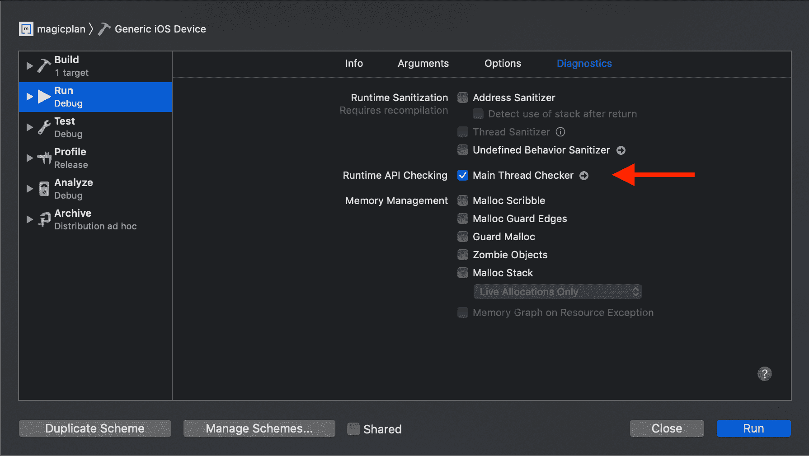**

**除了主队列之外，每个应用都有几个预定义的并发队列，这些队列具有不同级别的[服务质量](https://developer.apple.com/library/archive/documentation/Performance/Conceptual/EnergyGuide-iOS/PrioritizeWorkWithQoS.html)(GCD 中优先级的抽象概念。)**

**例如，下面是向*用户交互*(最高优先级)QoS 队列异步提交工作的代码:**

```
**`DispatchQueue.global(qos: .userInteractive).async {
    print("We're on a global concurrent queue!") 
}`**
```

**或者，您可以调用*默认优先级*全局队列，不指定 QoS，如下所示:**

```
**`DispatchQueue.global().async {
    print("Generic global queue")
}`**
```

**default QoS falls somewhere between **user initiated** and **utility****

**此外，您可以使用以下语法创建自己的专用队列:**

```
**`let serial = DispatchQueue(label: "com.besher.serial-queue")
serial.async {
    print("Private serial queue")
}`**
```

**private queues are serial by default**

**创建专用队列时，使用描述性标签(如反向 DNS 符号)会有所帮助，因为这将有助于您在 Xcode 的导航器、lldb 和 Instruments 中进行调试:**

**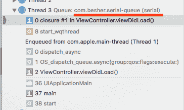****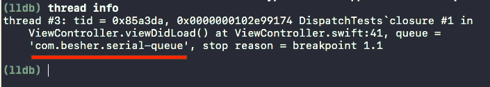**

**默认情况下，私有队列是*序列*(我会很快解释这是什么意思，保证！)如果您想创建一个私有的*并发*队列，您可以通过可选的*属性*参数来实现:**

```
**`let concurrent = DispatchQueue(label: "com.besher.serial-queue", attributes: .concurrent)
concurrent.sync {
    print("Private concurrent queue")
}`**
```

**还有一个可选的 QoS 参数。您创建的私有队列将最终基于它们的给定参数到达一个全局并发队列。**

### **任务里有什么？**

**我提到了将任务分派给队列。任务可以引用您使用`sync`或`async`函数提交给队列的任何代码块。它们可以以匿名关闭的形式提交:**

```
**`DispatchQueue.global().async {
    print("Anonymous closure")
}`**
```

**或者在稍后执行的[分派工作项目](https://developer.apple.com/documentation/dispatch/dispatchworkitem)中:**

```
**`let item = DispatchWorkItem(qos: .utility) {
    print("Work item to be executed later")
}`**
```

**notice how we defined a task QoS here**

**不管您是同步还是异步调度，也不管您选择串行还是并发队列，单个任务中的所有代码都将逐行执行。并发性仅在评估多个任务时相关。**

**例如，如果在**相同的**任务中有 3 个循环，这些循环将*总是*按顺序执行:**

```
**`DispatchQueue.global().async {
    for i in 0..<10 {
        print(i)
    }

    for _ in 0..<10 {
        print("?")
    }

    for _ in 0..<10 {
        print("?")
    }
}`**
```

**这段代码总是打印出从 0 到 9 的 10 个数字，接着是 10 个蓝色的圆圈，接着是 10 颗破碎的心，不管您如何调度这个闭包。**

**单个任务也可以有自己的 QoS 级别(默认情况下，它们使用自己队列的优先级。)队列 QoS 和任务 QoS 之间的这种区别导致了一些有趣的行为，我们将在优先级反转部分讨论这些行为。**

**现在你可能想知道*连载*和*并发*是怎么回事。您可能还想知道提交任务时`sync`和`async`之间的区别。这就引出了本文的症结所在，让我们深入探讨一下吧！**

## **同步与异步**

**当您将一个任务分派到一个队列时，您可以使用`sync`和`async`分派函数选择同步或异步地这样做。同步和异步主要影响提交任务的**源**，即从提交*的队列。***

**当您的代码到达一个`sync`语句时，它将阻塞当前队列，直到该任务完成。一旦任务返回/完成，控制权就返回给调用者，而`sync`任务之后的代码将继续执行。**

**把`sync`想成是‘阻挡’的代名词。**

**另一方面，`async`语句将相对于当前队列异步执行，并立即将控制返回给调用者，而不等待`async`闭包的内容执行。无法保证异步闭包内的代码将在何时执行。**

### **当前队列？**

**源队列或当前队列可能并不明显，因为它并不总是在代码中明确定义。**

**例如，如果您在 viewDidLoad 中调用您的`sync`语句，您的当前队列将是主调度队列。如果您在 URLSession 完成处理程序中调用相同的函数，您的当前队列将是一个后台队列。**

**回到同步与异步，让我们举个例子:**

```
**`DispatchQueue.global().sync {
    print("Inside")
}
print("Outside")
// Console output:
// Inside
// Outside`**
```

**上面的代码将阻塞当前队列，进入闭包并通过打印“Inside”在全局队列上执行它的代码，然后继续打印“Outside”。这个秩序是有保证的。**

**让我们看看如果我们尝试使用`async`会发生什么:**

```
**`DispatchQueue.global().async {
    print("Inside")
}
print("Outside")
// Potential console output (based on QoS): 
// Outside
// Inside`**
```

**我们的代码现在将闭包提交给全局队列，然后立即运行下一行。很有可能在“内部”之前打印“外部”,但是这个顺序不能保证。它取决于源队列和目标队列的 QoS，以及系统控制的其他因素。**

**线程是 GCD 中的一个实现细节——我们不能直接控制它们，只能使用队列抽象来处理它们。尽管如此，我认为“深入观察”线程行为对于理解我们在 GCD 中可能遇到的一些挑战是有用的。**

**例如，当您使用`sync`，[提交任务时，GCD 通过在当前线程](https://developer.apple.com/documentation/dispatch/1452870-dispatch_sync?language=objc)(调用者)上执行该任务来优化性能。)**

**但是有一个例外，就是当您向主队列提交一个同步任务时——这样做将总是在主线程而不是调用者上运行任务。这种行为可能会产生一些后果，我们将在优先级反转一节中探讨。**

**

[From Dispatcher on Github](https://github.com/almaleh/Dispatcher)** 

### **用哪个？**

**向队列提交工作时，[苹果建议使用异步执行而不是同步执行](https://developer.apple.com/library/archive/documentation/General/Conceptual/ConcurrencyProgrammingGuide/OperationQueues/OperationQueues.html#//apple_ref/doc/uid/TP40008091-CH102-SW21)。然而，在某些情况下，`sync`可能是更好的选择，比如在处理竞争条件时，或者在执行一个非常小的任务时。我将很快介绍这些情况。**

**在函数内部异步执行工作的一个很大的后果是，函数不再能直接返回它的值(如果它们依赖于正在进行的异步工作)。相反，它必须使用结束/完成处理程序参数来传递结果。**

**为了演示这个概念，让我们用一个小函数来接受图像数据，执行一些昂贵的计算来处理图像，然后返回结果:**

```
**`func processImage(data: Data) -> UIImage? {
    guard let image = UIImage(data: data) else { return nil }
    // calling an expensive function
    let processedImage = upscaleAndFilter(image: image)
    return processedImage 
}`**
```

**在这个例子中，函数`upscaleAndFilter(image:)`可能需要几秒钟，所以我们希望将它卸载到一个单独的队列中，以避免冻结 UI。让我们为图像处理创建一个专用队列，然后异步调度这个昂贵的函数:**

```
**`let imageProcessingQueue = DispatchQueue(label: "com.besher.image-processing")

func processImageAsync(data: Data) -> UIImage? {
    guard let image = UIImage(data: data) else { return nil }

    imageProcessingQueue.async {
        let processedImage = upscaleAndFilter(image: image)
        return processedImage
    }
}`**
```

**this code doesn't compile!**

**这段代码有两个问题。首先，return 语句在 async 闭包内部，所以它不再向`processImageAsync(data:)`函数返回值，目前没有任何用途。**

**但是更大的问题是我们的`processImageAsync(data:)`函数不再返回任何值，因为函数在进入`async`闭包之前已经到达了它的主体的末尾。**

**为了修复这个错误，我们将调整函数，使它不再直接返回值。相反，它将有一个新的完成处理程序参数，一旦我们的异步函数完成了它的工作，我们就可以调用它:**

```
**`let imageProcessingQueue = DispatchQueue(label: "com.besher.image-processing")

func processImageAsync(data: Data, completion: @escaping (UIImage?) -> Void) {
    guard let image = UIImage(data: data) else {
        completion(nil)
        return
    }

    imageProcessingQueue.async {
        let processedImage =  self.upscaleAndFilter(image: image)
        completion(processedImage)
    }
}`**
```

**如本例所示，使函数异步的更改已经传播到了它的调用者，现在调用者必须传入一个闭包并异步处理结果。通过引入异步任务，您可能最终会修改一系列函数。**

**正如我们刚刚观察到的，并发和异步执行增加了项目的复杂性。这种间接方式也增加了调试的难度。这就是为什么在设计的早期就考虑并发性是值得的——这不是你想在设计周期结束时附加的东西。**

**相比之下，同步执行不会增加复杂性。相反，它允许您像以前一样继续使用 return 语句。包含`sync`任务的函数将不会返回，直到该任务中的代码已经完成。因此，它不需要完成处理器。**

**如果您正在提交一个微小的任务(例如，更新一个值)，请考虑同步进行。这不仅有助于你保持代码的简单性，还能更好地执行——异步被认为[会导致开销](https://gist.github.com/tclementdev/6af616354912b0347cdf6db159c37057),这超过了异步完成不到 1 毫秒的微小任务的好处。**

**然而，如果您正在提交一个大的任务，就像我们上面执行的图像处理，那么考虑异步完成它，以避免长时间阻塞调用者。**

### **在同一队列上调度**

**虽然将任务从队列异步分派到自身是安全的(例如，您可以使用[)。async after](https://developer.apple.com/documentation/dispatch/dispatchqueue/2300020-asyncafter)on the current queue)，你不能将一个任务*从一个队列同步*分派到同一个队列。这样做会导致死锁，立即崩溃的应用程序！**

**当执行一系列同步调用并返回到原始队列时，这个问题就会显现出来。也就是说，您将一个任务`sync`放到另一个队列中，当任务完成时，它将结果同步回原来的队列，从而导致死锁。使用`async`来避免这种崩溃。**

### **阻塞主队列**

**从主队列同步分派任务*将阻塞该队列，从而冻结 UI，直到任务完成。因此，最好避免从主队列同步分派工作，除非您正在执行非常轻的工作。***

**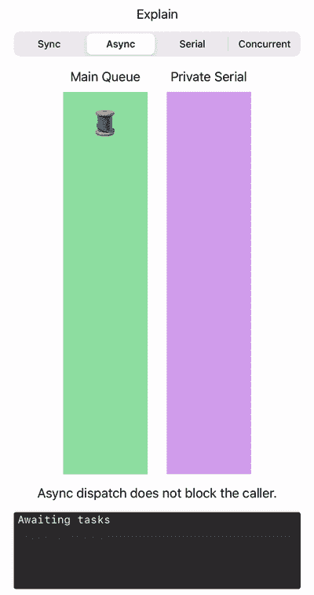

[prefer to use async from the main queue](https://github.com/almaleh/Dispatcher)** 

## **串行与并发**

***序列*和*并发*影响**目的地**——你的工作被提交运行的队列。这与影响**源**的*同步*和*异步*相反。**

**串行队列不会同时在多个线程上执行其工作，无论您在该队列上分派了多少任务。因此，任务不仅保证以先进先出的顺序开始，而且保证以先进先出的顺序结束。**

**此外，当您阻塞一个串行队列时(使用一个`sync`调用、信号量或一些其他工具)，该队列上的所有工作都将暂停，直到阻塞结束。**

**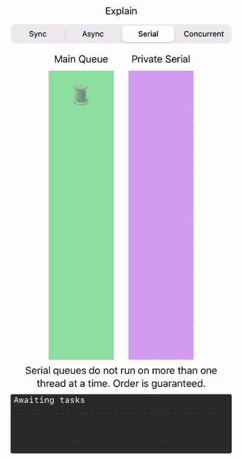

[From Dispatcher on Github](https://github.com/almaleh/Dispatcher)** 

**一个并发队列可以产生多个线程，系统决定创建多少个线程。任务总是以先进先出的顺序*开始*，但是队列不等待任务完成就开始下一个任务，因此并发队列上的任务可以以任何顺序完成。**

**当您在并发队列上执行阻塞命令时，它不会阻塞该队列上的其他线程。此外，当一个并发队列被阻塞时，它会面临*线程爆炸*的风险。稍后我将更详细地介绍这一点。**

**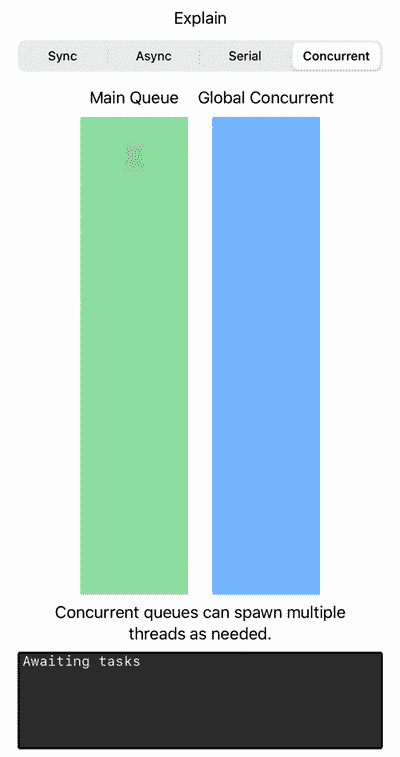

[From Dispatcher on Github](https://github.com/almaleh/Dispatcher)** 

**应用程序中的主队列是串行的。所有全局预定义队列都是并发的。默认情况下，您创建的任何私有调度队列都是串行的，但是可以使用前面讨论过的可选属性将其设置为并发的。**

**这里需要注意的是*串行*与*并发*的概念仅在讨论特定队列时相关。所有队列相对于*彼此并发*。**

**也就是说，如果您将工作从主队列异步分派到私有的*串行*队列，那么该工作将相对于主队列同时*完成*。如果创建两个不同的串行队列，然后对其中一个队列执行阻塞工作，另一个队列不会受到影响。**

**为了演示多个串行队列的并发性，让我们举一个例子:**

```
**`let serial1 = DispatchQueue(label: "com.besher.serial1")
let serial2 = DispatchQueue(label: "com.besher.serial2")

serial1.async {
    for _ in 0..<5 { print("?") }
}

serial2.async {
    for _ in 0..<5 { print("?") }
}`**
```

**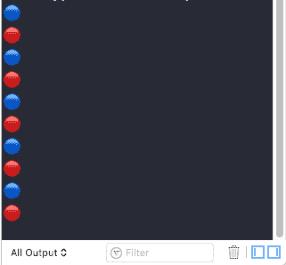**

**这里的两个队列都是串行的，但是结果是混乱的，因为它们是并发执行的。它们是连续的(或并发的)对这个结果没有影响。他们的服务质量水平决定了谁将会最先完成(不保证顺序)。**

**如果我们想确保第一个循环在开始第二个循环之前先完成，我们可以从调用者同步提交第一个任务:**

```
**`let serial1 = DispatchQueue(label: "com.besher.serial1")
let serial2 = DispatchQueue(label: "com.besher.serial2")

serial1.sync { // <---- we changed this to 'sync'
    for _ in 0..<5 { print("?") }
}
// we don't get here until first loop terminates
serial2.async {
    for _ in 0..<5 { print("?") }
}`**
```

****

**这不一定是我们想要的，因为我们现在在第一个循环执行的时候阻塞了调用者。**

**为了避免阻塞调用者，我们可以异步提交这两个任务，但是提交到*相同的*串行队列:**

```
**`let serial = DispatchQueue(label: "com.besher.serial")

serial.async {
    for _ in 0..<5 { print("?") }
}

serial.async {
    for _ in 0..<5 { print("?") }
}`** 
```

**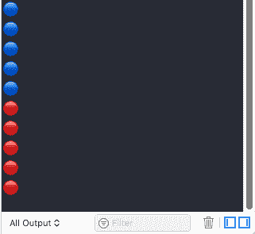**

**现在，我们的任务相对于*调用者*同时执行，同时保持它们的顺序不变。**

**请注意，如果我们通过可选参数使我们的单个队列并发，我们将返回到混乱的结果，正如预期的那样:**

```
**`let concurrent = DispatchQueue(label: "com.besher.concurrent", attributes: .concurrent)

concurrent.async {
    for _ in 0..<5 { print("?") }
}

concurrent.async {
    for _ in 0..<5 { print("?") }
}`**
```

****

**有时你可能会混淆同步执行和串行执行(至少我是这样)，但它们是非常不同的东西。例如，尝试将第 3 行的第一个派单从我们之前的示例更改为一个`sync`呼叫:**

```
**`let concurrent = DispatchQueue(label: "com.besher.concurrent", attributes: .concurrent)

concurrent.sync {
    for _ in 0..<5 { print("?") }
}

concurrent.async {
    for _ in 0..<5 { print("?") }
}`**
```

**this can be misleading**

****

**突然间，我们的结果恢复了完美的秩序。但是这是一个并发队列，所以怎么会发生这种情况呢？是不是`sync`语句不知何故把它变成了一个串行队列？**

**答案是**不！****

**这有点偷偷摸摸。发生的情况是，直到第一个任务执行完毕，我们才到达`async`调用。队列仍然是非常并发的，但是在这个放大的代码部分中。看起来像是连环杀人案。这是因为我们阻塞了调用者，在第一个任务完成之前，不会继续下一个任务。**

**如果您应用程序中其他地方的另一个队列在执行`sync`语句的同时试图向这个队列提交工作，那么这个工作*将与我们在这里运行的*同时运行，因为它仍然是一个并发队列。**

### **用哪个？**

**串行队列利用了 CPU 优化和缓存，有助于减少上下文切换。**

**苹果建议在你的应用程序中每个子系统设置一个串行队列，例如一个用于网络，一个用于文件压缩，等等。如果需要的话，在构建队列时，您可以使用 [setTarget 方法](https://developer.apple.com/documentation/dispatch/dispatchobject/1452989-settarget)或[可选目标参数](https://developer.apple.com/documentation/dispatch/dispatchqueue/2300059-init)扩展到每个子系统的队列层次结构[。](https://developer.apple.com/videos/play/wwdc2017/706/)**

**如果你遇到性能瓶颈，测量你的应用程序的性能，然后看看并发队列是否有帮助。如果您看不到明显的好处，最好坚持使用串行队列。**

## **陷阱**

### **优先级反转和服务质量**

**[优先级反转](https://en.wikipedia.org/wiki/Priority_inversion)是指当一个高优先级任务被一个低优先级任务阻止运行时，有效地反转它们的相对优先级。**

**当高 QoS 队列与低 QoS 队列共享资源，并且低 QoS 队列锁定该资源时，通常会出现这种情况。**

**但是我希望涵盖一个与我们的讨论更相关的不同场景——当您向一个低 QoS 串行队列提交任务，然后向同一个队列提交一个高 QoS 任务。这种情况还会导致优先级反转，因为高 QoS 任务必须等待低 QoS 任务完成。**

**GCD 通过临时提高包含低优先级任务的队列的 QoS 来解决优先级反转问题，这些低优先级任务位于高优先级任务之前或阻塞了高优先级任务。**

**这有点像让汽车堵在救护车的 *前面*。突然，他们被允许穿过红灯，以便救护车可以移动(在现实中，汽车移动到一边，但想象一个狭窄的(连续)街道或其他东西，你明白这一点:-P)****

*为了说明反演问题，让我们从这段代码开始:*

```
 *`enum Color: String {
    case blue = "?"
    case white = "⚪️"
}

func output(color: Color, times: Int) {
    for _ in 1...times {
        print(color.rawValue)
    }
}

let starterQueue = DispatchQueue(label: "com.besher.starter", qos: .userInteractive)
let utilityQueue = DispatchQueue(label: "com.besher.utility", qos: .utility)
let backgroundQueue = DispatchQueue(label: "com.besher.background", qos: .background)
let count = 10

starterQueue.async {

    backgroundQueue.async {
        output(color: .white, times: count)
    }

    backgroundQueue.async {
        output(color: .white, times: count)
    }

    utilityQueue.async {
        output(color: .blue, times: count)
    }

    utilityQueue.async {
        output(color: .blue, times: count)
    }

    // next statement goes here
}`*
```

*我们创建一个启动队列(在这里我们提交来自的任务*，以及两个具有不同 QoS 的队列。然后我们将任务分派到这两个队列中的每一个，每个任务打印出相同数量的特定颜色的圆圈(*实用工具*队列*是蓝色，*背景*是白色)。)***

因为这些任务是异步提交的，所以每次运行应用程序时，您都会看到略有不同的结果。然而，正如您所料，QoS 较低的队列(后台)几乎总是最后结束。事实上，最后 10-15 个圆圈通常都是白色的。

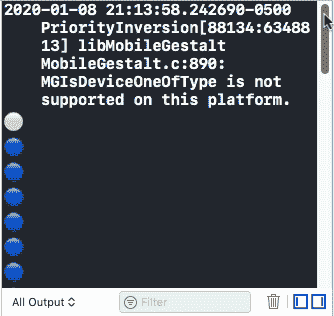

no surprises here

但是请注意，当我们在最后一条异步语句之后向后台队列提交一个**同步**任务时会发生什么。您甚至不需要在`sync`语句中打印任何内容，只需添加这一行就足够了:

```
// add this after the last async statement, 
// still inside starterQueue.async
backgroundQueue.sync {}
```

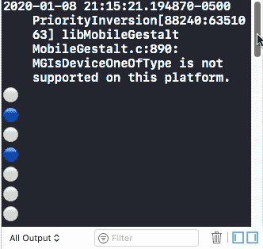

priority inversion

控制台中的结果已经翻转！现在，优先级较高的队列(实用程序)总是最后完成，最后 10-15 个圆圈是蓝色的。

为了理解为什么会发生这种情况，我们需要回顾一下同步工作是在调用者线程上执行的这一事实(除非您提交给主队列。)

在上面的例子中，调用者(starterQueue)拥有最高的 QoS (userInteractive)。)因此，那个看似无害的`sync`任务不仅阻塞了启动器队列，而且还运行在启动器的高 QoS 线程上。因此，该任务以高 QoS 运行，但是在它前面的同一个后台队列中还有两个任务具有*后台* QoS。检测到优先级反转！

正如预期的那样，GCD 通过提高整个队列的 QoS 来解决这种反转，以暂时匹配高 QoS 任务。因此，后台队列上的所有任务最终都以*用户交互* QoS 运行，该 QoS 高于*实用程序* QoS。这就是为什么实用程序任务最后完成的原因！

补充说明:如果您从该示例中删除 starter 队列，并从主队列提交，您将得到类似的结果，因为主队列也有*用户交互* QoS。

为了避免这个例子中的优先级反转，我们需要避免用`sync`语句阻塞 starter 队列。使用`async`可以解决这个问题。

尽管这并不总是理想的，但是您可以通过在创建私有队列或分派到全局并发队列时坚持默认的 QoS 来最小化优先级反转。

### 线程爆炸

当使用并发队列时，如果不小心，就会有线程爆炸的风险。当您试图将任务提交到当前被阻塞的并发队列时，就会发生这种情况(例如，使用信号量、同步或其他方式)。)你的任务*将会*运行，但是系统很可能最终会旋转出新的线程来容纳这些新任务，而线程并不便宜。

这可能就是为什么苹果建议在你的应用中为每个子系统设置一个串行队列，因为每个串行队列只能使用一个线程。请记住，串行队列相对于和*其他*队列是并发的，所以当您将工作卸载到一个队列时，即使它不是并发的，您仍然可以获得性能优势。

### 竞赛条件

默认情况下，Swift 数组、字典、结构和其他值类型不是线程安全的。例如，当你有多个线程试图访问并且**修改**同一个数组时，你就会开始遇到麻烦。

读者-写者问题有不同的解决方案，比如使用锁或信号量。但是我想在这里讨论的相关解决方案是使用一个[隔离队列](http://khanlou.com/2016/04/the-GCD-handbook/)。

假设我们有一个整数数组，我们想要提交引用这个数组的异步工作。只要我们的工作只是*读取*数组并且不修改它，我们就是安全的。但是一旦我们试图在一个异步任务中修改数组，我们就会在应用程序中引入不稳定性。

这是一个棘手的问题，因为你的应用程序可以运行 10 次而没有问题，然后它在第 11 次崩溃。在这种情况下，一个非常方便的工具是 Xcode 中的线程杀毒器。启用此选项将帮助您识别应用程序中的潜在竞争条件。

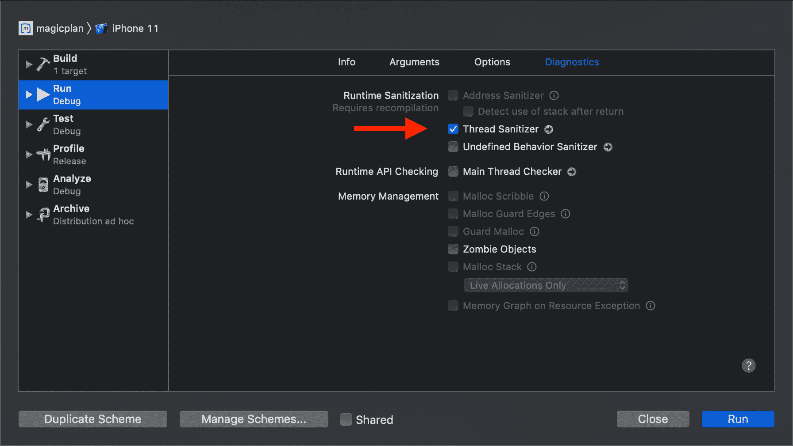

**t**his option is only available on the simulator****

为了说明这个问题，让我们举一个例子(当然是人为的):

```
class ViewController: UIViewController {

    let concurrent = DispatchQueue(label: "com.besher.concurrent", attributes: .concurrent)
    var array = [1,2,3,4,5]

    override func viewDidLoad() {
        for _ in 0...1 {
            race()
        }
    }

    func race() {

        concurrent.async {
            for i in self.array { // read access
                print(i)
            }
        }

        concurrent.async {
            for i in 0..<10 {
                self.array.append(i) // write access
            }
        }
    }
}
```

任务之一是通过追加值来修改数组。如果你试着在模拟器上运行，你可能不会崩溃。但是运行足够多次(或者增加第 7 行的循环频率)，最终会崩溃。如果启用线程杀毒器，每次运行应用程序时都会收到警告。

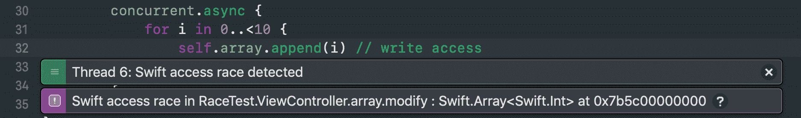

为了处理这种竞争情况，我们将添加一个使用[屏障标志](https://developer.apple.com/documentation/dispatch/dispatchworkitemflags/1780674-barrier)的隔离队列。该标志允许队列中任何未完成的任务完成，但阻止任何进一步的任务执行，直到屏障任务完成。

把障碍想象成清洁工打扫公共厕所(共享资源。)洗手间内有多个(同时)隔间可供人们使用。

到达后，看门人放置一个清洁标志(屏障),阻止任何新来者进入，直到清洁工作完成，但看门人直到里面的所有人完成他们的工作后才开始清洁。一旦他们都离开了，看门人就开始单独打扫公共厕所。

当最后完成时，看门人移除标志(障碍)，以便在外面排队的人最终可以进入。

代码看起来是这样的:

```
class ViewController: UIViewController {
    let concurrent = DispatchQueue(label: "com.besher.concurrent", attributes: .concurrent)
    let isolation = DispatchQueue(label: "com.besher.isolation", attributes: .concurrent)
    private var _array = [1,2,3,4,5]

    var threadSafeArray: [Int] {
        get {
            return isolation.sync {
                _array
            }
        }
        set {
            isolation.async(flags: .barrier) {
                self._array = newValue
            }
        }
    }

    override func viewDidLoad() {
        for _ in 0...15 {
            race()
        }
    }

    func race() {
        concurrent.async {
            for i in self.threadSafeArray {
                print(i)
            }
        }

        concurrent.async {
            for i in 0..<10 {
                self.threadSafeArray.append(i)
            }
        }
    }
}
```

我们添加了一个新的隔离队列，并使用 getter 和 setter 来限制对私有数组的访问，这将在修改数组时设置一个障碍。

getter 需要是`sync`才能直接返回值。设置者可以是`async`，因为我们不需要在写的时候阻塞调用者。

我们可以使用一个没有屏障的串行队列来解决争用情况，但是这样我们就失去了对阵列进行并发读访问的优势。也许这对你来说是有意义的，你来决定。

## 结论

非常感谢你读到这里！我希望你能从这篇文章中学到一些新的东西。我将留给你一个总结和一些一般性的建议:

### 摘要

*   队列总是以先进先出的顺序开始任务
*   相对于其他队列，队列总是并发的
*   **同步** vs **异步**关系到信号源
*   **连载** vs **并发**关注目的地
*   同步是“阻塞”的同义词
*   Async 立即将控制权返回给调用者
*   串行使用单线程，并保证执行顺序
*   并发使用多线程，并有线程爆炸的风险
*   在设计周期的早期考虑并发性
*   同步代码更容易推理和调试
*   尽可能避免依赖全局并发队列
*   考虑从每个子系统一个串行队列开始
*   仅当您看到**可衡量的**性能优势时，才切换到并发队列

我喜欢 Swift Concurrency Manifesto 中的比喻，即“在并发的海洋中有一个序列化的孤岛”。Matt Diephouse 在这条推文中也分享了这一观点:

> 编写并发代码的秘密是让大部分代码串行。将并发限制在一个小的外层。(串行核，并发壳。)
> 
> 例如，不使用锁来管理 5 个属性，而是创建一个包装它们的新类型，并在锁内使用单个属性。
> 
> — Matt Diephouse (@mdiep) [December 18, 2019](https://twitter.com/mdiep/status/1207112168224763905?ref_src=twsrc%5Etfw)