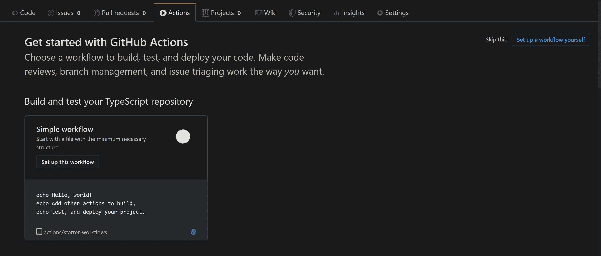
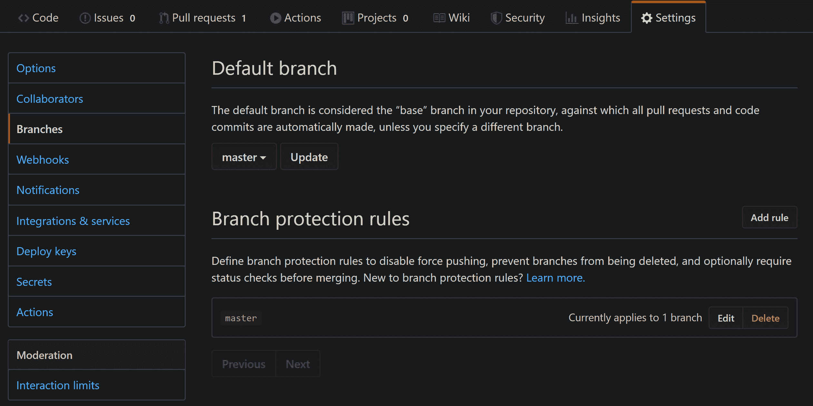
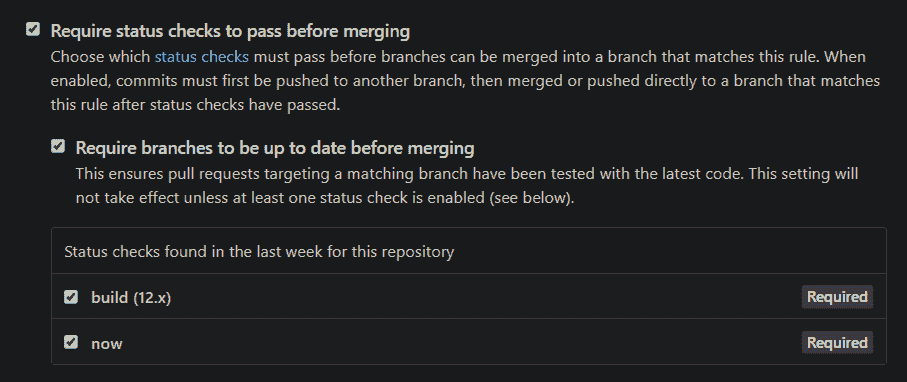

# 如何用 GitHub Actions 和 Puppeteer 建立一个持续集成管道

> 原文：<https://www.freecodecamp.org/news/continuous-integration-with-github-actions-and-puppeteer/>

最近我在我的博客中加入了持续集成，使用 Puppeteer 进行端到端测试。我的主要目标是允许使用[dependent bot](https://dependabot.com/)自动更新依赖关系。在本指南中，我将向您展示如何自己创建这样的管道。

作为我的 CI 平台，我选择了 [Github Actions](https://github.com/features/actions) ，因为它非常容易使用。它还可以与您已经拥有的任何 Github 库完美集成。整个过程只花了大概两天的间歇工作，我认为结果相当不错。

我真的想对尼克·泰勒表示感谢，他发表了关于这个主题的文章，为我在这里的努力奠定了基础。我鼓励你也读读他的文章。

不过，我的技术组合完全不同。我选择[木偶师](https://pptr.dev/)作为我的端到端框架有几个原因。首先，它是由 Chrome 开发工具背后的人编写和维护的，所以我可以保证终身获得支持(直到 Chrome 消失，这不是在不久的将来)，而且它真的很容易使用。

另一个原因是，在家里，我在一台装有 WSL 的 windows 笔记本电脑上工作(在这台笔记本电脑上，我用 oh-my-zsh 运行 zshell)。建立柏树要困难得多(尽管在我们的世界里没有什么是不可能的)。这两个原因都让我选择了木偶师，到目前为止我并不后悔。

## 端到端测试

端到端(或 E2E)测试不同于其他类型的自动化测试。E2E 测试模拟一个真实的用户，在屏幕上执行动作。这种测试应该有助于填补“静态”测试和组件测试之间的空白，前者如单元测试，通常不引导整个应用程序，后者通常针对单个组件(或微服务架构中的服务)运行。

通过模拟用户交互，你可以像普通用户一样测试使用你的应用程序或服务的体验。

我们试图遵循的原则是，如果用户应该按下的按钮由于 CSS 的一些怪癖而被隐藏，那么代码执行得是否完美并不重要。最终的结果是用户永远不会感受到你的代码的伟大。

## 木偶师入门

Puppeteer 有几个配置选项，使它非常适合用于编写和验证测试。

木偶测试可以在“头满”状态下进行。这意味着您可以打开一个真正的浏览器窗口，导航到正在测试的站点，并在给定的页面上执行操作。这样，你——编写测试的开发人员——就可以确切地看到测试中发生了什么，按下了什么按钮，以及最终的 UI 是什么样子。

与“head-full”相反的是 headless，在这种情况下，puppeteer 不打开浏览器窗口，这对于 CI 管道来说是理想的。

木偶师很容易操作，但是你会惊讶于使用自动化工具可以完成的动作数量。

我们将从一个基本的 scraper 开始，它在我们访问 [https://dorshinar.me](https://dorshinar.me) 时打印页面标题。为了运行 puppeteer 测试，我们必须将其作为一个依赖项进行安装:

```
npm i puppeteer 
```

现在，我们的基本刮刀看起来像这样:

```
const puppeteer = require("puppeteer");

(async () => {
  const browser = await puppeteer.launch();
  const page = await browser.newPage();
  await page.goto("https://dorshinar.me");
  console.log(await page.title());

  await browser.close();
})(); 
```

我们在这里做的非常简单:我们用`puppeteer.launch()`打开浏览器，用`browser.newPage()`创建一个新页面，用`page.goto()`导航到这个博客，然后我们打印标题。

我们可以用木偶师 API 做很多事情，比如:

在页面上下文中运行代码:

```
(async () => {
  await page.evaluate(() => document.querySelector(".awesome-button").click());
})(); 
```

使用 CSS 选择器点击屏幕中的元素:

```
(async () => {
  await page.click(".awesome-button");
})(); 
```

使用`$`选择器(jQuery 风格):

```
(async () => {
  await page.$(".awesome-button");
})(); 
```

截图:

```
(async () => {
  await page.screenshot({ path: "screenshot.png" });
})(); 
```

使用 puppeteer API 还可以做更多的事情，我建议您在开始编写测试之前先看看它。但是我展示的例子应该给你一个坚实的基础。

### 将木偶戏与笑话融为一体

jest 是一个非常棒的测试运行器和断言库。从他们的文档中:

> Jest 是一个令人愉快的 JavaScript 测试框架，专注于简单性。

Jest 允许您非常容易地运行测试、模拟导入和做出复杂的断言。Jest 还捆绑了 create-react-app，所以我经常在工作中使用。

#### 编写您的第一个 Jest 测试

Jest 测试非常容易编写，那些了解其他测试框架的人可能也很熟悉(因为 Jest 使用了`it`、`test`、`describe`和其他熟悉的约定)。

一个基本的测试可能是这样的:

```
function subtract(a, b) {
  return a - b;
}

it("subtracts 4 from 6 and returns 2", () => {
  expect(subtract(6, 4)).toBe(2);
}); 
```

您还可以将多个测试分组到一个`describe`下，这样您可以运行不同的描述或使用它来方便报告:

```
function divide(a, b) {
  if (b === 0) {
    throw new Error("Can't divide by zero!");
  }
  return a / b;
}

describe("divide", () => {
  it("throws when dividing by zero", () => {
    expect(() => divide(6, 0)).toThrow();
  });
  it("returns 3 when dividing 6 by 3", () => {
    expect(divide(6, 3)).toBe(2);
  });
}); 
```

当然，您可以使用模拟和其他类型的断言(或期望)来创建更加复杂的测试，但是现在这已经足够了。

运行测试也非常简单:

```
jest 
```

Jest 将寻找具有以下任何流行命名约定的测试文件:

*   `__tests__`文件夹中带有`.js`后缀的文件。
*   后缀为`.test.js`的文件。
*   后缀为`.spec.js`的文件。

#### 小丑木偶师

现在，我们需要让木偶师很好地和 jest 一起表演。这不是一项特别难做的工作，因为有一个名为[jest-puppet er](https://github.com/smooth-code/jest-puppeteer)的伟大软件包可以帮助我们。

首先，我们必须将其作为依赖项安装:

```
npm i jest-puppeteer 
```

现在我们必须扩展我们的 jest 配置。如果你还没有，有很多方法可以做到。我将使用配置文件。在项目的根目录下创建一个名为`jest.config.js`的文件:

```
touch jest.config.js 
```

在文件中，我们必须告诉 jest 使用`jest-puppeteer`的预置，因此将以下代码添加到文件中:

```
module.exports = {
  preset: "jest-puppeteer"
  // The rest of your file...
}; 
```

你可以在一个`jest-puppeteer.config.js`文件中指定一个特殊的启动配置，jest-puppeter 会将这个配置传递给`puppeteer.launch()`。例如:

```
module.exports = {
  launch: {
    headless: process.env.CI === "true",
    ignoreDefaultArgs: ["--disable-extensions"],
    args: ["--no-sandbox"],
    executablePath: "chrome.exe"
  }
}; 
```

将负责打开新的浏览器和新的页面，并将它们存储在全局范围内。所以在你的测试中，你可以简单地使用全局可用的`browser`和`page`对象。

我们可以使用的另一个很棒的功能是 jest-puppet er 在测试期间运行您的服务器，然后用`server`键杀死它:

```
module.exports = {
  launch: {},
  server: {
    command: "npm run serve",
    port: 9000,
    launchTimeout: 180000
  }
}; 
```

现在 jest-puppet er 将运行`npm run serve`，超时 180 秒(3 分钟)，并监听端口 9000 以查看它何时启动。一旦服务器启动，测试就会运行。

您现在可以使用 jest 和 puppeteer 编写一个完整的测试套件。剩下的唯一一件事就是创建一个 CI 管道，为此我们将使用 GitHub 操作。

您可以向您的`package.json`文件添加一个脚本来执行您的测试:

```
{
  "scripts": {
    "test:e2e": "jest"
  }
} 
```

## gist 中的 Github 操作

最近，Github 发布了一个名为 Actions 的新功能。基本上，动作允许您使用简单的 yaml 语法创建工作流，并在专用虚拟机上运行它们。

在你的工作流程中，你可以做任何你想做的事情，从基本的`npm ci && npm build && npm run test`到更复杂的事情。

我将向您展示如何配置运行您的 puppeteer 测试套件的基本工作流，并在您的测试没有通过时防止合并。

最简单的方法是点击 github repo 中的`Actions`标签。如果您以前没有配置任何操作，您将看到以前配置的工作流列表，您可以从中选择一个带有预定义配置的工作流。



对于我们的例子，选择预定义的 Node.js 动作就足够了。生成的 yaml 如下所示:

```
name: Node CI

on: [push]

jobs:
  build:
    runs-on: ubuntu-latest

    strategy:
      matrix:
        node-version: [8.x, 10.x, 12.x]

    steps:
      - uses: actions/checkout@v1
      - name: Use Node.js ${{ matrix.node-version }}
        uses: actions/setup-node@v1
        with:
          node-version: ${{ matrix.node-version }}
      - name: npm install, build, and test
        run: |
          npm ci
          npm run build --if-present
          npm test
        env:
          CI: true 
```

在该文件中，您可以配置工作流名称、要运行的作业以及运行工作流的时间。您可以在每次推送、新的拉取请求或重复事件时运行工作流。

默认情况下，工作流中的作业并行运行，但可以配置为按顺序运行。在上面的工作流中，有一个名为`build`的作业。

您还可以使用`runs-on`键选择工作流将在其上运行的操作系统(默认情况下，您可以使用 Windows Server 2019、Ubuntu 18.04、Ubuntu 16.04 和 macOS Catalina 10.15 -在发布时)。

`strategy`键可以帮助我们在节点版本矩阵上运行测试。在这种情况下，我们有最新版本的 LTS 专业- `8.x`、`10.x`和`12.x`。如果您对此感兴趣，您可以保持原样，或者简单地删除它并使用您想要的任何特定版本。

最有趣的配置选项是`steps`。有了它，我们可以定义我们的管道中实际发生了什么。

每一步都代表您可以执行的一个操作，比如从 repo 中签出代码、设置您的节点版本、安装依赖项、运行测试、上传工件(稍后使用或下载)等等。

您可以在[动作市场](https://github.com/marketplace?type=actions)中找到一个非常广泛的现成动作列表。

基本配置将安装依赖项，构建我们的项目并运行我们的测试。如果你需要更多(例如，如果你想为你的申请提供 e2e 测试)，你可以根据自己的喜好进行修改。一旦完成，提交您的更改，您就可以开始了。

### 合并前强制检查通过

留给我们的唯一事情是确保在我们的工作流成功通过之前没有代码可以被合并。为此，请转到您的回购设置并点击分支机构:



我们需要设置一个**分支保护规则**，这样恶意代码(或者至少是没有通过我们测试的代码)就不会被合并。点击**添加规则**，并在**分支名称模式**下放置您的受保护分支(主分支、开发分支或您选择的分支)。确保在选中合并之前**要求通过状态检查，您可以选择哪些检查必须通过:**



点击下面的保存更改，您就可以开始了！

感谢您的阅读！
这篇文章之前发表在我的博客上: [dorshinar.me](https://dorshinar.me/continuous-integration-with-github-actions-and-puppeteer) ，如果你想阅读更多内容，你可以查看我的博客，因为这对我意义重大。

If you want to support me, you can [](https://ko-fi.com/L3L116P44)