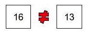
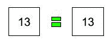

# 线性搜索解释

> 原文：<https://www.freecodecamp.org/news/linear-search/>

## **什么是线性搜索？**

假设给你一个列表或一组项目。您正在搜索特定的项目。你是怎么做到的？

在给定的列表中找出数字 13。


你只要看看名单就知道了！


现在，你如何告诉计算机找到它？

计算机在给定的时间内只能看到数值。因此，它从数组中取出一个项目，并检查它是否与您正在寻找的项目相同。


第一项不匹配。所以继续下一个。



诸如此类…

这样做，直到找到一个匹配，或者直到所有的项目都被检查过。



在这种算法中，当找到项目时，您可以停止，然后没有必要进一步寻找。

那么进行线性搜索操作需要多长时间呢？在最好的情况下，你可能很幸运，你看到的东西可能在数组的第一个位置！

但是在最坏的情况下，在你找到最后一个位置的项之前，或者在你意识到该项不在数组中之前，你必须查看每一项。

因此，线性搜索的复杂度是 O(n)。

如果要搜索的元素位于第一个存储块上，那么复杂度将是:O(1)。

JavaScript 中线性搜索函数的代码如下所示。这个函数返回我们在数组中寻找的项目的位置。如果数组中不存在该项，函数将返回 null。

### **Javascript 中的例子**

```
function linearSearch(arr, item) {
  // Go through all the elements of arr to look for item.
  for (var i = 0; i < arr.length; i++) {
    if (arr[i] === item) { // Found it!
      return i;
    }
  }

  // Item not found in the array.
  return null;
}
```

### **Ruby 中的例子**

```
def linear_search(target, array)
  counter = 0

  while counter < array.length
    if array[counter] == target
      return counter
    else
      counter += 1
    end
  end
  return nil
end
```

### **c++中的例子**

```
int linear_search(int arr[],int n,int num)
{
	for(int i=0;i<n;i++){
		if(arr[i]==num)
			return i;
   }
   // Item not found in the array
   return -1; 
}
```

### **Python 中的例子**

```
def linear_search(array, num):
	for i in range(len(array)):
		if (array[i]==num):
			return i
	return -1
```

## **全局线性搜索**

如果您正在搜索一个元素的多次出现会怎样？例如，你想知道一个数组中有多少个 5。

目标= 5

Array = [ 1，2，3，4，5，6，5，7，8，9，5]

这个数组中出现了 3 次 5，我们希望返回所有 5 的索引(它们在数组中的位置)。

这叫做全局线性搜索，你需要调整你的代码来返回一个索引点的数组，在这个数组中你可以找到你的目标元素。

当您找到与目标匹配的索引元素时，索引点(计数器)将被添加到结果数组中。如果不匹配，代码将继续移动到数组中的下一个元素，将计数器加 1。

```
def global_linear_search(target, array)
  counter = 0
  results = []

  while counter < array.length
    if array[counter] == target
      results << counter
      counter += 1
    else
      counter += 1
    end
  end

  if results.empty?
    return nil
  else
    return results
  end
end
```

## **为什么线性搜索效率不高**

毫无疑问，线性搜索很简单。但是因为它逐个比较每个元素，所以很耗时，因此效率不是很高。如果我们必须从 1，000，000 个数字中找出一个数字，而这个数字位于最后一个位置，那么线性搜索技术将变得非常乏味。

所以你也要学习一下冒泡排序，快速排序等更高效的算法。

## 其他搜索算法:

*   [如何实现快速排序](https://guide.freecodecamp.org/certifications/coding-interview-prep/algorithms/implement-quick-sort/)
*   [二进制搜索算法](https://guide.freecodecamp.org/algorithms/search-algorithms/binary-search/)
*   [跳转搜索算法](https://guide.freecodecamp.org/algorithms/search-algorithms/jump-search/)
*   [举例说明搜索算法](https://www.freecodecamp.org/news/search-algorithms-explained-with-examples-in-java-python-and-c/)
*   [用 Java 实现一个没有递归的二分搜索法算法](https://www.freecodecamp.org/news/how-to-implement-a-binary-search-algorithm-in-java-without-recursion-67d9337fd75f/)
*   [关于搜索算法的更多信息](https://guide.freecodecamp.org/algorithms/search-algorithms)