# HTML URL 编码字符参考

> 原文：<https://www.freecodecamp.org/news/url-encoded-characters-reference/>

URL 是网站的地址。就像邮政地址必须遵循特定的格式才能被邮递员理解一样，URL 也必须遵循一种格式才能被理解并把你带到正确的位置。

URL 字符串中只允许使用某些字符、字母字符、数字和少数具有特殊含义的字符`; , / ? : @ & = + $ - _ . ! ~ * ' ( ) #`。

## 保留字符

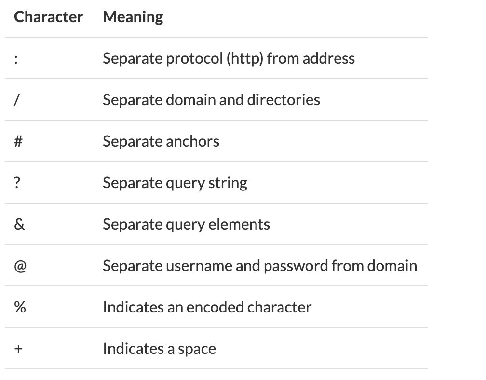

## 编码

任何不是字母字符、数字或保留字符的字符都需要编码。

URL 使用 ASCII(“美国信息交换标准码”)字符集，因此编码必须是有效的 ASCII 格式。

大多数 web 语言中都有函数来为你做这种编码，例如在 JavaScript `encodeURI()`和 PHP `rawurlencode()`中。

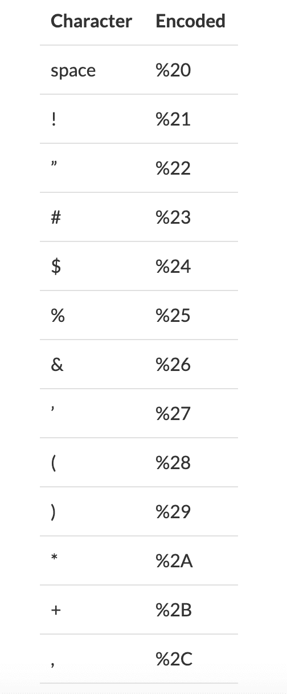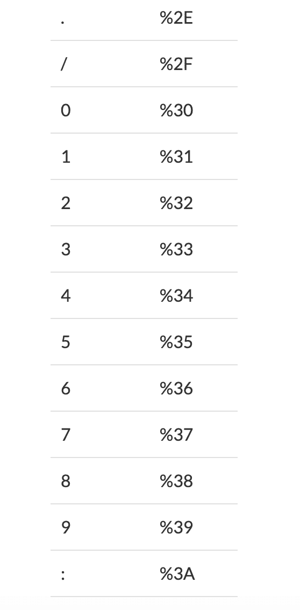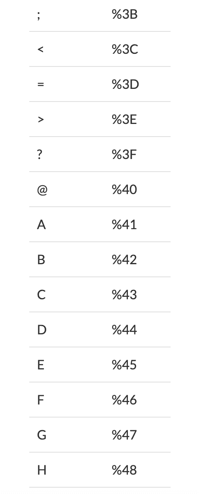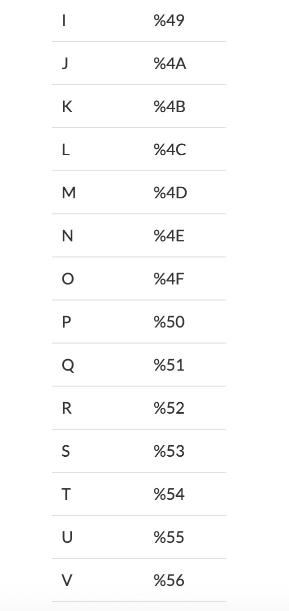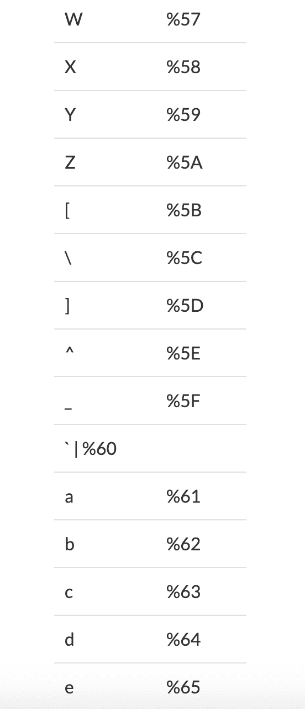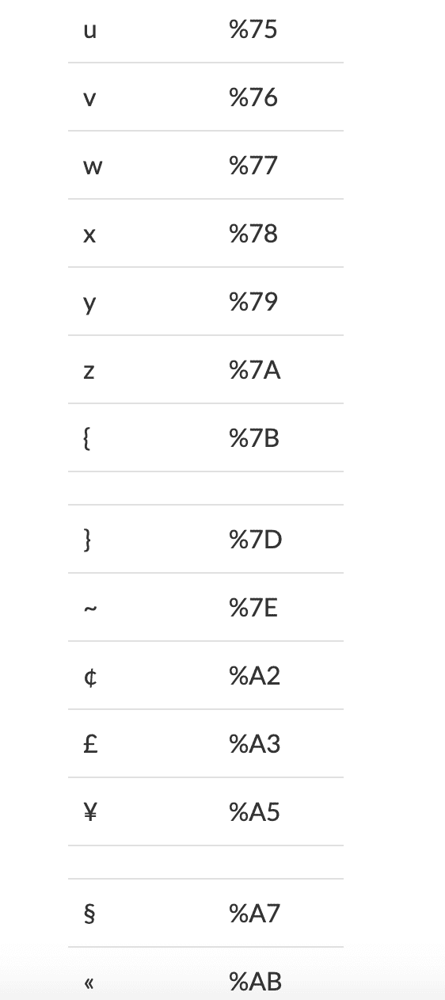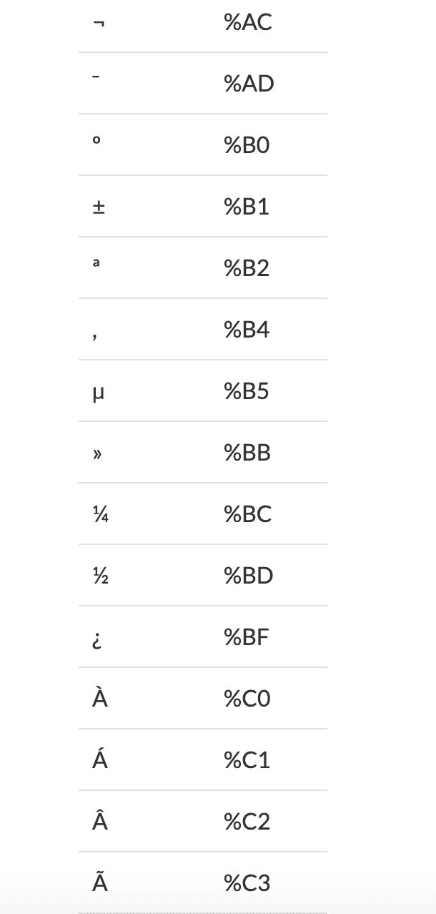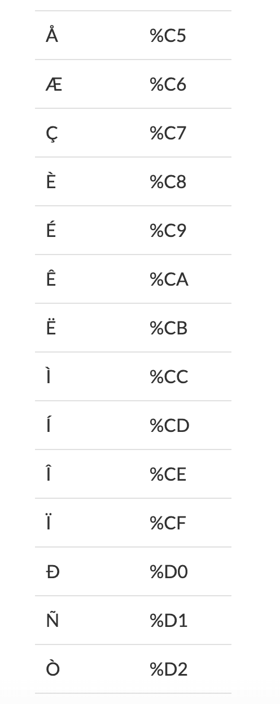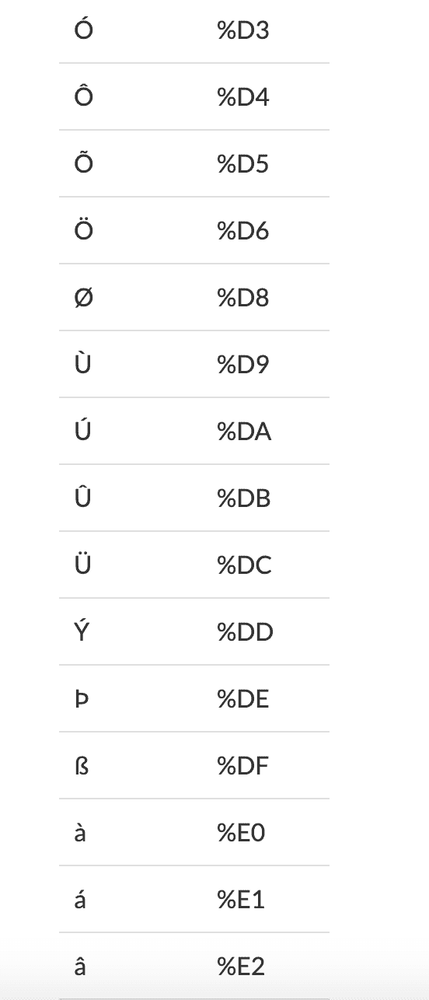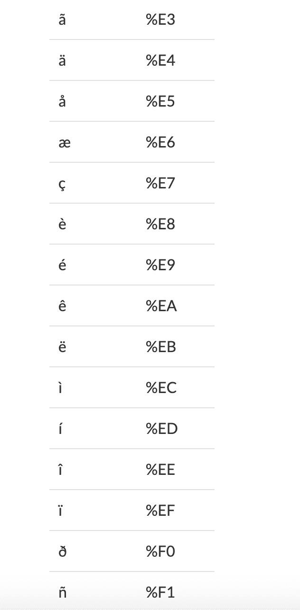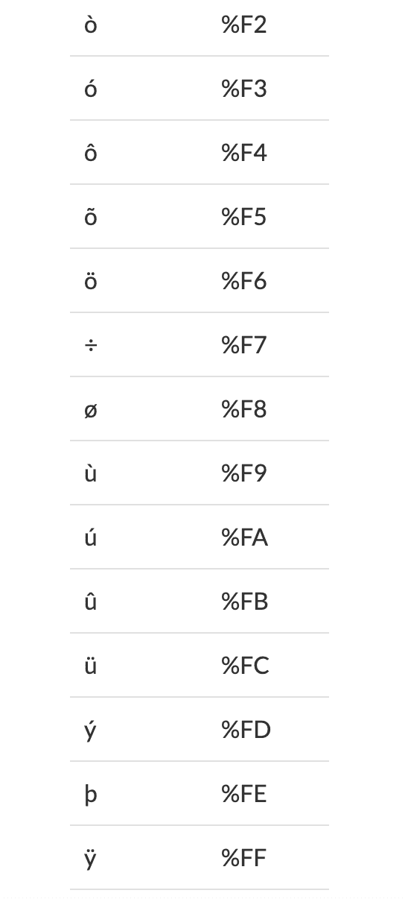

### 示例:

```
encodeURI(Free Code Camp);
// Free%20Code%20Camp
```