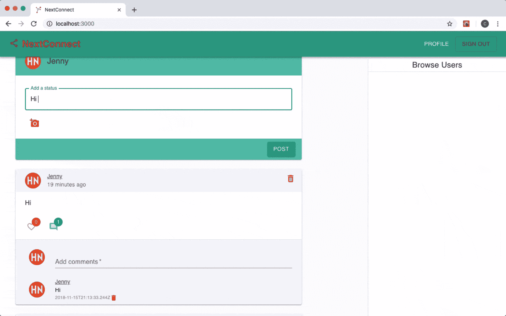
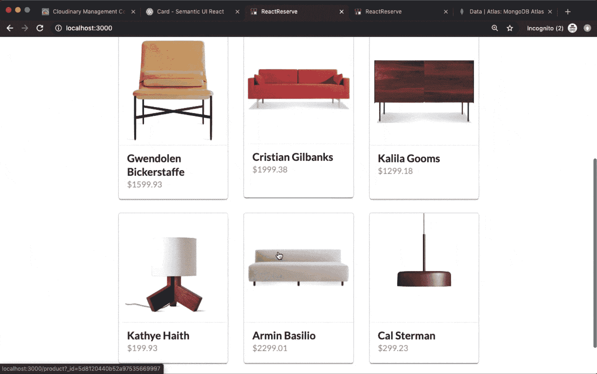
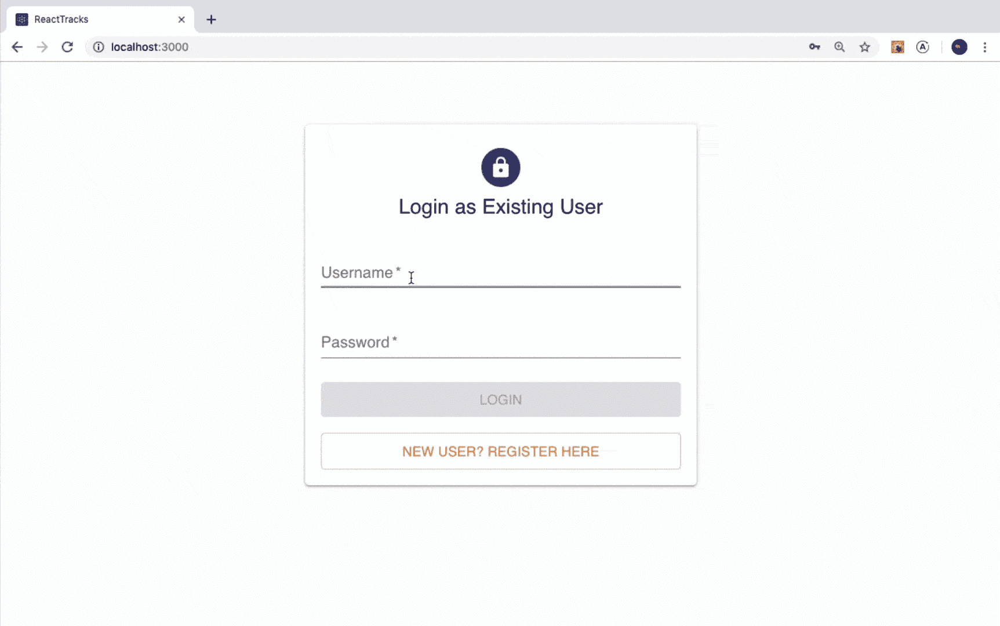
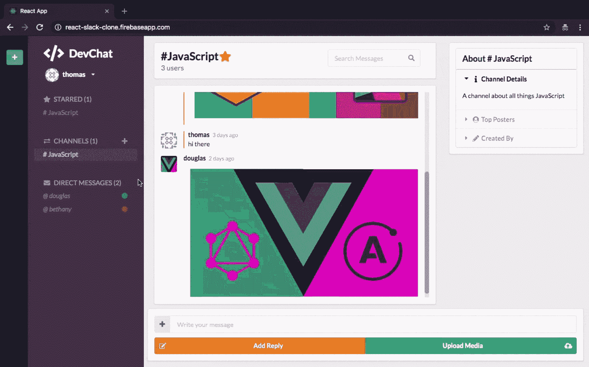
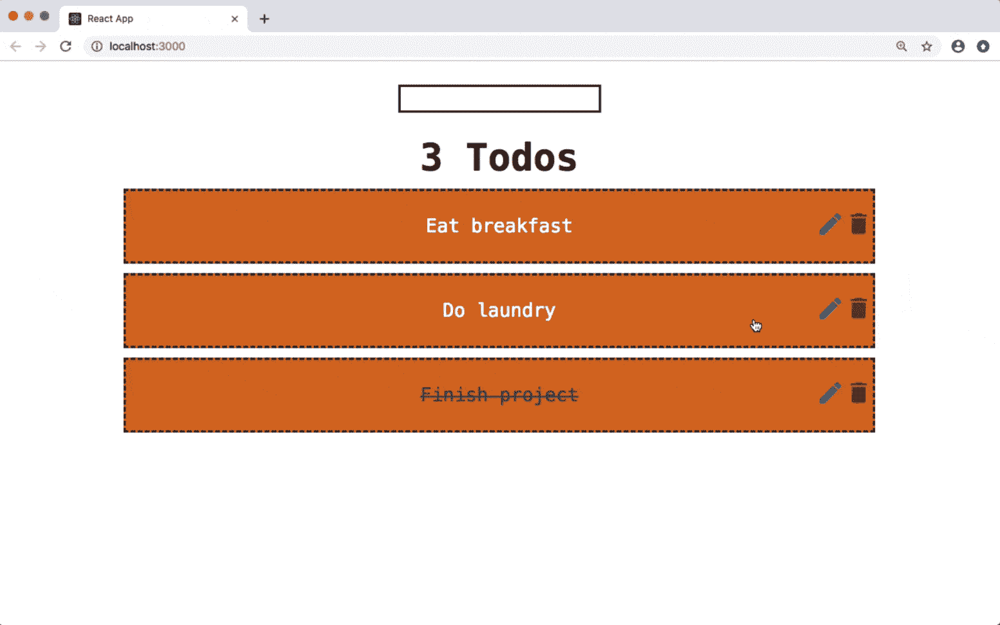

# 5 对你的投资组合中需要的项目做出反应

> 原文：<https://www.freecodecamp.org/news/5-react-projects-you-need-in-your-portfolio/>

您已经完成了工作，现在您已经对 React 库有了坚实的理解。

最重要的是，您已经很好地掌握了 JavaScript，并且正在 React 代码中使用它最有用的特性。

你取得了很大的进步...但是现在你做什么？

您如何在了解 React 的基础知识和成为专业开发人员之间架起一座桥梁？

许多开发人员在学习 React 或任何其他 JavaScript 库的中级阶段都会遇到这个问题。他们知道库本身的大部分内容以及有效使用它的 JavaScript，但是他们不知道下一步该怎么做。

## 为什么你应该开发应用程序

在您学习了 React 的基础知识之后，您需要用您所学到的技能轻松地构建应用程序。这种实践是成为一名有效的 React 开发人员的核心——知道如何自己构建应用程序，并在 React 生态系统中使用正确的工具来实现这一点。

但是你应该用什么样的应用程序来提升你作为开发人员的能力呢？

在本文中，我们将介绍 5 种不同类型的应用程序，你应该考虑在基本的 todo 应用程序之后构建它们。构建应用程序的最大好处是，一旦部署，它们就可以与你的投资组合联系起来，成为向雇主展示你的专业知识的一种强大而直接的方式。

对于每种类型的应用程序，我将介绍一些你可以用作灵感的流行例子，我推荐的构建每种功能的工具，以及我个人使用 React 制作的这种应用程序的简短演示。

## 如何开始用 React 构建应用

与学习 React 本身不同，你可以找到几十篇文章来深入研究任何相关的概念，构建应用程序的过程在很大程度上是一种自我指导的活动，没有太多的指导。

如果你开始自己构建应用程序，我建议你搜索那些教你构建应用程序基础知识的文章，并深入研究他们提供的应用程序源代码。甚至阅读代码的过程本身也会让你成为更好的开发者。

如果这些例子看起来太吓人而无法自己构建，请记住作为 React 开发人员您所知道的事情——将应用程序分解成可组合的组件。每个应用程序都必须一部分一部分、一个组件一个组件地构建。专注于一次构建一个功能。通过实践，你会更好地了解每个特性需要什么工具，以及构建应用程序背后的通用模式。

> 注意:当我开始构建这样的实际应用程序时，我有一个误解，那就是我必须用 Node 或 Python 构建一个完整的后端/ API 来获得我需要的功能。

> 你不需要这样做。看看强大的无服务器技术，如 Firebase、AWS Amplify 或 Hasura，它们为您提供开箱即用的完整后端，而无需您自己创建和部署。购买能让你更有效率和节省时间的工具。

## 构建一个社交媒体应用程序

如果我只能向你推荐一个应用程序来添加到你的投资组合中，它会是一个社交媒体应用程序。Twitter、脸书和 Instagram 相当复杂，并且包含越来越多的功能来吸引用户。最重要的是，你可能最了解这种应用应该如何运行。

几乎所有社交媒体应用都有一些共同的功能:

*   用户用文本和/或媒体文件发帖的能力，
*   这些帖子的实时反馈，
*   允许其他用户喜欢和评论帖子，
*   以及用户认证。

完成后，您可以为每个用户添加个人资料，他们可以在其中个性化自己的帐户并管理他们关注的用户。

**App 例子:** Instagram，Twitter，Snapchat，Reddit

**要利用的技术:**

*   创建 React App 或 Next.js 来制作帖子、赞和消息的动态 UI
*   实时数据的 Firebase、AWS Amplify 或 Hasura(使用订阅的 GraphQL)
*   用于通知的无服务器功能，如 AWS Lambda 或 Firebase 功能
*   用于上传图片或视频的 Cloudinary 或 Firebase 存储

## 构建一个电子商务应用程序

选择几个你最喜欢的网站，我保证其中至少有一个嵌入了电子商务应用，即使它只是一个小店面。电子商务应用程序无处不在，我敢打赌，在你作为开发人员的职业生涯中，你会被要求开发一个电子商务应用程序。

像亚马逊一样建立一个令人印象深刻的大规模电子商务平台是很诱人的，但我建议做一些更小更专注的事情。

与其去一个为所有人提供所有东西的市场，不如去一个你感兴趣的行业。例如，如果你喜欢家居用品，你可以看看 Crate & Barrel 或 Williams-Sonoma 为他们的网站建了什么。

除了产品，电子商务应用程序还可能为消费者提供一种服务。如果是本地提供的服务，可以在应用程序中添加一个交互式地图，让服务提供商和客户知道彼此的位置。我们想到了 UberEats 和 Doordash 等食品配送应用程序，它们需要知道订餐者的位置。

不管卖的是什么，不管是实体的还是虚拟的，每个电子商务应用程序都会包含一些带有产品或服务细节的店面。如果用户可以一次购买多种产品，它应该有一个购物车，用户可以管理他们想买的产品。

最后，每个电子商务应用程序都需要一个结账流程，用户既可以匿名购买产品，也可以通过认证后购买。

**热门例子:** Airbnb，优步，UberEats，Doordash，Etsy，Udemy

**要利用的技术:**

*   为店面和展示产品创建 React 应用程序或 Gatsby
*   用于处理支付处理的包反应条带元素
*   无服务器功能，如 Netlify / AWS Lambda，用于处理结账流程
*   快速搜索产品的 Algolia
*   Snipcart 用于轻松创建购物车和管理购物车产品

## 打造娱乐应用

这是所有类别中最广泛的。我说的娱乐是什么意思？专注于某种媒体的应用程序。这可能是电影，播客，或音乐等等。

一些很好的例子分别是网飞、Audible、Soundcloud 或 Spotify。如果你在这一类别中包括艺术或设计，我们可以将 Behance 或 Dribbble 等网站添加到列表中。

这个类别有趣的是，许多娱乐应用程序与社交媒体应用程序接壤。例如，像 Tiktok 这样的应用程序，其特点是短而富有想象力的视频，是由高用户参与度驱动的。另一个应用程序，如 YouTube，通过赞、评论和订阅，以用户互动为中心。

想想什么类型的媒体或娱乐最让你感兴趣，看看你是否可以围绕它建立一个简单的平台，用户可以登录并保存他们喜欢的内容。之后，考虑添加社交元素，这样就可以添加评论、赞，并与平台上的其他用户分享内容。

**流行的例子:** YouTube、网飞、Audible、Spotify、Tiktok

**要利用的技术:**

*   创建 React App、Next.js 或 Gatsby 来创建 app UI
*   npm 包 react-player 用于播放媒体
*   用于媒体上传的 Cloudinary 或 Firebase 存储
*   用于按名称搜索媒体的 Algolia(即音轨、视频、电影等)。)

## 构建消息应用程序

消息应用非常庞大。你的手机上可能有 WhatsApp 或 Viber 这样的免费消息服务，或者 Facebook Messenger 这样的社交媒体平台内置的服务。像带有即时消息的内部通信这样的服务也可以作为网络应用程序使用，因此公司可以为他们的用户提供即时的客户支持。

任何消息应用程序都将包含与两个或更多人的对话，其中消息是实时发送的。与社交媒体应用类似，我会推荐 Firebase 或 Hasura 等服务，它们通过 WebSockets 传输数据，以便消息立即显示在对话中。

大多数消息应用程序都在移动设备或平板电脑上。如果这不是你的第一个应用克隆，这是一个超越网络，用 React Native 构建移动应用的好机会。更好的是，你可以用 React Native web 这样的包同时构建一个 Web 和移动消息应用。

**流行的例子:** WhatsApp，Viber，Discord，Messenger，Slack

**要利用的技术:**

*   React Native 或 React Native Web 构建为移动应用或混合应用(web +移动)
*   Firebase、AWS Amplify 或 Hasura(使用 GraphQL 订阅)实时发送消息
*   用于发送包含图像或视频内容的消息的云或 Firebase 存储
*   npm 软件包 emoji-mart 为用户提供了一个光滑的 Slack-like emoji picker，供用户包含在他们的消息中

## 构建生产力应用程序

考虑到有这么多基础生产力应用的教程，这可能是最容易开始的应用类型。当我谈到生产力应用程序时，我指的是笔记应用程序、管理团队的应用程序和任务列表。一般来说，任何有助于你完成某项任务或更有成效的事情。

首先构建一个生产力应用程序的伟大之处在于，它提供了一个很好的应用程序构建入门，因为它的许多功能都相对简单。

您可以从一些简单的东西开始，比如一个文本编辑器，它可以轻松地编写带 markdown 的格式化文本，然后对其进行扩展。然后添加将文本作为单独文件保存在计算机上的功能。之后，有一个功能可以将降价导出为 HTML 格式来编写格式化的电子邮件。

要开始构建一个生产力应用程序，先问问这个应用程序有什么功能可以让你的日常日程安排变得更简单，然后从这里开始。

流行的例子: Todoist，观念，事物等。

**要利用的技术:**

*   创建 React web 应用程序或 React Native 移动应用程序
*   npm 包 react-markdown 在您的应用程序 UI 中显示降价
*   npm 包 react-codemirror2，用于在笔记中编写代码
*   npm 包可通过单击和拖动对列表内容进行重新排序

祝您的应用程序构建之旅好运，下一篇文章再见。

## 喜欢这篇文章吗？加入 React 训练营

**[React 训练营](http://bit.ly/join-react-bootcamp)** 将你应该知道的关于学习 React 的一切打包成一个全面的包，包括视频、备忘单，外加特殊奖励。

获得数百名开发人员已经使用的内部信息，以掌握 React、找到他们梦想的工作并掌控他们的未来:

 
*打开时点击此处通知*