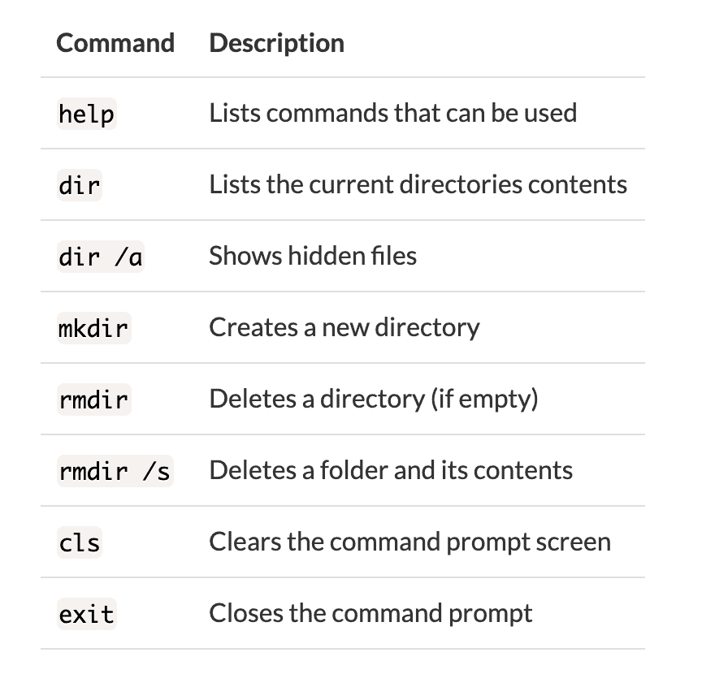

# 如何在 Windows 中打开和使用命令提示符

> 原文：<https://www.freecodecamp.org/news/how-to-use-the-command-prompt-in-windows/>

# **入门**

Windows、MacOS 和 Linux 都有命令行界面。Windows 的默认命令行是命令提示符。命令提示符允许用户使用他们的计算机，而不需要用鼠标点击。

命令提示符是一个黑屏，用户在这里键入命令来使用他们的计算机。通过鼠标指向和单击可以完成的相同任务也可以通过命令提示符来完成。不同之处在于，许多任务(如创建文件夹和删除文件)可以在命令提示符下更快地完成。

此外，它允许用户配置他们的计算机和运行程序，否则他们不能通过指向和点击。

## **打开命令提示符**

要访问命令提示符，请单击桌面工具栏上的 windows 开始菜单(也可以按键盘上的 windows 按钮)，键入`cmd`并点击`enter`。将出现命令提示符，它将显示如下文本:

```
C:\Users\YourUserName>
```

## **导航目录(在文件夹中移动)**

`C:\Users\YourUserName`称为你当前的工作目录(目录是文件夹的另一种说法)。它就像一个街道地址，告诉你你在电脑上的位置。

当前工作目录可以作为您在计算机中导航的指南。在`>`的右边，我们可以键入`cd`，它代表更改目录，以及您想要导航到的目录的名称。在这种情况下，我们将输入`Documents`。输入`cd Documents`，您当前的工作目录应该如下所示:

```
C:\Users\YourUserName\Documents>
```

返回一个目录类型并输入`cd..`。您当前的工作目录应该返回到:

```
C:\Users\YourUserName>
```

使用`cd`和`cd ..`命令，你可以在目录间来回移动。乍一看，这似乎是非常基础的，但是随着您学习更多的命令，命令提示符将成为一个非常有用和高效的工具。

## **以下是常用命令的列表:**



## **用法举例:**

#### **制作目录**

```
mkdir name_of_the_directory_you_want_to_make
```

#### **获取命令信息**

```
your_command /?
```

#### **删除文件和内容**

```
rm /s name_of_directory_you_want_to_delete
```

## **有用提示:**

*   命令`Ipconfig`显示你的计算机的 ip 地址
*   如果你输入一个目录名的一部分并按下`tab`键，命令提示符会自动完成它，如果你重复按下`tab`键，它会在以相同字母开头的目录中循环
*   您可以使用其他 shells 或工具(如 git bash 或 cmder)向命令提示符添加更多命令和功能
*   有些任务需要您以管理员身份运行命令提示符，您可以单击 windows 按钮，键入`cmd admin`并按下`enter`键
*   如果您知道文件或目录的路径，可以键入`cd PATH_TO_YOUR_DIRECTORY`而不是多次更改目录来获得目录或文件
*   当您点击向上箭头键时，您先前输入的命令将出现，如果您重复点击它，它将循环显示您先前输入的所有命令