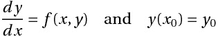
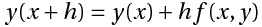
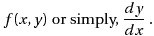
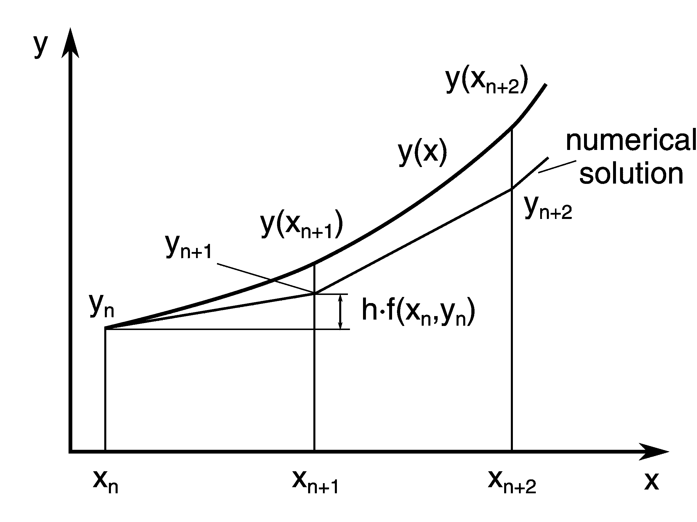
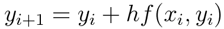
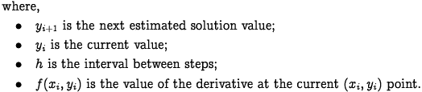
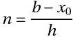
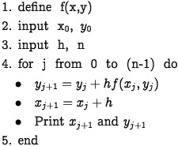
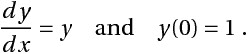
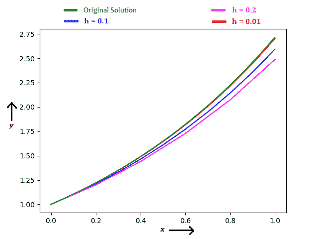

# 举例说明欧拉方法

> 原文：<https://www.freecodecamp.org/news/eulers-method-explained-with-examples/>

# **欧拉法是什么？**

欧拉方法是一种求解具有给定初始值的常微分方程(ODE)的一阶数值方法。

## **一般初值问题**

## **方法论**

欧拉方法使用简单的公式，

构造`x`点的切线，得到`y(x+h)`的值，其斜率为，

在欧拉方法中，你可以用每个区间的切线(即一系列短线段)来逼近解的曲线，步长为`h`。

*一般情况下*，如果使用小步长，逼近的精度增加。

## **通式**

## **任意点`b`的函数值，由`y(b)`** 给出

在哪里，

*   ****n**** =步数
*   ****h**** =区间宽度(每一步的大小)

### **伪代码**

## **例子**

找到`y(1)`，给定

解析求解，解为*****y = e^x*****和`y(1)` = `2.71828`。(注:这个解析解只是为了比较精度。)

使用欧拉法，考虑`h` = `0.2`、`0.1`、`0.01`，可以看到下图的结果。

当`h` = `0.2`，`y(1)` = `2.48832`(误差= 8.46 %)

当`h` = `0.1`，`y(1)` = `2.59374`(误差= 4.58 %)

当`h` = `0.01`，`y(1)` = `2.70481`(误差= 0.50 %)

你可以注意到，步长越小，精度越好。