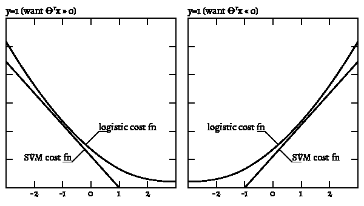
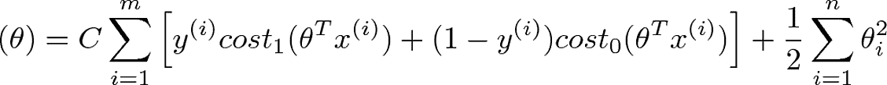

# SVM 机器学习算法讲解

> 原文：<https://www.freecodecamp.org/news/support-vector-machines/>

根据 OpenCV 的“支持向量机简介”，一个支持向量机(SVM):

> ...是由分离超平面形式定义的判别分类器。换句话说，给定标记的训练数据(监督学习)，算法输出一个分类新例子的最佳超平面。



SVM 成本函数试图用分段线性来逼近逻辑函数。这种机器学习算法用于分类问题，是监督学习算法子集的一部分。

### **成本函数**



成本函数用于训练 SVM。通过最小化 J(θ)的值，我们可以确保 SVM 尽可能精确。在等式中，函数 cost1 和 cost0 指的是 y=1 的示例的成本和 y=0 的示例的成本。对于支持向量机，代价由核(相似性)函数决定。

### **内核**

多项式要素往往计算量很大，并且可能会增加大型数据集的运行时间。与其添加更多的多项式特征，不如添加*界标*来测试其他数据点的接近度。训练集的每个成员都可以被认为是一个地标，而核是度量输入与所述地标接近程度的相似性函数。

### **大幅度分类器**

SVM 将找到以最大可能的余量分割数据的线或超平面。尽管会有异常值使线在某个方向摇摆，但足够小的 C 值将会强制正则化。

以下是用 Python 编写的用于训练、预测和查找 SVM 精确度的代码:

```
import numpy as np

class Svm (object):
    """" Svm classifier """

    def __init__ (self, inputDim, outputDim):
        self.W = None

        # - Generate a random svm weight matrix to compute loss                 #
        #   with standard normal distribution and Standard deviation = 0.01\.    #

        sigma =0.01
        self.W = sigma * np.random.randn(inputDim,outputDim)

    def calLoss (self, x, y, reg):
        """
        Svm loss function
        D: Input dimension.
        C: Number of Classes.
        N: Number of example.
        Inputs:
        - x: A numpy array of shape (batchSize, D).
        - y: A numpy array of shape (N,) where value < C.
        - reg: (float) regularization strength.
        Returns a tuple of:
        - loss as single float.
        - gradient with respect to weights self.W (dW) with the same shape of self.W.
        """
        loss = 0.0
        dW = np.zeros_like(self.W)

        # - Compute the svm loss and store to loss variable.                        #
        # - Compute gradient and store to dW variable.                              #
        # - Use L2 regularization                                                  #

        #Calculating score matrix
        s = x.dot(self.W)
        #Score with yi
        s_yi = s[np.arange(x.shape[0]),y]
        #finding the delta
        delta = s- s_yi[:,np.newaxis]+1
        #loss for samples
        loss_i = np.maximum(0,delta)
        loss_i[np.arange(x.shape[0]),y]=0
        loss = np.sum(loss_i)/x.shape[0]
        #Loss with regularization
        loss += reg*np.sum(self.W*self.W)
        #Calculating ds
        ds = np.zeros_like(delta)
        ds[delta > 0] = 1
        ds[np.arange(x.shape[0]),y] = 0
        ds[np.arange(x.shape[0]),y] = -np.sum(ds, axis=1)

        dW = (1/x.shape[0]) * (x.T).dot(ds)
        dW = dW + (2* reg* self.W)

        return loss, dW

    def train (self, x, y, lr=1e-3, reg=1e-5, iter=100, batchSize=200, verbose=False):
        """
        Train this Svm classifier using stochastic gradient descent.
        D: Input dimension.
        C: Number of Classes.
        N: Number of example.
        Inputs:
        - x: training data of shape (N, D)
        - y: output data of shape (N, ) where value < C
        - lr: (float) learning rate for optimization.
        - reg: (float) regularization strength.
        - iter: (integer) total number of iterations.
        - batchSize: (integer) number of example in each batch running.
        - verbose: (boolean) Print log of loss and training accuracy.
        Outputs:
        A list containing the value of the loss at each training iteration.
        """

        # Run stochastic gradient descent to optimize W.
        lossHistory = []
        for i in range(iter):
            xBatch = None
            yBatch = None

            # - Sample batchSize from training data and save to xBatch and yBatch   #
            # - After sampling xBatch should have shape (batchSize, D)              #
            #                  yBatch (batchSize, )                                 #
            # - Use that sample for gradient decent optimization.                   #
            # - Update the weights using the gradient and the learning rate.        #

            #creating batch
            num_train = np.random.choice(x.shape[0], batchSize)
            xBatch = x[num_train]
            yBatch = y[num_train]
            loss, dW = self.calLoss(xBatch,yBatch,reg)
            self.W= self.W - lr * dW
            lossHistory.append(loss)

            # Print loss for every 100 iterations
            if verbose and i % 100 == 0 and len(lossHistory) is not 0:
                print ('Loop {0} loss {1}'.format(i, lossHistory[i]))

        return lossHistory

    def predict (self, x,):
        """
        Predict the y output.
        Inputs:
        - x: training data of shape (N, D)
        Returns:
        - yPred: output data of shape (N, ) where value < C
        """
        yPred = np.zeros(x.shape[0])

        # -  Store the predict output in yPred                                    #

        s = x.dot(self.W)
        yPred = np.argmax(s, axis=1)
        return yPred

    def calAccuracy (self, x, y):
        acc = 0

        # -  Calculate accuracy of the predict value and store to acc variable    
        yPred = self.predict(x)
        acc = np.mean(y == yPred)*100
        return acc
```