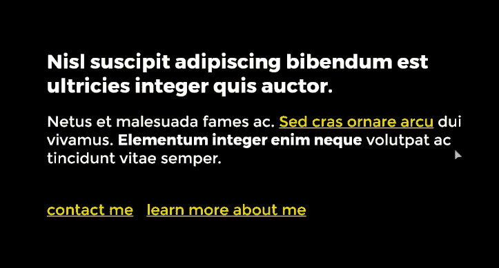
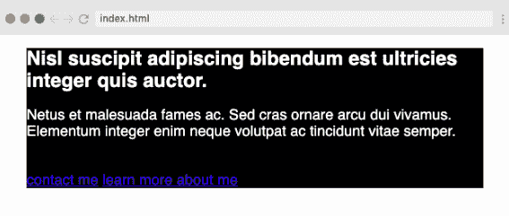
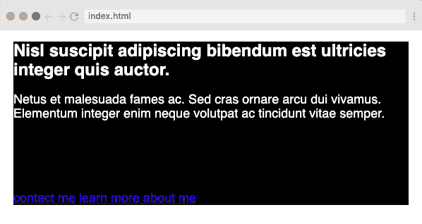
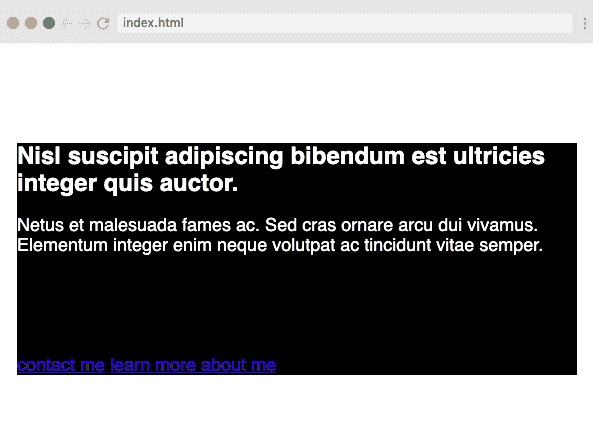
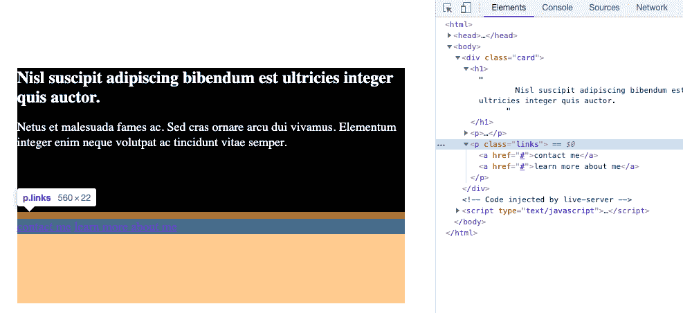
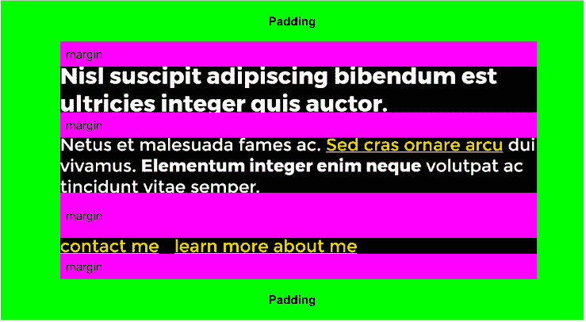

# 如何理解和使用 CSS 边距

> 原文：<https://www.freecodecamp.org/news/css-margins/>

CSS 因为没有按照人们期望的方式行事而受到指责。最让人们困惑的事情之一是利润。它们看起来很简单，但是它们有可能导致一些非常奇怪的问题。

对于刚刚接触 CSS 的人来说，这很容易让你想到“这是一种没有意义的愚蠢语言！”

我每天都看到它——在教室里，人们试图解决他们的间距问题，在我的 YouTube 评论区也是如此。

在某种程度上，边距是 CSS 的缩影。CSS 看起来很简单，但是当你使用它的时候，你会意识到有很多事情在发生。

利润率似乎也很简单。添加一些边距，并在元素周围添加一些空白空间。但是突然之间，它们在不同情况下的行为会有所不同，或者你给子元素添加了一些`margin-top`，取而代之的是父元素下移。

沮丧随之而来。

在这篇文章中，我希望对利润是如何运作的有一点了解。我们将看看一些常见的问题，以及这些问题的简单解决方案。

为了回顾这一切，我将使用我在 Scrimba 上的[响应式网页设计训练营中的例子，我从
中提取了这个简单的布局](https://scrimba.com/p/gresponsive?utm_source=dev.to&utm_medium=referral&utm_campaign=gresponsive_margins_5_minute_article)



## 什么是利润？

在我们真正开始深入讨论之前，我想确保我们都知道实际的利润是多少！

我假设我们都知道边距是盒子模型的一部分，边距一直在外面，在内容本身、填充和边框之后。

MDN 很好地解释了它们(重点是我的):

> 边距是最外层，将内容、填充和边框包装为这个框和其他元素之间的**空白。它的大小可以使用边距和相关属性来控制。**

换句话说，它实际上是空的空间，我们可以用它来创建布局中一个框和另一个框之间的空间。

## 处理用户代理样式表

默认情况下，浏览器附带了数量惊人的 CSS，我们称之为*用户代理样式表*。这些样式是我们没有任何 CSS 的情况下，`<h1>`比`<h2>`大的原因，也是为什么`<body>`上有一个我们倾向于总是移除的空白。

这些样式很重要，但它们也导致了人们在边距方面遇到的最大问题之一！所有元素的边距都不是默认的`0`,这可能会导致各种奇怪的问题，我们很快就会探讨这些问题。

列表、块引号、段落和标题都有`margin`(以及其他元素)。虽然有时它们只是带来一点不便，但段落和标题的默认边距似乎是导致大多数问题的原因。

默认情况下，文本元素的左边距和右边距被设置为`0`，但是它们都带有一个`margin-top`和`margin-bottom`。

我经常告诉人们，那些顶部和底部的默认值与那个元素的`font-size`大致相同，因为对于`<p>`以及`<h3>`到`<h6>`都是如此。对`<h1>`来说实际上是`0.67em`，对`<h2>`来说是`0.83em`。

这意味着即使我们没有明确设置边距，页面上的元素之间也存在空间。

我们一会儿将回到这些默认值。

## 折叠页边距

利润暴跌通常是令人头疼的地方。

当两个元素有相互接触的**垂直**边距时，它们实际上合并成了另一个。

这已经是一种奇怪的行为，再加上这只是为了垂直边距(顶部和底部)，我明白为什么人们会对它们感到困惑和烦恼。

我们可以从下面的例子中看到这一点:

```
p {
  font-size: 18px;
  margin-bottom: 40px;
}

.links {
  margin-top: 40px;
} 
```

为了帮助说明这里发生了什么，最后一段(`<p class="links">`)上有`.links`类，其中包含了两个链接。

当人们做这样的事情时，他们期望中间段落与其下方链接之间的边距是 80px ( `40px` + `40px`)，但实际上是 40px。这两个边互相接触，所以它们合并在一起。



为了更进一步，让我们给`100px`一个`margin-bottom`:

```
p {
  font-size: 18px;
  margin-bottom: 100px;
}

.links {
  margin-top: 40px;
} 
```

同样，这两个页边没有加在一起，它们折叠成一个，所以这里的总空间是`100px`。



### 这是一件好事

在这种情况下，这实际上是一件好事。如果有几个边距不同的元素，那么没有必要将边距加在一起来查看元素之间的差距有多大，因为我们可以依赖于这样一个事实:**较大的边距总是赢**。

我们甚至经常不去想它，它只是按照我们期望的方式工作。

### 当它不是一件好事的时候

也就是说，边距折叠导致各种混乱的一个例子是当元素中的第一个子元素的`margin-top`与父元素的`margin-top`合并时。

让我们再看一遍同样的截图:


在视口顶部和黑盒之间有一个空白区域。这不是来自于主体(它比主体应有的`8px`余量大得多)。

介意猜猜它是从哪里来的吗？

它实际上来自那个黑盒顶部的`<h1>`。

还记得我提到过*用户代理样式表*可以做一些奇怪的事情吗？

为了帮助解释这里到底发生了什么，让我们给`h1`加上一个更大的`margin-top`。

```
.card {
  background: #000;
  color: white;
  width: 560px;
  margin: 0 auto;
}

h1 {
  font-size: 24px;
  margin-top: 100px;
}

p {
  font-size: 18px;
  margin-bottom: 100px;
}

.links {
  margin-top: 10px;
} 
```

我看到人们总是这样做，试图将标题压入其父标题中。然而，我们并没有像预期的那样工作，而是在整张卡片的顶部得到了一个巨大的空间！



这是因为`<h1>`上的`margin-top`与父元素上的`margin-top`合并。

在这种情况下，子节点和父节点之间没有任何分隔。所以当我们给孩子加`margin-top`的时候，就触及到了家长的`margin-top`。正如我们在上面看到的，当两个边缘相互接触时，它们会合并成一个边缘。

因此，当我们将边距给子节点时，它也应用于父节点。

这就是人们讨厌 CSS 的原因。

类似地，在上面的代码中，我们给所有的段落加了一个`margin-bottom`。`p.link`元素上的边距接触到了`.card`元素的`margin-bottom`，这意味着两者合并在一起，边距影响的是`.card`元素而不是链接。



虽然这不会给我们当前创建的站点带来问题，但是如果我们以后决定向页面添加更多的元素，这可能会带来问题。

## 问题是，我们将`margin`用于错误的目的

如果我想要在`.card`元素的顶部和里面的子元素之间留有空间，我就不应该使用`margin`。

初学者经常会混淆`margin`和`padding`。我的一般经验是，如果你想要空白，使用`margin`。如果想要更多背景，使用`padding`。

在这种情况下，我们希望我们的`.card`有更多的背景，所以我们不应该添加一个`margin`到它的孩子。相反，我们应该将`padding`添加到元素本身。



在上图中，我们可以看到填充和边距。顶部的`<h1>`仍然有一个边距，但是它不再与`.card`合并，因为`padding`增加了一个缓冲区。这可以防止`.card`和`h1`边缘相互接触。

由于填充在`<p>`和`<h1>`之间增加了足够的空间，我们现在可以删除之前添加的边距。


## 利润率并不总是下降

折叠边距也有一些例外。grid 和 flex 父级的直接后代没有折叠边距。

暗示一下。。

但是对此也有一点变通办法，这使我们又回到了我们在开始时谈到的那些用户代理样式表。

## 有一种简单的方法可以避免考虑利润率的下降

首先，这是我上面提到的一般经验法则:

*   如果您需要空白空间，请使用`margin`
*   如果您需要更多背景信息，请使用`padding`

那会让你在大多数时候摆脱困境。但是，让我们添加一个额外的规则，这将有更大的帮助:

*   除非你真的需要，否则尽量避免使用

这条规则与用户代理风格有点冲突，用户代理风格将一个`margin-top`和`margin-bottom`设置为一组元素，这是我经常这样做的一个原因:

```
h1,
h2,
h3,
h4,
h5,
h6,
p,
ul,
ol {
 margin: 0 0 1em 0;   
}
```

它消除了大量由折叠边距本身引起的问题，以及当一些地方使用 flex 或 grid 而其他地方不使用时布局中的差异。

(注意:如果你查看 freeCodeCamp 上的代码，你会发现他们也做了类似的事情！)

这不是一个完美的解决方案，我经常在某些字幕上或者在需要的特定情况下使用一点`margin-top`。但是我是有意这样做的，而不是让用户代理风格以某种不可预见的方式潜在地妨碍我。

这些课程只是我的响应式网页设计大课程的一小部分。为了继续这段编码之旅，[请看一下课程](https://scrimba.com/p/gresponsive?utm_source=dev.to&utm_medium=referral&utm_campaign=gresponsive_margins_5_minute_article)。

在这门课程中，我将介绍响应式网页设计，并深入研究 flexbox 和 grid，同时试图向人们展示，一旦你开始理解 CSS 的工作原理，它会多么有趣。

快乐编码:)