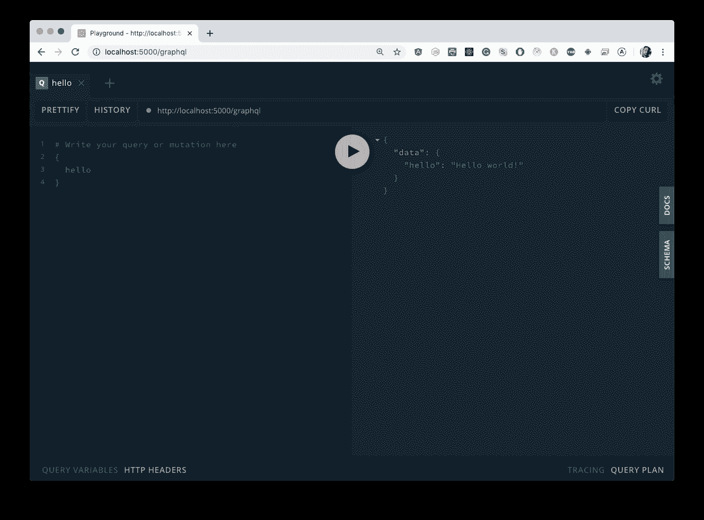

# ⚡如何在 2 分钟内将 GraphQL 服务器添加到 RESTful Express.js API 中

> 原文：<https://www.freecodecamp.org/news/add-a-graphql-server-to-a-restful-express-js-api-in-2-minutes/>

你可以在两分钟内完成很多事情，比如用微波炉加热爆米花、发送短信、吃蛋糕，以及连接 GraphQL 服务器。

没错。如果您有一个旧的 Express.js RESTful API，或者您对逐步采用 GraphQL 感兴趣，我们只需要两分钟就可以将它与一个全新的 GraphQL 服务器连接起来。

准备好了吗？设置。走吧。

假设您的服务器如下所示。

```
import express from 'express';
import { apiRouter } from './router';

const app = express();
const port = process.env.PORT || 5000;

// Existing routes for our Express.js app
app.use('/api/v1', apiRouter);

app.listen(port, () => console.log(`[App]: Listening on port ${port}`)) 
```

在你的项目中，`npm install`[Apollo-server-express](https://github.com/apollographql/apollo-server/tree/master/packages/apollo-server-express)作为一个依赖项。

```
npm install apollo-server-express --save 
```

转到定义您的 Express 应用程序的位置，从`apollo-server-express`导入`ApolloServer`和`gql`。

```
import { ApolloServer, gql } from 'apollo-server-express' 
```

接下来，用*最简单的可能* GraphQL **类型定义**和**解析器**创建一个`ApolloServer`的实例。

```
const server = new ApolloServer({
  typeDefs: gql`
    type Query {
      hello: String
    }
  `,
  resolvers: {
    Query: {
      hello: () => 'Hello world!',
    },
  }
}) 
```

最后，使用`ApolloServer`的 [applyMiddleware](https://www.apollographql.com/docs/apollo-server/api/apollo-server/?utm_source=devto&utm_medium=blog_post&utm_campaign=add_graphl_server_express_2_mins#apolloserverapplymiddleware) 方法传入我们的 Express.js 服务器。

```
server.applyMiddleware({ app }) 
```

嘣。就是这样！

您的代码应该如下所示。

```
import express from 'express';
import { v1Router } from './api/v1';
import { ApolloServer, gql } from 'apollo-server-express'

const app = express();
const port = process.env.PORT || 5000;

const server = new ApolloServer({
  typeDefs: gql`
    type Query {
      hello: String
    }
  `,
  resolvers: {
    Query: {
      hello: () => 'Hello world!',
    },
  }
})

server.applyMiddleware({ app })

app.use('/api/v1', v1Router);

app.listen(port, () => {
  console.log(`[App]: Listening on port ${port}`)
}) 
```

如果您导航到`localhost:5000/graphql`，您应该能够在 GraphQL playground 中看到您的 GraphQL 模式。



注意:如果您想将 GraphQL 端点所在的 URL 从`/graphql`更改为其他，您可以将一个`path`选项传递给带有您想要的 URL 的`server.applyMiddleware()`，比如`path: '/specialUrl'`。查看[文档](https://www.apollographql.com/docs/apollo-server/api/apollo-server/?utm_source=devto&utm_medium=blog_post&utm_campaign=add_graphl_server_express_2_mins#apolloserverapplymiddleware)了解完整的 API 用法。

有多简单？你的爆米花吃完了吗？？

## 摘要

我们是这样做的。

1.  安装`apollo-server-express`
2.  创建一个`new ApolloServer`
3.  用`server.applyMiddleware`连接您的 GraphQL 服务器

我个人非常喜欢这样一个事实，即 Apollo Server 是非侵入性的，可以作为服务和应用程序之间通信的替代方式添加到任何项目中。

## 从这里去哪里

如果你是 Apollo 和 GraphQL 的新手，一个很好的学习方法是在现实生活中实际构建一些东西。出于这个原因，我强烈推荐查看一下 [Apollo Fullstack 教程(你现在也可以在 TypeScript 中学习？)](https://www.apollographql.com/docs/tutorial/introduction?utm_source=freecodecamp&utm_medium=blog_post&utm_campaign=add_graphl_server_express_2_mins)。

我是 Apollo GraphQL 的开发者支持者 Khalil Stemmler。我教授大型应用程序的高级 TypeScript、GraphQL 和 Node.js 最佳实践。如果你需要任何关于阿波罗、打字稿或建筑相关的帮助，请随时在[推特](https://twitter.com/stemmlerjs)上联系我。干杯？