# 猫鼬 101:基础知识、子文档和种群介绍

> 原文：<https://www.freecodecamp.org/news/mongoose101/>

Mongoose 是一个使 MongoDB 更容易使用的库。它做两件事:

1.  它为 MongoDB 集合提供了结构
2.  它给了你有用的方法

在本文中，我们将介绍:

1.  使用猫鼬的基础
2.  猫鼬子文档
3.  猫鼬种群

到本文结束时，您应该可以毫无问题地使用 Mongoose。

## 先决条件

我假设您已经完成了以下工作:

1.  您已经在计算机上安装了 MongoDB
2.  您知道如何建立本地 MongoDB 连接
3.  您知道如何查看数据库中的数据
4.  你知道 MongoDB 中的“集合”是什么吗

如果您不知道这些，请在继续之前阅读[“如何设置本地 MongoDB 连接”](https://zellwk.com/blog/local-mongodb)。

我还假设您知道如何使用 MongoDB 创建一个简单的 CRUD 应用程序。如果你不知道如何做到这一点，请在继续之前阅读[“如何用 Node、Express 和 MongoDB 构建 CRUD app”](https://zellwk.com/blog/crud-express-mongodb)。

## 猫鼬基础

在这里，您将学习如何:

1.  连接到数据库
2.  创建模型
3.  创建文档
4.  找到一份文件
5.  更新文档
6.  删除文件

### 连接到数据库

首先，你需要下载猫鼬。

```
npm install mongoose --save 
```

您可以使用`connect`方法连接到数据库。假设我们想要连接到一个名为`street-fighters`的数据库。以下是您需要的代码:

```
const mongoose = require('mongoose')
const url = 'mongodb://127.0.0.1:27017/street-fighters'

mongoose.connect(url, { useNewUrlParser: true }) 
```

我们想知道我们的连接是成功还是失败。这有助于我们进行调试。

为了检查连接是否成功，我们可以使用`open`事件。为了检查连接是否失败，我们使用了`error`事件。

```
const db = mongoose.connection
db.once('open', _ => {
  console.log('Database connected:', url)
})

db.on('error', err => {
  console.error('connection error:', err)
}) 
```

尝试连接到数据库。您应该会看到这样的日志:

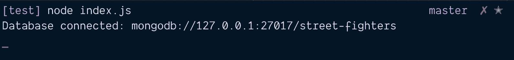

### 创建模型

在 Mongoose 中，您需要使用模型从 MongoDB 集合中创建、读取、更新或删除项目。

为了创建一个模型，**您需要创建一个模式**。模式让您**定义集合中条目**的结构。该条目也称为文档。

以下是创建模式的方法:

```
const mongoose = require('mongoose')
const Schema = mongoose.Schema

const schema = new Schema({
  // ...
}) 
```

您可以在一个模式中使用 10 种不同的值。大多数时候，你会用到这六个:

*   线
*   数字
*   布尔代数学体系的
*   排列
*   日期
*   ObjectId

让我们将此付诸实践。

假设我们想为我们的街头霸王数据库创建角色。

在 Mongoose 中，通常的做法是**将每个模型放在自己的文件中。**所以我们先创建一个`Character.js`文件。这个`Character.js`文件将被放在`models`文件夹中。

```
project/
    |- models/
        |- Character.js 
```

在`Character.js`中，我们创建了一个`characterSchema`。

```
const mongoose = require('mongoose')
const Schema = mongoose.Schema

const characterSchema = new Schema({
  // ...
}) 
```

假设我们想将两件事情保存到数据库中:

1.  角色的名字
2.  他们最终行动的名称

两者都可以用字符串表示。

```
const mongoose = require('mongoose')
const Schema = mongoose.Schema

const characterSchema = new Schema({
  name: String,
  ultimate: String
}) 
```

一旦我们创建了`characterSchema`，我们就可以使用 mongoose 的`model`方法来创建模型。

```
module.exports = mongoose.model('Character', characterSchema) 
```

### 创建文档

假设您有一个名为`index.js`的文件。在本教程中，我们将在这里执行 Mongoose 操作。

```
project/
    |- index.js
    |- models/
        |- Character.js 
```

首先，您需要加载角色模型。你可以用`require`来做到这一点。

```
const Character = require('./models/Character') 
```

假设您想要创建一个名为 Ryu 的角色。龙有一个终极招式叫“真功夫”。

要创建 Ryu，您可以使用`new`，后跟您的模型。这种情况下是`new Character`。

```
const ryu = new Character ({
  name: 'Ryu',
  ultimate: 'Shinku Hadoken'
}) 
```

`new Character`在内存中创建角色。它尚未保存到数据库中。**要保存到数据库中，可以运行`save`方法**。

```
ryu.save(function (error, document) {
  if (error) console.error(error)
  console.log(document)
}) 
```

如果您运行上面的代码，您应该会在控制台中看到这个。

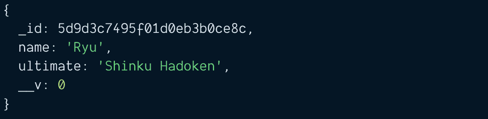

#### 承诺和异步/等待

猫鼬支持承诺。它让你写出更好的代码，比如:

```
// This does the same thing as above
function saveCharacter (character) {
  const c = new Character(character)
  return c.save()
}

saveCharacter({
  name: 'Ryu',
  ultimate: 'Shinku Hadoken'
})
  .then(doc => { console.log(doc) })
  .catch(error => { console.error(error) }) 
```

如果有异步函数，也可以使用`await`关键字。

如果 Promise 或 Async/Await 代码看起来很陌生，我建议在继续本教程之前阅读[“JavaScript Async and Await”](https://zellwk.com/blog/async-await)。

```
async function runCode() {
  const ryu = new Character({
    name: 'Ryu',
    ultimate: 'Shinku Hadoken'
  })

  const doc = await ryu.save()
  console.log(doc)
}

runCode()
  .catch(error => { console.error(error) }) 
```

注意:在本教程的剩余部分，我将使用 async/await 格式。

#### 独特性

每次使用`new Character`和`save`时，Mongoose 都会向数据库中添加一个新字符。如果您运行上述代码三次，您将会在数据库中看到三个 Ryu。

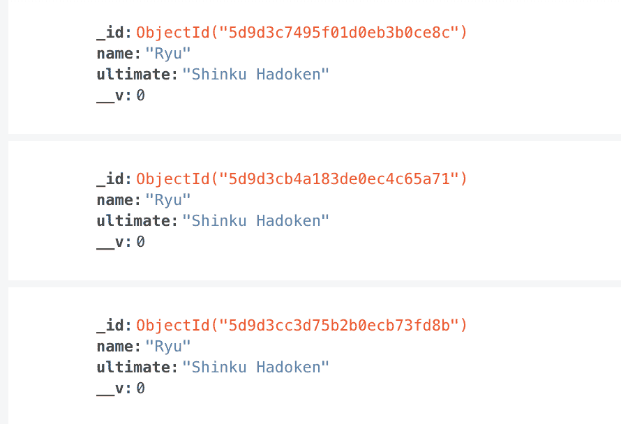

我们不想数据库里有三个 Ryu。我们只想要一个 Ryu。为此，我们可以使用**特有的**选项。

```
const characterSchema = new Schema({
  name: { type: String, unique: true },
  ultimate: String
}) 
```

`unique`选项**创建一个唯一的索引**。这确保了我们不能有两个具有相同值的文档(在本例中为`name`)。

为了让`unique`正常工作，你需要**清除角色集合**。要清除字符集合，您可以使用:

```
await Character.deleteMany({}) 
```

现在尝试将两个 Ryu 添加到数据库中。你会得到一个`E11000 duplicate key error`。你救不了第二个龙。

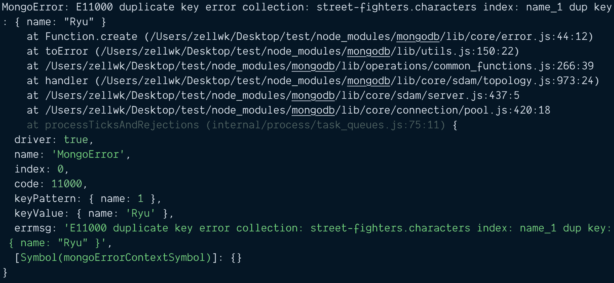

在继续本教程的剩余部分之前，让我们将另一个角色添加到数据库中。

```
const ken = new Character({
  name: 'Ken',
  ultimate: 'Guren Enjinkyaku'
})

await ken.save() 
```

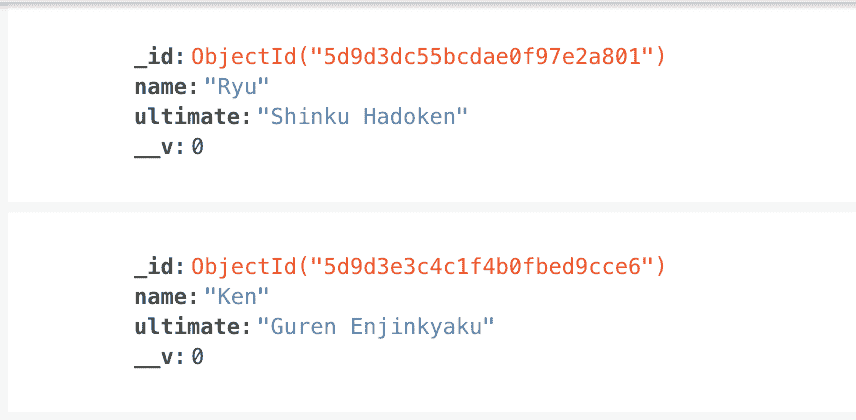

### 查找文档

Mongoose 为您提供了两种从 MongoDB 中查找内容的方法。

1.  `findOne`:获取一个文档。
2.  `find`:获取文档数组

#### findOne .找到一个

`findOne` **返回它找到的第一个文档**。您可以指定要搜索的任何属性。让我们搜索一下`Ryu`:

```
const ryu = await Character.findOne({ name: 'Ryu' })
console.log(ryu) 
```

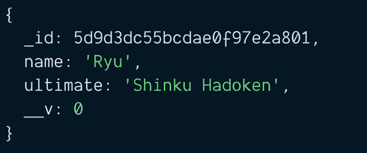

#### 发现

`find` **返回文档的数组**。如果您指定要搜索的属性，它将返回与您的查询相匹配的文档。

```
const chars = await Character.find({ name: 'Ryu' })
console.log(chars) 
```

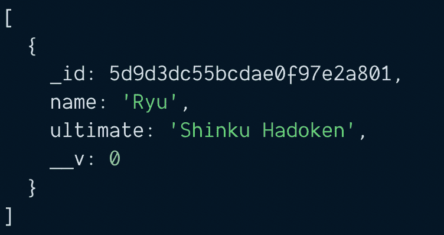

如果您没有指定任何要搜索的属性，它将返回一个包含集合中所有文档的数组。

```
const chars = await Character.find()
console.log(chars) 
```

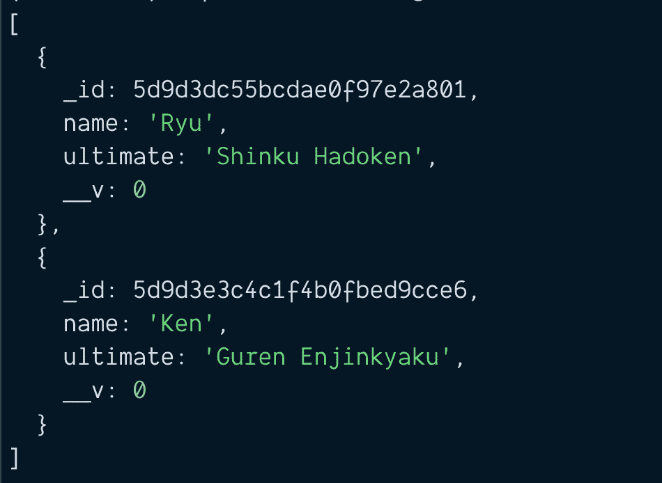

### 更新文档

假设 Ryu 有三个特殊动作:

1.  哈多肯
2.  肖鲁肯
3.  战栗的龙卷·森普克亚库

我们想把这些特殊动作加入数据库。首先，我们需要更新我们的`CharacterSchema`。

```
const characterSchema = new Schema({
  name: { type: String, unique: true },
  specials: Array,
  ultimate: String
}) 
```

然后，我们使用这两种方法中的一种来更新角色:

1.  使用`findOne`，然后使用`save`
2.  使用`findOneAndUpdate`

#### 找到一个并保存

首先，我们使用`findOne`来获取 Ryu。

```
const ryu = await Character.findOne({ name: 'Ryu' })
console.log(ryu) 
```

然后，我们更新了 Ryu 的特殊动作。

```
const ryu = await Character.findOne({ name: 'Ryu' })
ryu.specials = [
  'Hadoken',
  'Shoryuken',
  'Tatsumaki Senpukyaku'
] 
```

在我们修改了`ryu`之后，我们运行`save`。

```
const ryu = await Character.findOne({ name: 'Ryu' })
ryu.specials = [
  'Hadoken',
  'Shoryuken',
  'Tatsumaki Senpukyaku'
]

const doc = await ryu.save()
console.log(doc) 
```

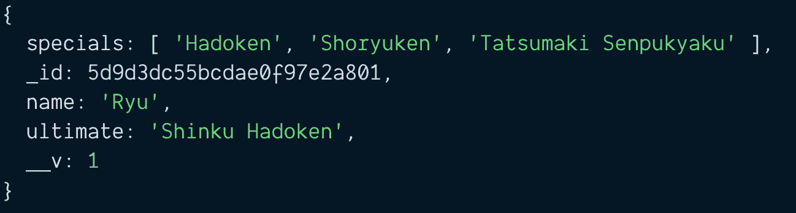

#### findOneAndUpdate

`findOneAndUpdate`和 MongoDB 的`findOneAndModify`方法一样。

在这里，您搜索 Ryu，同时传递您想要更新的字段。

```
// Syntax
await findOneAndUpdate(filter, update) 
```

```
// Usage
const doc = await Character.findOneAndUpdate(
  { name: 'Ryu' },
  {
    specials: [
      'Hadoken',
      'Shoryuken',
      'Tatsumaki Senpukyaku'
    ]
  })

console.log(doc) 
```


#### findOne + save 与 findOneAndUpdate 的区别

两大区别。

首先，`findOne` + `save`的**语法比`findOneAndUpdate`更容易阅读**。

第二，`findOneAndUpdate`不触发`save`中间件。

**因为这两个区别，任何时候我都会选择`findOne` + `save`** 而不是`findOneAndUpdate`。

### 删除文档

有两种方法可以删除字符:

1.  `findOne` + `remove`
2.  `findOneAndDelete`

#### 使用 findOne + remove

```
const ryu = await Character.findOne({ name: 'Ryu' })
const deleted = await ryu.remove() 
```

#### 使用 findOneAndDelete

```
const deleted = await Character.findOneAndDelete({ name: 'Ken' }) 
```

## 子文档

在 Mongoose 中，**子文档**是嵌套在其他文档中的**文档。当一个模式嵌套在另一个模式中时，可以找到一个子文档。**

注意:MongoDB 调用子文档**嵌入文档**。

```
const childSchema = new Schema({
  name: String
});

const parentSchema = new Schema({
  // Single subdocument
  child: childSchema,

  // Array of subdocuments
  children: [ childSchema ]
}); 
```

实际上，您不必像上面的例子那样创建一个单独的`childSchema`。当您将一个对象嵌套在另一个对象中时，Mongoose 可以帮助您创建嵌套模式。

```
// This code is the same as above
const parentSchema = new Schema({
  // Single subdocument
  child: { name: String },

  // Array of subdocuments
  children: [{name: String }]
}); 
```

在本节中，您将学习:

1.  创建包含子文档的架构
2.  创建包含子文档的文档
3.  更新数组形式的子文档
4.  更新单个子文档

### 更新字符架构

假设我们想要创建一个名为 Ryu 的角色。龙有三个特别的动作。

1.  哈多肯
2.  Shinryuken
3.  战栗的龙卷·森普克亚库

龙还有一个终极招式叫做:

1.  新光堂

我们希望保存每个动作的名称。我们还希望保存执行该移动所需的关键点。

在这里，每一步棋都是一个子文档。

```
const characterSchema = new Schema({
  name: { type: String, unique: true },
  // Array of subdocuments
  specials: [{
    name: String,
    keys: String
  }]
  // Single subdocument
  ultimate: {
    name: String,
    keys: String
  }
}) 
```

如果愿意，也可以使用 childSchema 语法。这使得字符模式更容易理解。

```
const moveSchema = new Schema({
  name: String,
  keys: String
})

const characterSchema = new Schema({
  name: { type: String, unique: true },
  // Array of subdocuments
  specials: [moveSchema],
  // Single subdocument
  ultimate: moveSchema
}) 
```

### 创建包含子文档的文档

有两种方法可以创建包含子文档的文档:

1.  将嵌套对象传递到`new Model`
2.  将属性添加到创建的文档中。

#### 方法 1:传递整个对象

对于这个方法，我们构建了一个嵌套的对象，包含 Ryu 的名字和他的移动。

```
const ryu = {
  name: 'Ryu',
  specials: [{
    name: 'Hadoken',
    keys: '↓ ↘ → P'
  }, {
    name: 'Shoryuken',
    keys: '→ ↓ ↘ → P'
  }, {
    name: 'Tatsumaki Senpukyaku',
    keys: '↓ ↙ ← K'
  }],
  ultimate: {
    name: 'Shinku Hadoken',
    keys: '↓ ↘ → ↓ ↘ → P'
  }
} 
```

然后，我们将这个对象传递给`new Character`。

```
const char = new Character(ryu)
const doc = await char.save()
console.log(doc) 
```

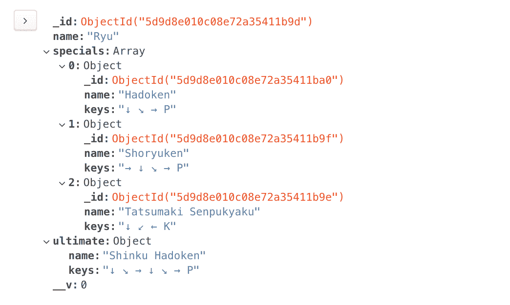

#### 方法 2:稍后添加子文档

对于这个方法，我们首先创建一个带有`new Character`的角色。

```
const ryu = new Character({ name: 'Ryu' }) 
```

然后，我们编辑角色添加特殊动作:

```
const ryu = new Character({ name: 'Ryu' })
const ryu.specials = [{
  name: 'Hadoken',
  keys: '↓ ↘ → P'
}, {
  name: 'Shoryuken',
  keys: '→ ↓ ↘ → P'
}, {
  name: 'Tatsumaki Senpukyaku',
  keys: '↓ ↙ ← K'
}] 
```

然后，我们编辑角色添加终极动作:

```
const ryu = new Character({ name: 'Ryu' })

// Adds specials
const ryu.specials = [{
  name: 'Hadoken',
  keys: '↓ ↘ → P'
}, {
  name: 'Shoryuken',
  keys: '→ ↓ ↘ → P'
}, {
  name: 'Tatsumaki Senpukyaku',
  keys: '↓ ↙ ← K'
}]

// Adds ultimate
ryu.ultimate = {
  name: 'Shinku Hadoken',
  keys: '↓ ↘ → ↓ ↘ → P'
} 
```

一旦我们对`ryu`感到满意，我们就运行`save`。

```
const ryu = new Character({ name: 'Ryu' })

// Adds specials
const ryu.specials = [{
  name: 'Hadoken',
  keys: '↓ ↘ → P'
}, {
  name: 'Shoryuken',
  keys: '→ ↓ ↘ → P'
}, {
  name: 'Tatsumaki Senpukyaku',
  keys: '↓ ↙ ← K'
}]

// Adds ultimate
ryu.ultimate = {
  name: 'Shinku Hadoken',
  keys: '↓ ↘ → ↓ ↘ → P'
}

const doc = await ryu.save()
console.log(doc) 
```


### 更新数组子文档

更新子文档最简单的方法是:

1.  使用`findOne`查找文件
2.  获取数组
3.  改变阵列
4.  运行`save`

比如说我们要给 Ryu 的特殊招式加`Jodan Sokutou Geri`。`Jodan Sokutou Geri`的按键是`↓ ↘ → K`。

首先，我们用`findOne`找到 Ryu。

```
const ryu = await Characters.findOne({ name: 'Ryu' }) 
```

Mongoose 文档的行为类似于常规的 JavaScript 对象。我们可以通过写`ryu.specials`得到`specials`数组。

```
const ryu = await Characters.findOne({ name: 'Ryu' })
const specials = ryu.specials
console.log(specials) 
```

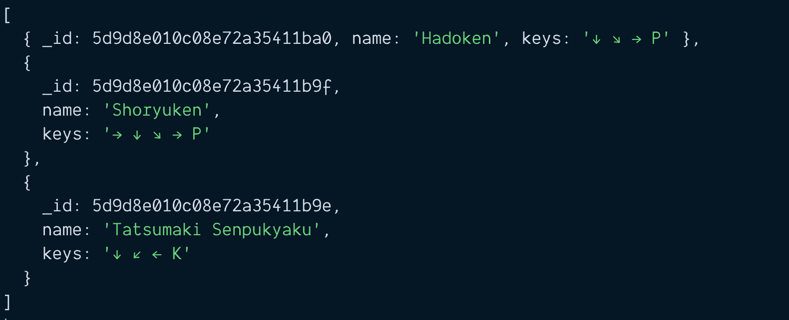

这个`specials`数组是一个普通的 JavaScript 数组。

```
const ryu = await Characters.findOne({ name: 'Ryu' })
const specials = ryu.specials
console.log(Array.isArray(specials)) // true 
```

我们可以使用`push`方法向`specials`中添加一个新项目，

```
const ryu = await Characters.findOne({ name: 'Ryu' })
ryu.specials.push({
  name: 'Jodan Sokutou Geri',
  keys: '↓ ↘ → K'
}) 
```

更新完`specials`后，我们运行`save`将 Ryu 保存到数据库中。

```
const ryu = await Characters.findOne({ name: 'Ryu' })
ryu.specials.push({
  name: 'Jodan Sokutou Geri',
  keys: '↓ ↘ → K'
})

const updated = await ryu.save()
console.log(updated) 
```

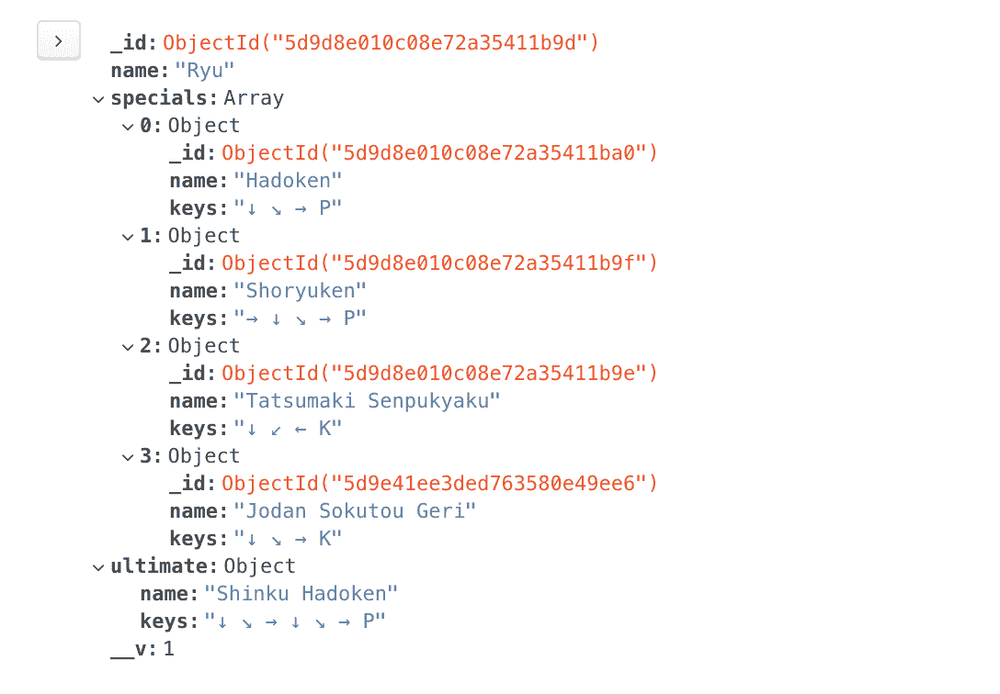

### 更新单个子文档

更新单个子文档甚至更容易。您可以像普通对象一样直接编辑文档。

假设我们想把 Ryu 的最终名字从 Shinku Hadoken 改成 Dejin Hadoken。我们所做的是:

1.  使用`findOne`得到 Ryu。
2.  更改`ultimate`中的`name`
3.  运行`save`

```
const ryu = await Characters.findOne({ name: 'Ryu' })
ryu.ultimate.name = 'Dejin Hadoken'

const updated = await ryu.save()
console.log(updated) 
```

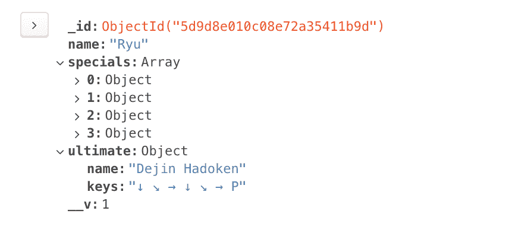

## 人口

MongoDB 文档的大小限制为 16MB。这意味着如果子文档(或嵌入文档)数量较少，您可以使用它们。

例如，街头霸王角色的移动次数有限。龙只有 4 个特殊动作。在这种情况下，可以直接在 Ryu 的角色文档中使用嵌入移动。

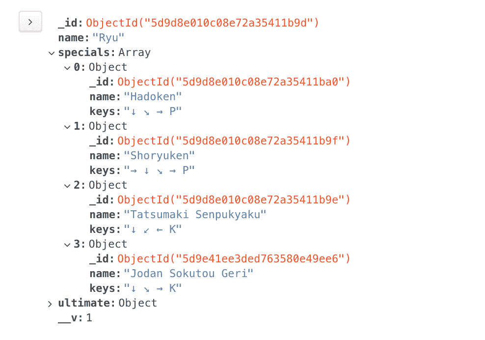

但是，如果您的数据可以包含无限数量的子文档，则需要以不同的方式设计数据库。

一种方法是创建两个独立的模型，并用 populate 将它们结合起来。

### 创建模型

假设你想创建一个博客。并且您想用 MongoDB 存储博客内容。每个博客都有标题、内容和评论。

您的第一个模式可能如下所示:

```
const blogPostSchema = new Schema({
  title: String,
  content: String,
  comments: [{
    comment: String
  }]
})

module.exports = mongoose.model('BlogPost', blogPostSchema) 
```

此架构有问题。

一篇博客文章可以有无限数量的评论。如果一篇博客文章大受欢迎，评论激增，文档可能会超过 MongoDB 规定的 16MB 限制。

这意味着我们不应该在博客文章中嵌入评论。我们应该为评论创建一个单独的集合。

```
const comments = new Schema({
  comment: String
})

module.exports = mongoose.model('Comment', commentSchema) 
```

在 Mongoose 中，我们可以将这两个模型与人口联系起来。

要使用人口，我们需要:

1.  将属性的`type`设置为`Schema.Types.ObjectId`
2.  将`ref`也设置为我们想要链接的模型。

这里，我们希望`blogPostSchema`中的`comments`链接到评论集合。这是我们将使用的模式:

```
const blogPostSchema = new Schema({
  title: String,
  content: String,
  comments: [{ type: Schema.Types.ObjectId, ref: 'Comment' }]
})

module.exports = mongoose.model('BlogPost', blogPostSchema) 
```

### 创建博客文章

假设您想要创建一篇博客文章。要创建博客文章，您可以使用`new BlogPost`。

```
const blogPost = new BlogPost({
  title: 'Weather',
  content: `How's the weather today?`
}) 
```

一篇博文可以没有评论。我们可以用`save`保存这篇博文。

```
const doc = await blogPost.save()
console.log(doc) 
```

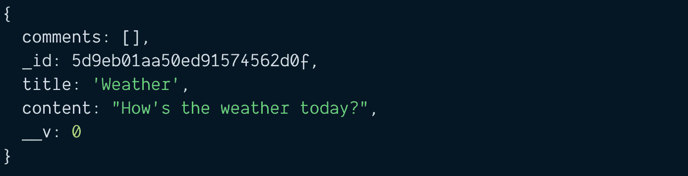

### 创建注释

现在，假设我们想为博客文章创建一个评论。为此，我们创建并保存注释。

```
const comment = new Comment({
  comment: `It's damn hot today`
})

const savedComment = await comment.save()
console.log(savedComment) 
```


注意，保存的注释有一个`_id`属性。我们需要将这个`_id`属性添加到博文的`comments`数组中。这就创建了链接。

```
// Saves comment to Database
const savedComment = await comment.save()

// Adds comment to blog post
// Then saves blog post to database
const blogPost = await BlogPost.findOne({ title: 'Weather' })
blogPost.comments.push(savedComment._id)
const savedPost = await blogPost.save()
console.log(savedPost) 
```

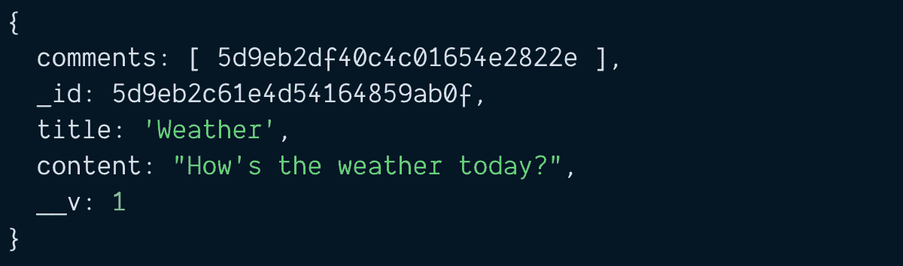

Blog post with comments.

### 搜索博客文章及其评论

如果您尝试搜索这篇博文，您会看到这篇博文有一组评论 id。

```
const blogPost = await BlogPost.findOne({ title: 'Weather' })
console.log(blogPost) 
```


有四种方法可以获得评论。

1.  猫鼬种群
2.  手动方式#1
3.  手动方式#2
4.  手动方式#3

#### 猫鼬种群

Mongoose 允许您用`populate`方法获取链接的文档。你需要做的是在用`findOne`执行的时候调用`.populate`。

调用 populate 时，需要传入想要填充的属性的`key`。在这种情况下，`key`就是`comments`。(注:猫鼬称此`key`为“路径”)。

```
const blogPost = await BlogPost.findOne({ title: 'Weather' })
  .populate('comments')
console.log(blogPost) 
```

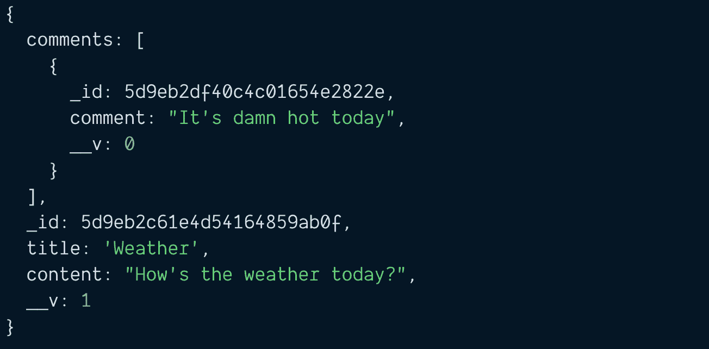

#### 手动方式(方法 1)

如果没有 Mongoose Populate，您需要手动查找评论。首先，您需要获得注释数组。

```
const blogPost = await BlogPost.findOne({ title: 'Weather' })
  .populate('comments')
const commentIDs = blogPost.comments 
```

然后，循环通过`commentIDs`找到每个评论。如果用这种方法，用`Promise.all`会稍微快一点。

```
const commentPromises = commentIDs.map(_id => {
  return Comment.findOne({ _id })
})
const comments = await Promise.all(commentPromises)
console.log(comments) 
```

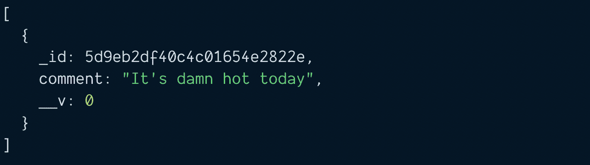

#### 手动方式(方法 2)

猫鼬给你一个`$in`算子。您可以使用这个`$in`操作符来查找数组中的所有注释。这种语法需要一点努力来适应。

如果我必须用手动方式，我更喜欢手动 1 号而不是这个。

```
const commentIDs = blogPost.comments
const comments = await Comment.find({
    '_id': { $in: commentIDs }
})

console.log(comments) 
```


#### 手动方式(方法 3)

对于第三种方法，我们需要改变模式。当我们保存评论时，我们将评论链接到博客文章。

```
// Linking comments to blog post
const commentSchema = new Schema({
  comment: String
  blogPost: [{ type: Schema.Types.ObjectId, ref: 'BlogPost' }]
})

module.exports = mongoose.model('Comment', commentSchema) 
```

您需要将评论保存到博客文章中，并将博客文章 id 保存到评论中。

```
const blogPost = await BlogPost.findOne({ title: 'Weather' })

// Saves comment
const comment = new Comment({
  comment: `It's damn hot today`,
  blogPost: blogPost._id
})
const savedComment = comment.save()

// Links blog post to comment
blogPost.comments.push(savedComment._id)
await blogPost.save() 
```

一旦你这样做了，你就可以在评论集合中搜索与你的博客文章 id 相匹配的评论。

```
// Searches for comments
const blogPost = await BlogPost.findOne({ title: 'Weather' })
const comments = await Comment.find({ _id: blogPost._id })
console.log(comments) 
```


比起手册 1 和手册 2，我更喜欢手册 3。

人口普查胜过所有三种手工方法。

## 快速小结

在本文中，您学习了在三个不同的层次上使用 Mongoose:

1.  基本猫鼬
2.  猫鼬子文档
3.  猫鼬种群

就是这样！

* * *

感谢阅读。这篇文章最初发表在我的博客上。如果你想要更多的文章来帮助你成为一个更好的前端开发人员，请注册我的时事通讯。