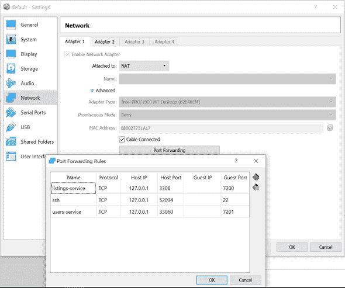

# 如何在 Windows 10 家庭版上运行 Docker

> 原文：<https://www.freecodecamp.org/news/how-to-run-docker-on-windows-10-home-edition/>

最近我一直在看一个教程，为了遵循它，你需要在你的机器上运行 [Docker](https://docs.docker.com/docker-for-windows/install/) 。到目前为止，一切顺利。

但事实证明，Docker 的最新版本需要 Windows 10 Pro、企业版或教育版。这意味着，如果你像我一样，在你的个人笔记本电脑上只有 Windows 10 家庭版，那么你就不能使用 Docker… ****或者也许你仍然可以使用**** 。

请阅读下面的内容，了解如何做到这一点。？

## 论证

首先，我们对情况做一个简短的总结。我们想要实现什么，我们目前拥有什么？

我们的机器上有 Windows 10 OS 家庭版。我们希望让 docker 在同一台机器上运行，这样我们就能够创建 Docker 映像，运行容器，并更好地学习和更快地成长！

最后一个有点超出了本文的范围，但我们应该从某个地方开始，不是吗？？。

## 行动

明确了自己想要什么之后，再来看如何实现。以下是我遵循的步骤。它对我有效，这让我想和你分享它。也许我可以帮某人节省几天来回 StackOverflow 的时间！？

经过一番阅读，我发现了这篇[文章](http://support.divio.com/en/articles/646695-how-to-use-a-directory-outside-c-users-with-docker-toolbox-docker-for-windows)。它解释说，通过利用 Linux 虚拟机并在其上运行 Docker 容器，可以在 Windows 10 Home 中使用 Docker。让我们看看它是如何工作的。

### 步骤 1:安装

首先你需要安装一个名为 [Oracle VM VirtualBox](https://www.virtualbox.org/) 的软件。它使您能够在一台物理机上安装多个虚拟机。通过这种方式，我们可以拥有一个运行 Linux 的虚拟机，我们的 Docker 将在这个虚拟机上运行。

然后使用 Windows PowerShall 和您的 Windows 软件包管理器 [Chocolatey](https://chocolatey.org/) ，通过运行以下命令来安装一个 *docker-machine* :

```
choco install docker-machine
```

打开您最喜欢的 bash 终端应用程序并运行:

```
docker-machine create --driver virtualbox default
```

这将创建一个名为“default”的 docker 虚拟机。

### 步骤 2:配置

接下来，我们需要配置在运行 Docker 容器时公开哪些端口。您可以进入 Oracle VM VirtualBox ->默认虚拟机->设置->网络->适配器 1 ->端口转发。



这是 ****最关键的**** **细节**我忘了。我们需要允许 Docker 安装位于您硬盘上的卷。默认情况下，您只能从`C://Users/`目录挂载。

要添加不同的路径，只需进入****Oracle VM VirtualBox****GUI。选择 ****默认**** 虚拟机，进入*设置>共享文件夹*。如果您不介意使用默认设置，不要忘记将您的项目放在“用户”目录下，例如`C:\Users\{your project}`。

在我的情况下，我忘记了这一点，不得不花了几天时间绞尽脑汁，直到我发现为什么当我试图运行通过这个[教程](https://www.youtube.com/watch?v=6Yfm5gHQjaQ&list=PLnTRniWXnjf8YC9qJFLSVCrXfS6cyj6x6&index=2)构建的[容器](https://github.com/mihailgaberov/microservices)时会出现“找不到 package.json”错误。

通过在您的终端应用程序中运行以下命令来启动虚拟机:

```
docker-machine start default
```

### 步骤 3:设置环境变量

接下来，我们需要设置 Docker 环境变量:

```
docker-machine env default
```

这允许 Docker 客户机和 Docker Compose 与运行在我们命名为“default”的 Linux VM 中的 Docker 引擎进行通信。

您可能还需要运行:

```
@FOR /f "tokens=*" %i IN ('"C:\ProgramData\chocolatey\lib\docker-machine\bin\docker-machine.exe" env') DO @%i
```

为了让 Docker 正常工作。*注意:上述命令中指定的路径可能因您的设置*而异。

如果你打算使用像`docker-compose up`这样的东西，你也需要安装 Docker 工具。您可以通过在 PowerShall 中运行以下命令来实现:

```
choco install docker-cli
choco install docker-compose
```

这些将安装您在 Windows 10 家庭操作系统上开始使用 Docker 所需的一切。

## **结论**

既然我们已经得到了我们所需要的一切，我们可以把时间花在实际的学习上，或者是跟随 docker 相关的教程，或者是阅读一本书。无论你下一步想做什么，你都有你需要的所有工具。

我个人会试着[完成](https://github.com/mihailgaberov/microservices)前面提到的教程，然后，谁知道呢，也许我会开始在我做的每个项目中使用 Docker。

顺便说一下，在研究的过程中，我发现了一本非常有前途的书，是专门关于 Docker 的。伊恩·米尔称之为“实践中的码头工人”。如果你对此感兴趣，你可能想看看。

？感谢阅读！？

### **参考文献**

*   [https://www.virtualbox.org/](https://www.virtualbox.org/)
*   [https://www.sitepoint.com/docker-windows-10-home](https://www.sitepoint.com/docker-windows-10-home)
*   [https://www.youtube.com/watch?v=6Yfm5gHQjaQ&list = plntrniwxnjf 8 YC 9 qjflsvcrxfs 6 cyj 6 x 6&index = 2](https://www.youtube.com/watch?v=6Yfm5gHQjaQ&list=PLnTRniWXnjf8YC9qJFLSVCrXfS6cyj6x6&index=2)
*   [https://github.com/mihailgaberov/microservices](https://github.com/mihailgaberov/microservices)
*   [http://support . divio . com/en/articles/646695-how-to-use-a-directory-outside-c-users-with-docker-toolbox-docker-for-windows](http://support.divio.com/en/articles/646695-how-to-use-a-directory-outside-c-users-with-docker-toolbox-docker-for-windows)