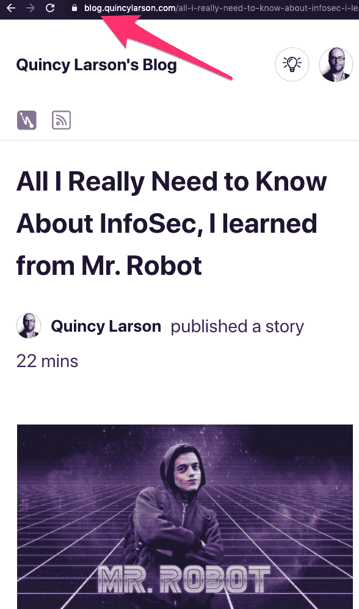
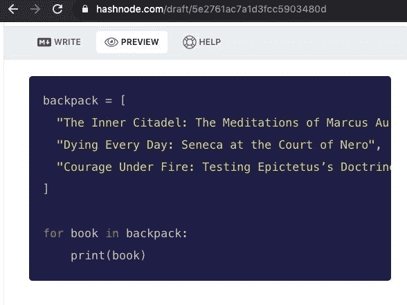
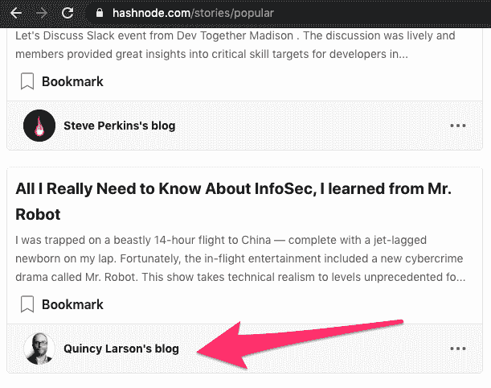
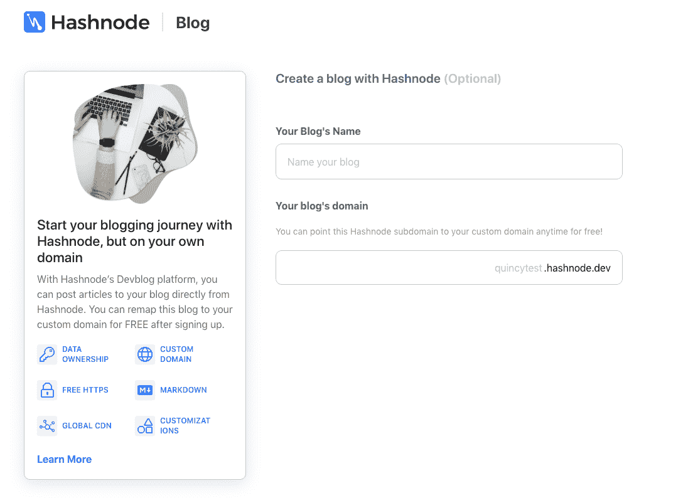
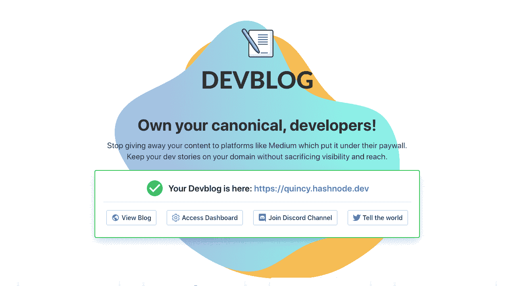
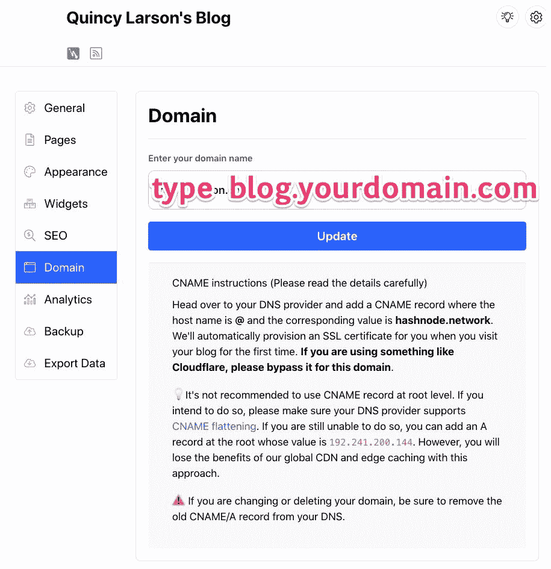
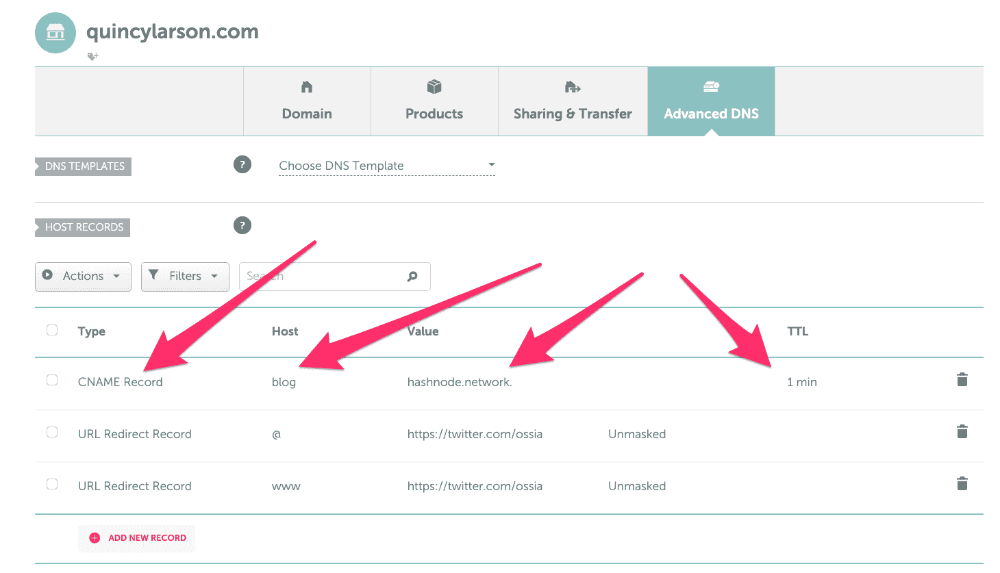

# Hashnode:如何在几分钟内在你自己的领域上发布你自己的开发者博客

> 原文：<https://www.freecodecamp.org/news/devblog-launch-your-developer-blog-own-domain/>

Hashnode 最近发布了一个工具，可以让你在几分钟之内在自己的域上建立自己的开发者博客。

如果你想知道，我不是 Hashnode 赞助的。他们甚至不知道我在写这篇文章。他们的工具给我留下了难以置信的印象，我想和你分享一下。

首先，你可能会问:为什么不使用 Medium 或其他开放的发布平台呢？

下面是 Hashnode 更适合开发人员的一些主要原因。

## 原因 1:你可以在自己的域名上托管你的 Hashnode 博客。

I published this article on my Hashnode blog and now it's available on my own personal website's subdomain.

如果你想在更长的时间范围内建立自己博客的 SEO，这是一件大事。

这也避免了你对博客平台的依赖，这些平台有在你的文章上投放广告或弹出窗口的恶劣倾向(甚至在你的博客文章前面放置付费墙/签到墙)。

我的意思是肯定的——当这些平台变得太垃圾的时候，你总是可以迁移你的文章。但是迁移可能是一个巨大的麻烦。(是的，这是我的经验之谈。)

> "占有是法律的十分之九。"–我采访过的一位著名硅谷知识产权律师

## 原因 2: Hashnode 是为开发人员设计的。

A preview of Hashnode's Python Syntax highlighting on my Hashnode blog article

您可以使用 markdown 键入。您的代码片段也可以突出显示语法。

为了提高速度，你上传的任何图片都会被缓存在 Hashnode 的 CDN 中，所以你不用热链接或者依赖于 CDN，这些 CDN 在某些国家可能会被屏蔽(比如谷歌或者脸书)。

### 原因 3: Hashnode 会通过它的网络分发你的文章，这样你可以获得更多的读者

My Hashnode blog article showing up in Hashnode's global algorithmic newsfeed

Hashnode 的许多作者都在自己的个人领域上写博客。但他们的文章仍然会自动出现在 Hashnode 网站的算法新闻订阅中。

这意味着你的博客将从一个基线受众开始，你可以在那里成长。

## Hashnode 博客更好的其他原因:

*   你拥有自己的数据。
*   你可以定制你的 Hashnode 博客，比大多数其他博客网站允许的方式都要多。
*   Hashnode 博客是免费的。您甚至不需要为自己的服务器或无服务器函数调用付费。
*   Hashnode 会自动为您创建一个 SSL 证书，并保持更新。

## 好的——那么我如何建立一个 Hashnode 博客呢？

好消息是这很简单。您可以前往[https://hashnode.com/](https://hashnode.com/)并登录来创建博客。

你只需要选择一个名字就可以了。然后你可以在配置完域名后回来撰写你的第一篇文章。

The Hashnode blog creation flow

您的 Hashnode 博客将立即获得一个 hashnode.dev 子域。

What you see after you've created your Hashnode blog and before you've configured it.

在你创建了你的 Hashnode 博客后，你会看到这样一个屏幕。输入您的域名(如果您正在使用域名，请输入您的子域)，然后单击“更新”。然后点击“访问仪表板”进行配置。

有很多方法可以定制你的 Hashnode 博客。但今天，我们将重点关注如何在您自己的领域实现它。

Hashnode 建议为此使用一个子域，这样你就可以访问他们的全局 CDN 和边缘缓存，所以这就是我们在本教程中要做的。

如果你还没有购买域名，你可以这样做。我建议选择一个你可以买到相同名字的域名。com，。org，还有。net，因为这些是自 20 世纪 90 年代以来就存在的“三大”原始顶级域名。(在伟大的 TLD 抢现金事件之前)。)

您只需要为您的一个域配置您的 Hashnode 博客。然后，您可以将您的其他域重定向到它。

以下是您应该如何配置您的 DNS。请注意，这是 NameCheap 的 DNS 仪表板，但大多数仪表板看起来都相似，并且都有一个 CNAME 选项:

A picture of my personal domain name dashboard on Namecheap. The blog subdomain is pointed to my Hashnode blog and the www and root domains redirect to my personal Twitter account.

创建一个 CNAME 记录，并将主机设置为您想要的任何子域(我选择了`blog`)。

然后将其值设置为`hashnode.network`

Hashnode 将为您处理 SSL 证书的发布，因此您将自动在博客的 URL 前面获得一个漂亮的`https`。？

我将 TTL 设置为 1 分钟，这样刷新会更快，但您可能不必这样做。

转眼间。你可以去`https://[your subdomain].[your domain].[your TLD]`看看你的 Hashnode 博客。

例如，我的 Hashnode 博客在[https://blog.quincylarson.com](https://blog.quincylarson.com)。

## 你完了。

我告诉过你它很快。

现在，您可以使用 Hashnode 的 markdown 编辑器来创建您的第一篇博客文章。

博客快乐。