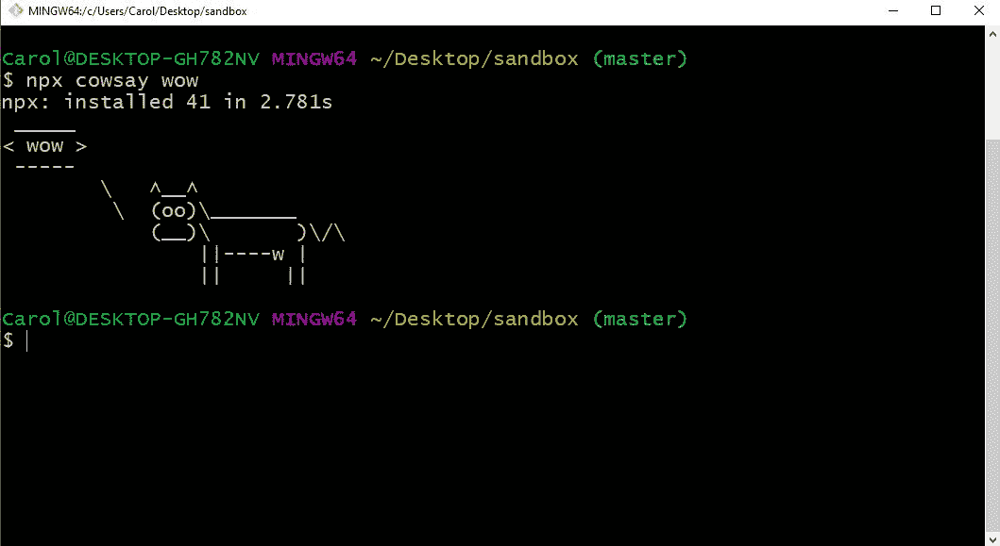
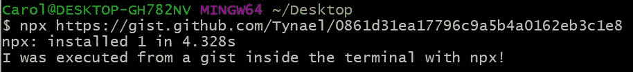
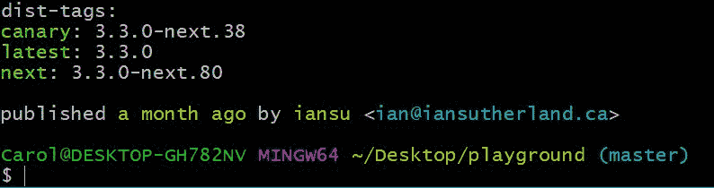
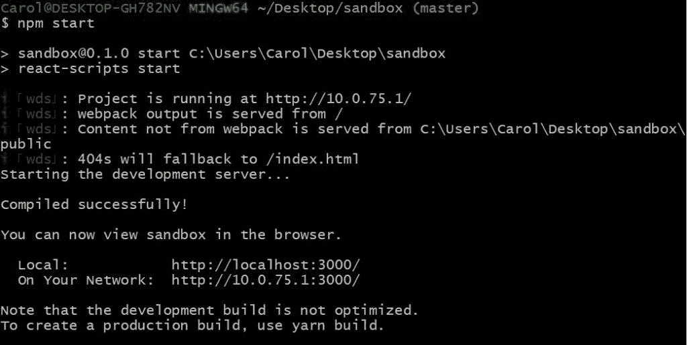
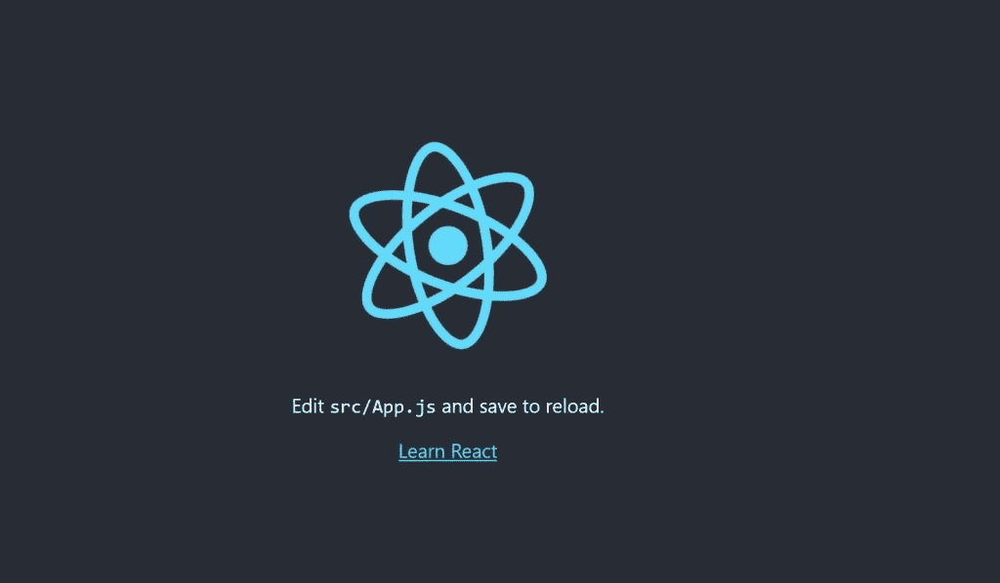

# npm 与 npx —有什么区别？

> 原文：<https://www.freecodecamp.org/news/npm-vs-npx-whats-the-difference/>

如果你曾经用过 [Node.js](https://nodejs.org/) ，那么你肯定用过 **npm** 。

**npm** (节点包管理器)是你安装 Node.js 时开箱即用的依赖/包管理器，它为开发者提供了全局和本地安装包的方式。

有时，您可能想要查看一个特定的包，并尝试一些命令。但是如果不在本地的`node_modules`文件夹中安装依赖项，就无法做到这一点。

这就是 npx 的用武之地。

在本文中，我们将看看 **npm** 和 **npx** 之间的区别，并学习如何从两者中获得最佳效果。

首先，让我们了解 npm 实际上是什么，以及我们可以用它做什么。

想看个视频补充阅读？看看这个:

[https://www.youtube.com/embed/fSHWc8RTJug?feature=oembed](https://www.youtube.com/embed/fSHWc8RTJug?feature=oembed)

## npm 软件包管理器

npm 是几样东西。首先，它是一个发布开源 Node.js 项目的在线存储库。

其次，它是一个 CLI 工具，可以帮助您安装这些软件包并管理它们的版本和依赖项。npm 上有成千上万的 Node.js 库和应用程序，而且每天还会增加更多。

npm 本身不运行任何包。如果您想使用 npm 运行一个包，您必须在您的`package.json`文件中指定该包。

当可执行文件通过 npm 软件包安装时，npm 会创建指向它们的链接:

*   **本地**安装在`./node_modules/.bin/`目录下创建链接
*   **全局**安装有从全局`bin/`目录创建的链接(例如:Linux 上的`/usr/local/bin`或 Windows 上的`%AppData%/npm`)

要使用 npm 执行包，您必须键入本地路径，如下所示:

```
$ ./node_modules/.bin/your-package
```

或者您可以运行本地安装的包，方法是将它添加到脚本部分的`package.json`文件中，如下所示:

```
{
  "name": "your-application",
  "version": "1.0.0",
  "scripts": {
    "your-package": "your-package"
  }
}
```

然后您可以使用`npm run`运行脚本:

```
npm run your-package
```

你可以看到用普通的 npm 运行一个包需要相当多的仪式。

幸运的是，这正是 **npx** 派上用场的地方。

## npx 包裹运送者

由于 npm 版本 [5.2.0](https://github.com/npm/npm/releases/tag/v5.2.0) npx 预捆绑了 npm。所以这几乎是现在的标准。

npx 也是一个 CLI 工具，其目的是使安装和管理托管在 npm 注册表中的依赖关系变得容易。

现在运行任何一种通常通过 npm 安装的基于 Node.js 的可执行文件都非常容易。

您可以运行以下命令，查看是否已经为您当前的 npm 版本安装了该命令:

```
$ which npx
```

如果不是，可以这样安装:

```
$ npm install -g npx
```

一旦你确定你已经安装了它，让我们来看看几个用例，它们让 **npx** 变得非常有用。

### 轻松运行本地安装的软件包

如果您希望执行本地安装的软件包，您只需键入:

```
$ npx your-package
```

npx 将检查`<command>`或`<package>`是否存在于`$PATH`或本地项目二进制文件中，如果存在，它将执行它。

### 执行以前没有安装的包

另一个主要优点是能够执行以前没有安装的包。

让我们通过运行以下命令对此进行测试:

```
$ npx cowsay wow 
```



这很棒，因为有时你只是想使用一些 CLI 工具，但你不想为了测试而全局安装它们。

这意味着您可以节省一些磁盘空间，只在需要时才运行它们。这也意味着你的全局变量会被污染的更少。

### 直接从 GitHub 运行代码



这个很棒。

您可以使用 npx 运行任何 GitHub gists 和存储库。让我们专注于执行 GitHub gist，因为创建 GitHub gist 更容易。

最基本的脚本由主 JS 文件和一个`package.json`组成。在你设置好文件之后，你所要做的就是运行 npx，链接到如上图所示的要点。

在这里你可以找到我在这个例子中使用的代码。

确保在执行任何脚本之前仔细阅读它，以避免恶意代码可能导致的严重问题。

### 测试不同的包版本

npx 使得测试 Node.js 包或模块的不同版本变得非常容易。为了测试这个令人敬畏的特性，我们将在本地安装`create-react-app`包，并测试即将到来的版本。

这将在输出的末尾列出一些 dist 标签。Dist 标签为版本号提供了别名，这使得键入版本号更加容易。

```
$ npm v create-react-app
```



让我们使用 npx 来尝试一下`create-react-app`的`next` dist 标签，它将在沙盒目录中创建应用程序。

```
$ npx create-react-app@next sandbox
```

npx 将暂时安装下一个版本的`create-react-app`，然后它将执行以搭建应用程序并安装其依赖项。

安装后，我们可以像这样导航到应用程序:

```
$ cd sandbox
```

然后用这个命令启动它:

```
$ npm start
```



它会自动在你默认的浏览器窗口中打开 React 应用。
现在我们有了一个运行在下一版本`create-react-app`包上的应用程序！



This is how the index page of your React app should look like.

## 结论

npx 帮助我们避免版本控制、依赖性问题和安装不必要的包，我们只是想尝试一下。

它还提供了一种清晰简单的方式来执行包、命令、模块甚至 GitHub gists 和库。

如果你以前没有用过 npx，现在是开始的好时机！

这篇文章最初发布在我的博客上。
你可以在[推特](https://twitter.com/pelu_carol)和[脸书](https://www.facebook.com/neutrondevcom)上联系并问我任何问题。