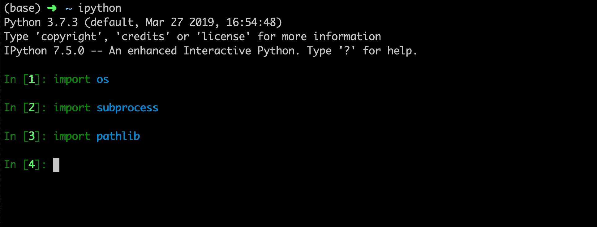
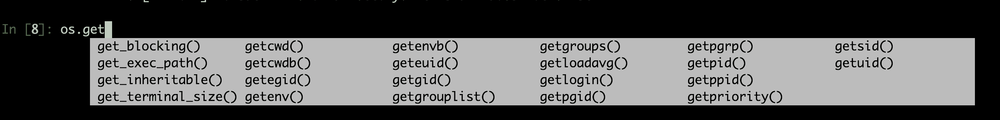
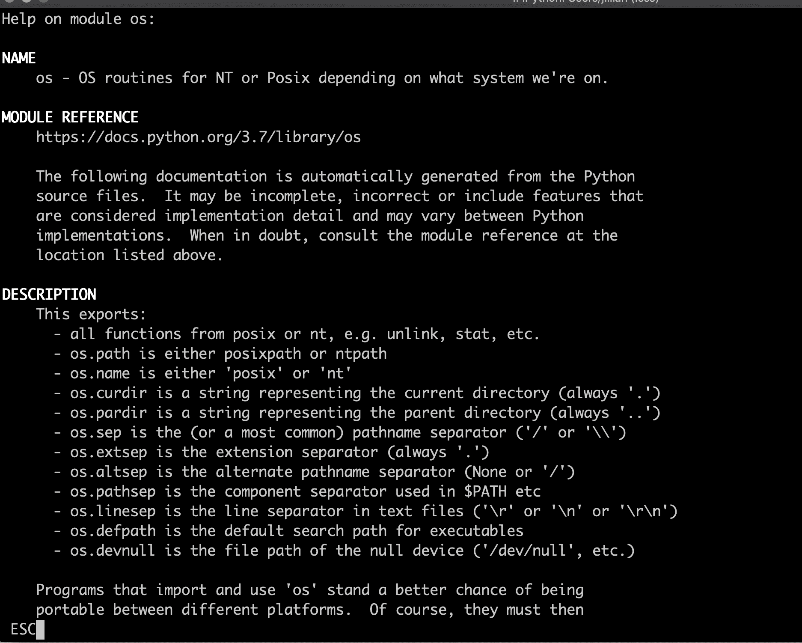

# 如何用 Python 代替 Bash 作为您的首选命令行语言

> 原文：<https://www.freecodecamp.org/news/python-for-system-administration-tutorial/>

我对巴什又爱又恨。我花很多时间在终端上，bash 是我默认的“编程语言”。有时我告诉人们 find、grep 和 xargs 运行他们的基础设施，他们笑啊笑，直到他们意识到我是认真的。

对于系统管理员来说，学习一些 Python 是一个完美的选择。对于必须在终端中处理任何事情，但不想使用 bash，或者对 bash 的需求过于复杂的人来说，这也是一个很好的选择。一旦任务超出

```
find $(pwd) -name "*.txt" | xargs -I {} echo "do stuff with {}"
```

是时候爆发巨蟒了！

使用 Python 作为命令行语言有很多好处。

*   Python 有很多很好的库来帮助解决几乎所有的问题。这包括处理系统操作、读取文件、列出目录、编写循环、检查退出代码等等。
*   用 ide 自动完成。说真的。谁想记住任何东西？
*   健壮的测试套件，如果这是你的事情(如果不是，你应该考虑让它成为你的事情)。
*   iPython 控制台。太棒了。太神奇了。我喜欢它。
*   Python 在大多数系统上都是可用的，如果不是，你可以用 [Miniconda](https://docs.conda.io/en/latest/miniconda.html) 获得它。
*   使用 try 和 catch 块进行健壮的错误检查。
*   如果你在不同的操作系统上工作，你可以使用 Python 库来处理这一切。
*   即使你没有编程能力，Python 也是一门容易上手的语言。

## 我们开始吧

要开始，首先你需要安装 Python 或者用 Miniconda 安装它。

### 检查您是否安装了 iPython

```
which python
which ipython 
```

如果这两个都成功了，你就成功了！如果你有 Python，但没有 iPython，你必须安装它。你可以把它作为一个系统包来安装，但是我真的建议你把它和 Miniconda 一起安装。

### 安装 Miniconda

点击获取操作系统的安装程序[。我建议获取 Python3 安装。](https://docs.conda.io/en/latest/miniconda.html)

然后就是简单的安装了。

```
bash Miniconda3-latest-Linux-x86_64.sh 
```

按照提示操作，你就可以安装 Miniconda3 了。一旦你安装了它，你会想运行一个更新，因为这是技术，当然你想运行一个更新。；-)

```
conda update conda
conda config --add channels conda-forge
conda update -y --all
conda install -y ipython 
```

### 解决纷争

如果您在安装任何软件包时遇到问题，这里有一些提示。

*   运行`conda clean --all`并重试。
*   确保您使用的是正确的频道。
*   运行`conda update -y --all`
*   尽量少安装到您的全球康达空间。相反，为不同的任务和项目创建环境，我们将在接下来讨论。

### 用康达创造环境

如果你用过 virtualenv，pipenv(那是个东西吗？)、Rbenv、plenv、anyenv 或者这些年来出现的其他各种 env 中的任何一个，这听起来对你来说都会很熟悉。这个想法是不同的项目应该有他们自己的独立的软件环境。

```
conda create -n my-project ipython package1 package2 package2 
```

如果你像我一样，希望 iPython 随时可用，请确保将它安装到任何新环境中！

## 用于系统管理的 Python 库

在我们进入例子之前，让我们列出一些方便的软件包和它们的文档。

我的目标包是操作系统包。您可以使用它来列出目录，检查文件是否存在，检查符号链接是否存在，创建目录，运行系统命令，获取和设置环境变量，等等。太棒了！

我的第二个用于运行系统命令的包是[子进程](https://docs.python.org/3/library/subprocess.html)模块，它没有现成的 python 库。

[shutil](https://docs.python.org/3/library/shutil.html) 具有不在操作系统库中的文件操作。

[pprint](https://docs.python.org/3/library/pprint.html) 库用漂亮的缩进打印出复杂的数据结构。

pytest 库让你可以测试你的 Python 代码，因为让我们面对现实吧，没有什么能在第一次(几次)就正确运行。

## 我如何执行我的代码？

终于！代码！



当您使用 Python 进行系统管理时，您可以直接进入 iPython 控制台，或者编写脚本，然后用`python name-of-script.py`执行它们。

如果你更喜欢写你的剧本，你有这么多的选择，这真的是一个个人偏好的问题。我用的 [PyCharm](https://www.jetbrains.com/pycharm/) ，是付费的，但是 [Visual Studio Code](https://code.visualstudio.com/) 和 [Atom](https://atom.io/) 同样是优秀的免费选择。

我发现这取决于我在做什么。有时我只是打开 iPython 控制台并开始输入，而其他时候我需要更健壮的测试之类的东西。

如果您使用的是 iPython 控制台或我上面列出的任何编辑器，您将拥有自动完成功能。自动完成太棒了！使用 iPython，只需开始输入您的函数，然后按 tab 键即可获得您可能需要的潜在函数列表。



我无法表达我有多喜欢自动完成。；-)

## 寻求帮助

您可以进入任何库的任何文档页面，但是如果您知道库或函数的名称，您可以在 iPython 中找到它。




你也可以在大多数 ide 和文本编辑器中打开帮助菜单，但是这是你的编辑器特有的。

## 例子

首先，您需要导入您的包

```
import os
import subprocess
import shutil
from pprint import pprint 
```

下面是一些常见的文件和目录操作的例子。

```
# Get your current working directly
# This returns a string
my_cwd = os.getcwd()
print(my_cwd) 
```

```
# List the contents of a directory
# This returns a list
dir_list = os.listdir()
for item in dir_list:
    print(item) 
```

```
# Get the Absolute Path name of a file (file + current working dir)
os.path.abspath('some-file') 
```

```
#Get the basename - returns file
os.path.basename('/path/to/file') 
```

```
# Split a directory path - platform independent
os.path.split(os.getcwd())
# Out[17]: ('/Users', 'jillian') 
```

```
# Check if a path exists
os.path.exists('/path/on/filesystem') 
```

```
# Check if a path is a symlink
os.path.islink() 
```

移动文件和目录

```
# Copy a directory
# cp -rf
shutil.copytree('src', 'dest') 
```

```
# Copy a file
# cp -rf
shutil.copyfile('file1', 'file2') 
```

```
# Move a directory
# mv
shutil.move('src', 'dest') 
```

并不是所有的东西都可以通过 python 库获得，比如安装系统库，所以运行一些系统命令吧！

```
# Run an arbitrary system command
command = "echo 'hello'"
result = subprocess.run(command.split(' '), stdout=subprocess.PIPE, stderr=subprocess.PIPE)
#Print the stdout and stderr
print(result.stdout)
print(result.stderr) 
```

写入文件！

```
# Write to a file (and create it if it doesn't exist)
# echo "hello" > hello.txt
f= open("hello.txt","w+")
f.write("hello!")
f.close() 
```

```
# Append to a file
# echo "hello" >> hello.txt
f = open("hello.txt", "a+")
f.write("hello again!")
f.close() 
```

## 写一些测试！

测试主要是通过使用一个叫做 assert 的函数来工作的，这个函数本质上是在说确保这是真的，如果不是就大声地死去。

```
def test_system_command():
    """Test the exit code of a system command"""
    command = "echo 'hello'"
    result = subprocess.run(command.split(' '), stdout=subprocess.PIPE)
    assert result.returncode == 0 
```

将这个函数放在一个名为`test_my_code.py`的文件中，并作为`pytest test_my_code.py`运行。

## 包裹

这就是我关于使用 Python 作为 bash 替代品的主要技巧和诀窍。下一次您需要在 bash 中编写循环时，请考虑打开 iPython 控制台，看看您能想到什么！