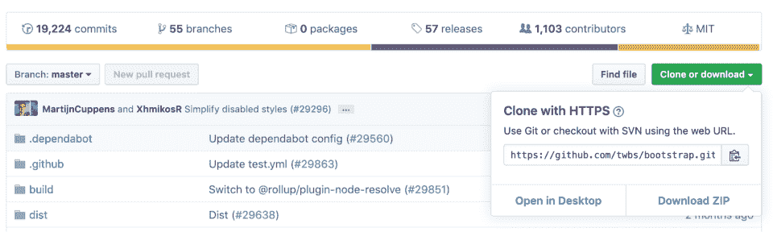
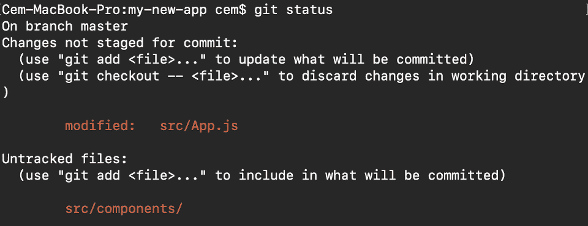
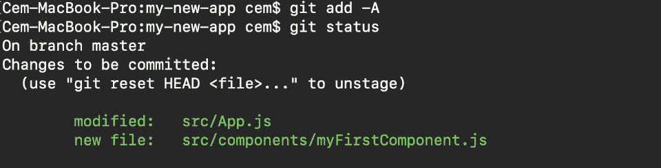
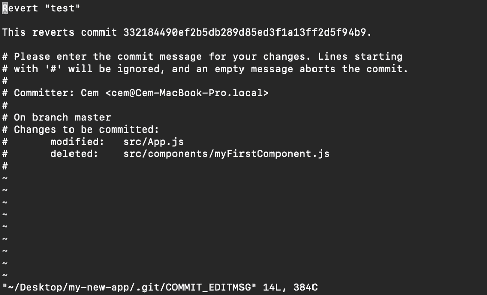
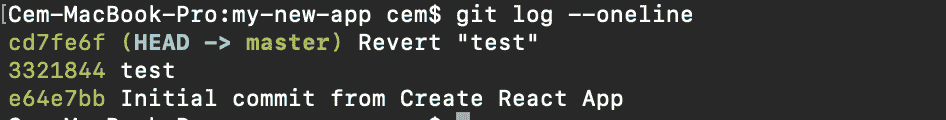

# 每个开发人员都应该知道的 10 个 Git 命令

> 原文：<https://www.freecodecamp.org/news/10-important-git-commands-that-every-developer-should-know/>

Git 是日常编程的一个重要部分(尤其是当你和一个团队一起工作的时候),并且在软件行业中被广泛使用。

因为您可以使用许多不同的命令，所以掌握 Git 需要时间。但是有些命令使用得更频繁(有些是每天)。所以在这篇文章中，我将分享和解释每个开发人员都应该知道的 10 个最常用的 Git 命令。

**注意:要理解这篇文章，你需要了解 Git 的基础知识。**

## 1\. Git clone

Git clone 是一个从远程存储库(例如 Github)下载现有源代码的命令。换句话说，Git clone 基本上是在存储库中制作一个项目最新版本的相同副本，并将其保存到您的计算机中。

有几种方法可以下载源代码，但我更喜欢用 https 的**克隆方式:**

```
git clone <https://name-of-the-repository-link>
```

例如，如果我们想从 Github 下载一个项目，我们需要做的就是点击绿色按钮(克隆或下载)，复制框中的 URL，并将其粘贴在我上面显示的 git clone 命令之后。



**Bootstrap source code example from Github**

这将把项目复制到您的本地工作空间，以便您可以开始使用它。

## 2.Git 分支

分支在 git 世界中非常重要。通过使用分支，几个开发人员能够同时在同一个项目上并行工作。我们可以使用 git branch 命令来创建、列出和删除分支。

**创建新分支:**

```
git branch <branch-name>
```

该命令将在本地创建一个分支**。要将新分支推入远程存储库，您需要使用以下命令:**

```
git push -u <remote> <branch-name>
```

**查看分支:**

```
git branch or git branch --list
```

**删除分支:**

```
git branch -d <branch-name>
```

## 3\. Git checkout

这也是最常用的 Git 命令之一。要在分行工作，首先你需要转到它。我们使用 **git checkout** 主要是为了从一个分支切换到另一个分支。我们也可以用它来检查文件和提交。

```
git checkout <name-of-your-branch>
```

要在分支之间成功切换，您需要遵循一些步骤:

*   在切换之前，必须提交或隐藏当前分支中的更改
*   您要签出的分支应该存在于您的本地

**还有一个快捷命令可以让你同时创建和切换到一个分支:**

```
git checkout -b <name-of-your-branch>
```

这个命令在本地创建一个新的分支(-b 代表分支)，并在创建后立即将分支签出到 new。

## 4\. Git status

Git status 命令为我们提供了关于当前分支的所有必要信息。

```
git status
```

我们可以收集以下信息:

*   当前分支是否是最新的
*   是否有任何事情要提交、推或拉
*   是否有暂存、未暂存或未跟踪的文件
*   是否有文件被创建、修改或删除



**Git status gives information about the branch & files**

## 5.去把它给我

当我们创建、修改或删除文件时，这些更改将发生在我们的本地，不会包括在下一次提交中(除非我们更改配置)。

我们需要使用 git add 命令将文件的更改包含到我们的下一次提交中。

**添加单个文件:**

```
git add <file>
```

**一次添加所有内容:**

```
git add -A
```

当您访问上面第四部分的屏幕截图时，您会看到有些文件名是红色的，这意味着它们是未暂存的文件。未转移的文件不会包括在您的提交中。

为了包含它们，我们需要使用 git add:



**Files with green are now staged with git add**

重要提示:git add 命令不会更改存储库，并且在我们使用 git commit 之前不会保存更改。

## 6.去吧，Committee

这可能是 Git 最常用的命令。一旦我们到达开发中的某个点，我们想要保存我们的更改(可能在一个特定的任务或问题之后)。

Git commit 就像是在开发过程中设置一个检查点，如果需要的话，您可以稍后返回。

我们还需要写一个简短的消息来解释我们在源代码中开发或更改了什么。

```
git commit -m "commit message"
```

重要提示:Git 提交只在本地保存你的修改。

## 7\. Git push

在提交您的更改之后，接下来您要做的事情是将您的更改发送到远程服务器。Git push 将您的提交上传到远程存储库。

```
git push <remote> <branch-name>
```

但是，如果您的分支是新创建的，那么您还需要使用以下命令上传分支:

```
git push --set-upstream <remote> <name-of-your-branch>
```

或者

```
git push -u origin <branch_name>
```

重要提示:Git push 只上传已提交的更改。

## 8\. Git pull

**git pull** 命令用于从远程 repo 获取更新。这个命令是 **git fetch** 和 **git merge** 的组合，这意味着，当我们使用 git pull 时，它从远程存储库获取更新(git fetch)并立即在本地应用最新的更改(git merge)。

```
git pull <remote>
```

**此操作可能会导致冲突，您需要手动解决。**

## 9\. Git revert

有时我们需要撤销已经做出的改变。有多种方法可以本地或远程撤销我们的更改(取决于我们的需要)，但是我们必须小心使用这些命令以避免不必要的删除。

撤销提交的一个更安全的方法是使用 **git revert** 。要查看我们的提交历史，首先我们需要使用 **git log - oneline:**


**commit history of my master branch**

然后，我们只需要在我们想要撤销的提交旁边指定哈希代码:

```
git revert 3321844
```

在这之后，你会看到一个如下的屏幕——只需按下 **shift + q** 退出:



Git revert 命令将撤销给定的提交，但将创建新的提交，而不删除旧的提交:



**new "revert" commit**

使用 **git revert** 的好处是它不会触及提交历史。这意味着您仍然可以看到历史中的所有提交，甚至是已恢复的提交。

这里的另一个安全措施是，一切都发生在我们的本地系统中，除非我们将它们推送到远程回购。这就是为什么 git revert 使用起来更安全，并且是撤销提交的首选方式。

## 10\. Git merge

当你在你的分支中完成了开发并且一切正常时，最后一步是将分支与父分支(dev 或 master)合并。这是通过`git merge`命令完成的。

Git merge 基本上将您的特性分支与其提交回开发(或主)分支的所有内容集成在一起。请务必记住，您首先需要位于要与要素分支合并的特定分支上。

例如，当您想要将特性分支合并到开发分支时:

**首先你应该切换到开发分支:**

```
git checkout dev
```

在合并之前，你应该更新你的本地开发分支:

```
git fetch
```

**最后，您可以将您的特性分支合并到 dev:**

```
git merge <branch-name>
```

提示:在合并你的分支之前，确保你的开发分支拥有最新的版本，否则你可能会面临冲突或其他不必要的问题。

这些是我在日常编程中遇到的 10 个最常用的 git 命令。关于 Git 还有很多东西需要学习，我将在以后的独立文章中解释它们。

**如果你想了解更多关于 web 开发的知识，欢迎在 Youtube 上关注我**[](https://www.youtube.com/channel/UC1EgYPCvKCXFn8HlpoJwY3Q)****！****

**感谢您的阅读！**