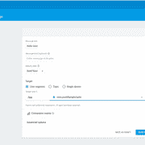
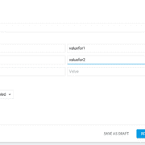
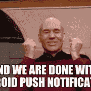
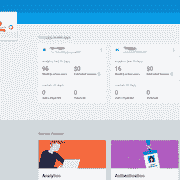
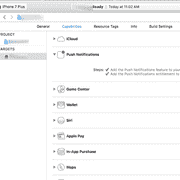
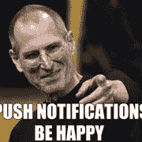

# 面向科尔多瓦混合应用的 Firebase 云消息集成

> 原文：<https://www.freecodecamp.org/news/firebase-cloud-messaging-integration-for-cordova-hybrid-apps/>

由 t1tan1um

这是一个关于如何使用 fcm 的 [cordova 插件和 Google Firebase FCM 在 Android 和 iOS 中实现推送通知的简单介绍。为此，我将使用 Ubuntu 16.04 LTS，但用于开发的操作系统应该没多大关系。](https://github.com/fechanique/cordova-plugin-fcm)

## 【Cordova 混合应用的 FCM 集成

### **安卓实现**

创建空文件夹 pushSample

```
cd '/opt/lampp/htdocs'
mkdir pushSample
cd pushSample
cordova create pushSample
cd pushSample
cordova platform add android
cordova plugin add cordova-plugin-FCM
```

添加 cordova FCM 插件时会显示一个错误:

```
Error: cordova-plugin-fcm: You have installed platform android but file 'google-services.json' was not found in your Cordova project root folder.
```

注意:这是因为我们没有添加 google-services.json 文件，该文件必须在接下来的步骤中创建。

接下来打开 [google firebase 控制台](https://console.firebase.google.com/)并添加项目(基本上意味着创建一个新项目)

创建项目后，单击左侧面板中的通知部分。

现在点击 Android 图标，为我们的项目添加 ****Android**** 平台支持。

在下一个弹出的表单中填写如下详细信息: ****Android 包名称:**** 包名称或 id 是 play store 中某个应用程序的唯一标识符。请注意，这是一个非常重要的值，一旦上传到 play store，就不能更改。它将在反向域名语法:如 hello.pushSample.com 将有应用程序 id : com.pushSample.hello。也在你的科尔多瓦项目的 ****config.xml**** 文件中设置相同的应用程序 id。对于我们的示例项目，它将位于:push sample/push sample/config . XML 中，例如，对于我来说，该文件的内容是:

```
<?xml version='1.0' encoding='utf-8'?>
<widget id="io.cordova.hellocordova" version="1.0.0"  xmlns:cdv="http://cordova.apache.org/ns/1.0">
    <name>HelloCordova</name>
    <description>
        A sample Apache Cordova application that responds to the deviceready event.
    </description>
    <author email="dev@cordova.apache.org" href="http://cordova.io">
        Apache Cordova Team
    </author>
    <content src="index.html" />
    <plugin name="cordova-plugin-whitelist" spec="1" />
    <access origin="*" />
    <allow-intent href="http://*/*" />
    <allow-intent href="https://*/*" />
    <allow-intent href="tel:*" />
    <allow-intent href="sms:*" />
    <allow-intent href="mailto:*" />
    <allow-intent href="geo:*" />
    <platform name="android">
        <allow-intent href="market:*" />
    </platform>
    <platform name="ios">
        <allow-intent href="itms:*" />
        <allow-intent href="itms-apps:*" />
    </platform>
</widget>
```

注意标签

```
<widget id="io.cordova.hellocordova" version="1.0.0"  xmlns:cdv="http://cordova.apache.org/ns/1.0">
```

这里的属性 id 是包 ****id**** ，默认为****io . Cordova . hello Cordova****将其更改为您在 firebase 控制台中指定的应用 id。我将使用 com.pushSample.hello

firebase 控制台弹出窗口中要填写的下一个字段是:

****app 昵称(可选):**** 这可以是显示在 App 菜单中的同一个 App 名称，也可以在 config.xml 中更改，默认为 HelloCordova，我会将其更新为 ****PushSample****

****调试签名证书 SHA-1(可选):**** 此为可选，请留空。

接下来点击 ****注册 App****

下一步是下载****Google services JSON****文件。


点击 ****下载 google-services.json**** 按钮，应该会把文件下载到你的 PC 上。

获得文件后，将它粘贴到 cordova 项目的根文件夹中，在我的例子中:

```
/opt/lampp/htdocs/pushSample/pushSample
```

接下来构建项目

```
cordova build android
```

添加 google-services.json 文件后，应该可以成功构建。

接下来，我们必须编写客户端代码来处理推送通知:

```
FCMPlugin.getToken(function(token) {
    //this is the FCM token which can be used
    //to send notification to specific device 
    console.log(token);
    //FCMPlugin.onNotification( onNotificationCallback(data), successCallback(msg), errorCallback(err) )
    //Here you define your application behaviour based on the notification data.
    FCMPlugin.onNotification(function(data) {
        console.log(data);
        //data.wasTapped == true means in Background :  Notification was received on device tray and tapped by the user.
        //data.wasTapped == false means in foreground :  Notification was received in foreground. Maybe the user needs to be notified.
        // if (data.wasTapped) {
        //     //Notification was received on device tray and tapped by the user.
        //     alert(JSON.stringify(data));
        // } else {
        //     //Notification was received in foreground. Maybe the user needs to be notified.
        //     alert(JSON.stringify(data));
        // }
    });
});
```

代码首先调用 ****getToken**** 函数从 firebase 获取 FCM 令牌，然后在回调中注册另一个回调 ****onNotification**** 来处理收到推送通知时发生的事情。

****onNotification**** 函数具有包含通知数据的数据值。data.wasTapped 指示当应用程序在前台或后台时是否发送通知，以便我们可以为每种情况定义单独的逻辑。现在，要触发示例推送通知，请单击左侧面板中的通知部分，这会向您显示 firebase notification composer，显示过去发送的通知列表。

以防您尚未发送任何推送通知。你应该看到一个 ****发送你的第一个通知**** 按钮。

****注意:**** 通知作曲者会是这样的:



注意在使用 firebase 控制台发送推送通知时，您需要选择应用程序名称****com . push sample . hello****。

要发送自定义应用程序特定数据，请选择高级选项->键值对。



onNotification 回调中的数据对象将如下所示

```
{myKey2: "valuefor2", myKey: "valuefor1", wasTapped: false}
```

另请注意，使用 REST APIs 从应用服务器而不是 firebase notification composer 发送推送通知时，必须使用以下语法:

```
//POST: https://fcm.googleapis.com/fcm/send
//HEADER: Content-Type: application/json
//HEADER: Authorization: key=AIzaSy*******************
{
  "notification":{
    "title":"Notification title",
    "body":"Notification body",
    "sound":"default",
    "click_action":"FCM_PLUGIN_ACTIVITY",
    "icon":"fcm_push_icon"
  },
  "data":{
    "param1":"value1",
    "param2":"value2"
  },
    "to":"/topics/topicExample",
    "priority":"high",
    "restricted_package_name":""
}
//sound: optional field if you want sound with the notification
//click_action: must be present with the specified value for Android
//icon: white icon resource name for Android >5.0
//data: put any "param":"value" and retreive them in the JavaScript notification callback
//to: device token or /topic/topicExample
//priority: must be set to "high" for delivering notifications on closed iOS apps
//restricted_package_name: optional field if you want to send only to a restricted app package (i.e: com.myapp.test)
```

****注意:“点击*动作”:“FCM*PLUGIN _ ACTIVITY”****字段非常重要，不提它就不会在前台模式下执行 onNotification 回调。



### **iOS 实施**

对于 iOS 实现，我们需要在[苹果开发者页面中生成以下内容。](https://developer.apple.com/)我使用的是 XCODE 8.3

App ID : com.example.app 启用推送通知的 Apple 推送通知认证密钥(APNs 认证密钥)开发预置描述文件。APNs 证书

另外，[Firebase docs for push notifications](https://firebase.google.com/docs/cloud-messaging/ios/client)是一个很好的深度起点。

注意:您不能在模拟器中运行推送通知，您需要一个实际的设备。

我们开始吧。

首先登录到 firebase 开发人员的控制台，并选择一个现有的项目或创建一个新项目，我们将使用相同的 pushSample 项目。在项目概述中添加另一个以 iOS 为平台的应用程序。在弹出的窗口中，输入以下详细信息:

*   第一步 ****Bundle id :**** 这是用于在 apple appstore 中识别应用程序的唯一标识符，这应该与您将在 cordova 项目的 config.xml 文件中指定的 Bundle id 或 xCode 中的 bundle id 部分相同。我们将使用****com . pushSample . hello********应用程序名称**** :这是选项标识符昵称，我们将使用与 iOS 应用程序菜单中显示的名称相同的名称，即 push sample。 ****App Store Id**** :留空。

一旦你点击注册应用程序的 iOS 应用程序步骤 2 出现。

*   步骤 2 在这里点击下载****Google service-info . plist****按钮，下载我们将在后面的步骤中使用的文件。

****步骤 3 和步骤 4**** 我们可以跳过，因为这些将由 cordova FCM 插件在内部处理。

将 iOS 应用程序添加到您的项目后，单击左侧面板中概述标签旁边的齿轮图标，然后选择项目设置。(参考下图。) .默认情况下，这将打开项目设置的 General 选项卡。



接下来在你的应用-> iOS 应用中点击你的 iOS 应用。在 iOS 应用详情中更新 ****应用 ID 前缀**** ，你将在苹果会员中心的会员标签下获得该值。

现在切换到 ****云消息**** 选项卡- > iOS app 配置部分。


如前所述，上传你在苹果会员中心生成的 APNs 认证密钥。接下来，我们做客户端应用程序设置。在你的开发文件夹中创建一个新的文件夹 sampleApp，对我来说是

```
/Volumes/Development/
```

因此，新文件夹将是

```
/Volumes/Development/pushSample
cd /Volumes/Development/pushSample
```

创建一个新的 cordova 项目， ****注意:如果需要的话使用 sudo****

```
cordova create pushSample
cd pushSample
```

现在添加最新的 iOS 平台

```
sudo cordova platform add ios
```

现在将我们之前下载的****Google service-info . plist****文件粘贴到 cordova 项目的根文件夹中，对我来说就是

```
/Volumes/Development/pushSample/pushSample
```

添加 cordova fcm 插件。

```
cordova plugin add cordova-plugin-fcm
```

用我们之前在配置 firebase 控制台和应用程序名称时决定的包 id 更新默认的应用程序 id 和应用程序名称。

```
<widget id="com.pushSample.hello" version="1.0.0"  xmlns:cdv="http://cordova.apache.org/ns/1.0">
    <name>PushSample</name>
```

此时，示例代码将有一个 app.js 文件，您可以修改并添加与 android 相同的 getToken 和 onNotification 函数。两个平台的 javascript 代码是相同的。

下一次运行 cordova 构建命令

```
sudo cordova build ios
```

cordova build 命令成功后，在 xcode 中打开应用程序。为此，请打开 xcode.proj 文件，该文件将位于

```
your_cordova_project/platforms/ios/app_name.xcodeproj
```

对我来说是的

```
/Volumes/Development/pushSample/pushSample/platforms/ios/PushSample.xcodeproj
```



接下来，在项目的 Capabilities 选项卡中启用推送通知。

连接实际设备并运行应用程序。

现在从 firebase notification composer 触发推送通知，一切都应该工作了…

