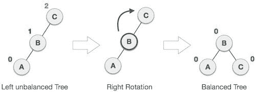
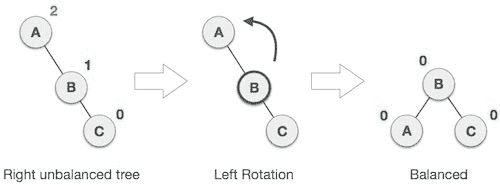

# AVL 树插入和旋转

> 原文：<https://www.freecodecamp.org/news/avl-tree/>

AVL 树是自平衡二叉查找树(BST)的改进版本。它以其发明者 **A** 德尔森- **V** 埃尔斯基和 **L** 安迪斯的名字命名，并于 1962 年首次推出，仅比 1960 年二叉查找树的设计晚了两年。AVL 树被认为是这种类型的第一个数据结构。

BST 是由节点组成的数据结构。它有以下保证:

1.  每棵树都有一个根节点(在顶部)。
2.  根节点有零个或多个子节点。
3.  每个子节点有零个或多个子节点，依此类推。
4.  每个节点最多有两个子节点。
5.  对于每个节点，其左后代小于当前节点，当前节点小于右后代。

AVL 树有一个额外的保证:

1.  左右子树的深度之差不能超过 1。

为了保持这种保证，AVL 树的实现包括一种算法，当添加额外的元素会导致左右树之间的深度差大于 1 时，该算法重新平衡该树。

AVL 树最坏情况下的查找、插入和删除时间为 O(log n)。

### **右旋转**



Source: [https://github.com/HebleV/valet_parking/tree/master/images](https://github.com/HebleV/valet_parking/tree/master/images)

### **向左旋转**



Source: [https://github.com/HebleV/valet_parking/tree/master/images](https://github.com/HebleV/valet_parking/tree/master/images)

### **AVL 插入过程**

这类似于正常的二叉查找树插入。插入后，通过向左或向右旋转来固定 AVL 特性。

*   如果右侧子树的左侧子树不平衡，那么您将执行左右旋转。
*   如果左子树的左子树不平衡，那么你执行右旋转。
*   如果右子树的右子树不平衡，那么就执行左旋转。
*   如果左侧子树的右侧子树不平衡，那么您将执行左右旋转。

### 例子

下面是 Python 中 AVL 树的一个例子:

```
class node:
	def __init__(self,value=None):
		self.value=value
		self.left_child=None
		self.right_child=None
		self.parent=None # pointer to parent node in tree
		self.height=1 # height of node in tree (max dist. to leaf) NEW FOR AVL

class AVLTree:
	def __init__(self):
		self.root=None

	def __repr__(self):
		if self.root==None: return ''
		content='\n' # to hold final string
		cur_nodes=[self.root] # all nodes at current level
		cur_height=self.root.height # height of nodes at current level
		sep=' '*(2**(cur_height-1)) # variable sized separator between elements
		while True:
			cur_height+=-1 # decrement current height
			if len(cur_nodes)==0: break
			cur_row=' '
			next_row=''
			next_nodes=[]

			if all(n is None for n in cur_nodes):
				break

			for n in cur_nodes:

				if n==None:
					cur_row+='   '+sep
					next_row+='   '+sep
					next_nodes.extend([None,None])
					continue

				if n.value!=None:       
					buf=' '*int((5-len(str(n.value)))/2)
					cur_row+='%s%s%s'%(buf,str(n.value),buf)+sep
				else:
					cur_row+=' '*5+sep

				if n.left_child!=None:  
					next_nodes.append(n.left_child)
					next_row+=' /'+sep
				else:
					next_row+='  '+sep
					next_nodes.append(None)

				if n.right_child!=None: 
					next_nodes.append(n.right_child)
					next_row+='\ '+sep
				else:
					next_row+='  '+sep
					next_nodes.append(None)

			content+=(cur_height*'   '+cur_row+'\n'+cur_height*'   '+next_row+'\n')
			cur_nodes=next_nodes
			sep=' '*int(len(sep)/2) # cut separator size in half
		return content

	def insert(self,value):
		if self.root==None:
			self.root=node(value)
		else:
			self._insert(value,self.root)

	def _insert(self,value,cur_node):
		if value<cur_node.value:
			if cur_node.left_child==None:
				cur_node.left_child=node(value)
				cur_node.left_child.parent=cur_node # set parent
				self._inspect_insertion(cur_node.left_child)
			else:
				self._insert(value,cur_node.left_child)
		elif value>cur_node.value:
			if cur_node.right_child==None:
				cur_node.right_child=node(value)
				cur_node.right_child.parent=cur_node # set parent
				self._inspect_insertion(cur_node.right_child)
			else:
				self._insert(value,cur_node.right_child)
		else:
			print("Value already in tree!")

	def print_tree(self):
		if self.root!=None:
			self._print_tree(self.root)

	def _print_tree(self,cur_node):
		if cur_node!=None:
			self._print_tree(cur_node.left_child)
			print ('%s, h=%d'%(str(cur_node.value),cur_node.height))
			self._print_tree(cur_node.right_child)

	def height(self):
		if self.root!=None:
			return self._height(self.root,0)
		else:
			return 0

	def _height(self,cur_node,cur_height):
		if cur_node==None: return cur_height
		left_height=self._height(cur_node.left_child,cur_height+1)
		right_height=self._height(cur_node.right_child,cur_height+1)
		return max(left_height,right_height)

	def find(self,value):
		if self.root!=None:
			return self._find(value,self.root)
		else:
			return None

	def _find(self,value,cur_node):
		if value==cur_node.value:
			return cur_node
		elif value<cur_node.value and cur_node.left_child!=None:
			return self._find(value,cur_node.left_child)
		elif value>cur_node.value and cur_node.right_child!=None:
			return self._find(value,cur_node.right_child)

	def delete_value(self,value):
		return self.delete_node(self.find(value))

	def delete_node(self,node):

		## -----
		# Improvements since prior lesson

		# Protect against deleting a node not found in the tree
		if node==None or self.find(node.value)==None:
			print("Node to be deleted not found in the tree!")
			return None 
		## -----

		# returns the node with min value in tree rooted at input node
		def min_value_node(n):
			current=n
			while current.left_child!=None:
				current=current.left_child
			return current

		# returns the number of children for the specified node
		def num_children(n):
			num_children=0
			if n.left_child!=None: num_children+=1
			if n.right_child!=None: num_children+=1
			return num_children

		# get the parent of the node to be deleted
		node_parent=node.parent

		# get the number of children of the node to be deleted
		node_children=num_children(node)

		# break operation into different cases based on the
		# structure of the tree & node to be deleted

		# CASE 1 (node has no children)
		if node_children==0:

			if node_parent!=None:
				# remove reference to the node from the parent
				if node_parent.left_child==node:
					node_parent.left_child=None
				else:
					node_parent.right_child=None
			else:
				self.root=None

		# CASE 2 (node has a single child)
		if node_children==1:

			# get the single child node
			if node.left_child!=None:
				child=node.left_child
			else:
				child=node.right_child

			if node_parent!=None:
				# replace the node to be deleted with its child
				if node_parent.left_child==node:
					node_parent.left_child=child
				else:
					node_parent.right_child=child
			else:
				self.root=child

			# correct the parent pointer in node
			child.parent=node_parent

		# CASE 3 (node has two children)
		if node_children==2:

			# get the inorder successor of the deleted node
			successor=min_value_node(node.right_child)

			# copy the inorder successor's value to the node formerly
			# holding the value we wished to delete
			node.value=successor.value

			# delete the inorder successor now that it's value was
			# copied into the other node
			self.delete_node(successor)

			# exit function so we don't call the _inspect_deletion twice
			return

		if node_parent!=None:
			# fix the height of the parent of current node
			node_parent.height=1+max(self.get_height(node_parent.left_child),self.get_height(node_parent.right_child))

			# begin to traverse back up the tree checking if there are
			# any sections which now invalidate the AVL balance rules
			self._inspect_deletion(node_parent)

	def search(self,value):
		if self.root!=None:
			return self._search(value,self.root)
		else:
			return False

	def _search(self,value,cur_node):
		if value==cur_node.value:
			return True
		elif value<cur_node.value and cur_node.left_child!=None:
			return self._search(value,cur_node.left_child)
		elif value>cur_node.value and cur_node.right_child!=None:
			return self._search(value,cur_node.right_child)
		return False 

	# Functions added for AVL...

	def _inspect_insertion(self,cur_node,path=[]):
		if cur_node.parent==None: return
		path=[cur_node]+path

		left_height =self.get_height(cur_node.parent.left_child)
		right_height=self.get_height(cur_node.parent.right_child)

		if abs(left_height-right_height)>1:
			path=[cur_node.parent]+path
			self._rebalance_node(path[0],path[1],path[2])
			return

		new_height=1+cur_node.height 
		if new_height>cur_node.parent.height:
			cur_node.parent.height=new_height

		self._inspect_insertion(cur_node.parent,path)

	def _inspect_deletion(self,cur_node):
		if cur_node==None: return

		left_height =self.get_height(cur_node.left_child)
		right_height=self.get_height(cur_node.right_child)

		if abs(left_height-right_height)>1:
			y=self.taller_child(cur_node)
			x=self.taller_child(y)
			self._rebalance_node(cur_node,y,x)

		self._inspect_deletion(cur_node.parent)

	def _rebalance_node(self,z,y,x):
		if y==z.left_child and x==y.left_child:
			self._right_rotate(z)
		elif y==z.left_child and x==y.right_child:
			self._left_rotate(y)
			self._right_rotate(z)
		elif y==z.right_child and x==y.right_child:
			self._left_rotate(z)
		elif y==z.right_child and x==y.left_child:
			self._right_rotate(y)
			self._left_rotate(z)
		else:
			raise Exception('_rebalance_node: z,y,x node configuration not recognized!')

	def _right_rotate(self,z):
		sub_root=z.parent 
		y=z.left_child
		t3=y.right_child
		y.right_child=z
		z.parent=y
		z.left_child=t3
		if t3!=None: t3.parent=z
		y.parent=sub_root
		if y.parent==None:
				self.root=y
		else:
			if y.parent.left_child==z:
				y.parent.left_child=y
			else:
				y.parent.right_child=y		
		z.height=1+max(self.get_height(z.left_child),
			self.get_height(z.right_child))
		y.height=1+max(self.get_height(y.left_child),
			self.get_height(y.right_child))

	def _left_rotate(self,z):
		sub_root=z.parent 
		y=z.right_child
		t2=y.left_child
		y.left_child=z
		z.parent=y
		z.right_child=t2
		if t2!=None: t2.parent=z
		y.parent=sub_root
		if y.parent==None: 
			self.root=y
		else:
			if y.parent.left_child==z:
				y.parent.left_child=y
			else:
				y.parent.right_child=y
		z.height=1+max(self.get_height(z.left_child),
			self.get_height(z.right_child))
		y.height=1+max(self.get_height(y.left_child),
			self.get_height(y.right_child))

	def get_height(self,cur_node):
		if cur_node==None: return 0
		return cur_node.height

	def taller_child(self,cur_node):
		left=self.get_height(cur_node.left_child)
		right=self.get_height(cur_node.right_child)
		return cur_node.left_child if left>=right else cur_node.right_child
```

Source: [https://github.com/bfaure/Python3_Data_Structures/blob/master/AVL_Tree/main.py](https://github.com/bfaure/Python3_Data_Structures/blob/master/AVL_Tree/main.py)

### 更多关于二分搜索法的信息:

*   [二分搜索法基础知识](https://guide.freecodecamp.org/algorithms/search-algorithms/binary-search/)
*   [二分搜索法树举例说明](https://www.freecodecamp.org/news/binary-search-tree-what-is-it/)
*   [二进制数据结构:树(和堆)简介](https://www.freecodecamp.org/news/binary-data-structures-an-intro-to-trees-and-heaps-in-javascript-962ab536cb42/)