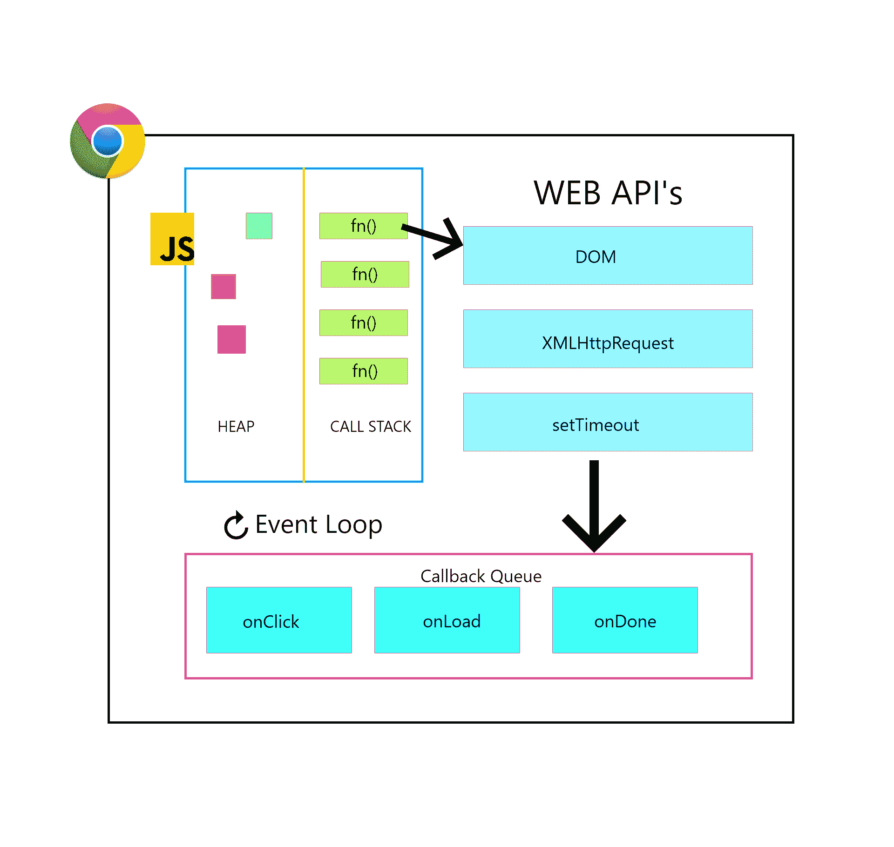

# JavaScript 并发模型和事件循环

> 原文：<https://www.freecodecamp.org/news/javascript-concurrency-model-and-event-loop/>

Javascript 运行时是单线程的，这意味着它一次可以执行一段代码。为了理解 Javascript 中的并发模型和事件循环，我们必须首先了解一些与之相关的常用术语。

## 调用堆栈

首先让我们了解一下什么是调用栈。

调用堆栈是一个简单的数据结构，它记录了我们当前在代码中的位置。因此，如果我们单步执行一个函数调用，它将被推送到调用堆栈。当我们从一个函数返回时，它被弹出堆栈。

让我们看一个代码示例来理解调用堆栈:

```
function multiply(x,y) {
   return x * y;
}

function squared(n) {
     return multiply(n,n)
  }

function printSquare(n) {
   return squared(n)
}

let numberSquared = printSquare(5);
console.log(numberSquared);
```

首先，当代码执行时，运行时将通读每个函数定义。但是当它到达第一个函数 ****printSquare(5)**** 被调用的那一行时，它会将这个函数推入调用堆栈。

接下来，这个函数将执行。在返回之前，它将遇到另一个函数，****【n】**，**，因此它将暂停当前操作，并将该函数推到现有函数之上。

它执行函数(在这种情况下是平方函数)，最后遇到另一个函数****(n，n)** 。然后它挂起当前的执行，并将这个函数推入调用堆栈。函数 multiply 执行并返回相乘后的值。**

最后，squared 函数返回并弹出堆栈，printSquare 也是如此。最终的平方值被分配给 numberSquared 变量。

我们再次遇到函数调用(在本例中是一个 console.log()语句),因此运行时将它推送到堆栈中。这将执行它，从而在控制台上打印平方数。

请注意，在上述任何代码运行之前，第一个被推入堆栈的函数是 main 函数。在运行时，这被称为“匿名函数”。

总结一下:无论何时调用一个函数，它都会被推入调用栈中执行。最后，当函数执行完毕并隐式或显式返回时，它将被弹出堆栈。

调用堆栈只记录在哪个时间点哪个函数正在执行。并且它跟踪哪个函数当前正在执行。

## 浏览器

现在我们知道 Javascript 可以一次执行一件事，但浏览器却不是这样。浏览器有自己的一组 API，如 setTimeout 和 XMLHttpRequests，它们不是在 Javascript 运行时中指定的。

事实上，如果你浏览 V8 的源代码，你不会找到任何关于它的定义。这是因为这些特殊的 web API 存在于浏览器环境中，而不是 javascript 环境中。因此，你可以说这些 API 将并发性引入了组合中。

让我们看一张图来了解全貌。



这里还介绍了一些术语，我们来看一下:

****堆** :** 多半是分配对象的地方。

****回调队列** :** 它是一个存储所有回调的数据结构。因为它是一个队列，所以基于先进先出的 FIFO 来处理元素。

****事件循环** :** 这是所有这些事情汇集的地方。事件循环只是检查调用堆栈，如果堆栈为空(这意味着堆栈中没有函数),它将从回调队列中取出最早的回调，并将其推入调用堆栈，调用堆栈最终会执行回调。

让我们通过一个代码示例来理解这一点:

```
console.log('hi');

setTimeout(function() {
     console.log('freecodeCamp')
},5000);

console.log('JS')
```

当第一行执行时，它是一个 console.log()。这是一个函数调用，意味着这个函数被推入调用堆栈，在那里它执行打印“hi”到控制台。最后，它被返回并弹出堆栈。

然后，当运行时执行 setTimeout()时，它知道这是一个 web API。因此，它把它交给浏览器来处理它的执行。浏览器启动计时器，然后 JS 运行时将 setTimeout()弹出堆栈。它遇到了另一个 console.log()调用，因此它将这个调用推入调用堆栈，消息“JS”被记录到控制台中，然后它最终被返回。然后将最后一个 console.log()弹出堆栈。现在调用堆栈是空的。

与此同时，当这一切正在进行时，计时器结束了。5 秒钟后，浏览器继续将回调函数推入回调队列。

接下来，事件循环检查调用堆栈是否空闲。因为它是免费的，所以它接受回调函数并再次将其推回调用堆栈，调用堆栈执行其中的代码。

同样，在代码内部有一个 console.log()调用，所以这个函数会转到堆栈的顶部执行，将“freecodecamp”记录到控制台中，最后它会返回。这意味着它被弹出堆栈，最后回调被弹出堆栈，我们就完成了。

为了更好地形象化，试试菲利普·罗伯茨的这个工具:[放大镜事件循环可视化器](http://latentflip.com/loupe/?code=!!!PGJ1dHRvbj5DbGljayBtZSE8L2J1dHRvbj4%3D)