# Python 中的二分搜索法:可视化介绍

> 原文：<https://www.freecodecamp.org/news/binary-search-in-python-visual-introduction/>

## 欢迎

在本文中，您将了解二分搜索法算法是如何在幕后工作的，以及如何用 Python 实现它。

**特别是，你将会学到:**

*   算法如何在幕后找到目标元素。
*   它的 Python 实现是如何逐行工作的。
*   为什么与线性搜索相比，它是一个非常有效的算法。
*   它的优点和要求。

让我们开始吧！✨

## 🔹二分搜索法介绍

该算法用于查找有序序列中的元素(例如:列表、元组或字符串)。

### 要求

要将二分搜索法算法应用于一个序列，该序列已经必须按升序排序。否则算法找不到正确答案。如果是的话，那将纯属巧合。

**💡提示:**在应用二分搜索法之前，您可以使用符合您需要的排序算法对序列进行排序。

### 输入和输出

算法(作为函数实现)需要这些数据:

*   元素的有序序列(例如:列表、元组、字符串)。
*   我们正在搜索的目标元素。

如果找到了，它将返回您正在寻找的元素的索引。如果找不到元素，则返回-1。

### 效率

与线性搜索(从第一个元素开始逐个搜索元素)相比，它非常高效，因为我们能够在每一步“丢弃”一半的列表。

让我们开始研究这个算法。

## 🔸视觉漫游

我们将对这个列表应用二分搜索法算法:

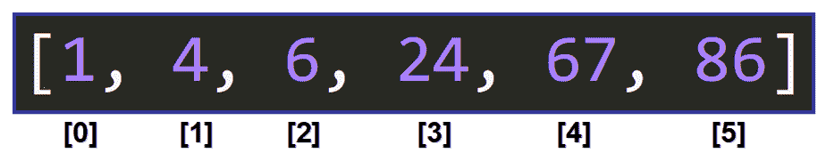

**💡提示:**注意这个列表已经被排序了。它包括作为视觉参考的指数。

### 目标

我们要求整数 **67** 的索引。

### 间隔

假设我们是算法。我们如何开始这个过程？

我们首先选择我们要搜索的区间的两个边界。我们想要搜索整个列表，所以我们选择索引`0`作为下限，索引`5`作为上限:

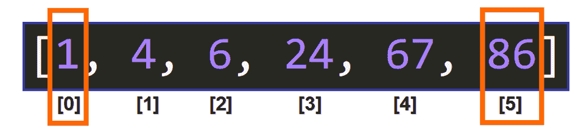

### 中间分子

现在我们需要找到中间元素在这个区间的索引。我们通过将下限和上限相加并用整数除法将结果除以 2 来实现这一点。

在这种情况下，`(0 + 5)//2`是 **`2`** ，因为`5/2`的结果是`2.5`，整数除法会截断小数部分。

所以中间元素位于**索引 2** ，中间元素是数字 **6** :

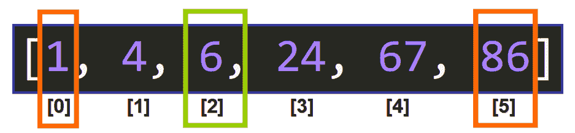

### 比较

现在我们需要开始比较中间元素和目标元素，看看下一步需要做什么。

我们问:
**中间的元素等于我们要找的元素吗？**

```
6 == 67 # False
```

不，不是的。

于是我们问:
**中间的元素是否大于我们要找的元素？**

```
6 > 67 # False
```

不，不是的。

所以中间的元素比我们要找的元素要小。

```
6 < 67 # True
```

### 丢弃元素

由于列表已经排序，这告诉我们一些非常重要的事情。它告诉我们，我们可以“丢弃”列表的下半部分，因为我们知道中间元素之前的所有元素都小于我们要寻找的元素，所以我们的目标元素不在那里。

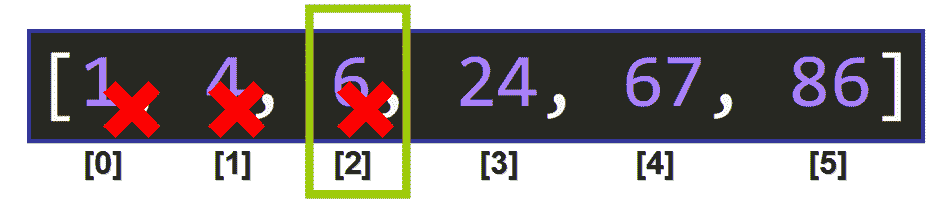

### 重新开始-选择边界

我们下一步做什么？我们丢弃了这些元素，循环再次重复。

我们必须选择新区间的边界(见下文)。但是请注意，上限保持不变，只有下限发生了变化。

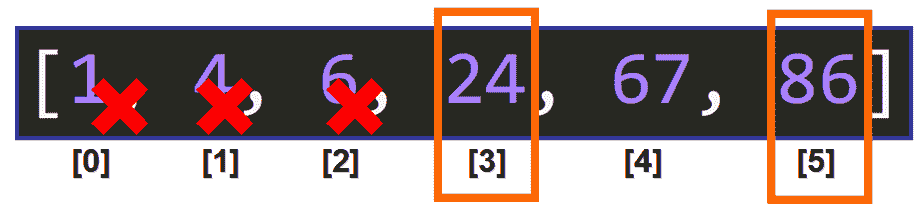

这是因为我们正在寻找的元素可能在列表的上半部分。上限保持不变，下限被更改为将区间“缩小”到可以找到目标元素的区间。

💡**提示:**如果中间的元素大于我们正在寻找的元素，那么上限将被改变，而下限将保持不变。这样，我们将放弃列表的上半部分，继续在下半部分搜索。

### 中间分子

现在我们需要找到中间元素的索引，方法是将下界与上界相加，并用整数除法将结果除以 2。

`(3+5)//2`的结果是`4`，所以中间元素位于**索引** `**4**`，中间元素是 **67** 。

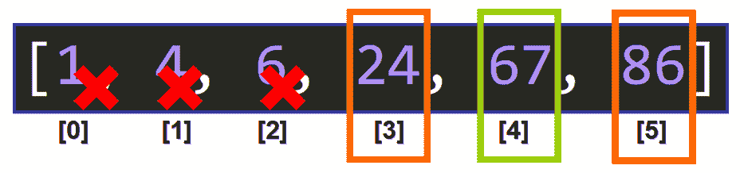

### 比较

我们问:
**中间的元素等于我们要找的元素吗？**

```
67 == 67 # True
```

是的，它是！所以我们找到了索引为 **4** 的元素。返回值 4，算法成功完成。

💡**提示:**如果没有找到该元素，该过程将一直继续，直到间隔不再有效。如果没有在整个列表中找到该元素，则返回-1。

## 🔹代码走查

现在，您对算法在幕后如何工作有了直观的了解，让我们通过逐行分析来深入了解迭代 Python 实现:

```
def binary_search(data, elem):

    low = 0
    high = len(data) - 1

    while low <= high:

        middle = (low + high)//2

        if data[middle] == elem:
            return middle
        elif data[middle] > elem:
            high = middle - 1
        else:
            low = middle + 1

    return -1
```

### 页眉

这里我们有函数头:

```
def binary_search(data, elem):
```

它需要两个参数:

*   元素的有序序列(例如:列表、元组或字符串)。
*   我们想要找到的元素。

### 初始间隔

下一行设置初始的下限和上限:

```
low = 0
high = len(data) - 1
```

初始下限是索引`0`，初始上限是序列的最后一个索引。

### 环

我们将在存在有效区间时重复该过程，而下限小于或等于上限。

```
while low <= high:
```

💡**提示:**记住界限是指数。

### 中间分子

在每次迭代中，我们需要找到中间元素的索引。为此，我们将下限和上限相加，并使用整数除法将结果除以 2。

```
middle = (low + high)//2
```

💡提示:在列表或区间包含偶数个元素的情况下，我们使用整数除法。例如，如果列表有 6 个元素，而我们没有使用整数除法，`middle`将是`(0 + 5)/2`的结果，也就是`2.5`。索引不能是浮点数，所以我们使用`//`截断小数部分，并选择索引`2`处的元素。

### 比较

有了这些条件(见下文)，我们根据中间元素`data[middle]`的值来决定做什么。我们将它与我们正在寻找的目标元素进行比较。

```
if data[middle] == elem:
    return middle
elif data[middle] > elem:
    high = middle - 1
else:
    low = middle + 1
```

有三个选项:

*   如果中间的元素等于我们正在寻找的元素，我们立即返回索引，因为我们找到了该元素。

```
if data[middle] == elem:
    return middle
```

*   如果中间的元素大于我们正在寻找的元素，我们重新分配上限，因为我们知道目标元素在列表的下半部分。

```
elif data[middle] > elem:
    high = middle - 1
```

*   否则，剩下的唯一选择是中间的元素小于我们要寻找的元素，所以我们重新分配下界，因为我们知道目标元素在列表的上半部分。

```
else:
    low = middle + 1
```

### 找不到元素

如果循环完成后没有找到元素，则返回值-1。

```
return -1
```

我们有了二分搜索法算法的最终实现:

```
def binary_search(data, elem):

    low = 0
    high = len(data) - 1

    while low <= high:

        middle = (low + high)//2

        if data[middle] == elem:
            return middle
        elif data[middle] > elem:
            high = middle - 1
        else:
            low = middle + 1

    return -1
```

## 🔸特殊情况

开始使用该算法时，您可能会发现一些特殊情况:

### 重复元素

如果要查找的元素在序列中重复出现，则返回的索引将取决于元素的数量以及算法对序列执行的操作顺序。

```
>>> >>> b = [2, 2, 3, 6, 7, 7]
>>> binary_search(b, 7)
4 
```

### 找不到元素

如果找不到元素，则返回-1。

```
>>> b = [2, 2, 3, 6, 7, 7]
>>> binary_search(b, 8)
-1
```

### 空序列

如果序列为空，将返回-1。

```
>>> b = []
>>> binary_search(b, 8)
-1
```

### 未排序序列

如果顺序不对，答案就不正确。获得正确的索引纯粹是巧合，这可能是由于序列中元素的顺序和算法执行的操作顺序。

此示例返回正确的结果:

```
>>> b = [5, 7, 3, 0, -9, 2, 6]
>>> binary_search(b, 6)
6
```

但是这个没有:

```
>>> b = [5, 7, 3, 0, -9, 2, 10, 6]
>>> binary_search(b, 6)
-1
```

💡**提示:**思考为什么第一个例子返回正确的结果。提示:元素的顺序恰好使算法达到正确的索引，这纯粹是巧合，但循序渐进的过程是求值`0`，然后是`2`，最后是`6`。在这种特殊情况下，对于这个特殊的元素，即使序列没有排序，也能找到正确的索引。

## 🔹一个更复杂的例子

既然您已经对算法及其 Python 实现更加熟悉，下面我们来看一个更复杂的例子:

我们希望使用二分搜索法找到列表中元素 **45** 的索引:

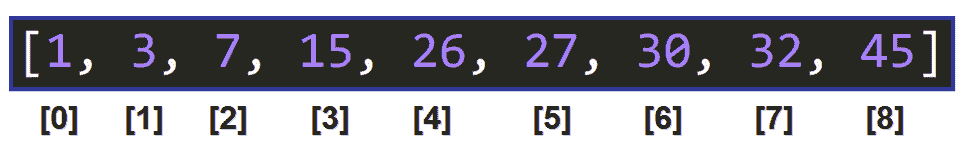

### 第一次迭代

选择下限和上限:

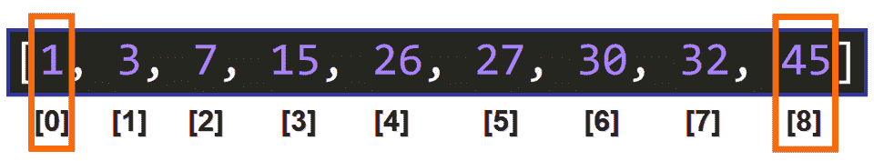

选择中间元素( **26** ):

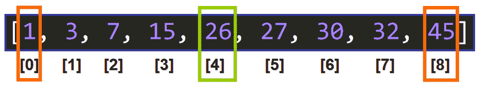

但是中间的元素( **26** )不是我们要找的元素，它比 **45** 小:

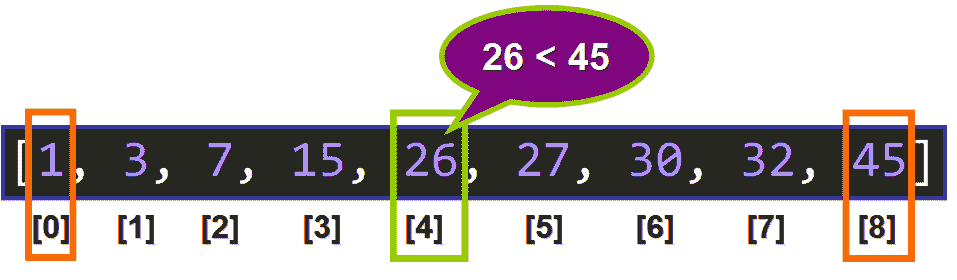

### 第二次迭代

所以我们可以丢弃所有比中间元素小的元素，选择新的边界。新的下限( **27** )是直接位于前一个中间元素右侧的元素:

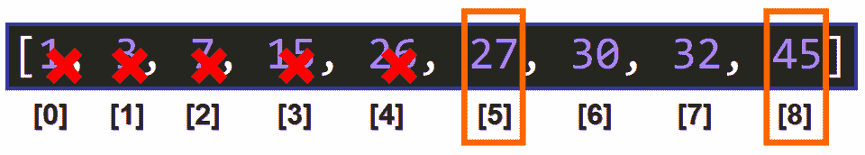

💡**提示:**记住列表已经排序了。

选择新的中间元素( **30** ):

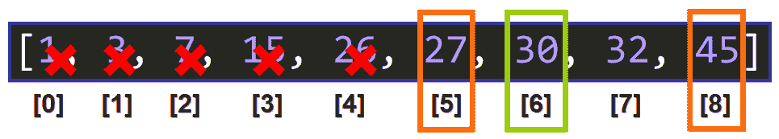

中间的元素( **30** )不是我们要找的元素，它比 **45** 小:

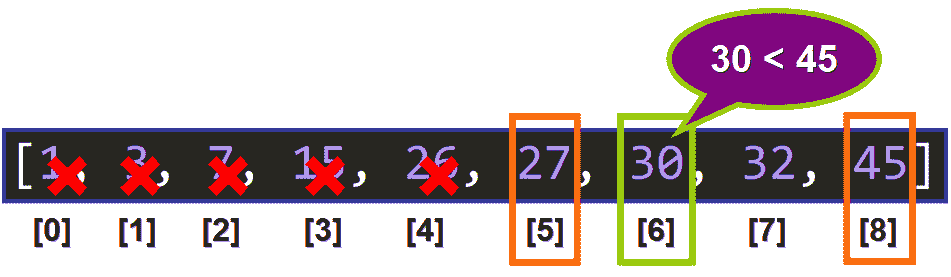

### 第三次迭代

我们可以丢弃小于或等于 **30** 且尚未被丢弃的元素。下限更新为 **32** :

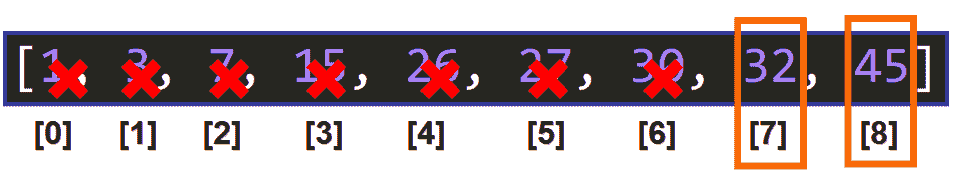

这里我们有一个有趣的案例:中间的元素是当前区间的边界之一，因为`(7+8)//2`是`7`。

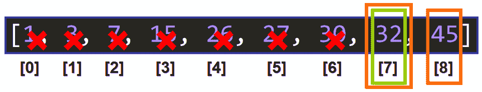

中间的元素( **32** )不是我们要找的元素( **45** )，它更小。

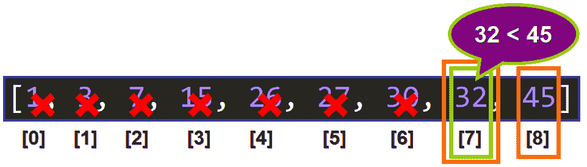

### 第四次迭代

我们可以丢弃小于或等于 **32** 且尚未被丢弃的元素。

这里我们有另一个非常有趣的例子:区间只有一个元素。

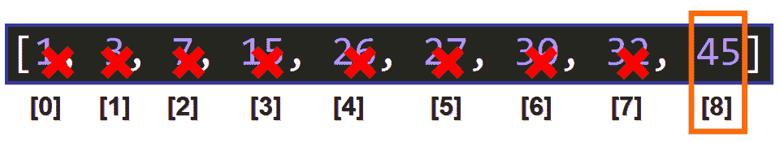

💡**提示:**这个区间是有效的，因为我们写了这个条件`while high <= low:`，它包含了下界的指数等于上界的指数的区间。

中间元素是区间中唯一的元素因为`(8+8)//2`是`8`，所以中间元素的索引是 **8** ，中间元素是 **45** 。

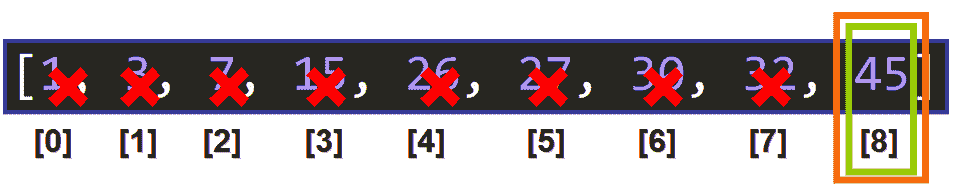

现在中间的元素就是我们正在寻找的元素， **45** :

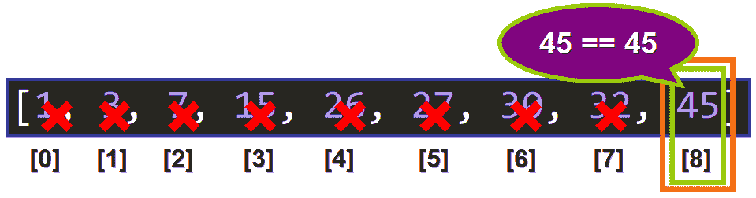

因此返回值 **8** (索引):

```
>>> binary_search([1, 3, 7, 15, 26, 27, 30, 32, 45], 45)
8
```

## 🔸额外练习

如果你想对这个算法进行一些额外的练习，试着解释一下当它被应用到这个列表来寻找整数 **90** 时，算法是如何在幕后工作的:

```
[5, 8, 15, 26, 38, 56]
```

*   一步一步会怎么样？
*   返回什么值？
*   找到元素了吗？

我真的希望你喜欢我的文章，并觉得它很有帮助。现在你可以用 Python 实现二分搜索法算法了。查看我的在线课程“ [Python 搜索&排序算法:实用方法](https://www.udemy.com/course/python-searching-sorting-algorithms/?couponCode=FREECODECAMP-ALG)”。在[推特](https://twitter.com/EstefaniaCassN)上关注我。⭐️