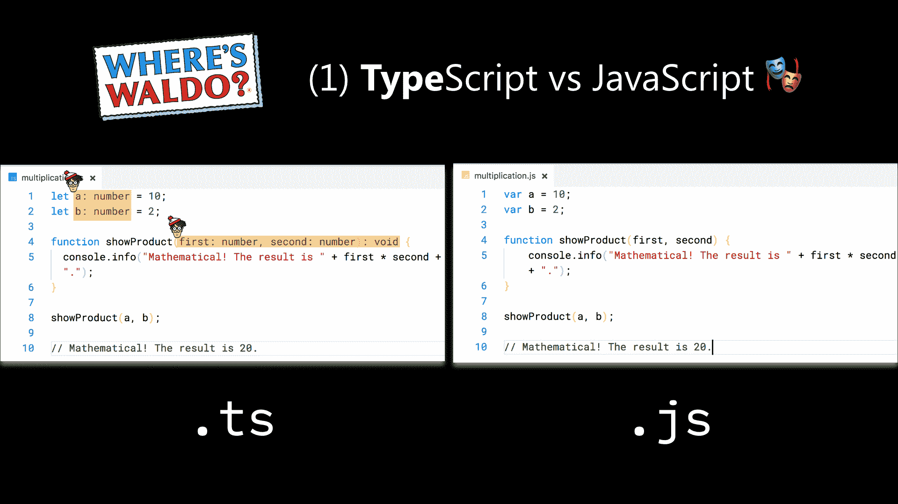
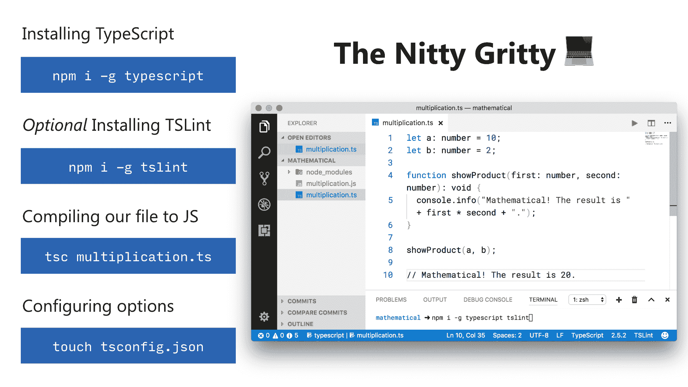
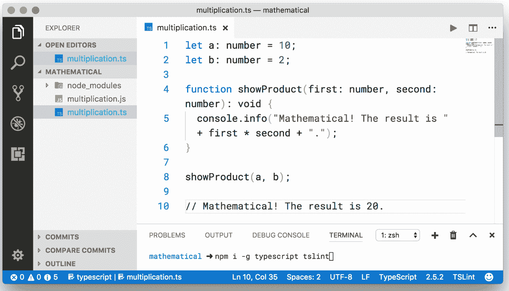
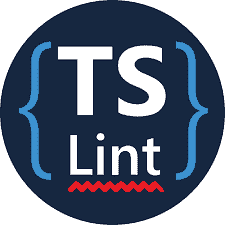
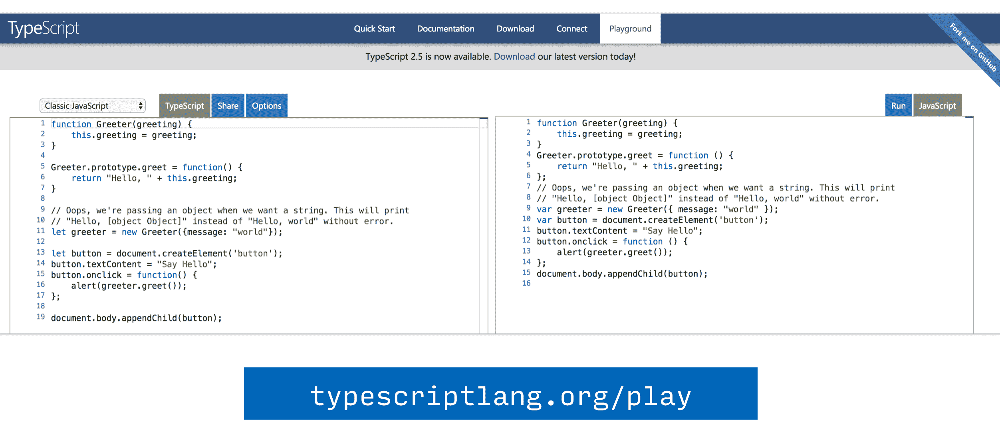

# 什么是 TypeScript？

> 原文：<https://www.freecodecamp.org/news/what-is-typescript/>

## **打字稿概述**

因此，正如您最有可能意识到的，JavaScript 每天都在扩展它的足迹。如今，你可以用这种语言做的事情令人惊叹不已。

然而，随着越来越多的大型项目开始使用 JavaScript，使代码更易于编写和维护的过程变得越来越困难。

这是微软很早就认识到的问题，他们提出了一个解决方案:TypeScript 第一个版本于 2012 年 10 月 1 日发布。

## **JavaScript vs TypeScript**



好了，现在我们对什么是 TypeScript 有了一个大致的概念，让我们来玩一个快速的游戏 ****沃尔多**** 在哪里。

在上面的截图中，你可以在这个非常简单的乘法程序中找出`JavaScript` & `TypeScript`之间的区别，这个程序只是打印出我预先定义的两个数字的乘积。

### 这些差异是什么？？️

他们是 ****型**** ！

所以`JavaScript`有动态类型，声明为数字的变量可以转换为字符串，而`TypeScript`有静态类型，这意味着你预先声明变量将保存什么类型的值，它不会改变。

在那个`multiplication.ts`文件中，我将所有这些变量都声明为数字，这样它们就不能被改变为其他值。

本质上，TypeScript 试图帮助 JavaScript 达到新的高度，变得非常可伸缩。它可以突出以下特点:

*   由微软开发和维护的免费开源编程语言
*   编译成普通 JavaScript 的严格语法超集
*   简化用 JavaScript 编写的大型应用程序的开发
*   通过添加静态类型、类、模块、接口和泛型来扩展 JavaScript

****？趣事**** 打字稿 2019 年 10 月 1 日满 7 岁。

## 版本

可用的最新稳定版本是 [TypeScript 3.7](https://www.typescriptlang.org/docs/handbook/release-notes/typescript-3-7.html) (截至 2020 年初)。

## **如何安装 TypeScript**



首先，您需要两件东西:TypeScript 编译器和一个支持 TypeScript 的编辑器。

在上面的截图中，我正在使用 [Visual Studio Code](https://code.visualstudio.com/) 的集成终端中的`npm`安装编译器和 [TSLint](https://github.com/palantir/tslint) (类似于 [ESLint](https://eslint.org/) )。

### **安装打字稿**

这个命令将使用一个流行的包管理器 [`npm`](https://www.npmjs.com/) 把 TypeScript 包作为一个依赖项安装到你的项目中。

```
npm i typescript
```

*注意*[有几个选项](https://docs.npmjs.com/cli/install)`npm`根据你想要安装 TypeScript 的位置提供。

*   `npm i -g typescript`全局安装 TypeScript 包
*   `npm i -D typescript`将 TypeScript 包作为开发依赖项安装

### **将单个文件编译成 JavaScript**

```
tsc multiplication.ts
```

*注意*您可以在您的`package.json`中将这个 TypeScript 编译过程配置为一个定制的 npm 脚本。

### **配置选项**

```
touch tsconfig.json
```

还有创建一个指定根文件和编译器选项的 [`tsconfig.json`](https://www.typescriptlang.org/docs/handbook/tsconfig-json.html) 文件的选项。

例如，在您的 [`tsconfig.json`](https://www.typescriptlang.org/docs/handbook/tsconfig-json.html) 文件中，您可以指定您希望 TypeScript 向下编译到 ES5 而不是 ES6。

### **快速示例**



在上面的截图中，你可以看到两个文件——`multiplication.js`和`multiplication.ts`。

这个程序只是打印出我预先定义的两个数的乘积。

`multiplication.ts`

```
let a: number = 10;
let b: number = 2;

function showProduct(first: number, second: number): void {
  console.info("Mathematical! The result is " + first * second + ".");
}

showProduct(a, b);

// Mathematical! The result is 20.
```

一旦我完成了`multiplication.ts`的创建，我就可以使用`tsc`命令将它编译成 JavaScript，T1 代表 TypeScript compile。

`multiplication.js`

```
var a = 10;
var b = 2;

function showProduct(first, second) {
    console.info("Mathematical! The result is " + first * second + ".");
}

showProduct(a, b);

// Mathematical! The result is 20.
```

bam——我们刚刚成功地将 TypeScript 编译成 JavaScript！

## **丝带**



一个 [linter](https://www.wikiwand.com/en/Lint_(software) 是一个检测和标记编程语言中错误的工具，包括风格错误。

对于 TypeScript， [TSLint](http://palantir.github.io/tslint) 是最流行的 linter 选项。

TSLint 是一个可扩展的静态分析工具，它检查 TypeScript 代码的可读性、可维护性和功能错误。

它在现代编辑器和构建系统中得到广泛支持，并且可以使用您自己的 lint 规则、配置和格式化程序进行定制。

### **安装 TSLint**

这个命令将使用一个流行的包管理器`npm`全局安装`TSLint`包。

```
npm i -g tslint
```

## 操场



如果你想在不安装的情况下试用 TypeScript，请访问 [TypeScript 游乐场](http://www.typescriptlang.org/play/index.html)。

Playground 具有内置的自动完成功能，并且能够直接看到发出的 JavaScript。

### **其他资源**

要了解更多关于安装的信息，请参见[安装附录](https://guide.freecodecamp.org/typescript/src/articles/typescript/appendix-installation/index.md)。

如果你只需要一个类型检查器而不想编译你的程序，请阅读关于 [Flux](https://facebook.github.io/flux/) 的内容。

*   [快速启动](http://www.typescriptlang.org/samples/index.html)
*   [文档](http://www.typescriptlang.org/docs/home.html)
*   [源代码](https://github.com/Microsoft/TypeScript)