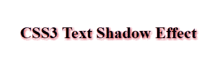
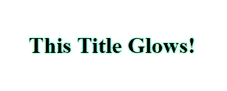
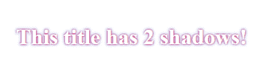
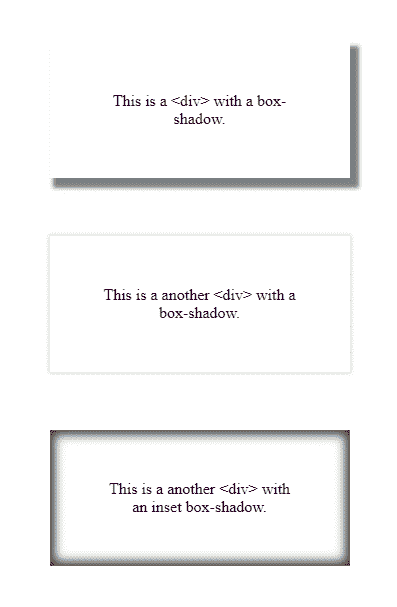

# CSS 文本阴影和框阴影效果(有例子)

> 原文：<https://www.freecodecamp.org/news/css-text-shadow-and-box-shadow-examples/>

使用 CSS3 你可以创建两种类型的阴影:`text-shadow`(给文本添加阴影)和`box-shadow`(给其他元素添加阴影)。

### **CSS3 文字阴影**

`text-shadow`属性最多可以有四个值:

*   水平阴影
*   垂直阴影
*   模糊效果
*   颜色

##### **例子:**

普通文本阴影

```
h1 {
text-shadow: 2px 2px 5px crimson;
}
```



发光文本效果

```
h1 {
text-shadow: 0 0 4px #00FF9C;
}
```



#### **多重阴影**

为此，您只需在两组(或多组)值之间添加一个逗号:

```
h1 {
	color: white;
	text-shadow: 0 0 3px #F10D58, 0 0 7px #4578D5;
}
```



### **CSS3 方框阴影**

`box-shadow`属性最多可以有六个值:

*   (可选)关键字`inset`(将阴影更改为框架内的阴影)
*   水平阴影
*   垂直阴影
*   模糊效果
*   传播
*   颜色

##### **例子:**

```
.first-div {
	box-shadow: 1px 1px 5px 3px grey;
}

.second-div {
	box-shadow: 0 0 5px 1px lightgrey;
}

.third-div {
	box-shadow: inset 0 0 15px 5px rgba(0,0,0,0.75);
}
```



#### **更多信息:**

*   [MDN 网络文档](https://developer.mozilla.org/en-US/docs/Web/CSS/box-shadow?v=b)
*   [检查浏览器支持](https://caniuse.com/#search=box-shadow)
*   CSS 盒子阴影生成器(随意试验盒子阴影)