# 如何用 JSCharting 制作你的第一个 JavaScript 图表

> 原文：<https://www.freecodecamp.org/news/how-to-make-your-first-javascript-chart/>

当你开始作为一个初级 JavaScript 开发者时，我认为追求有趣的项目是很重要的。这样你就能确保在学习的过程中获得乐趣，并且你可能会找到你喜欢的专业领域。

就像他们说的那样，“如果你热爱你所做的事情，你这辈子一天都不会工作”。


Source: giphy.com

在本文中，我将向您介绍前端数据可视化，这是我个人的热情所在。也许它也会成为你的激情！

作为一名开发人员，对我来说最有收获的时刻是当我能看到或体验到我所做的成果的时候。创建一个图表来揭示关于其数据的有趣见解，或者创建一个交互式体验来帮助探索独特数据集的细节，这是非常令人满意的。结果越显著，就越有成就感。

然而，我意识到你在一个项目上投入的工作量并不一定与成就感相关联——有时即使相对容易，感觉也很棒。

随着时间的推移，你会发现有助于提高效率的工具，有时你会不费吹灰之力就能移山倒海。在数据可视化领域有许多图表库和工具可用。使用正确的工具，无论您需要什么类型的图表，您都可以轻松地创建新的图表。就个人而言，我认为 datavis 为您投入的时间和精力带来了巨大的回报。

在本教程中，您将使用许多工具通过互联网获取数据，对其进行处理，并绘制一个可以在任何现代浏览器中查看的漂亮图表。你可以点击下面的链接分别下载每个步骤的示例代码，在 **[GitHub](https://github.com/arthurPuszynski/first-chart-article)** 上查看，或者在这里一次性下载所有步骤: **[all-steps.zip](https://github.com/arthurPuszynski/first-chart-article/raw/master/zips/all-steps.zip) 。**

## 结果呢

本教程结束时，您将创建这个交互式数据驱动图表。您将学习如何通过互联网获取数据，处理数据，并用这些数据制作图表。您还可以从头开始制作自己的图表。


Interactive JavaScript line chart

在处理数据并制作图表后，您还将学习如何对图表进行调整，包括修改默认图例、启用带有工具提示的 x 轴十字光标，以及应用文本批注向图表添加上下文和其他信息。

## 工具

首先，使用一个你可能用来阅读这篇文章的网络浏览器。我推荐 Chrome，因为它为开发者提供了很好的体验和内置工具。

接下来，您将需要一个文本编辑器。像记事本这样简单的东西就可以了。但是，我建议使用更高级的代码编辑器，比如 VS Code，因为这是一个你会花很多时间使用的环境。它会给你一个更方便、更愉快的编码体验，并且让编写 HTML5、CSS 和 JavaScript 看起来更容易。最重要的是，如果您忘记了某处的引号或逗号，代码编辑器可以帮助您找到错误。

这篇文章可以帮助你为 web 开发选择最好的 JavaScript 代码编辑器。

您将使用 JSCharting 图表库来自动绘制该图表并为其添加交互式功能。不需要 jQuery 等其他 JavaScript 库，也不需要 React 和 Angular(通常用于网站项目)等前端平台。

### 为什么是 JSCharting？

JSCharting 是一个 JavaScript 图表库，可以使用 SVG 绘制许多不同类型的图表。它易于使用和入门，因此非常适合本教程。API(应用程序编程接口，也称为创建图表所需的选项和设置)使困难的事情变得更简单，在试验数据可视化时，这是一个很好的选择。

您可以通过附带的品牌免费将 JSCharting 用于个人和商业用途。

您可以通过几个简单的步骤使用 JSCharting 创建响应图表:

*   在 HTML 文件中定义一个带有唯一 id 的`<div>`标签。
*   在 JavaScript 文件中调用`JSC.Chart()`时，提供这个 id、数据和任何其他选项。

就是这样。JSC 将绘制一个专业的图表，用 SVG 元素视觉效果填充这个 div 标签。图表将会有反应和互动，不需要任何额外的努力。

## 数据

您将使用由 NCHS(国家健康统计中心)提供的数据文件，该文件列出了美国男性和女性的历史预期寿命。

你可以在这里找到:[https://data.cdc.gov/resource/w9j2-ggv5.csv](https://data.cdc.gov/resource/w9j2-ggv5.csv)。

该 CSV 文件包含按年份、种族和性别对预期寿命进行分类的数据。你将使用这些数据来绘制一条简单的男性/女性在过去 100 年的趋势线。

CSV(逗号分隔值)是一种很好的通过互联网传输数据的格式。它很简洁，易读，你可以直接用 excel 打开它，这也很好。

所以事不宜迟，我们开始吧。


Source: giphy.com

## 步骤 1 -添加空白图表

第一个 zip 文件包含一个空白的起点，您可以在我们进行的过程中填充它。如果你迷路了或困惑了，或者想跳过前面的部分，每一部分末尾的压缩文件会帮助你加快速度。

如果您希望一次性下载所有文件，请查看**[all-steps . zip](https://github.com/arthurPuszynski/first-chart-article/raw/master/zips/all-steps.zip)***而不是*。**

### *[step1-a.zip](https://github.com/arthurPuszynski/first-chart-article/raw/master/zips/step1-a.zip)*

*这个 zip 文件包含以下文件。*

 **   `index.html`
*   `js/index.js`

除了一些使其成为有效文件的标准代码之外，`.html`文件是空的，而`.js`文件完全是空白的。

第一步是向 HTML 网页文件添加一些脚本。通常人们建议在`<head>`标签内添加`<script>`标签。然而，对于影响 HTML 内容的脚本来说，将它们添加在结束的`</body>`标签之后通常会更好。

这种技术在执行任何 JavaScript 之前将所有 HTML 加载到 DOM 中。图表需要先加载 HTML，然后才能在其中绘图。DOM(文档对象模型)是浏览器内存中 HTML 代码的表示。一旦 HTML 被加载到 DOM 中，浏览器就可以显示它，JavaScript 也可以与之交互。

首先将 JSCharting 库添加到 HTML 文件中。在您选择的编辑器中打开`index.html`文件。然后添加一个脚本标记，在结束的`</body>`标记之后包含 JSCharting。文件底部的结果代码应该如下所示:

```
</body>
<script src="https://code.jscharting.com/2.9.0/jscharting.js"></script>
</html>
```

此库 URL 指向 CDN(内容交付网络)。它托管图表代码，并方便快速地将库添加到任何 HTML 页面，以进行图表原型制作和实验。你也可以[下载](https://jscharting.com/download/)并在本地使用这个库或者在你的项目中使用 npm 包，但是 CDN 不需要任何额外的步骤。

接下来，使用相同的技术，添加另一个引用空白 JavaScript 文件的脚本标记。将该脚本添加到`jscharting.js`脚本之后，如下所示:

```
</body>
<script src="https://code.jscharting.com/2.9.0/jscharting.js"></script>
<script src="js/index.js"></script>
</html>
```

太好了。我们几乎准备好绘制空白图表。您需要做的最后一件事是在 HTML 文件中添加一个`<div>`占位符来定义我们希望在哪里绘制这个图表。

将这段 HTML 代码添加到`<body>`标签中。

```
<body>
    <div id="chartDiv" style="width:50%; height:300px; margin:0 auto;"></div>
</body>
```

div 必须有一个 id，这样您就可以告诉图表要在哪个 div 中绘制。在这种情况下，id 是`chartDiv`。

您可能会注意到`<div>`标签的样式属性。它使 div 为窗口宽度的 50%，高度为 300 像素。边距样式`margin:0 auto;`使 div 在页面上居中。无论 div 的大小如何，图表都会填充，因此更改 div 的大小是控制图表大小的一个好方法。

HTML 文件已经设置好了。打开`index.js`文件，通过编写包含 div id `chartDiv`的以下代码，向该页面添加一个空白图表:

```
JSC.Chart('chartDiv', {});
```

在浏览器中打开`index.html`文件(将文件拖放到类似 chrome 的 web 浏览器中)。

还没看到多少，但你可能会注意到这一页上的一个小 JSC 标志。表示图表已连接并正在绘制。


JSCharting logo shows the chart is working

## 第二步-稍微摆弄一下图表

好的，作为一个测试，让我们为图表添加几个值来观察它是如何工作的。

回到`index.js`文件，用下面的代码替换内容，为图表添加更多选项。

```
JSC.Chart('chartDiv', {
   type: 'horizontal column',
   series: [
      {
         points: [
            {x: 'Apples', y: 50},
            {x: 'Oranges', y: 42}
         ]
      }
   ]
});
```

现在刷新(F5)加载了`index.html`页面的浏览器窗口。

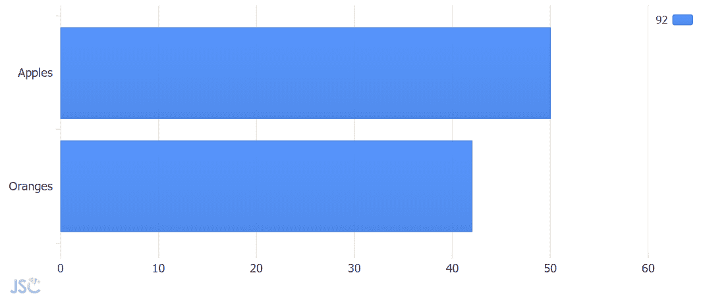

Horizontal column chart with one series and two points

不错！您刚刚使用 JavaScript 制作了第一个图表。


Source: giphy.com

您通过将图表类型选项设置为`'horizontal column'`制作了一个条形图。如果您喜欢垂直列，请将该值设置为`'column'`。您还向图表中添加了一个包含两个苹果和桔子的数据系列。

所有图表数据都由系列和点组成。系列只是一组数据点。图表可以包含一个或多个数据系列。数据点由映射到 x 轴和 y 轴的值组成。点还可以包括许多其他描述性变量和值。

上面的示例只包含一个系列。现在让我们来看看两个系列的图表的选项。用这段代码替换 JavaScript 文件的内容。

```
JSC.Chart('chartDiv', {
   type: 'horizontal column',
   series: [
      {
         name:'Andy',
         points: [
            {x: 'Apples', y: 50},
            {x: 'Oranges', y: 32}
         ]
      },{
         name:'Anna',
         points: [
            {x: 'Apples', y: 30},
            {x: 'Oranges', y: 22}
         ]
      }
   ]
});
```

刷新浏览器窗口将显示此图表。


Horizontal column chart with two series

图表选项看起来很相似。仍然是条形图，但这次在 series 数组中多了一个对象。我们还为每个系列添加了名称属性，以便图表可以在图例中识别它们。

如果你对制作不同的图表感兴趣，比如雷达图、面积图、饼图、甘特图，甚至日历热图，看看 [JSCharting 示例库](https://jscharting.com/examples/chart-types/)和用于创建这些图表的源代码(图表选项)。通过复制可用的示例，您可以快速了解如何使用其他图表功能。

****[step 2 . zip](https://github.com/arthurPuszynski/first-chart-article/raw/master/zips/step2.zip)****

## 步骤 3 -准备数据


Source: giphy.com

CSV 数据格式就是这样——逗号分隔的值。该文件包含行(行),每行代表一个记录或条目。通常，第一行值包含每个逗号分隔值(列)的名称。后续行包含这些值本身。

```
name,age
chris,26
mike,34
```

CSV 是人类可读的，但是这种格式有多种变体。有时，如果值包含逗号(例如邮寄地址)，则格式不会按原样工作，因此每个值也用引号括起来。这样，引号内的逗号将被忽略，格式仍然可以通过仅使用引号外的逗号来分隔值。

```
"name","age","parents"
"Chris","26","Gregory, Mary"
"Mike","34","David, Sarah"
```

也可以使用不同的字符(如制表符)代替逗号来分隔值。

但是我们不要陷入细枝末节。JSCharting 提供了许多工具来帮助这个过程，我们将使用其中的一个来跳过对 CSV 文件格式的担心，并将其转换为 JSON (JavaScript 对象符号)。结果将是一个对象数组。每个对象代表一个具有命名属性的行。CSV 文件中的第一行用于定义这些属性的名称。

这是我们感兴趣的数据的 URL:[https://data.cdc.gov/resource/w9j2-ggv5.csv](https://data.cdc.gov/resource/w9j2-ggv5.csv)。

可以点击下载，用 excel 打开。

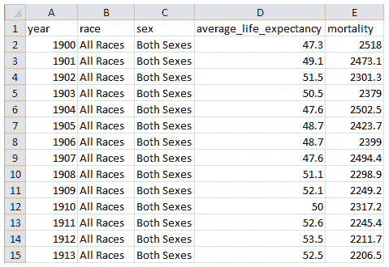

CSV file opened in Excel

但是，您将使用 JavaScript 代码实时下载和访问这个 CSV 数据。下面的代码一开始可能有点混乱，但是它很短，您可以重用它以编程方式通过互联网获取任何 CSV、文本或 JSON 文件。它类似于老的 AJAX 技术，但使用起来简单得多。

再次用以下内容替换`index.js`文件的内容:

```
fetch('https://data.cdc.gov/resource/w9j2-ggv5.csv')
   .then(function (response) {
      return response.text();
   })
   .then(function (text) {
	csvToSeries(text);
   })
   .catch(function (error) {
      //Something went wrong
      console.log(error);
   });

function csvToSeries(text) {
   console.log(text);
}
```

为什么这么复杂？这是因为当您请求一个文件时，它不会立即变得可用。有一个延迟，你必须等待文件到达。所以首先你使用`fetch()`从另一个网站请求文件。

```
fetch('https://data.cdc.gov/resource/w9j2-ggv5.csv')
```

然后，当响应到达时，调用`then(...)`参数函数中的代码。这个函数将响应转换成文本并返回，然后将结果传递给下面的`then()`参数函数。

```
.then(function (response) {
	return response.text();
})
```

下一个`then(...)`参数函数调用`csvToSeries()`函数，并将文本作为参数传递。

```
.then(function (text) {
	csvToSeries(text);
})
```

在`catch()`功能中，您可以指定出现问题时该做什么。例如，互联网可能中断，或者 URL 不正确。

```
.catch(function (error) {
	//Something went wrong
	console.log(error);
});
```

在这种情况下，错误被发送到控制台。

在`csvToSeries()`函数中，我们将该文本传递给控制台进行检查。

```
function csvToSeries(text) {
   console.log(text);
}
```

？**注意:**Internet Explorer 11 不支持原生`fetch()`功能。如果您也想支持这个浏览器，您可以使用 JSCharting 附带的`JSC.fetch()`函数。它提供相同的功能，但增加了对 IE11 的额外支持。

将`index.html`文件拖到浏览器窗口中(如果已经打开，则刷新页面)并按 F12。这将打开 chrome 浏览器的 DevTools 窗口。默认情况下，DevTools 窗口的下半部分将显示控制台输出。当您运行如下代码时，文本将发送到这里:

```
console.log(text);
```

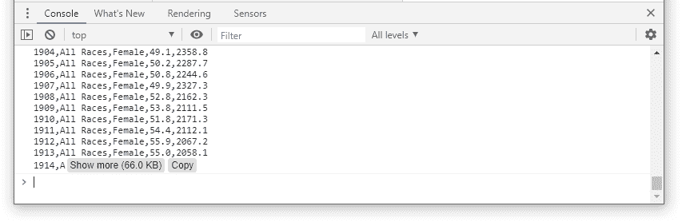

Console window output

您也可以将代码粘贴或编写到这个控制台窗口中来执行它。尝试将上面的整个代码片段粘贴到控制台窗口中(在>字符旁边)，然后按 enter 键。您会注意到在控制台窗口输出中得到相同的结果。这对于测试一行代码和进行实验很有用。

此时，您已经通过互联网检索到了 CSV 文件的文本，并将其发送到控制台以证明它可以工作。现在我们可以开始使用它了。

让我们看看这个数据文件，了解一下里面有什么:[https://data.cdc.gov/resource/w9j2-ggv5.csv](https://data.cdc.gov/resource/w9j2-ggv5.csv)

我使用 excel 按年份列对行进行排序，以分析单个年份的数据行。


The CSV data sorted by year.

每年包含 9 行基于种族和性别的数据。我们只对每年所有种族的男性和女性价值观感兴趣。您将基于突出显示的行创建两个系列。女性价值观系列和男性价值观系列。

现在你已经知道需要做什么了，让我们开始吧。

首先，让我们使用`JSC.csv2Json()`函数将文本转换为 JSON 格式，并将其传递给控制台，看看它做了什么。

用以下代码更新`csvToSeries()`函数:

```
function csvToSeries(text) {
   let dataAsJson = JSC.csv2Json(text);
   console.log(dataAsJson)
}
```

刷新浏览器以查看更新后的控制台输出。

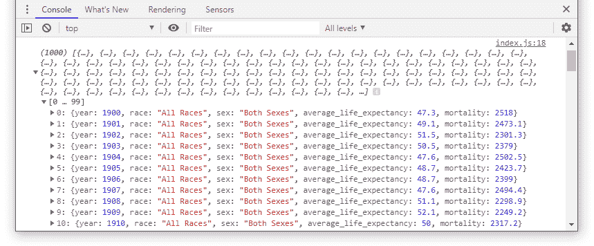

CSV data converted to JSON using JSC.csv2Json() utility function

控制台显示 1062 条记录的数组。这是其中一项记录:

```
{year: 1900, race: "All Races", sex: "Both Sexes", average_life_expectancy: 47.3, mortality: 2518}
```

？**注意:**控制台可以显示阵列和要检查的对象，并且您可以展开和折叠控制台中的部分以浏览详细信息。

属性名`average_life_expectancy`有点长，但是您将需要使用它。为了避免多次输入，定义一个常量变量来存储这个名称。当你需要使用这个属性的时候，你可以只写变量名`lifeExp`。它将看起来像这个`row[lifeExp]`而不是`row.average_life_expectancy`。

在`csvToSeries()`函数的顶部添加这一行。

```
function csvToSeries(text) {
	const lifeExp = 'average_life_expectancy';
	...
```

您可以使用简单的普通 JavaScript 来处理这些数据。我们想要的最终结果是两个数据点序列，每个数据点包含一年和预期寿命。

用以下代码更新`csvToSeries()`:

```
function csvToSeries(text) {
	const lifeExp = 'average_life_expectancy';
	let dataAsJson = JSC.csv2Json(text);
	let male = [], female = [];
	dataAsJson.forEach(function (row) {
		 //add either to male, female, or discard.
		console.log(row);
	});
}
```

它定义了男性和女性数据点的数组。然后它调用数组`dataAsJson.forEach()`函数，传递一个回调函数`function(row){...}`作为参数。`forEach()`函数将对`dataAsJson`数组中的每一项执行回调函数。现在我们将只在回调函数遇到的每一行上调用`console.log(row)`。

刷新浏览器并检查控制台输出。

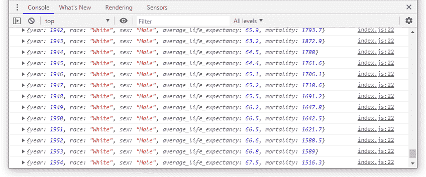

Each row object the callback function encountered

让我们添加一些逻辑来过滤我们想要的数据，并在控制台窗口中记录结果。用此代码替换`csvToSeries()`功能。

```
function csvToSeries(text) {
	const lifeExp = 'average_life_expectancy';
	let dataAsJson = JSC.csv2Json(text);
	let male = [], female = [];
	dataAsJson.forEach(function (row) {
		 //add either to male, female, or discard.
		if (row.race === 'All Races') {
			if (row.sex === 'Male') {
				male.push({x: row.year, y: row[lifeExp]});
			} else if (row.sex === 'Female') {
				female.push({x: row.year, y: row[lifeExp]});
			}
		}
	});
    console.log([male, female]);
}
```

在回调函数中，您决定该行是否是感兴趣的并使用它，否则就丢弃它。

```
if (row.race === 'All Races') {
	if (row.sex === 'Male') {
		//add data to male array
		male.push({x: row.year, y: row[lifeExp]});
	} else if (row.sex === 'Female') {
		//add data to female array
		female.push({x: row.year, y: row[lifeExp]});
	}
}
```

该逻辑检查以查看`row.race`值是否等于“所有比赛”。如果是，那么它检查`row.sex`属性是否等于“男性”或“女性”。如果该行等于其中之一，它将数据作为一个`{x, y}`点对象添加到`male`或`female`数组中。注意上面定义的`lifeExp`变量的使用，它有助于缩短这段代码。

最后，您使用`console.log([male, female])`将男性和女性变量传递到控制台进行检查，并确保您的代码按预期工作。

刷新浏览器后，控制台显示两个数组的结果，每个数组包含 118 个数据点，时间跨度从 1900 年到 2017 年。

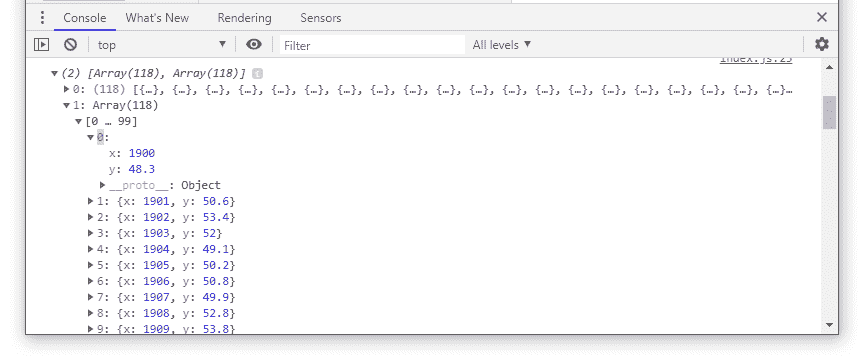

The male and female point arrays

最后，不要将结果传递给控制台，而是将这些数据点包装在两个系列的数组中，图表可以直接使用并返回它们。

将这段代码添加到`csvToSeries()`函数的末尾:

```
return [
   {name: 'Male', points: male},
   {name: 'Female', points: female}
];
```

如果返回值被发送到控制台，就会产生这个结果。

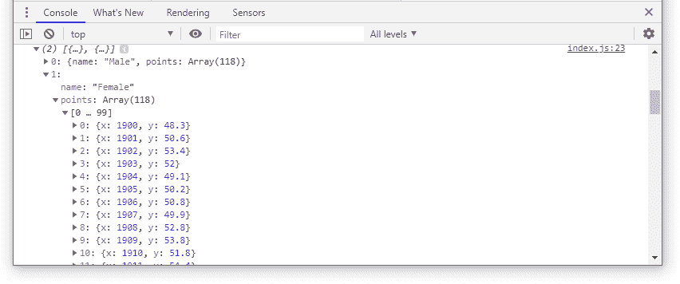

Two series objects the chart can consume directly

如您所见，过滤行的逻辑相当简单，您可以对其进行调整，以便从该数据集中获得其他细节。

要了解更多关于使用 JSCharting 实用程序处理 CSV 文件的信息，请参见本[教程](https://jscharting.com/tutorials/js-chart-data/client-side/fetch-csv-and-json/)。当您准备好进行更高级的数据处理时，可以使用 [JSC.nest()实用程序](https://jscharting.com/tutorials/js-chart-data/client-side/data-nesting/)用很少的代码从 JSON 数据中创建系列和点。

[**step3-b.zip**](https://github.com/arthurPuszynski/first-chart-article/raw/master/zips/step3-b.zip)

## 第四步——把所有东西放在一起

数据处理部分是最困难的一步，但仅此一步就能让您从任何 CSV 文件中操作和提取感兴趣的数据。这是所有事情汇集在一起的地方，也是你会有成就感的地方。

首先在`index.js`文件的末尾添加一个`renderChart()`函数。您将把系列数据作为参数传递给这个函数。

```
function renderChart(series){
   JSC.Chart('chartDiv', {
      series: series
   });
}
```

在调用`csvToSeries()`的`then()`参数函数中，将序列结果传递给`renderChart()`函数，以查看它在浏览器中绘制了什么。

```
.then(function (text) {
	let series = csvToSeries(text);
	renderChart(series);
})
```

**[step 4-a . zip](https://github.com/arthurPuszynski/first-chart-article/raw/master/zips/step4-a.zip)**

现在，刷新浏览器。您应该会看到这个图表，它使用了您在上一节中处理的 CSV 数据。太棒了。？


Line chart showing filtered CSV data

哇，1918 年发生了什么？那里的预期寿命显著下降。根据维基百科，曾有一次涉及 H1N1 病毒的疫情流感，导致世界人口的一部分死亡。这一不幸的事件表明，可视化数据如何提供了您通常无法从仅仅查看数字中获得的洞察力。

您使用默认的线条系列类型创建了一个图表，它看起来不错，但您可以进行一些调整和微调来进一步改进它。

首先，在顶部添加一个标题来解释查看者正在查看的内容，并在图表底部添加注释来说明数据源。更新`JSC.Chart()`构造函数以传递以下选项:

```
function renderChart(series){
	JSC.Chart('chartDiv', {
		title_label_text: 'Life Expectancy in the United States',
		annotations: [{
			label_text: 'Source: National Center for Health Statistics',
			position: 'bottom left'
		}],
		series: series
	});
} 
```

刷新浏览器时，您可以看到更新的图表。

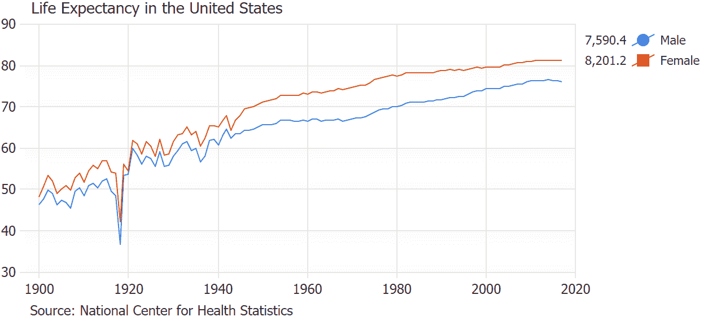

Line chart with title and annotation for attribution

您添加了带有标签文本和位置设置的注释。我们也可以为标题使用另一个注释，但是在这个例子中使用标题标签更容易。

使用`'top right'`或`'inside bottom right'`这样的值很容易控制注释位置。`'inside'`值意味着注释放置在绘制数据的图表区域内。这个[箱位图表示例](https://jscharting.com/examples/chart-features/annotation/box-positions/)演示了所有的位置设置选项。

图例显示了每个系列的点值的总和，但该总和对于该数据集并不重要。通过使用此设置，您可以减少图例列，使其仅显示图标和系列名称:

```
legend_template: '%icon,%name'
```

但是你并不真的需要使用一个传说。简单地标记线条本身会更干净。您可以禁用图例，并告诉图表使用以下图表选项将系列名称写在每个线条系列的最后一点上:

```
legend_visible: false,
defaultSeries_lastPoint_label_text: '<b>%seriesName</b>', 
```


Line chart using point labels instead of a legend

`'%seriesname'`标记是众多[点相关标记](https://jscharting.com/tutorials/js-chart-labels/token-reference/#point-tokens)中的一个，可在任何点标签文本中使用，以显示点的详细信息和计算。

最后，让我们启用 x 轴十字准线组合工具提示来显示任何给定年份的男性和女性预期寿命。在移动设备上，您可以轻按图表来查看十字准线工具提示。使用 PC 时，当鼠标指针悬停在图表上时会显示工具提示。

```
xAxis_crosshair_enabled: true,
```

您可能想知道，属性名中的下划线是怎么回事？这不是实际的属性名。这是一种简写方式:

```
xAxis: {crosshair: {enabled: true}},
```

您可能会发现用下划线指定设置更方便，JSCharting 会理解您的意思。

默认的工具提示文本是清楚的，但是让我们稍微定制一下，使它成为我们自己的。


Default combined tooltip

由于十字准线工具提示显示关于它穿过的每个点的信息，工具提示文本在点选项中定义。`defaultPoint`属性定义了所有点将自动继承的点选项。

```
defaultPoint_tooltip: '%seriesName <b>%yValue</b> years',
```

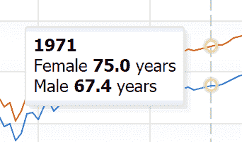

Customized combined tooltip

关于这个功能的更多信息，请查看[十字准线和组合工具提示教程](https://jscharting.com/tutorials/js-chart-interactivity/crosshair-combined-tooltip/)。

当您应用所有这些选项时，您的代码将类似于下面的代码片段。用这段代码替换整个`renderChart()`函数。

```
function renderChart(series){
	JSC.Chart('chartDiv', {
		title_label_text: 'Life Expectancy in the United States',
		annotations: [{
			label_text: 'Source: National Center for Health Statistics',
			position: 'bottom left'
		}],
        legend_visible: false,
		defaultSeries_lastPoint_label_text: '<b>%seriesName</b>',
		defaultPoint_tooltip: '%seriesName <b>%yValue</b> years',
		xAxis_crosshair_enabled: true,
		series: series
	});
} 
```

再次刷新浏览器窗口。

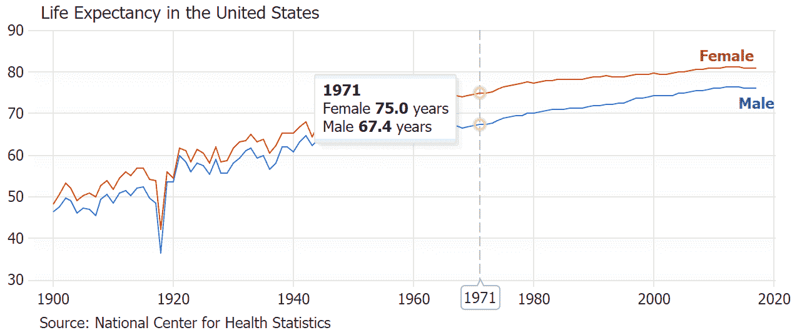

Line chart with crosshairs and customized combined tooltips

你做到了！


Source: giphy.com

首先，您使用原生 JavaScript 获取 CSV 数据。然后将它转换成 JSON 格式，并将数据过滤成两个序列。对于这些系列，您使用 JSCharting 创建了一个漂亮的交互式折线图，并将其配置为看起来很专业。

您可以进一步自定义和调整图表，以满足您的特定需求。访问 JSCharting [教程](https://jscharting.com/tutorials/)部分以了解关于特定主题的更多信息，或者在[示例库](https://jscharting.com/examples/chart-types/)中找到与您想要制作的图表相似的图表，并复制它们以继续您的数据可视化之旅。

如果您在使用 JSCharting 时遇到问题，请随时[联系](https://jscharting.com/support.htm)支持团队。他们会很乐意指导你或帮助解决你可能遇到的任何问题。

## 奖金挑战

我们没有使用该 CSV 文件中的所有可用数据。为了好玩和练习，我们来试验一下吧。

用你所学的知识制作这张图表。

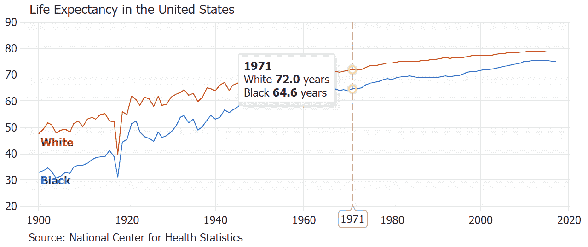

Challenge: Replicate this chart on your own

这个 zip 文件包含了答案:

**[step5-bonus.zip](https://github.com/arthurPuszynski/first-chart-article/raw/master/zips/step5-bonus.zip)**

你能想到用这些数据制作其他图表吗？坚持尝试，享受其中的每一分钟！*