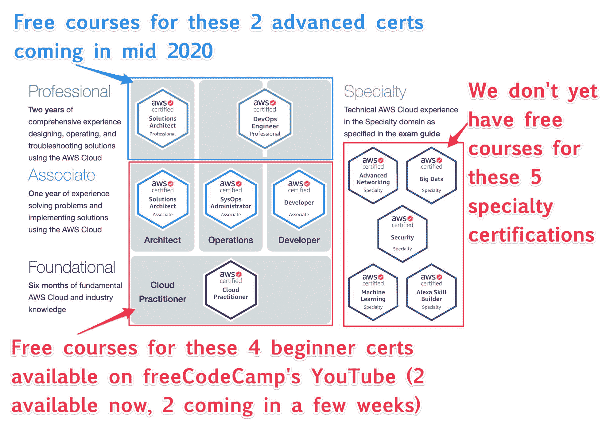

# 介绍 AWS 认证挑战:通向您的第一个 AWS 认证之路

> 原文：<https://www.freecodecamp.org/news/awscertified-challenge-free-path-aws-cloud-certifications/>

你可能已经知道亚马逊网络服务(AWS)是最大、最老、最受欢迎的云服务提供商。但是你知道他们也提供专业认证吗？

这些 AWS 云认证直接来自亚马逊本身。获得这些证书的考试相当具有挑战性，但它们会对你的简历和履历产生影响。他们可以帮助您在各种新兴的云角色中指导您的职业生涯，如开发运维或站点可靠性工程。

使用云(基本上就是其他人的电脑的集合)的一大优势是，你不再需要购买自己的服务器并接入互联网。

相反，你可以在云中租用虚拟服务器，并在其上运行你的应用程序。截至 2020 年，大多数公司都是这样做的。

当您完成这项挑战时，您将成为 AWS 认证的云从业者。您还将获得至少一项助理级 AWS 认证。如果你准备好了，你可能会有一个梦寐以求的专业级认证或者专业认证。

这至少需要三种认证——每一种都有自己严格的考试程序。

首先，你应该知道 AWS 收取考试费来参加这些考试并获得认证。(每次测试的费用是 100 到 300 美元。更多细节见下文。)

但是除了那些考试费，你不用花一分钱准备考试。这怎么可能呢？因为 freeCodeCamp 在我们的 YouTube 频道上有几十个小时的免费 AWS 认证预备课程。就是这样。

我的朋友兼《星际迷航》粉丝安德鲁·布朗为这些认证设计了全程课程。他的公司 ExamPro 慷慨地将这些免费提供给全世界的开发者。

我会链接到下面的视频。但首先，这里是挑战的规则，如果你选择接受它。

## # AWS 认证挑战赛的规则

1.  在推特上发布一张你竖起大拇指的照片，并宣布你将参加# AWS 认证挑战。
2.  每天至少用#AWSCertified 标签发一次关于你的进步和你学到了什么或做了什么的微博。
3.  每天，给至少另外两个使用#AWSCertified 标签的人回复鼓励。
4.  每次你获得认证，打印出来，摆个姿势，然后在推特上发布一张胜利的照片。

就是这样。与#100DaysOfCode 不同，本次挑战没有设定结束日期。当它结束的时候就结束了，如果你每天都在为你的证书而努力，那应该只有几个月的时间。

注意 AWS 对每个认证都有推荐的工作经验。当你看到 AWS 提到“两年使用 AWS 云设计、操作和故障排除解决方案的全面经验”时，不要担心这些只是建议。

如果你知道的足够多，可以通过测试，你就可以获得认证——即使你还没有做过使用 AWS 的专业项目。

## AWS 提供哪些认证？

AWS 总共提供 12 种认证。这是测试的细目分类，费用以及认证的有效期。

A chart showing all 12 AWS certifications. (Since the time that AWS made this chart, the've broken down the "Big Data" certification into 2 specialty certifications - Database and Analytics). We explain each of these in much more detail later in this article.

# 云计算为新开发人员创造了大量机会

过去十年云服务的兴起改变了开发者构建和运行网络应用的方式。

由于 2020 年几乎每个应用都是 web 应用或有重要的 web 应用组件，你可以说云计算已经改变了软件开发本身的性质。

大多数新公司都是“云原生的”——这意味着他们完全放弃数据中心，只使用像 AWS 这样的云服务。

一些大公司和政府仍在运营他们自己的数据中心。但其中大多数也采用混合模式，将数据中心连接到云。

云计算的兴起创造了各种新的技术角色，称为“云角色”。这些角色可能不太依赖于传统的计算机科学基础。相反，他们更关注配置、组合和维护云服务，以创建有凝聚力的产品和服务。

这些新角色为软件开发和系统管理职业创造了几个新的切入点。

在本文中，我将深入探讨各种专注于云的开发人员角色，以便您可以选择最适合您的背景和兴趣的角色。

我将在此介绍的角色有:

*   解决方案架构师
*   云工程师
*   系统运行管理员
*   DevOps 管理
*   现场可靠性工程师(SRE)
*   数据科学家
*   数据工程师
*   数据分析师
*   安全工程师

我还将为每个角色推荐一个认证途径。我会解释每个认证考试的费用。

另外，由于这是免费代码营——你的免费学习资源之杯在这里溢出——我将为你链接到这些考试的大量免费深入课程。

让我们开始吧。

# 解释了 AWS 认证解决方案架构师角色

截至 2020 年，AWS 拥有超过 150 种不同的云服务——数量之多，甚至连资深开发者都不知道。

解决方案架构师的工作是对这些核心 AWS 服务有广泛的了解，并不断了解新服务的出现，以及如何将它们用于业务目的。

解决方案架构师并不总是负责实现他们自己的解决方案。但是他们确实收集研究成果并向他们的团队提出想法。

在我将在这里讨论的所有角色中，解决方案架构师角色是需要最少编程知识的角色。

如果你喜欢战略、计划和解决问题，你会喜欢解决方案架构师这个角色。

如果您不知道从哪里开始您的职业生涯，解决方案架构师认证可以让您最广泛地接触云概念，以便您可以从那里进一步专业化。

## 成为 AWS 认证解决方案架构师的推荐认证途径

1.  AWS 认证云从业者(100 美元考试)
2.  AWS 解决方案架构师助理(150 美元考试)
3.  AWS 解决方案架构师专业人员(300 美元考试)

# AWS 认证云工程师角色解释

云工程师是一个更普遍的角色。它包含了与 web 开发人员相同的责任，但是更强调利用云服务。

云工程师更关注开发者解决方案的实现细节，而不是基础设施解决方案。云工程师通常不负责设置服务器或网络。(这些都是由 SysOps 处理的——我将在下面解释这个角色)。

在我今天要介绍的所有角色中，云工程师是需要最多编程知识的角色。

## 成为 AWS 认证云工程师的推荐认证途径

1.  AWS 认证云从业者(100 美元考试)
2.  AWS 认证开发人员助理(150 美元考试)

# AWS 认证 SysOps 管理员角色说明

SysOps(系统运营)角色包括维护现有的云基础架构。SysOps 管理员修补、监控和压力测试服务器。

SysOps 管理员还负责对发生的事件做出反应。因此，如果一个网络服务器在半夜关闭，而你是值班的系统操作员，你将是第一个醒来修理它的人。:)

SysOps 角色通常被视为成为一名成熟的 DevOps 工程师的第一步(开发人员操作——我将在下面解释)。

SysOps 角色要求您具备深厚的基础架构知识。你需要知道服务器和网络是如何工作的。你还需要熟悉 Linux(也许还有 Unix 或 Windows)之类的操作系统。

这个角色不需要太多的脚本知识。

## 成为 AWS 认证系统管理员的推荐认证途径

1.  AWS 认证云从业者(100 美元考试)
2.  AWS 系统操作管理员(150 美元考试)

# AWS 认证 DevOps 管理员角色说明

DevOps(开发人员运营)角色包括使用代码实现基础设施自动化。DevOps 管理员帮助他们的组织最大限度地降低基础架构成本。

例如，一个 DevOps 管理员可能会写一个脚本，在高峰时间旋转额外的服务器，然后在业务缓慢时旋转这些服务器以节省资金。

DevOps 是一个积极主动的角色。他们正在努力减少系统管理员维护基础设施所需的工作量。

DevOps 角色既需要丰富的基础设施知识，也需要丰富的脚本知识。

## 成为 AWS 认证 DevOps 的推荐认证途径:

1.  AWS 认证云从业者(100 美元考试)
2.  AWS 系统操作管理员(150 美元考试)
3.  AWS DevOps 专业版(300 美元考试)
4.  AWS 高级网络专业(300 美元考试)

# 解释了 AWS 认证现场可靠性工程师的角色

站点可靠性工程师(SRE)的职责主要是实施灾难恢复、容错和高可用性策略。SRE 还致力于提高团队中开发人员和基础设施本身的性能。

SRE 扮演着积极主动的角色，以确保一切顺利进行。它需要广泛的知识。

## 成为现场可靠性工程师的推荐认证途径

1.  AWS 认证云从业者(100 美元考试)
2.  AWS 开发人员助理(150 美元考试)
3.  AWS 解决方案架构师助理(150 美元考试)
4.  AWS 系统操作管理员(150 美元考试)

# 解释了 AWS 认证数据科学家角色

数据科学家的角色包括尝试预测未来。

数据科学家使用统计学、机器学习和其他学术知识来帮助创建自动化的数据驱动的业务解决方案。这是一个更被动的角色。

诚然，数据科学家的角色传统上需要学术背景，许多数据科学家拥有博士学位和广泛的数学培训。

这就是说，许多雇主对数据科学家的需求如此之大，以至于仅仅能够使用简单的机器学习解决方案就足以帮助你获得这份工作。

您还可以找到使用托管机器学习服务的数据科学角色。

如果你不害怕数学，并希望与大数据打交道，这个角色可能非常适合你。

## 成为数据科学家的推荐认证途径

1.  AWS 认证云从业者(100 美元考试)
2.  AWS 解决方案架构师助理(150 美元考试)
3.  AWS 数据库专业(300 美元考试)
4.  AWS 分析专业(300 美元考试)

# AWS 认证数据工程师角色解释

当数据科学家创建一个数据解决方案时，他们正在构建一个不一定可扩展的原型。这就是数据工程师的用武之地。

数据工程师的角色是将该解决方案包装在可大规模运行的基础设施中。

数据工程师必须考虑如何移动和存储数据。他们需要深入了解如何配置和扩展数据库和消息传递系统。他们还需要了解如何无缝集成不同的 API。

如果你想处理大数据和大规模基础设施，但又不想学习太多数学和领域专业知识，那么数据工程师是理想的角色。

## 成为数据工程师的推荐认证途径

1.  AWS 认证云从业者(100 美元考试)
2.  AWS 开发人员助理(150 美元考试)
3.  AWS DevOps 专业版(300 美元考试)
4.  AWS 数据库专业(300 美元考试)

# AWS 认证数据分析师角色解释

数据分析师角色包括分析数据和创建数据可视化。

数据分析师是数据的管理者。他们是复杂 SQL 查询的大师。他们可以使用企业级商业智能工具。或者他们可以使用现成的 JavaScript 框架来拼凑他们的可视化。

如果你没有扎实的数学基础，但确实知道一点关于 web 开发的知识，并且希望从事大数据工作，那么数据分析师的角色可能非常适合你。

## 成为数据分析师的推荐认证途径

1.  AWS 认证云从业者(100 美元考试)
2.  AWS 开发人员助理(150 美元考试)
3.  AWS 数据库专业(300 美元考试)
4.  AWS 分析专业(300 美元考试)

# AWS 认证安全工程师角色解释

随着真正的大数据在过去十年的兴起，安全漏洞可能会产生巨大的影响。似乎每个月我们都会听到一些公司被黑客攻击，数百万用户记录暴露给黑客。

即使是小公司和当地非营利组织也不得不担心安全问题。云计算引入了更多的安全考虑，所以在这个领域有很多新的就业机会。

网络安全领域也有各种各样的专业化。我可以写一整篇关于这些专门化的文章，至少和这篇文章一样长。

但是，如果你想成为一名从事云服务的安全工程师，这里有一个合理的起点。

## 成为安全工程师的推荐认证途径

1.  AWS 认证云从业者(100 美元考试)
2.  AWS 解决方案架构师助理(150 美元考试)
3.  AWS 安全专业(300 美元考试)

# 云认证的兴起

10 年前，科技行业的大多数认证都没有受到重视。其中一些原因是因为混淆了什么是“认证”而不仅仅是“证书”。(不同之处在于——在周末研讨会结束时，讲师可能会向您颁发*证书*，但您必须努力学习并通过某种评估，才能获得*认证*。)

AWS 提高了开发者认证的声誉。他们通过直接认证每个人，并在自己的服务器上提供经过验证的认证来做到这一点。

这些 AWS 认证已经是出了名的具有挑战性，AWS 每个季度都会用新的问题更新他们的考试，让开发人员保持警觉。AWS 还通过监考中心严格监控考生。(没错——你必须亲自去考点报到才能参加这些考试。)

# 我没有云经验。我如何开始？

如果你是第一次学习云服务，你肯定想从认证云从业者课程开始。它教给你所有你需要的基础知识，并给你 AWS 平台的实践经验。

这也是一个很好的自信助推器。你只需学习 10 个小时左右就能通过考试。所以你可以在一周内通过 AWS 认证。

以下是免费且无广告的完整课程，来自 freeCodeCamp 的 YouTube 频道:

另外，一定要加入 freeCodeCamp 的[# AWS certified Discord channel](https://discord.gg/nfwweUG)来提问并获得帮助。

# 我为什么要学习 AWS 而不是其他云服务提供商？

“三大”云服务提供商都有类似的产品。您可以很容易地将您为 AWS 学习的概念转移到其他平台上。(如果您想知道，除了 AWS，还有微软 Azure 和谷歌云平台。)

学习云计算时，选择 AWS 作为您的主要云服务提供商是有优势的。

## AWS 优势#1:最广泛的工具

自 21 世纪初以来，AWS 的历史最长。他们拥有最大的云服务产品库，超过 150 种服务。所以先学习 AWS 会让你接触到最广泛的云工具。

## AWS 优势 2:良好的学生支持

像亚马逊一样，AWS 非常重视客户支持。你可以每月向 AWS 支付 30 美元，以获得他们的支持计划，在那里你可以通过电子邮件向他们提问，他们会帮助你摆脱困境。这可以帮助你加速学习，让你不会停滞太久。

AWS 也有大量的技术文档——可以说比谷歌或微软的更全面。仅仅通过阅读 AWS 的官方文档和技术白皮书，就有可能通过许多 AWS 认证考试。(同样，我们为这些考试提供免费的深入课程，因此您可能不必太依赖这些文档。)

## AWS 优势#3:更多的雇主使用 AWS，因此就业市场更大

也许首先获得 AWS 认证最重要的优势是超过 50%的财富 500 强公司和许多政府使用 AWS。因此，在微软和谷歌占领更多市场之前，AWS 认证提供了最有潜力的就业机会。

# 三大巨头之外的其他云服务提供商

在工作中，您可能会遇到一些云提供商领域的新人。我不建议专门学习这些来获得认证，但是知道这些是有好处的。

几年前，IBM 推出了自己广泛的云服务，但可能已经停滞不前。随着沃森和其他人工智能项目的出现，他们似乎正在更多地投资于机器学习。

阿里云是亚洲的 AWS。就像 AWS 一样，它提供广泛的服务。理论上，如果你知道如何使用 AWS，你也可以使用阿里云。如果你是在中国读到这篇文章的，我鼓励你看看阿里云的工具和认证。否则，我建议关注三大巨头，因为它们在国际上应用更广泛。

Netlify 是三大云提供商之上的一个抽象层。它不完全是云服务提供商。但它确实有一个易于使用的界面，可以轻松地跨云进行托管、部署和无服务器。

Digital Ocean 和 Linode 最初都是主机服务提供商，现在都增加了一些额外的服务，比如负载平衡和自动备份。如果你学会了如何使用三大软件中的一个，你可以很容易地使用 Linode 和 Digital Ocean。它们使用起来简单多了。

Heroku 不是云服务提供商，而是平台即服务(PaaS)。Heroku 将你的云基础设施抽象化，这样你就可以更容易地部署你的 web 应用。如果你的目标是成为一名全栈开发人员，Heroku 可以让你专注于编码部分。大多数公司很快就超越了 Heroku，因为它在规模上变得非常昂贵。

# 所有 11 个 AWS 认证的细目分类

11 项认证中的每一项都属于四个类别中的一个，其中一些比另一些更难。

*   基础-简单
*   助理-努力
*   职业-黑暗灵魂努力
*   专业-各不相同

## 基础层

基础层只有一个 AWS 认证，即 AWS 认证云从业者(CCP)。

这将为您提供 AWS 上可用的主要工具的坚实基础。它还将教你关于安全的重要概念，使用 AWS 的界面，以及它的计费如何工作。

不管你想如何专业化，你的云计算之旅都应该从获得 CCP 开始。

## 员工层

在员工层有三种 AWS 认证，它们是:

*   解决方案架构师助理
*   SysOps 管理员助理
*   开发人员助理

如果你喜欢从事操作系统、基础设施和网络方面的工作，那么你会希望获得 SysOps 管理员助理资格。

如果您更关注产品管理、业务和问题解决，您将希望获得解决方案架构师助理。

如果您喜欢编程，并且有全栈开发人员的背景，那么您会希望获得开发人员助理资格。

## 专业层

专业级有两种 AWS 认证:

*   专业解决方案架构师
*   DevOps 专业工程师

如果您是一名开发人员，准备迎接人生中最艰难的认证挑战之一，那么就应该获得解决方案架构师专家资格。

如果你对软件开发不太感兴趣，而对构建基础设施更感兴趣，那么就去获得 DevOps 工程师专业证书。

## 专业认证

专业层有 6 种 AWS 认证:

*   高级网络
*   安全性
*   机器学习
*   分析学
*   数据库
*   Alexa 技能生成器

所有这些考试都很难，除了 Alexa 技能生成器。

这些专业认证中最难的是机器学习专业，因为它要求你在机器学习方面有很扎实的理论基础。

# 获得 AWS 认证会让我被录用吗？

不要认为 AWS 认证是一份“有保障的工作”，而是从增加你的机会的角度来考虑。这里有两个例子，它们增加了你找到工作的机会(也增加了你潜在的赚钱能力):

## 案例 1:认证要求出现在招聘信息中

在旧金山和多伦多等更大的科技中心，招聘信息的“优先要求”部分越来越多地提到云认证。所以一个或多个 AWS 认证真的能帮你脱颖而出。

## 案例 2:APN 激励机制雇佣 AWS 认证持有人

亚马逊合作伙伴网络(APN)是由 AWS 运营的全球合作伙伴计划。雇主加入 APN 是为了能够:

*   与其他 APN 会员一起获得更多商机
*   参加会议和其他营销活动(线上和线下)
*   获得 AWS 积分
*   接受专门培训

一家公司要想继续成为 APN 的一部分，就必须雇佣一定数量的不同层级的 AWS 认证员工。

有数百家公司是 APN 的一部分，如:德勤、奥尼察、DataDog、思杰、Autodesk、TrendMicro、Atlassian、Github、英特尔、VMWare、New Relic、思科、DataBricks、Akamai 和 Redhat。

如果你拥有 AWS 认证等级(基础、助理、专业、专业)的组合，你可以增加你在这些雇主的工作入围的机会。

# 获得云角色不需要认证

不要因为没有 AWS 认证就取消自己做云角色的资格。例如，AWS 本身经常雇佣没有任何 AWS 认证的人。获得 AWS 认证和能够胜任工作是两回事。

没有实践经验，很难通过专业或专业级 AWS 认证。但是，如果你能获得这些证书，它们向雇主强烈表明你能在这份工作中取得成功。

此外，即使你不在乎成为 AWS 认证，你仍然会受益于通过免费课程。云并不会消失。妖怪已经从瓶子里出来了，2020 年的每个开发者都应该明白它是如何工作的——即使是在抽象的层面上。

# 获得 AWS 认证能让我在美国或加拿大找到工作吗？

这取决于地缘政治、签证法和当地经济等诸多因素。但是我可以说，获得 AWS 认证可以增加你在国外被雇佣的几率。

有专门招聘云计算职位的招聘公司。

例如，Vanhack 在全球范围内发现有才华的开发人员——比如来自印度或巴西的——并帮助他们迁移到美国或加拿大。对于云角色，他们专门安排 DevOps 工程师和站点可靠性工程师。

Jefferson Frank 是 AWS 招聘方面的全球专家。如果你持有 AWS 专业级认证或者专业认证，并且有大约 10 年的工作经验，那么你很有可能被他们录用。

开发运维工程师和站点可靠性工程师角色是最常见的外包云角色。因此，如果你希望能够在自己的国家工作，你可能希望专注于其中一个角色。

由于解决方案架构师角色需要大量的面对面交流，因此它通常是一个办公室或出差的角色。

# 我需要学习多长时间才能获得 AWS 认证？

对于每项认证，AWS 都在考试学习指南中列出了推荐的经验量。他们会说:“两年使用 AWS 云设计、操作和故障排除解决方案的全面经验。”

这只是一个建议。在实践中，许多人在几个月内通过这些认证考试，并且没有任何专业经验。

以下是我们通常从刚去世的人那里听到的内容:

## 获得 AWS 认证云从业者需要多长时间？

有些人只学了 4-10 个小时就通过了。大多数人在 1 周内通过，但有些人需要长达 3 周。这在很大程度上取决于你以前有多少技术经验。

## 获得 AWS 助理认证需要多长时间？

这些助理级认证通常需要 1 到 3 个月的学习时间。

解决方案架构师助理是最容易学习的，因为它需要的实践知识最少。大部分测试都是理论，你可以从 freeCodeCamp 的 YouTube 频道上的这些免费 ExamPro 课程中学到。

如果在获得解决方案架构师助理资格后，您继续学习开发人员助理资格或系统操作员助理资格，那么大约 50%的考试将是您以前学过的内容，从而节省您进一步学习的时间。

开发助理是目前最难通过的，因为它需要处理更多的编程和实践知识。

人们相隔几周通过全部三个助理级考试并不罕见。

有时，人们会希望通过所有的联营公司，以准备一个专业。

如果你可以直接跳到专业级并通过考试，那么获得所有的助理认证就没有什么意义了。但是请记住:专业级考试至少比助理级考试难 10 倍。

获得助理级认证反而可以作为开始找工作的起点。一旦你有了一些工作经验，你随时可以回来获得专业级认证。

## 专业级认证

专业级认证相当难。大多数人在完成所有问题之前就没有时间了。

这些考试有许多正确答案，但对于每个问题，你必须选择最佳答案。

如果你还没有在一家可以获得使用 AWS 的实践经验的公司工作，你可能需要学习大约 6 个月才能为这些专业级考试做好准备。

# 专业认证

专业认证没有专业级认证那么难。

Alexa 技能生成器很容易，但当你考虑它时，它比其他认证价格高了一点。很多人没有获得认证。

其他专业认证可能需要 2 到 4 个月的学习。

# 获得 AWS 认证需要多少钱？

AWS 创建考试问题。两个合作的考试中心网络(PSI 和 Pearson Vue)在他们的一个办公室管理考试本身。

参加认证考试是要花钱的。

*   认证云从业者考试费用为 100 美元。
*   助理级认证考试的费用为 150 美元。
*   专业级和专业认证每次考试的费用是 150 美元。

# 有没有节省认证考试费用的方法？

是的。如果你通过了一次考试，你在下一次考试中可以得到一半的优惠。因此，如果你通过了 CCP，然后你参加了解决方案架构师助理，它只需要 75 美元，而不是通常的 150 美元。

# 认证的有效期有多长？

当你通过了一个 AWS 认证考试，有效期只有 3 年才失效。

当人们获得专业级证书时，他们很少会去更新副级证书。这是因为一旦你持有专业级证书，你不再需要证明你能通过更简单的考试。

# 使用 AWS 需要信用卡吗？

是的，你有。你需要一张信用卡来创建一个账户。所有云服务提供商都是如此。

你还需要一张信用卡来注册认证考试。

或许可以使用预付费信用或虚拟信用卡应用程序来创建您的 AWS 帐户并支付考试费用。

请注意，如果您来自受到美国制裁的国家，您可能无法创建 AWS 帐户或参加考试。如果这种情况适用于你，你可以考虑看看阿里云或其他国际供应商。

# 如果我在 AWS 的免费层，AWS 会从我的信用卡中收费吗？

AWS 可能会通过一次性收取不到一美元的小额费用来验证您的卡，因此要小心国际交易成本。

AWS 附带了几个月的免费层。只要你没有超过它的限制，或者在免费期结束后继续使用它，你就不会看到 AWS 对你的信用卡收取任何费用。

# 云角色的人赚多少钱？

这取决于你在哪个国家，以及你是如何专业化的。偏远的机会往往报酬较低。开发运维工程师和站点可靠性工程师是薪酬最高的远程工作之一。

这里有一个例子:

> 我作为一名全职员工(编写代码，个人贡献者)从科技职业生涯中获得的全部收入进展:
> 
> 2008 年:2.5 万欧元
> 2009 年:3 万欧元
> 2010 年:5.5 万欧元
> 2011 年:7.5 万欧元
> 2012 年:12 万美元
> 2013 年:15.5 万美元
> 2014 年:18.6 万美元
> 2015 年:23 万美元
> 
> — Daniel Vassallo (@dvassallo) [August 23, 2019](https://twitter.com/dvassallo/status/1164778970778259458?ref_src=twsrc%5Etfw)