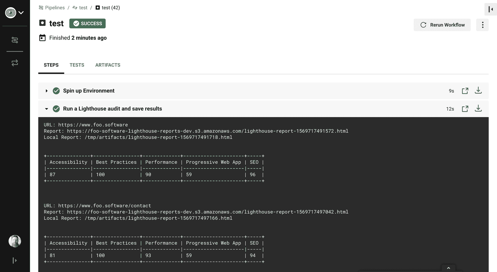
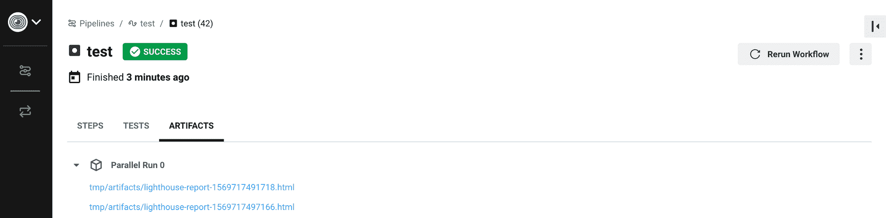
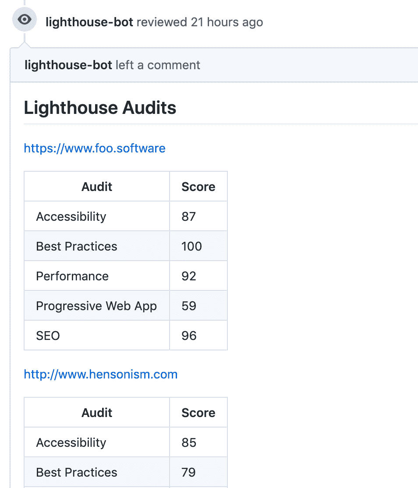
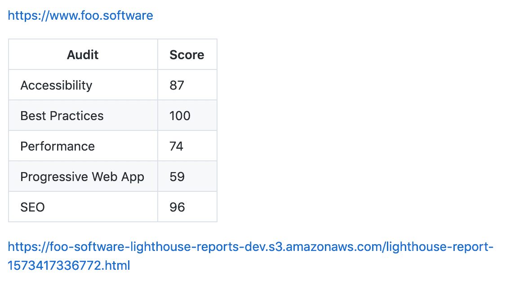
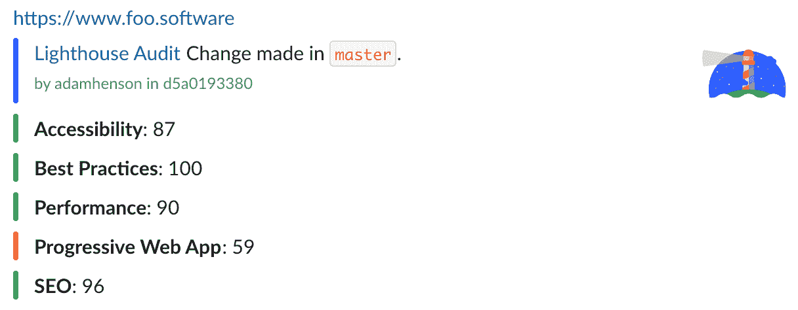

# 如何在 CircleCI 使用 Lighthouse

> 原文：<https://www.freecodecamp.org/news/how-to-use-lighthouse-in-circleci/>

CircleCI 是编排 CI/CD 管道的流行工具。Lighthouse 是 Google 的一个开源项目，用于提高网页质量。它提供了以用户为中心的指标来审核 SEO、性能、可访问性、最佳实践和渐进式 web 应用。

要深入了解 Lighthouse，你可以阅读“[如何使用 Lighthouse](https://www.freecodecamp.org/news/three-ways-to-analyze-website-performance-with-lighthouse-8d100966c04b/) 分析网站性能”。

通过结合这些力量，我们可以建立网站质量自动化。这篇文章将展示以下内容:

*   CircleCI 工作流中 Lighthouse 的基本实现。
*   在拉式请求注释中显示 Lighthouse 结果的高级设置。
*   S3 灯塔报告上传。
*   延期通知。

# 灯塔检查圆形球

circle ci orb 是可共享的配置元素包，包括您在工作流中使用的作业、命令和执行器。这篇文章将提供一个使用[灯塔检查 CircleCI Orb](https://circleci.com/orbs/registry/orb/foo-software/lighthouse-check) 自动化灯塔审计的指南。

### 基本示例

下面是一个最小的例子，我们所需要的就是在任何代码改变时自动运行 Lighthouse？在本例中， [`https://www.foo.software`](https://www.foo.software) 和 [`https://www.foo.software/contact`](https://www.foo.software/contact) 都将被审计。

```
version: 2.1

orbs:
  lighthouse-check: foo-software/lighthouse-check@0.0.8

jobs:
  test: 
    executor: lighthouse-check/default
    steps:
      - lighthouse-check/audit:
          urls: https://www.foo.software,https://www.foo.software/contact

workflows:
  test:
    jobs:
      - test 
```

通过这个最小的设置，我们在作业的输出中提供了一个摘要。我们还有保存为 [CircleCI“工件”](https://circleci.com/docs/2.0/artifacts/)的完整 HTML 报告。



Lighthouse Check Orb output



Lighthouse Check Orb save artifacts

### 高级示例

Lighthouse Check CircleCI Orb 通过利用引擎盖下的`[lighthouse-check](https://github.com/foo-software/lighthouse-check)` [NPM 模块](https://github.com/foo-software/lighthouse-check)提供了一套完整的铃铛和哨子。我们可以用它做更多的事情。我们继续吧！

## 提取请求注释

通过利用这一特性，每次提交时，都会发布带有 Lighthouse 结果的注释。我们可以通过下面的步骤做到这一点。

1.  创建一个新用户或找到一个现有的用户作为一个“机器人”。
2.  [从该用户帐户创建个人访问令牌](https://help.github.com/en/github/authenticating-to-github/creating-a-personal-access-token-for-the-command-line)。
3.  [在您的项目](https://circleci.com/docs/2.0/env-vars/#setting-an-environment-variable-in-a-project)中创建一个 CircleCI 环境变量来保存上面的加密值。在我们的例子中，我们将其命名为`LIGHTHOUSE_CHECK_GITHUB_ACCESS_TOKEN`。
4.  用下面显示的差异更新我们的配置文件。

```
+ prCommentAccessToken: $LIGHTHOUSE_CHECK_GITHUB_ACCESS_TOKEN
+ prCommentUrl: https://api.github.com/repos/foo-software/lighthouse-check-orb/pulls/${CIRCLE_PULL_REQUEST##*/}/reviews
urls: https://www.foo.software,https://www.foo.software/contact 
```

上面的更新提供了一个令牌来授权相应的拉请求上的注释。`prCommentUrl`应该是 GitHub API 指定的[格式的端点。您的端点将是类似的，但是替换了`owner`和`repo`参数(`foo-software/lighthouse-check-orb`)。这样，我们就创建了一个 bot 来发布 pull 请求的 Lighthouse 结果？](https://developer.github.com/v3/pulls/reviews/#create-a-pull-request-review)



Lighthouse Check PR comments

## S3 报告上传

在我们的示例中，我们通过将报告作为工件上传到我们的作业中来持久化结果。这种解决方案在某些情况下可能已经足够了，但是工件并不是永久存储的。为了查看报告，我们需要导航到工作流中，并从工件视图中手动下载报告。

但是，如果我们想要一种更可靠的方式来存储和引用报告，该怎么办呢？这就是 S3 特性发挥作用的地方。我们可以按照以下步骤配置 AWS S3 存储。

1.  [如果您还没有 AWS 帐户，请创建一个帐户](https://aws.amazon.com/premiumsupport/knowledge-center/create-and-activate-aws-account/)。
2.  [创建一个 S3 存储桶](https://docs.aws.amazon.com/AmazonS3/latest/gsg/SigningUpforS3.html)如果你还没有的话。
3.  [获取 AWS 访问密钥 id 和秘密访问密钥](https://docs.aws.amazon.com/general/latest/gr/aws-sec-cred-types.html)。
4.  [为这两个值创建一个 CircleCI 环境变量](https://circleci.com/docs/2.0/env-vars/#setting-an-environment-variable-in-a-project)。在我们的例子中，我们将分别使用`LIGHTHOUSE_CHECK_AWS_ACCESS_KEY_ID`和`LIGHTHOUSE_CHECK_AWS_SECRET_ACCESS_KEY`。
5.  添加桶名和[区域](https://docs.aws.amazon.com/AWSEC2/latest/UserGuide/using-regions-availability-zones.html)(例如:`us-east-1`)作为 CircleCI 环境变量:`LIGHTHOUSE_CHECK_AWS_BUCKET`和`LIGHTHOUSE_CHECK_AWS_REGION`。

接下来，我们将使用以下差异更新我们的配置。

```
+ awsAccessKeyId: $LIGHTHOUSE_CHECK_AWS_ACCESS_KEY_ID
+ awsBucket: $LIGHTHOUSE_CHECK_AWS_BUCKET
+ awsRegion: $LIGHTHOUSE_CHECK_AWS_REGION
+ awsSecretAccessKey: $LIGHTHOUSE_CHECK_AWS_SECRET_ACCESS_KEY
prCommentUrl: https://api.github.com/repos/foo-software/lighthouse-check-orb/pulls/${CIRCLE_PULL_REQUEST##*/}/reviews 
```

在我们的下一次提交和推送中，报告将自动上传到 S3 ✅！我们的公关评论中也有他们的链接。



Lighthouse result PR comment with S3 report linked

## 时差通知

没有延迟通知的 DevOps 工作流中有什么新功能？的确很悲伤。让我们将通知添加到一个 Slack 频道，让整个团队都能看到。我们可以通过以下步骤来实现这一点。

1.  [在你的空闲工作空间中创建一个“传入 Webhook”并授权一个频道](https://api.slack.com/messaging/webhooks)。
2.  添加 Webhook URL 作为 CircleCI 环境变量— `LIGHTHOUSE_CHECK_SLACK_WEBHOOK_URL`。

```
+ slackWebhookUrl: $LIGHTHOUSE_CHECK_SLACK_WEBHOOK_URL
urls: https://www.foo.software,https://www.foo.software/contact 
```

我们的下一个提交和推送引入了松弛通知！下面屏幕截图中的“Lighthouse audit”链接导航到配置了✨的 S3 报告



Lighthouse Slack notification

此时，我们完整的“高级示例”配置如下所示。

```
usage:
  version: 2.1

  orbs:
    lighthouse-check: foo-software/lighthouse-check@0.0.8

  jobs:
    test: 
      executor: lighthouse-check/default
      steps:
        - lighthouse-check/audit:
            awsAccessKeyId: $LIGHTHOUSE_CHECK_AWS_ACCESS_KEY_ID
            awsBucket: $LIGHTHOUSE_CHECK_AWS_BUCKET
            awsRegion: $LIGHTHOUSE_CHECK_AWS_REGION
            awsSecretAccessKey: $LIGHTHOUSE_CHECK_AWS_SECRET_ACCESS_KEY
            prCommentAccessToken: $LIGHTHOUSE_CHECK_GITHUB_ACCESS_TOKEN
            prCommentUrl: https://api.github.com/repos/foo-software/lighthouse-check-orb/pulls/${CIRCLE_PULL_REQUEST##*/}/reviews
            slackWebhookUrl: $LIGHTHOUSE_CHECK_SLACK_WEBHOOK_URL
            urls: https://www.foo.software,https://www.foo.software/contact

  workflows:
    test:
      jobs:
        - test 
```

## 保持历史记录

Foo 的自动化灯塔检查工具是我们可以用来管理灯塔审计历史记录的工具。我们可以用灯塔检测球连接它！通过这样做，你可以远程运行 Lighthouse，而不是在本地的 dockerized CircleCI 环境中。有了这一点，我们可以确信我们的 Lighthouse 结果不会因为 CircleCI 基础设施的变化而变得不稳定。按照[记录的步骤连接自动灯塔检查](https://github.com/foo-software/lighthouse-check-orb#usage-automated-lighthouse-check-api)。


A historical record of Lighthouse audits with "Automated Lighthouse Check"

# 现在怎么办？

你可以在 GitHub 上找到其他 [Lighthouse Check Orb 用法的例子。我希望这篇文章对您的 DevOps 工作流程有所帮助！通过将 Lighthouse 集成到 CI/CD 管道中，我们可以保持充分的准备，以确保网站 SEO、性能、可访问性、最佳实践和渐进式 web 应用程序的高质量。](https://github.com/foo-software/lighthouse-check-orb/tree/master/src/examples)