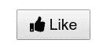
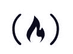
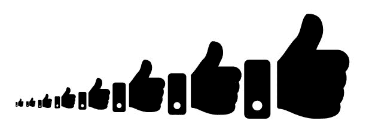

# 如何在你的按钮上添加字体很棒的图标

> 原文：<https://www.freecodecamp.org/news/how-to-add-font-awesome-icons-to-your-buttons/>

字体真棒是一个方便的图标库。这些图标可以是以`.svg`文件格式存储的矢量图形，也可以是网络字体。

这些图标被视为字体。您可以使用像素指定它们的大小，它们将采用其父 HTML 元素的字体大小。

## 基本用途

要在应用或页面中包含字体 Awesome，只需将以下代码添加到 HTML 顶部的`<head>`元素中:

```
<link rel="stylesheet" href="https://use.fontawesome.com/releases/v5.12.1/css/all.css" crossorigin="anonymous">
```

元素最初是用来使其他元素倾斜的，但是现在常用于图标。您可以将字体 Awesome 类添加到`i`元素中，将它变成一个图标，例如:

```
<i class="fas fa-info-circle"></i>
```

注意，`span`元素也可以用于图标。

以下是添加图标的方法:

```
<i class="fas fa-thumbs-up"></i>
```

这将产生一个简单的竖起大拇指图标:


下面是将图标插入按钮的方法:

```
<button>
  <i class="fas fa-thumbs-up"></i> Like
</button>
```



注意使用图标有两个部分，T2 风格前缀 T3 和 T4 图标名称 T5。在上例中，样式前缀和图标名分别是`fas`和`fa-thumbs-up`。

字体 Awesome 提供了以下样式前缀:

| 风格 | 样式前缀 | 计划类型 |
| --- | --- | --- |
| 固体 | `fas` | 自由的 |
| 规则的 | `far` | 赞成 |
| 光 | `fal` | 赞成 |
| 两色网版的一种 | `fad` | 赞成 |
| 品牌 | `fab` | 自由的 |

品牌图标通常由公司自己提交，对于构建社交认证或支付按钮之类的东西很有用。这些图标包括 Twitter、脸书、Spotify、苹果，甚至 freeCodeCamp:

```
<i class="fab fa-free-code-camp"></i>
```



虽然在免费计划下，你只能访问实体和品牌图标，但仍然有很多方式来设计它们。

## 样式字体真棒图标

对于简单的应用程序，您可以使用内联样式:

```
<span style="font-size: 3em; color: Tomato;">
  <i class="fas fa-thumbs-up"></i>
</span>
```


对于调整大小，您也可以使用字体牛逼的内置关键字:

```
<i class="fas fa-thumbs-up fa-xs"></i>
<i class="fas fa-thumbs-up fa-sm"></i>
<i class="fas fa-thumbs-up fa-lg"></i>
<i class="fas fa-thumbs-up fa-2x"></i>
<i class="fas fa-thumbs-up fa-3x"></i>
<i class="fas fa-thumbs-up fa-5x"></i>
<i class="fas fa-thumbs-up fa-7x"></i>
<i class="fas fa-thumbs-up fa-10x"></i>
```



需要记住的重要一点是 FA 图标继承了父容器的`font-size`。这意味着图标可以随可能使用的任何文本一起缩放，从而保持设计的一致性。

例如，假设您想要创建几个按钮。按钮的默认大小非常小，所以您编写一些 CSS 来增加按钮的大小，以及其中的文本和图标:

```
<button>
  <i class="fas fa-thumbs-up"></i> Like
</button>

<button>
  <i class="fas fa-thumbs-down"></i> Dislike
</button>

<button>
  <i class="fas fa-share"></i> Share
</button>
```

```
button {
  font-size: 1.5em;
  margin: 5px;
}
```


您也可以通过瞄准图标本身并调整其`font-size`来直接调整图标的大小。

字体牛逼就是，嗯，牛逼！作为最受欢迎的图标工具包，它很容易包含在您的所有项目中并在其中使用。现在继续图标所有的东西。

### 更多信息

*   [字体牛逼的文档](https://fontawesome.com/how-to-use/on-the-web/referencing-icons/basic-use)
*   [所有可用字体牛逼图标](https://fontawesome.com/icons)