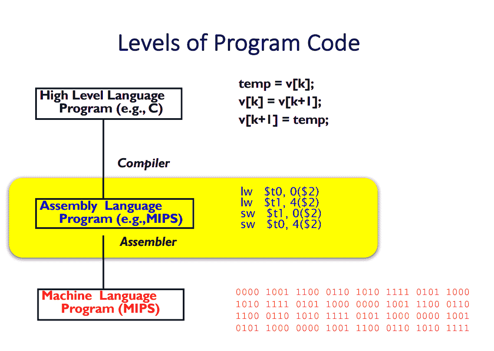

# 什么是汇编语言？

> 原文：<https://www.freecodecamp.org/news/what-are-assembly-languages/>

汇编语言是高级语言(C++，Java 等)和机器代码(二进制)之间的接口。对于编译语言，编译器将高级代码转换成汇编语言代码。

每个系列的 CPU 都定义了自己的指令集架构(ISA)，这是一组 CPU 无需进一步翻译或转换即可执行的基本指令。编译器将复合的高级复合指令分解成 ISA 中可用的操作。

目前使用的一些较常见的 ISAS 包括 MIPS、ARM、Intel x86 和 RISC-V

汇编程序将汇编指令分解成各自的二进制表示形式，并用计算机的显式寄存器和内存地址替换汇编代码的通用地址。

执行时间和控制至关重要的代码可以直接用汇编语言编写。然而，这是以延长开发时间和增加开发难度为代价的。还应该注意的是，已经有大量的研究致力于让编译器优化自动生成的代码。

汇编语言主要用于以下情况:

*   需要使用高级语言中没有的 CPU 指令。
*   没有高级语言来为某一类型的处理器编程。
*   在新的 ISA 上实现高级语言的编译器。

