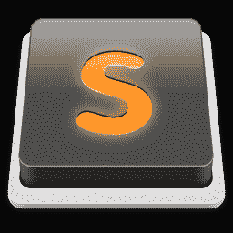
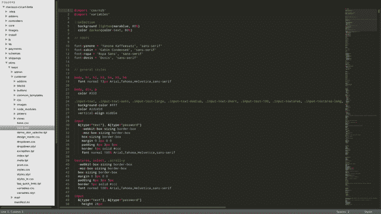
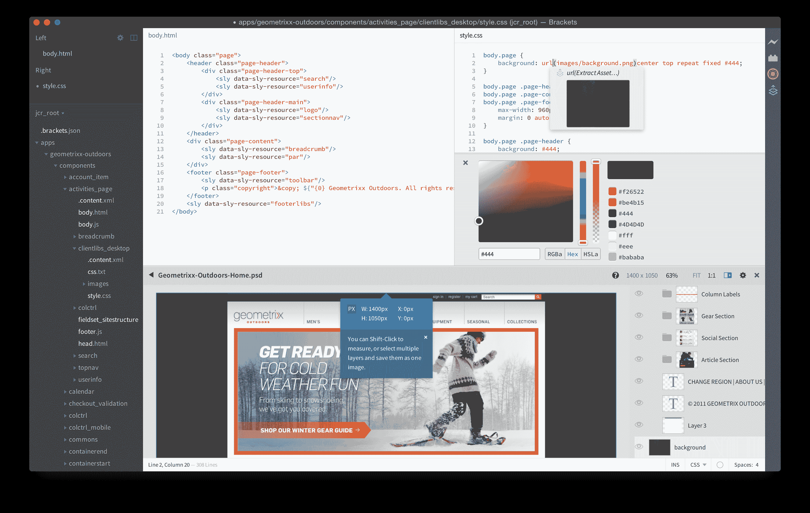
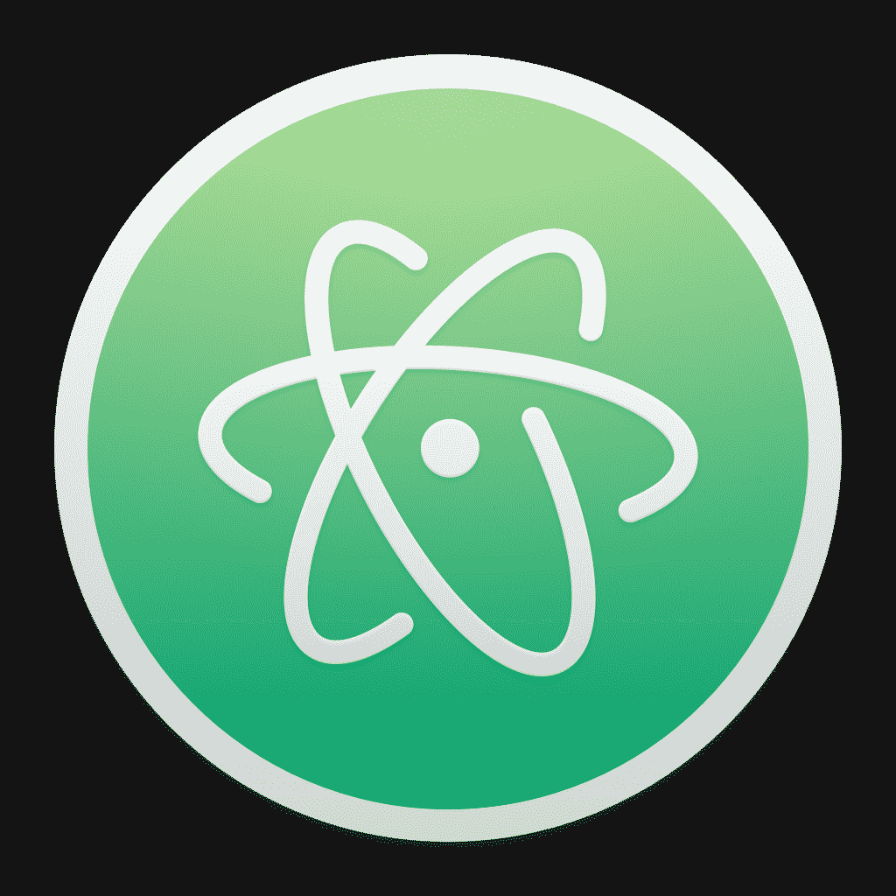
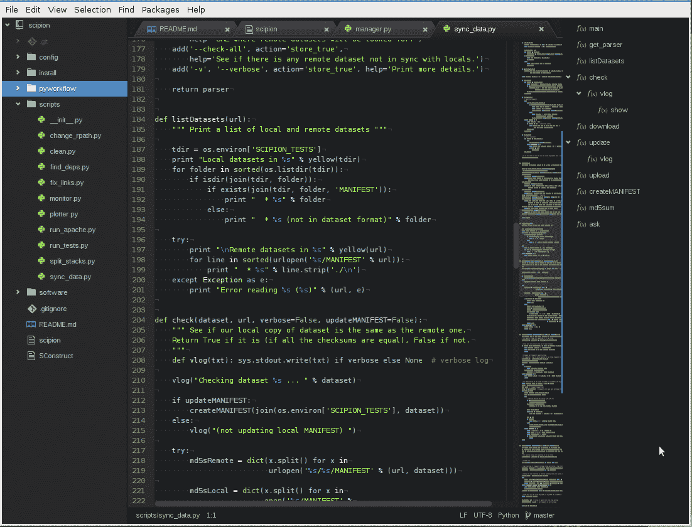
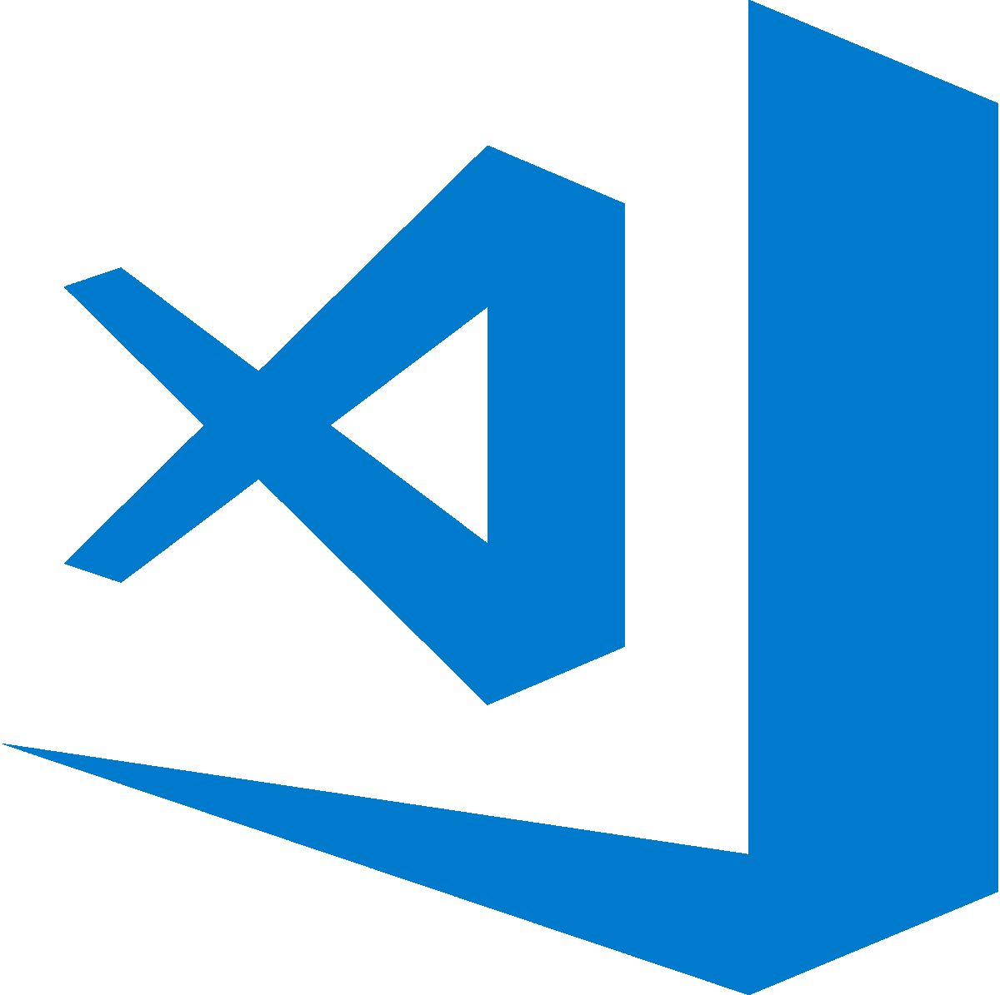
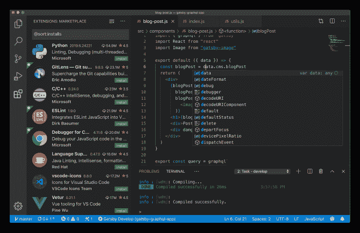

# 如何选择源代码编辑器

> 原文：<https://www.freecodecamp.org/news/source-code-editors-explained/>

源代码编辑器是允许代码创建和编辑的程序。

任何文本编辑器都可以用来编写代码。但是专用的代码编辑器提供了许多有用的特性，包括:文本补全、标记着色和用于并排编辑的选项卡/窗格。这些特性甚至对不了解所有高级选项的新用户也很有用。

有很多很多的编辑器可以在线下载或使用，有付费的也有免费的。它们提供了许多相同的核心特性，但各有各的微妙之处。进一步的研究可能有助于找到适合你的。

以下编辑器都是跨平台的，可以免费使用或外借。

## **[崇高文字](https://www.sublimetext.com/)**

Sublime Text 是一个非常受欢迎的编辑器，自 2008 年以来一直存在于[。有很多选项和](https://www.sublimetext.com/blog/articles/one-point-oh)[扩展](https://packagecontrol.io/)可用，还有很多[帮助](http://stackoverflow.com/search?q=sublime+text)在线帮助[设置](http://www.websightdesigns.com/wiki/Setting_up_Sublime_Text_3)。

(继续使用的许可费用为 70 美元。然而，Sublime Text 可以免费下载和评估，有一个 nag 屏幕弹出窗口。)

## **[括号](http://brackets.io/)**

括号是 Adobe 相对较新的开源编辑器。它非常用户友好，尤其是对于不习惯命令行界面或 JSON 风格的设置/偏好的人。

通过扩展管理器，可以快速、轻松地找到并安装扩展和主题。

## **[Atom](https://atom.io/)**

Atom 是一个由 [GitHub](https://github.com/) 开发的[开源](https://github.com/atom/atom)编辑器。和崇高文字一样，Atom 也是相当受欢迎的。

它是非常可配置的(“可黑客攻击的”，正如他们所说)，但是高级功能可能会让新用户不知所措。网上还有大量[有用的](http://readwrite.com/2014/05/20/github-atom-5-tips-getting-started-tutorial-corey-johnson/) [文档](http://flight-manual.atom.io/) [可用](http://stackoverflow.com/search?q=atom)。

## **[Visual Studio 代码](https://code.visualstudio.com/)**

Visual Studio Code 是微软在 2015 年开发的源代码编辑器，现在是 web 开发最知名的代码编辑器之一。

它支持许多编程语言，像其他语言一样，你可以下载插件或扩展，使它更适合你的编码风格。其主要特点是:

*   智能感知-语法高亮，自动完成，函数定义和智能完成。
*   调试——能够使用断点、调用堆栈和交互式控制台进行调试。
*   内置 Git——检查差异、暂存文件、提交、推和拉，所有这些都在编辑器中可用。
*   扩展-安装扩展来添加新的语言、主题、调试器和连接附加服务。