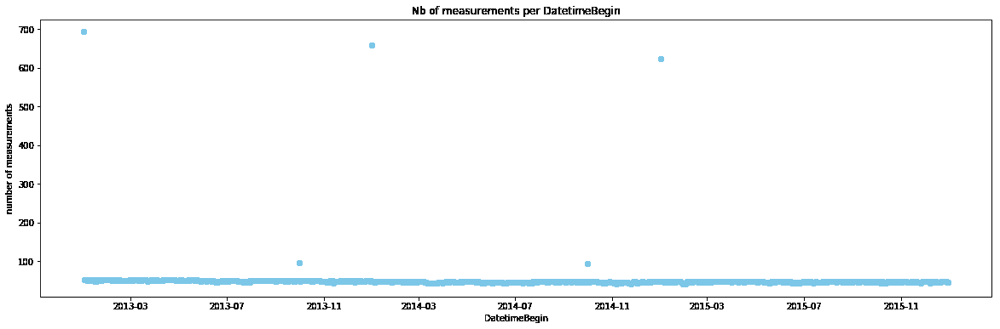
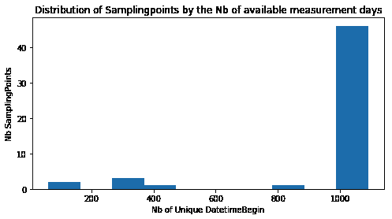
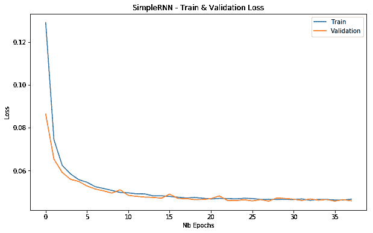
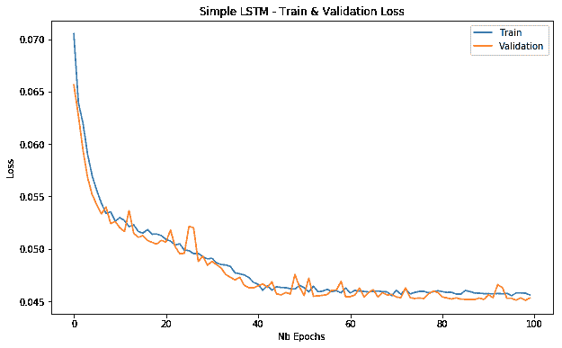
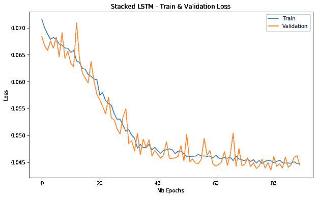

# 如何用递归神经网络预测空气污染

> 原文：<https://www.freecodecamp.org/news/forecasting-air-pollution-recurrent-neural-networks/>

在完成了公民科学项目之后，我想了解更多关于空气污染的知识，看看我是否可以用它来做一个数据科学项目。在[欧洲环境署](https://www.eea.europa.eu/data-and-maps/data/aqereporting-8)的网站上，你可以找到大量关于空气污染的数据和信息。

在本笔记本中，我们将重点介绍比利时**的空气质量，更具体地说，是介绍 ****二氧化硫(SO2)**** 造成的污染。数据可通过[https://www . EEA . Europa . eu/data-and-maps/data/aqereport-2/be](https://www.eea.europa.eu/data-and-maps/data/aqereporting-2/be)下载。**

**zip 文件包含不同空气污染物和聚集水平的单独文件。第一个数字代表污染物 ID，如[词汇表](http://dd.eionet.europa.eu/vocabulary/aq/pollutant)中所述。本笔记本使用的文件为****BE _ 1 _ 2013–2015 _ aggregated _ time series . CSV .****这是比利时的 SO2 污染情况，但你也可以找到其他欧洲国家的类似数据。**

**在[数据下载页面](https://www.eea.europa.eu/data-and-maps/data/aqereporting-2/be.)上可以找到 CSV 文件中字段的描述。更多关于空气污染物的背景信息可以在[维基百科](https://nl.wikipedia.org/wiki/Luchtvervuiling)上找到。**

# **项目设置**

```
`# Importing packages
from pathlib import Path
import pandas as pd
import numpy as np
import pandas_profiling
%matplotlib inline
import matplotlib.pyplot as plt
import warnings
warnings.simplefilter(action = 'ignore', category = FutureWarning)
from sklearn.preprocessing import MinMaxScaler

from keras.preprocessing.sequence import TimeseriesGenerator
from keras.models import Sequential
from keras.layers import Dense, LSTM, SimpleRNN
from keras.optimizers import RMSprop
from keras.callbacks import ModelCheckpoint, EarlyStopping
from keras.models import model_from_json

# Setting the project directory
project_dir = Path('/Users/bertcarremans/Data Science/Projecten/air_pollution_forecasting')`
```

# **加载数据**

```
`date_vars = ['DatetimeBegin','DatetimeEnd']

agg_ts = pd.read_csv(project_dir / 'data/raw/BE_1_2013-2015_aggregated_timeseries.csv', sep='\t', parse_dates=date_vars, date_parser=pd.to_datetime)
meta = pd.read_csv(project_dir / 'data/raw/BE_2013-2015_metadata.csv', sep='\t')

print('aggregated timeseries shape:{}'.format(agg_ts.shape))
print('metadata shape:{}'.format(meta.shape))`
```

# **数据探索**

**让我们使用 ****pandas_profiling**** 来检查数据。**

```
`pandas_profiling.ProfileReport(agg_ts)`
```

**为了不与图表混淆，我不会在本文中展示 pandas_profiling 的输出。但是你可以在我的 [GitHub 回购](https://github.com/bertcarremans/air_pollution_forecasting)里找到。**

**pandas_profiling 报告向我们展示了以下内容:**

*   **有 6 个常量变量。我们可以把这些从数据集中去掉。**
*   **不存在缺失值，因此我们可能不需要应用插补。**
*   ******AirPollutionLevel****有一些零，但这可能是完全正常的。另一方面，这些变量有一些极值，可能是空气污染的不正确记录。**
*   **有 53 个**，大概和 ****采样点**** 一样。****airqualitystationoicode****只是 AirQualityStation 的一个较短的代码，因此变量也可以删除。****
*   ******air quality network****(布鲁塞尔、佛兰德和瓦隆)有 3 个值。大多数测量来自佛兰德斯。**
*   ******data aggregation process****:大部分行包含作为一天测量(P1D)的 24 小时平均值聚集的数据。关于其他值的更多信息可以在[这里](http://dd.eionet.europa.eu/vocabulary/aq/aggregationprocess)找到。在这个项目中，我们将只考虑 P1D 值。**
*   ****:平均周期内有效测量时间占总测量时间(时间覆盖)的比例，用百分比表示。几乎所有行都有大约 100%的有效测量时间。一些行的数据捕获率略低于 100%。****
*   ********DataCoverage**** :平均周期内聚合过程中包含的有效测量的比例，以百分比表示。在这个数据集中，我们至少有 75%。根据[对该变量](https://www.eea.europa.eu/data-and-maps/data/aqereporting-2/be)的定义，低于 75%的值不应包括在空气质量评估中，这解释了为什么这些行没有出现在数据集中。****
*   ****:与数据覆盖率高度相关，将从数据中删除。****
*   ********unitofairprotectionlevel****:423 行有一个单位 **计数** 。为了有一个一致的目标变量，我们将删除这种类型的单位的记录。****
*   ******【datetime begin】****和 ****DateTimeEnd**** :柱状图在这里没有提供足够的细节。这需要进一步分析。**

# **DateTimeBegin and DateTimeEnd**

**pandas_profiling 中的直方图结合了每个 bin 的多个天数。让我们看看这些变量在日常水平上的表现。**

## **每个日期多个汇总级别**

*   ******datetime begin****:2013、2014、2015 年 1 月 1 日和 2013、2014 年 10 月 1 日的大量记录。**
*   ******datetime end****:2014、2015、2016 年 1 月 1 日和 2014、2015 年 4 月 1 日的大量记录。**

```
`plt.figure(figsize=(20,6))
plt.plot(agg_ts.groupby('DatetimeBegin').count(), 'o', color='skyblue')
plt.title('Nb of measurements per DatetimeBegin')
plt.ylabel('number of measurements')
plt.xlabel('DatetimeBegin')
plt.show()`
```

**

Number of rows per date** 

**记录数量中的异常值与多个聚合级别(DataAggregationProcess)有关。这些日期的 DataAggregationProcess 中的值反映了 DatetimeBegin 和 DatetimeEnd 之间的时间段。例如，2013 年 1 月 1 日是一年测量期的开始日期，直到 2014 年 1 月 1 日。**

**由于我们只对每日的聚合级别感兴趣，因此通过 ****过滤掉其他的聚合级别**** 就可以解决这个问题。为此，我们也可以删除 DatetimeEnd。**

## **每日汇总级别缺少时间步长**

**如下图所示， ****并非所有采样点都有三年期**** 开始的所有日期时间的数据。这是 DataCoverage 变量低于 75%的最有可能的日子。所以在这些日子里，我们没有足够的有效测量。在本笔记本的后面，我们将使用前几天的测量值来预测当天的污染情况。**

**为了获得类似大小的时间步长，我们需要为每个采样点插入缺失的 DatetimeBegin 行。我们将 ****用有效数据**** 插入第二天的测量数据。**

**其次，我们将 ****去掉太多丢失时间步长**** 的采样点。这里我们将任意取 1.000 个时间步长作为所需时间步长的最小数目。**

```
`ser_avail_days = agg_ts.groupby('SamplingPoint').nunique()['DatetimeBegin']
plt.figure(figsize=(8,4))
plt.hist(ser_avail_days.sort_values(ascending=False))
plt.ylabel('Nb SamplingPoints')
plt.xlabel('Nb of Unique DatetimeBegin')
plt.title('Distribution of Samplingpoints by the Nb of available measurement days')
plt.show()`
```

**

Distribution of SamplingPoints by the number of available measurement days** 

# **数据准备**

## **数据清理**

**基于数据探索，我们将执行以下操作来清理数据:**

*   **仅保留 P1D 的 DataAggregationProcess 记录**
*   **正在删除计数为 UnitOfAirPollutionLevel 的记录**
*   **删除一元变量和其他冗余变量**
*   **移除少于 1000 个测量日的采样点**

```
`df = agg_ts.loc[agg_ts.DataAggregationProcess=='P1D', :] 
df = df.loc[df.UnitOfAirPollutionLevel!='count', :]
df = df.loc[df.SamplingPoint.isin(ser_avail_days[ser_avail_days.values >= 1000].index), :]
vars_to_drop = ['AirPollutant','AirPollutantCode','Countrycode','Namespace','TimeCoverage','Validity','Verification','AirQualityStation',
               'AirQualityStationEoICode','DataAggregationProcess','UnitOfAirPollutionLevel', 'DatetimeEnd', 'AirQualityNetwork',
               'DataCapture', 'DataCoverage']
df.drop(columns=vars_to_drop, axis='columns', inplace=True)`
```

## **为缺失的时间步长插入行**

**对于每个采样点，我们将首先插入(空)没有 DatetimeBegin 的行。这可以通过在最小和最大 DatetimeBegin 之间的范围内创建包含所有采样点的完整多索引来实现。然后， ****reindex**** 将插入丢失的行，但列为 NaN。**

**其次，我们使用 ****bfill**** 并指定用有效数据的下一行的值来估算缺失值。bfill 方法应用于 groupby 对象，以将回填限制在每个采样点的行内。这样，我们就不会使用另一个采样点的值来填充缺失的值。**

**测试该操作是否正确工作的一个样本点是日期为**2013–01–29**的**SPO-betr 223 _ 00001 _ 100**。**

```
`dates = list(pd.period_range(min(df.DatetimeBegin), max(df.DatetimeBegin), freq='D').values)
samplingpoints = list(df.SamplingPoint.unique())

new_idx = []
for sp in samplingpoints:
    for d in dates:
        new_idx.append((sp, np.datetime64(d)))

df.set_index(keys=['SamplingPoint', 'DatetimeBegin'], inplace=True)
df.sort_index(inplace=True)
df = df.reindex(new_idx)
#print(df.loc['SPO-BETR223_00001_100','2013-01-29'])  # should contain NaN for the columns

df['AirPollutionLevel'] = df.groupby(level=0).AirPollutionLevel.bfill().fillna(0)
#print(df.loc['SPO-BETR223_00001_100','2013-01-29'])  # NaN are replaced by values of 2013-01-30
print('{} missing values'.format(df.isnull().sum().sum()))`
```

## **处理多个时间序列**

**好了，现在我们有了一个干净的数据集，不包含任何丢失的值。使这个数据集特别的一个方面是我们有 ****多个采样点**** 的数据。所以我们有多个时间序列。**

**一种处理方法是为采样点 创建 ****虚拟变量，并使用所有记录来训练模型。另一种方法是为每个采样点**** 建立一个 ****单独的模型。******

**在本笔记本中，我们将采用后者。但是，我们将限制笔记本电脑只能在一个采样点上这样做。但是同样的逻辑可以应用于每个采样点。**

```
`df = df.loc['SPO-BETR223_00001_100',:]`
```

## **分割训练、测试和验证集**

**为了评估模型的性能，我们划分了一个测试集。在训练阶段将不使用该测试集。**

*   **列车组:截至 2014 年 7 月的数据**
*   **验证集:2014 年 7 月至 2015 年 1 月之间的 6 个月**
*   **测试集:2015 年的数据**

```
`train = df.query('DatetimeBegin < "2014-07-01"')
valid = df.query('DatetimeBegin >= "2014-07-01" and DatetimeBegin < "2015-01-01"')
test = df.query('DatetimeBegin >= "2015-01-01"')`
```

## **缩放比例**

```
`# Save column names and indices to use when storing as csv
cols = train.columns
train_idx = train.index
valid_idx = valid.index
test_idx = test.index

# normalize the dataset
scaler = MinMaxScaler(feature_range=(0, 1))
train = scaler.fit_transform(train)
valid = scaler.transform(valid)
test = scaler.transform(test)`
```

## **保存已处理的数据集**

**这样，我们就不需要在每次重新运行笔记本时重复预处理。**

```
`train = pd.DataFrame(train, columns=cols, index=train_idx)
valid = pd.DataFrame(valid, columns=cols, index=valid_idx)
test = pd.DataFrame(test, columns=cols, index=test_idx)

train.to_csv('../data/processed/train.csv')
valid.to_csv('../data/processed/valid.csv')
test.to_csv('../data/processed/test.csv')`
```

# **建模**

**首先，我们读入经过处理的数据集。其次，我们创建一个函数来绘制我们将构建的不同模型的训练和验证损失。**

```
`train = pd.read_csv('../data/processed/train.csv', header=0, index_col=0).values.astype('float32')
valid = pd.read_csv('../data/processed/valid.csv', header=0, index_col=0).values.astype('float32')
test = pd.read_csv('../data/processed/test.csv', header=0, index_col=0).values.astype('float32')

def plot_loss(history, title):
    plt.figure(figsize=(10,6))
    plt.plot(history.history['loss'], label='Train')
    plt.plot(history.history['val_loss'], label='Validation')
    plt.title(title)
    plt.xlabel('Nb Epochs')
    plt.ylabel('Loss')
    plt.legend()
    plt.show()

    val_loss = history.history['val_loss']
    min_idx = np.argmin(val_loss)
    min_val_loss = val_loss[min_idx]
    print('Minimum validation loss of {} reached at epoch {}'.format(min_val_loss, min_idx))`
```

## **使用时间序列生成器准备数据**

**Keras 的 [TimeseriesGenerator 帮助我们以正确的格式构建数据用于建模。](https://keras.io/preprocessing/sequence/#timeseriesgenerator)**

*   ******长度:**** 生成序列中的时间步数。这里我们要回顾任意数量的 **n_lag** 时间步长。实际上，n_lag 可能取决于如何使用预测。假设比利时政府可以采取一些措施来减少采样点周围的 SO2 污染(例如在一定时间内禁止柴油车进入某个城市)。假设政府在纠正措施生效前需要 14 天。那么将 n_lag 设置为 14 是有意义的。**
*   ******sampling_rate:**** 生成序列中连续时间步之间的时间步数。我们希望保留所有的时间步长，因此我们将其保留为默认值 1。**
*   ******步距:**** 该参数影响生成的序列重叠的程度。由于我们没有太多的数据，我们将其保留为默认值 1。这意味着相继生成的两个序列与除一个时间步长之外的所有时间步长重叠。**
*   ******batch_size:**** 每批生成的序列数**

```
`n_lag = 14

train_data_gen = TimeseriesGenerator(train, train, length=n_lag, sampling_rate=1, stride=1, batch_size = 5)
valid_data_gen = TimeseriesGenerator(train, train, length=n_lag, sampling_rate=1, stride=1, batch_size = 1)
test_data_gen = TimeseriesGenerator(test, test, length=n_lag, sampling_rate=1, stride=1, batch_size = 1)`
```

## **递归神经网络**

******传统的神经网络没有记忆**** 。因此，在处理当前输入时，它们不会考虑以前的输入。在时序数据集中，如时间序列，先前时间步骤的信息通常与当前步骤的预测相关。所以一个 ****状态**** 大约需要维持先前的时间步骤。**

**在我们的例子中，时间 t 的空气污染可能受到先前时间点的空气污染的影响。所以我们需要考虑到这一点。递归神经网络或 rnn 有一个内部循环，通过它它们保持先前时间步长的状态。然后，该状态用于当前时间步长中的预测。当一个新的序列被处理时，该状态被复位。**

**关于 RNNs 的图解指南，你绝对应该阅读 Michael Nguyen 的文章[。](https://towardsdatascience.com/illustrated-guide-to-recurrent-neural-networks-79e5eb8049c9)**

**在我们的例子中，我们使用 Keras 包的一个 [SimpleRNN](https://keras.io/layers/recurrent/#simplernn) 。我们还指定了一个 ****提前停止**** 回调，以在有 10 个时期没有任何验证损失改善时停止训练。 ****模型检查点**** 允许我们保存最佳模型的权重。模型架构仍然需要单独保存。**

```
`simple_rnn = Sequential()
simple_rnn.add(SimpleRNN(4, input_shape=(n_lag, 1)))
simple_rnn.add(Dense(1))
simple_rnn.compile(loss='mae', optimizer=RMSprop())

checkpointer = ModelCheckpoint(filepath='../model/simple_rnn_weights.hdf5'
                               , verbose=0
                               , save_best_only=True)
earlystopper = EarlyStopping(monitor='val_loss'
                             , patience=10
                             , verbose=0)
with open("../model/simple_rnn.json", "w") as m:
    m.write(simple_rnn.to_json())

simple_rnn_history = simple_rnn.fit_generator(train_data_gen
                                              , epochs=100
                                              , validation_data=valid_data_gen
                                              , verbose=0
                                              , callbacks=[checkpointer, earlystopper])
plot_loss(simple_rnn_history, 'SimpleRNN - Train & Validation Loss')`
```

**

Training and validation loss for a SimpleRNN** 

## **长短期记忆网络**

******一个 RNN 有一个短暂的记忆**** 。它很难记住许多时间点以前的信息。当序列非常长时会出现这种情况。**

**其实是由于 ****消失渐变问题**** 。梯度是更新神经网络权重的值。当你的 RNN 中有很多时间步长时，第一层的梯度会变得非常小。结果，第一层的权重的更新可以忽略。这意味着 RNN 不能学习早期地层中的东西。**

**因此，我们需要一种方法将第一层的信息传递给后面的层。LSTMs 更适合考虑长期依赖性。Michael Nguyen 写了一篇优秀的文章，对 LSTMs 进行了[可视化描述。](https://towardsdatascience.com/illustrated-guide-to-lstms-and-gru-s-a-step-by-step-explanation-44e9eb85bf21)**

## **简单 LSTM 模型**

```
`simple_lstm = Sequential()
simple_lstm.add(LSTM(4, input_shape=(n_lag, 1)))
simple_lstm.add(Dense(1))
simple_lstm.compile(loss='mae', optimizer=RMSprop())

checkpointer = ModelCheckpoint(filepath='../model/simple_lstm_weights.hdf5'
                               , verbose=0
                               , save_best_only=True)
earlystopper = EarlyStopping(monitor='val_loss'
                             , patience=10
                             , verbose=0)
with open("../model/simple_lstm.json", "w") as m:
    m.write(simple_lstm.to_json())

simple_lstm_history = simple_lstm.fit_generator(train_data_gen
                                                , epochs=100
                                                , validation_data=valid_data_gen
                                                , verbose=0
                                                , callbacks=[checkpointer, earlystopper])
plot_loss(simple_lstm_history, 'Simple LSTM - Train & Validation Loss')` 
```

**

Training and validation loss for a simple LSTM** 

## **堆叠 LSTM 模型**

**在这个模型中，我们将堆叠多个 LSTM 层。这样，模型将随着时间的推移学习输入数据的其他抽象。换句话说， ****代表不同时间尺度的输入数据**** 。**

**在 Keras 中，我们需要在另一个 LSTM 层之前的 LSTM 层中指定参数 ****return_sequences**** 。**

```
`stacked_lstm = Sequential()
stacked_lstm.add(LSTM(16, input_shape=(n_lag, 1), return_sequences=True))
stacked_lstm.add(LSTM(8, return_sequences=True))
stacked_lstm.add(LSTM(4))
stacked_lstm.add(Dense(1))
stacked_lstm.compile(loss='mae', optimizer=RMSprop())

checkpointer = ModelCheckpoint(filepath='../model/stacked_lstm_weights.hdf5'
                               , verbose=0
                               , save_best_only=True)
earlystopper = EarlyStopping(monitor='val_loss'
                             , patience=10
                             , verbose=0)
with open("../model/stacked_lstm.json", "w") as m:
    m.write(stacked_lstm.to_json())

stacked_lstm_history = stacked_lstm.fit_generator(train_data_gen
                                                  , epochs=100
                                                  , validation_data=valid_data_gen
                                                  , verbose=0
                                                  , callbacks=[checkpointer, earlystopper])
plot_loss(stacked_lstm_history, 'Stacked LSTM - Train & Validation Loss')`
```

**

Training and validation loss for a stacked LSTM** 

# **评估绩效**

**基于最小验证损失，SimpleRNN 似乎优于 LSTM 模型，尽管度量标准彼此接近。**

**用****evaluate _ generator****的方法，我们可以对测试数据上的模型(生成器)进行评估。这会给我们带来测试数据上的损失。我们将首先从 JSON 文件中加载模型架构和最佳模型的权重。**

```
`def eval_best_model(model):
    # Load model architecture from JSON
    model_architecture = open('../model/'+model+'.json', 'r')
    best_model = model_from_json(model_architecture.read())
    model_architecture.close()
    # Load best model's weights
    best_model.load_weights('../model/'+model+'_weights.hdf5')
    # Compile the best model
    best_model.compile(loss='mae', optimizer=RMSprop())
    # Evaluate on test data
    perf_best_model = best_model.evaluate_generator(test_data_gen)
    print('Loss on test data for {} : {}'.format(model, perf_best_model))

eval_best_model('simple_rnn')
eval_best_model('simple_lstm')
eval_best_model('stacked_lstm')`
```

*   **simple_rnn 的测试数据的损失:0 . 54686 . 38686868661**
*   **simple_lstm 的测试数据损失:0 . 54686 . 68686868661**
*   **stacked_lstm 的测试数据损失:0 . 46866 . 38886888661**

# **结论**

**在这个故事中，我们为 LSTM 使用了一个递归神经网络和两种不同的架构。 ****的最佳性能来自于由几个隐藏层组成的堆叠 LSTM**** 。**

**肯定有许多事情值得进一步研究，以提高模型的性能。**

*   **使用每小时数据(EEA 网站上提供的另一个 CSV 文件)并尝试除每日数据之外的其他采样策略**。****
*   ****使用关于 ****其他污染物的数据作为特征**** 来预测 SO2 污染。也许其他污染物与二氧化硫污染有关。****
*   **基于日期 构造其他 ****特征。在[驱动数据](https://www.drivendata.org/)的幂律预测竞赛的获胜者之一的 [PDF 中可以找到一篇很好的文章。](https://github.com/drivendataorg/power-laws-forecasting/blob/master/3rd%20Place/Model_Documentation_and_Write_up.pdf)******

**通过做这个项目，我学到了很多关于递归神经网络的知识。我希望你喜欢它。欢迎留下任何评论！**