# Cordova iOS 应用程序开发从安装到部署

> 原文：<https://www.freecodecamp.org/news/cordova-ios-application-development-setup-to-deployment/>


Android 的混合应用程序开发轻而易举，无论是开发还是生产配置。但是我个人觉得 Cordova iOS 的设置、开发和部署有点复杂。

大多数处于学习阶段的混合应用程序开发人员无法探索混合 iOS 应用程序开发流程，因为他们没有 mac。开发 iOS 应用程序需要 iOS SDK 和 XCode(不像 Android SDK 可以在任何桌面操作系统上运行)。

因此，本指南的目的是展示在 Mac 上开发混合 iOS 应用程序的基本工作流程。这样，开发人员即使不能开发应用程序，也可以看到它是如何完成的。

## **创建科尔多瓦项目**

首先打开终端并创建一个新的 cordova 项目(仅当您有权限问题时才使用 sudo，即。EACCESS 错误):

```
sudo cordova create iosdemo
cd iosdemo
sudo cordova platform add ios
```

在撰写本指南时，cordova iOS 平台版本为 4.3.1。

我们不会修改应用程序的任何源代码——相反，我们将简单地继续使用默认的示例代码，它是在我们运行 create 命令时由 cordova 自动添加的。然而，假设我们将在正常的开发流程中在`www`文件夹中添加插件和修改代码。

下一步是运行 cordova build 命令。这将把我们的应用程序代码转换成。我们接下来将使用的 xcodeproj 文件。

```
sudo cordova build ios
```

生成的 Xcode 项目文件会在这里:

```
[Your App Folder]/platforms/ios/[Your App Name].xcodeproj
```

现在在 Android 的情况下，代码签名是使用。jks 格式。然而，在 iOS 中，你需要有一个苹果开发者帐户来分发 iOS 应用程序。这样我们就可以生成分发应用程序所需的*证书*和*配置文件*。

关于开发者账户的价格和其他信息，请参考本页。

## **创建开发证书**

一旦你准备好账户，我们就可以继续登录你的[苹果开发者账户](https://developer.apple.com/account/)。

仪表板屏幕应该如下所示:

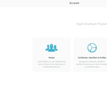

点击`Certificates, Identifiers & Profiles`。这将带您进入以下屏幕，默认显示从您的帐户颁发的证书:

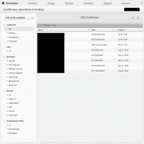

iOS 证书主要有两种类型:开发或分发。单击列表右上角的加号(+)按钮，将打开以下页面:

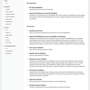

首先，让我们创建一个发展概况。选择 *iOS 应用开发*，点击继续。

这将把您带到下面的屏幕，要求您创建并上传证书签名请求或 CSR 文件。

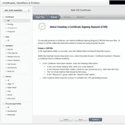

按照屏幕上的说明生成它，然后继续。证书准备好之后，将其下载到 Mac 上，然后双击它。这将把它添加到 Mac 的“钥匙串访问”中。

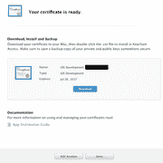

## **创建分发证书**

创建分发证书类似于创建开发证书的过程。然而，这里我们从`Add iOS Certifcate Page`的`Production`部分选择`App Store and Ad Hoc`:


## **创建应用 ID**

从`Identifiers`部分选择`App IDs`。这将打开现有应用程序 id 列表。接下来点击右上角的加号按钮(+)。这将打开*注册 iOS 应用 id*页面。

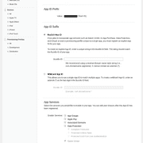

选择显式应用 ID。应用程序描述可以是任何相关的名称–这是将在应用程序 id 列表中显示的特定应用程序 id。

应用程序 id 是一个格式为*ab 11 a ABCD . com . my company . myapp*的字符串，其中*ab 11 a ABCD*是应用程序 id 前缀，默认为团队 ID， *com.mycompany.myapp* 是每个应用程序唯一的捆绑包 ID。

建议包 id 必须是反向域名样式的字符串。例如，MYCOMPANY 公司可能有两个应用程序(App1 和 App2)。所以每个应用程序的 HTTP URL 通常是 app1.mycompany.com 和 app2.mycompany.com。因此，每个应用程序的包 id 将是 com.mycompany.app1 和 com.mycompany.app2

接下来，从清单中选择您需要在应用中使用的任何服务，如推送通知、钱包等。接下来点击继续，确认详细信息，最后注册应用程序 id。

## **向您的开发者帐户添加设备**

从`Devices`部分选择`All`。这将打开已添加到您的 Apple developer 帐户的设备列表。只有这些设备被允许在开发期间运行应用程序。

要添加新设备，请单击右上角的加号按钮(+)。将显示以下画面:


这里的名称可以是任何容易理解的名称，例如 iPhone 5s ABC Pvt Ltd。设备 UDID 是与每台 Apple 设备相关联的唯一 ID。

要查找设备的 UDID，请执行以下步骤:

1.  将设备连接到 Mac。
2.  打开位于“/应用程序/实用工具”文件夹中的“系统信息”应用程序。
3.  在左栏的硬件下选择 USB。
4.  在右侧，选择 USB 设备树下连接的设备。设备 ID 或“序列号”出现在下面。

输入设备 UDID 和名称后，单击继续，然后确认详细信息并注册。

## **创建开发配置文件**

要创建开发预配概要文件，请单击预配概要文件->全部。这应该显示所有的配置文件，发展以及分布。接下来单击右上角的加号按钮(+)，这将显示以下页面:


在此选择`iOS App Development`并点击继续。在显示的下拉列表中，选择我们之前创建的应用 ID，然后继续。

接下来会显示一个证书清单，我们可以从中选择一个或多个证书。这些是开发证书，不是分发证书。生成的预置描述文件将链接到这些证书。

当您点按“继续”时，将显示设备清单。选择一个、多个或全部。仅允许选定的设备使用此预置描述文件运行应用程序。

接下来，在单击 continue 之后，输入配置文件的名称，并下载生成的。file 预配文件。

**注意事项**:创建临时分发预置描述文件的过程是相同的。创建您的 AppStore 分发预置描述文件也非常相似，只是我们不选择设备，因为该应用程序将通过 AppStore 公开提供。

现在我们已经有了所有需要的东西，我们可以继续使用 Xcode 生成实际的 ipa。

Cordova build 命令将我们的应用程序代码转换为 xcode 项目。使用 Xcode 我们创建了一个。ipa 文件，它是实际要安装的应用程序。

在继续之前，双击这两个证书以将它们添加到您的钥匙串中。

## **在 Xcode 中继续**

接下来，双击。xcodeproj 文件，应该在 Xcode 中打开它。(请使用最新版本的 Xcode——我用过 Xcode 8.3.2。)

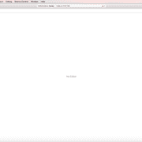

Xcode 屏幕应该看起来像上面这样。

点击窗口左上角的应用程序名称。这将在右侧打开详细视图。

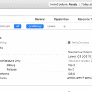

然后点击目标->应用程序名称:

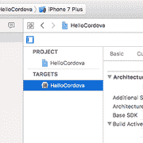

这将显示以下详细信息选项卡:

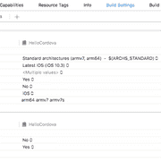

单击 general，应该会显示以下内容:

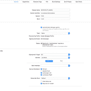

取消选中自动管理签名复选框。

这会显示以下错误，说明 AppNAme 需要预置描述文件:

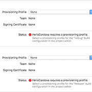

接下来，在 Signing (Debug)下，单击 Provisioning Profile 下拉菜单并选择 *import profile* 选项。在弹出的文件选择对话框中，导航到下载开发配置文件的路径，并选择它。它将有一个*的扩展。移动供应。*

在您选择之后，错误应该消失了，并且它应该在您的 Apple 开发人员帐户和签名证书名称中显示 Team 作为团队名称。

对“签名(发布)”部分执行相同的操作，但在“文件选择”对话框中选择“临时分发配置文件”。

既然代码签名步骤已经完成，我们可以

*   直接在设备上运行应用程序
*   在模拟器上运行应用程序
*   生成用于分发的 ipa 文件
*   将应用上传到 appstore

## **直接在设备上运行应用**

要在设备上运行应用程序，请通过 USB 将设备连接到 Mac。然后在左上角的设备列表中选择连接的设备，并单击运行或播放按钮(黑色三角形按钮):

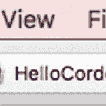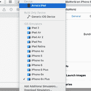

构建状态将显示在窗口顶部的状态栏中。如果一切顺利，应用程序应该安装在设备上，过一会儿应该会自动加载。

**注意**:在模拟器上运行 app 的步骤是一样的。但是我们使用设备列表中可用的 iPhone 和 iPad 模拟器，而不是实际的设备。

## **生成 ipa 文件进行分发**

如果您需要将应用程序分发给测试团队等，可以使用这种方法。但是，他们使用的设备必须在预置描述文件中有 UDID。

从 Xcode 菜单中选择`Product`->-`Clean`，然后选择`Product`->-`Archive`。将出现归档管理器，并显示新的归档。

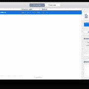

在右侧面板中，选择导出选项，将出现一个选项列表。

若要将您的应用程序分发给使用指定设备的用户，请选择“存储以用于临时部署”该应用程序将使用分发证书进行代码签名。

若要分发您的应用进行内部测试，请选择“保存以用于开发部署”该应用程序将使用您的开发证书进行代码签名。

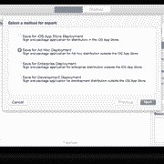

在出现的对话框中，从弹出式菜单中选取一个团队，然后点按“选取”。

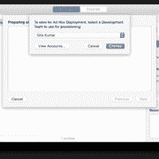

接下来，弹出设备选择对话框。选择*所有设备*或*特定设备*并点击下一步。

接下来将显示“查看”对话框。这里将显示用于生成构建的签名证书和配置文件。查看并单击下一步。最后，显示文件另存为弹出窗口，选择文件系统中存储导出的应用程序文件的位置。

应用程序被导出为. ipa `文件。

要在设备上运行该文件，只需双击即可在 iTunes 中打开。

然后连接您的设备(这应该会在 iTunes 窗口的左上角显示一个小设备图标)。点击它将显示设备摘要，如设备上的应用程序、音乐等。选择应用程序选项卡，在左侧窗格中选择要安装的应用程序，然后单击安装。等待该过程完成，然后单击应用。这将在您的设备上安装 ipa 文件。

要调试应用程序:

1.  打开 Safari
2.  在设备上打开应用程序
3.  在 Safari 菜单栏中选择`Develop --> Your Device Name --> Your App`。

## 所有人都到齐了！