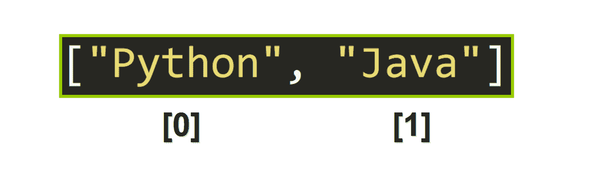
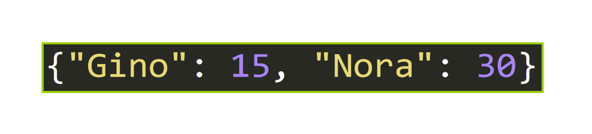
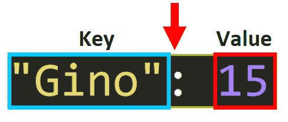
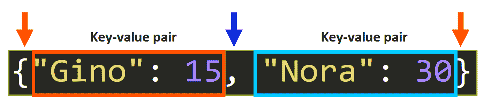
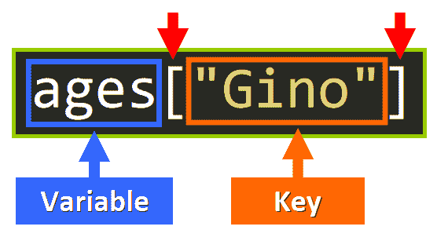
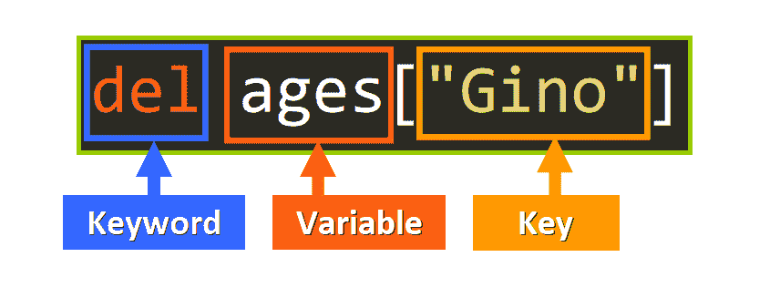

# Python 词典 101:详细的可视化介绍

> 原文：<https://www.freecodecamp.org/news/python-dictionaries-detailed-visual-introduction/>

## 欢迎

在本文中，您将学习如何使用 Python 字典，这是一种非常有用的内置数据类型，您肯定会在项目中使用它。

**特别是，你将会学到:**

*   字典的用途和主要特点。
*   为什么它们对您的编程项目很重要。
*   字典的“解剖”:键、值和键值对。
*   确定值是否可以是键的特定规则。
*   如何访问、添加、修改和删除键值对。
*   如何检查一个键是否在字典中？
*   字典的长度代表什么。
*   如何使用 for 循环迭代字典？
*   您可以使用哪些内置字典方法来利用这种数据类型的功能。

在本文的最后，我们将深入一个简单的项目来应用您的知识:我们将编写一个函数来创建并返回一个具有特定用途的字典。

让我们开始吧！⭐️

## 🔹语境中的词典

让我们从讨论字典的重要性开始。为了说明这一点，让我与您可能熟悉的另一种数据类型做一个快速比较:列表。

在 Python 中处理列表时，可以使用索引来访问元素，索引是一个描述元素在列表中的位置的整数。对于列表中的第一个元素，索引从零开始，随后的每个元素都增加 1。你可以在这里看到一个例子:



但是如果我们需要存储两个相关的值并在代码中保持这种“联系”呢？现在，我们只有单个独立的值存储在一个列表中。

假设我们想要存储学生的姓名，并将每个姓名与每个特定学生的成绩“联系”起来。我们希望保持他们之间的“联系”。用 Python 你会怎么做？

如果你使用嵌套列表，在只添加几个条目之后，事情会变得非常复杂和低效，因为你需要使用两个或更多的索引来访问每个值，这取决于最终的列表。这就是 Python 词典的用武之地。

### 遇见字典

Python 字典是这样的(见下文)。使用字典，您可以将一个值“连接”到另一个值，以在代码中表示它们之间的关系。在这个例子中，“Gino”被“连接”到整数 15，而字符串“Nora”被“连接”到整数 30。



让我们看看构成字典的不同元素。

## 🔸Python 字典的“剖析”

因为字典“连接”两个值，所以它有两种类型的元素:

*   **键:**键是用来访问另一个值的值。键相当于字符串、列表和元组中的“索引”。在字典中，要访问一个值，需要使用键，键本身就是一个值。
*   **值:**这些是您可以通过相应的键访问的值。



这两个元素形成了所谓的**键-值对**(一个键及其相应的值)。

### 句法

这是一个 Python 字典示例，将字符串“Gino”映射到数字 15，将字符串“Nora”映射到数字 30:

```
>>> {"Gino": 15, "Nora": 30}
```



*   为了创建一个字典，我们使用**花括号`{ }`** 。
*   在这些花括号之间，我们用逗号分隔键值对。
*   对于键-值对，我们编写键，后跟一个冒号、一个空格和对应于该键的值。

💡**温馨提示:**

*   出于可读性和风格的考虑，建议在每个逗号后添加一个空格来分隔键值对。
*   您可以用一对空的花括号`{}`创建一个空字典。

### 钥匙的重要规则

在 Python 字典中，不是每个值都可以是一个键。密钥必须遵循一组规则:

根据 [Python 文档](https://docs.python.org/3/tutorial/datastructures.html#dictionaries):

*   在一个字典中，键必须是唯一的。

> 最好将字典视为一组*键:值*对，要求键是**唯一的**(在一个字典中)。

*   键必须是不可变的。

> 与序列不同，序列由一系列数字索引，字典由*键*索引，键可以是任何**不可变的**类型；字符串和数字总是可以作为键。

*   如果键是元组，它只能包含字符串、数字或元组。

> 如果元组只包含字符串、数字或元组，则可以用作键。如果一个元组直接或间接地包含任何可变对象，它就不能用作键。

*   列表不能是键，因为它们是可变的。这是先前规则的结果。

> 您不能使用列表作为键，因为列表可以使用索引赋值、片赋值或者像`append()`和`extend()`这样的方法来修改。

💡**注意:**值没有特定的规则，可以是可变值，也可以是不可变值。

## 🔹行动中的字典

现在让我们看看如何使用 Python 中的字典。我们将访问、添加、修改和删除键值对。

我们将从这个字典开始工作，它被分配给`ages`变量:

```
>>> ages = {"Gino": 15, "Nora": 30}
```

### 使用键访问值

如果我们需要访问与特定键相关联的值，我们将引用字典的变量的名称写在方括号`[]`后面，在方括号内是对应于该值的键:

```
<variable>[<key>]
```



这是一个我们如何访问对应于字符串`"Gino"`的值的例子:

```
>>> ages = {"Gino": 15, "Nora": 30}
>>> ages["Gino"]
15
```

注意，语法非常类似于索引字符串、元组或列表，但是现在我们使用键而不是整数作为索引。

如果我们想要访问对应于“Nora”的值，我们应该这样做:

```
>>> ages = {"Gino": 15, "Nora": 30}
>>> ages["Nora"]
30
```

💡**提示:**如果你试图访问一个字典中不存在的键，你会得到一个`KeyError`:

```
>>> ages = {"Gino": 15, "Nora": 30}
>>> ages["Talina"]
Traceback (most recent call last):
  File "<pyshell#10>", line 1, in <module>
    ages["Talina"]
KeyError: 'Talina'
```

### 添加键值对

如果字典中不存在键值对，我们可以添加它。为此，我们编写引用字典的变量，后跟方括号中的键、等号和新值:


这是一个闲置的例子:

```
>>> ages = {"Gino": 15, "Nora": 30}

# Add the key-value pair "Talina": 24
>>> ages["Talina"] = 24

# The dictionary now has this key-value pair
>>> ages
{'Gino': 15, 'Nora': 30, 'Talina': 24}
```

### 修改键值对

为了修改与特定键相关联的值，我们使用与添加新的键-值对相同的语法，但是现在我们将把新值赋给现有的键:

```
>>> ages = {"Gino": 15, "Nora": 30}

# The key "Gino" already exists in the dictionary, so its associated value
# will be updated to 45.
>>> ages["Gino"] = 45

# The value was updated to 45.
>>> ages
{'Gino': 45, 'Nora': 30}
```

### 删除键值对

要删除一个键-值对，可以使用关键字`del`，后跟引用字典的变量名，以及方括号`[]`内的键-值对的键:



这是一个闲置的例子:

```
>>> ages = {"Gino": 15, "Nora": 30, "Talina": 45}

# Delete the key-value pair "Gino": 15.
>>> del ages["Gino"]

# The key-value pair was deleted.
>>> ages
{'Nora': 30, 'Talina': 45}
```

## 🔸检查一个关键字是否在字典中

有时，检查字典中是否已经存在某个键会很有帮助(记住键必须是唯一的)。

根据 [Python 文档](https://docs.python.org/3/tutorial/datastructures.html#dictionaries):

> 要检查单个**键**是否在字典中，请使用 [`in`](https://docs.python.org/3/reference/expressions.html#in) 关键字。

```
>>> ages = {"Gino": 15, "Nora": 30, "Talina": 45}
>>> "Talina" in ages
True
>>> "Gino" in ages
True
>>> "Lulu" in ages
False
```

`in`操作符检查键，而不是值。如果我们这样写:

```
>>> 15 in ages
False
```

我们正在检查 ***键*** 15 是否在字典中，而不是值。这就是表达式计算结果为`False`的原因。

💡**提示:**你可以使用`in`操作符来检查一个值是否在带有<dict>的字典中。价值观()。

```
>>> ages = {"Gino": 15, "Nora": 30, "Talina": 45}
>>> 30 in ages.values()
True
>>> 10 in ages.values()
False
```

## 🔹Python 字典的长度

字典的长度是它包含的键值对的数量。可以用我们常用的 [len()](https://docs.python.org/3/library/functions.html#len) 函数检查字典的长度，就像我们检查列表、元组和字符串的长度一样:

```
# Two key-value pairs. Length 2.
>>> ages = {"Gino": 15, "Nora": 30}
>>> len(ages)
2

# Three key-value pairs. Length 3.
>>> ages = {"Gino": 15, "Nora": 30, "Talina": 45}
>>> len(ages)
3
```

## 🔸用 Python 迭代字典

您可以使用 for 循环遍历字典。有各种方法可以做到这一点，它们都同样相关。你应该选择最适合你的方法，这取决于你想要完成的目标。

### 第一个选项——迭代键

我们可以像这样迭代字典的键:

```
for <key> in <dictionary>:
	# Do this
```

例如:

```
>>> ages = {"Gino": 15, "Nora": 30, "Talina": 45}
>>> for student in ages:
	print(student)

Gino
Nora
Talina
```

### 第二个选项——迭代键值对

为此，我们需要使用内置方法[。items()](https://docs.python.org/3/library/stdtypes.html#dict.items) ，它允许我们以这种格式`(key, value)`的元组迭代键值对。

```
for <key-value-pair-as-tuple> in <dictionary>.items():
	# Do this
```

例如:

```
>>> ages = {"Gino": 15, "Nora": 30, "Talina": 45}

>>> for pair in ages.items():
	print(pair)

('Gino', 15)
('Nora', 30)
('Talina', 45)
```

### 第三个选项——为单个变量分配键和值

用[。items()](https://docs.python.org/3/library/stdtypes.html#dict.items) 对于循环，您可以使用元组赋值的强大功能将键和值直接分配给可以在循环中使用的单个变量:

```
>>> ages = {"Gino": 15, "Nora": 30, "Talina": 45}

# Tuple assignment to assign the key to the variable key 
# and the value to the variable value.
>>> for key, value in ages.items():
	print("Key:", key, "; Value:", value)

Key: Gino ; Value: 15
Key: Nora ; Value: 30
Key: Talina ; Value: 45
```

### 第四个选项——迭代值

您可以使用[遍历字典的值。](https://docs.python.org/3/library/stdtypes.html#dict.values)方法取值()。

```
>>> ages = {"Gino": 15, "Nora": 30, "Talina": 45}
>>> for age in ages.values():
	print(age)

15
30
45
```

## 🔹字典方法

字典包括非常有用的内置方法，可以节省您执行常见功能的时间和工作量:

### 。清除()

这个方法从字典中删除所有的键值对。

```
>>> ages = {"Gino": 15, "Nora": 30, "Talina": 45}
>>> ages.clear()
>>> ages
{}
```

### 。get( <key>，<default>)</default></key>

此方法返回与键关联的值。否则，它返回作为第二个参数提供的默认值(第二个参数是可选的)。

```
>>> ages = {"Gino": 15, "Nora": 30, "Talina": 45}
>>> ages.get("Nora")
30
>>> ages.get("Nor", "Not Found")
'Not Found'
```

如果不添加第二个参数，这相当于您之前学习的带方括号`[]`的语法:

```
>>> ages = {"Gino": 15, "Nora": 30, "Talina": 45}
>>> ages["Nora"]
30
>>> ages.get("Nora")
30
```

### 。流行(<key>，<default>)</default></key>

该方法从字典中移除键值对并返回值。

```
>>> ages = {"Gino": 15, "Nora": 30, "Talina": 45}
>>> ages.pop("Talina")
45
>>> ages
{'Gino': 15, 'Nora': 30}
```

### 。更新(<other>)</other>

对于两个字典中都存在的键，该方法用另一个字典的值替换一个字典的值。

这方面的一个例子是一个包含三个学生原始成绩的字典(参见下面的代码)。我们只想替换参加补考的学生的成绩(在这种情况下，只有一个学生参加了补考，所以其他成绩应该保持不变)。

```
>>> grades = {"Gino": 0, "Nora": 98, "Talina": 99}
>>> new_grades = {"Gino": 67}
>>> grades.update(new_grades)
>>> grades
{'Gino': 67, 'Nora': 98, 'Talina': 99}
```

通过使用。update()方法，我们可以更新原始字典中与字符串“Gino”相关联的值，因为这是两个字典中唯一的公共键。

原始值将被字典中与此键关联的值替换，该值作为参数传递给。更新()。

💡**提示:**要了解更多关于字典方法的知识，我推荐阅读 Python 文档中的[这篇文章。](https://docs.python.org/3/library/stdtypes.html#mapping-types-dict)

## 🔸迷你项目-频率字典

现在，您将通过编写一个函数`freq_dict`来应用您的知识，该函数创建并返回一个字典，其中包含列表、字符串或元组中每个元素的频率(元素出现的次数)。元素是键，频率是值。

### 密码

我们将一步一步地编写函数，以了解每行代码背后的逻辑。

*   **第一步:**我们需要做的第一件事是编写函数头。注意，这个函数只接受一个参数，列表、字符串或元组，我们称之为`data`。

```
def freq_dict(data):
```

*   步骤 2: 然后，我们需要创建一个空字典，将列表、字符串或元组的每个元素映射到其对应的频率。

```
def freq_dict(data):
	freq = {}
```

*   **第三步:**然后，我们需要对列表、字符串或元组进行迭代，以确定如何处理每个元素。

```
def freq_dict(data):
	freq = {}
	for elem in data: 
```

*   **第四步:**如果该元素已经包含在字典中，那么该元素出现不止一次，我们需要在它的当前频率上加 1。否则，如果该元素不在字典中，它是第一次出现，它的初始值应该是 1。

```
def freq_dict(data):
	freq = {}
	for elem in data:
		if elem in freq:
			freq[elem] += 1
		else:
			freq[elem] = 1
```

*   **第五步:**最后，我们需要归还字典。

```
def freq_dict(data):
	freq = {}
	for elem in data:
		if elem in freq:
			freq[elem] += 1
		else:
			freq[elem] = 1
	return freq
```

❗️ **重要提示:**因为我们将元素指定为字典的键，所以它们必须是不可变的数据类型。

### 例子

这里我们有一个使用这个函数的例子。注意字典如何将字符串中的每个字符映射到它出现的次数。

```
>>> def freq_dict(data):
	freq = {}
	for elem in data:
		if elem in freq:
			freq[elem] += 1
		else:
			freq[elem] = 1
	return freq

>>> freq_dict("Hello, how are you?")
{'H': 1, 'e': 2, 'l': 2, 'o': 3, ',': 1, ' ': 3, 'h': 1, 'w': 1, 'a': 1, 'r': 1, 'y': 1, 'u': 1, '?': 1}
```

这是另一个应用于整数列表的示例:

```
>>> def freq_dict(data):
	freq = {}
	for elem in data:
		if elem in freq:
			freq[elem] += 1
		else:
			freq[elem] = 1
	return freq

>>> freq_dict([5, 2, 6, 2, 6, 5, 2, 2, 2])
{5: 2, 2: 5, 6: 2}
```

干得好！现在我们有了最后一个函数。

## 🔹概括起来

*   字典是 Python 中内置的数据类型，它将键与值相关联(映射),形成键-值对。
*   您可以使用相应的键来访问值。
*   键必须是不可变的数据类型。
*   您可以访问、添加、修改和删除键值对。
*   字典提供了多种方法，可以帮助您执行常见的功能。

我真的希望你喜欢我的文章，并觉得它很有帮助。现在您可以在 Python 项目中使用字典了。[查看我的在线课程](https://www.udemy.com/user/estefania-cn/)。在[推特](https://twitter.com/EstefaniaCassN)上关注我。⭐️