# 如何在 MacOS 上整合你的 iOS Flutter 应用和 Firebase

> 原文：<https://www.freecodecamp.org/news/how-to-integrate-your-ios-flutter-app-with-firebase-on-macos-6ad08e2714f0/>

Firebase 是由 Firebase，Inc .于 2011 年开发的移动应用开发平台，后于 2014 年被谷歌收购。它提供了各种功能，比如云存储、身份验证和 ML 工具包，这些对于开发现代移动应用程序是必不可少的。

此外，它还提供性能监控、Crashlytics 和 Google Analytics 等服务，帮助您提高应用程序的质量。


App Success Made Simple with Firebase

在本教程中，我将向您展示如何将您的 Flutter iOS 应用程序连接到 Mac 计算机上的 Firebase 平台，以便您可以在未来的工作中利用 firebase API 提供的强大服务…

### 1.准备一个 Gmail 账户和一个 Flutter 项目

为了利用 Firebase 和谷歌云平台的服务，你需要一个谷歌账户。如果您还没有，只需按照页面指示 [**这里的**](https://accounts.google.com/signup/v2/webcreateaccount?hl=en-GB&flowName=GlifWebSignIn&flowEntry=SignUp) 注册一个。

本教程将向您展示如何将您现有的 Flutter 应用程序连接到 Firebase 平台。如果你对如何创建你的第一个 Flutter 应用感兴趣，我有一个关于 [**如何在 MacOS**](https://medium.com/front-end-weekly/how-to-create-your-first-ios-flutter-app-on-macos-7dfa9c3e1962) 上创建你的第一个 iOS Flutter 应用的教程。在本教程结束时，您应该已经在模拟器中准备好了一个 ***hello_world*** 应用程序，并且了解了如何通过修改 ***main.dart*** 文件来修改应用程序。

### 2.创建 Firebase 项目

为了将您的 Flutter 应用程序与 Firebase 平台集成，首先您必须创建一个 Firebase 项目。这是步骤。

1.前往 [**Firebase 控制台**](https://console.firebase.google.com/) 。

2.点击大**添加项目**按钮。

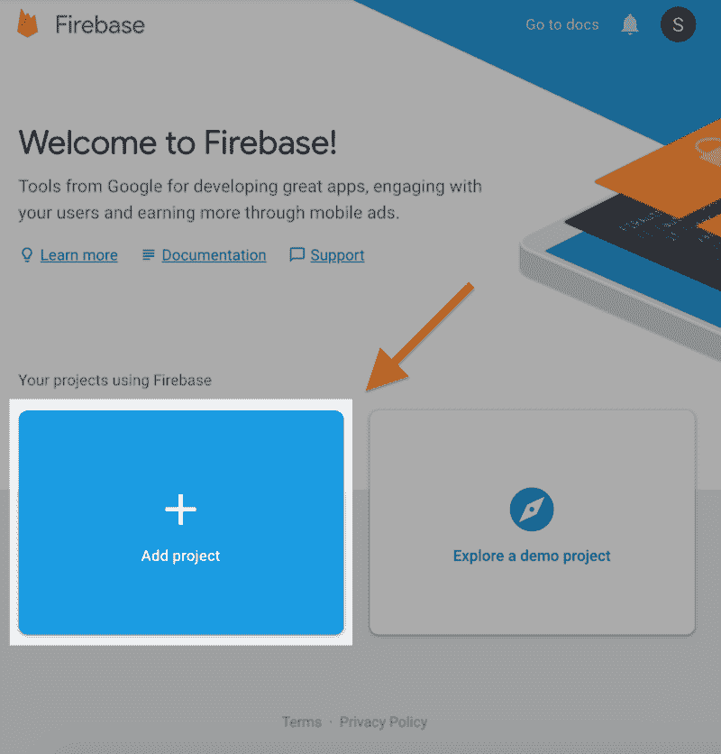

3.输入您的**项目名称**。

*   我用了 ***hello-world*** 作为这个例子。Firebase 会自动为您的项目名称添加一个唯一的 ID——例如，我创建的项目以名称***hello-world-f 2206***结束。

4.你可以挑一个 ***云火店*** 的位置。

*   我把它命名为 *nam5(美国中部)*，因为我住在洛杉矶，但是云功能在 *us-west2* 上不可用，而且中间的流量会产生额外的费用。您可以在这里 找到更多关于服务可用性和服务器位置 [**的信息。**](https://cloud.google.com/about/locations/)

5.接受**条款和条件**。

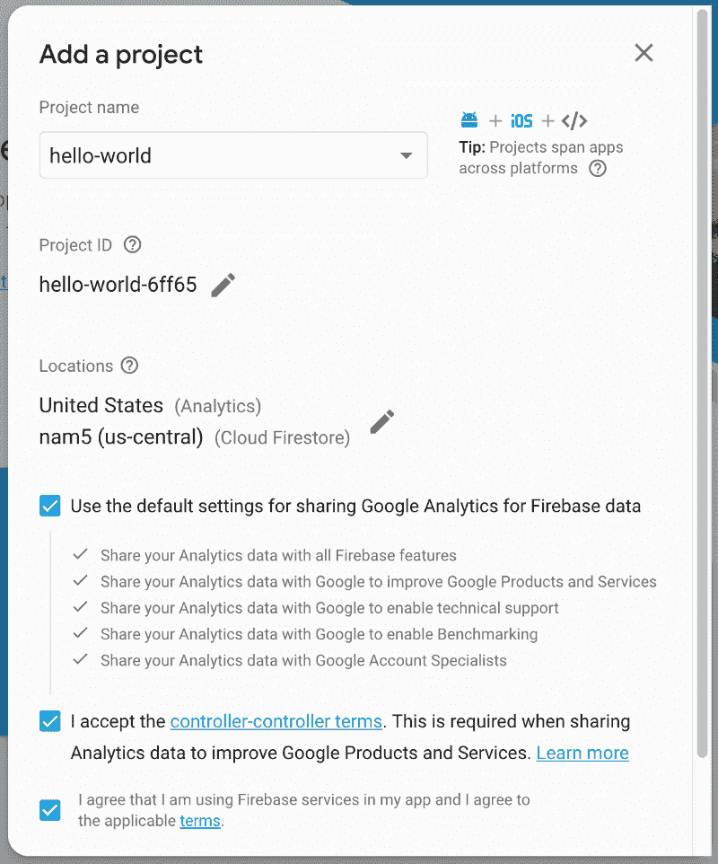

5.完成后，滚动到底部并点击**创建项目**。

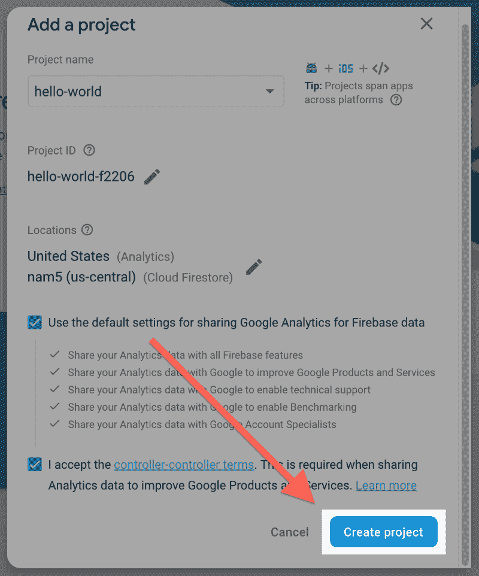

*   如果您遇到要求管理员帐户的错误消息，请参见本文末尾附录中的 **3.1 切换到管理员帐户**。

Firebase 需要一些时间来准备您的应用程序。完成后，点击**继续**按钮，打开 **Firebase 项目概述页面**。

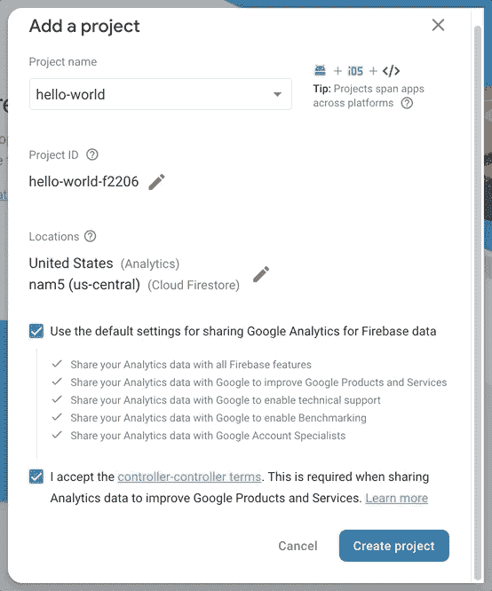

#### 4.配置 iOS 应用程序

1.在你的 **Firebase 项目概述页面**，启动 **iOS** 的设置向导。

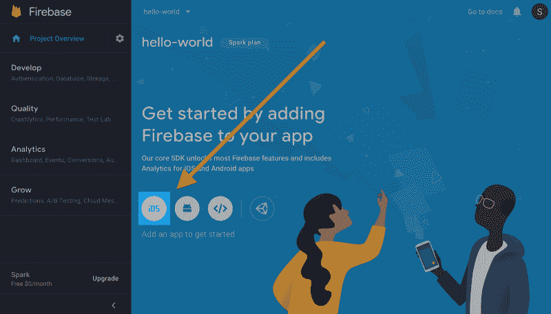

2.在设置向导中，输入 **iOS 包 ID。****注册 app** 按钮应该会亮起，点击它。

*   关于如何找到 iOS 捆绑包 ID 的指南可以在附录的第 **4.1 节找到 iOS 项目根文件夹&获取捆绑包 ID** 中找到。

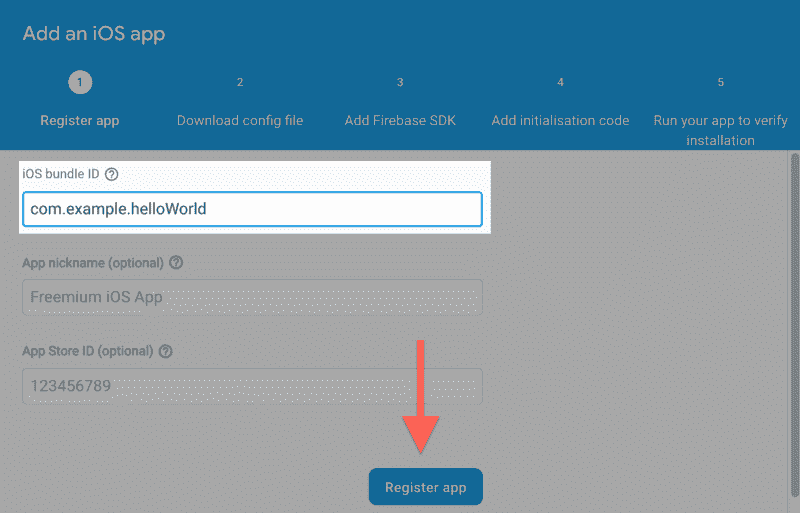

3.下载***Google service-info . plist***配置文件，放入 iOS 项目根文件夹，然后点击**下一步**。

*   关于如何找到 iOS 捆绑包 ID 的指南可以在附录的第 **4.1 节找到 iOS 项目根文件夹&获取捆绑包 ID** 中找到。

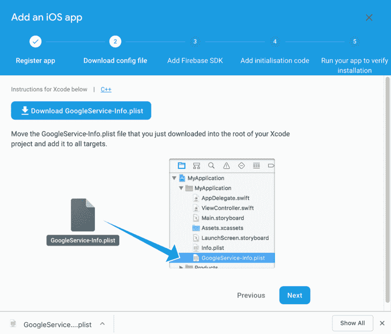

4.按照说明添加 **Firebase SDK** ，然后点击**下一步**。

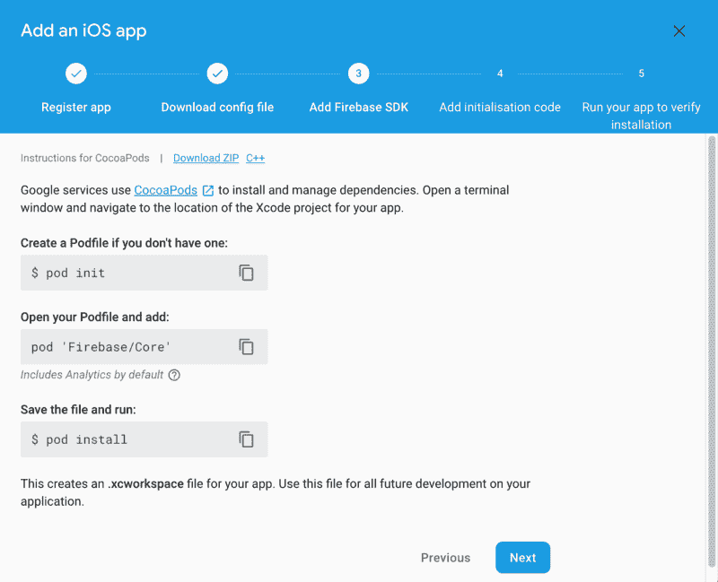

*   关于如何安装 **CocoaPods** 和 **Firebase SDK** 的详细指南可以在下面的 **4.2 节安装 CocoaPods 和 Firebase SDK** 中找到。

5.按照设置向导的指示修改主 **AppDelegate** 中的代码，然后单击**下一步**。对于这个例子，我使用了 **Objective-C** ，因此用下面的代码替换了 ***AppDelegate.m*** 中的内容。

```
#include "AppDelegate.h"
#include "GeneratedPluginRegistrant.h"

@import UIKit;
@import Firebase;

@implementation AppDelegate

- (BOOL)application:(UIApplication *)application
didFinishLaunchingWithOptions:(NSDictionary *)launchOptions {
[FIRApp configure];
return YES;
}

@end
```

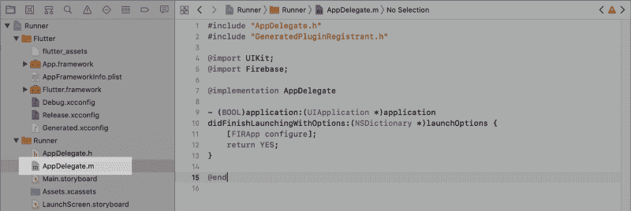

6.回到根文件夹，运行你的应用程序，过一会儿你会看到设置向导显示你的应用程序已经添加到 Firebase。点击**继续到控制台**完成设置。

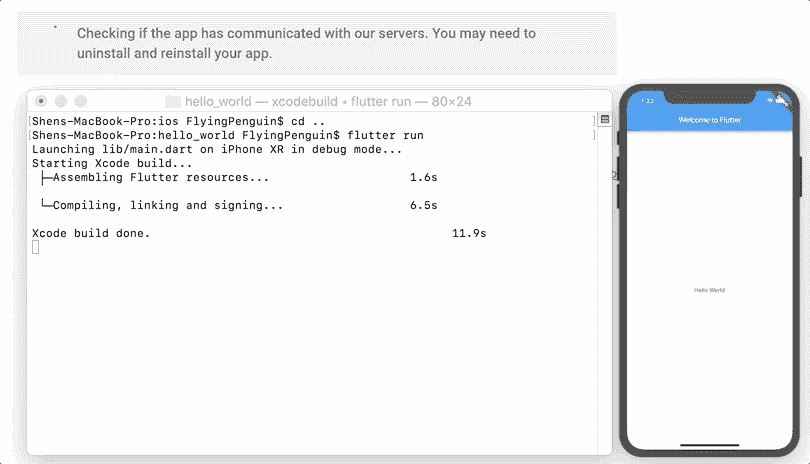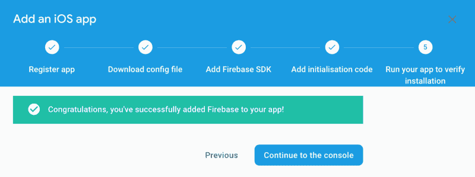

恭喜你！您已经成功地将 Firebase 添加到您的 Flutter 应用程序中。尽管同时拥有 Google 的 Firebase 和 Flutter 非常酷，但总是拥有 B 计划以及 C、D、E、F 和 g 计划实际上是一个很好的软件工程实践，将来我会写另一个关于使用 Firebase 的示例应用程序的指南，以及更多关于 Flutter 的内容。

祝编码愉快！！！

### 附录:

#### 3.1 切换到管理员帐户

如果您遇到以下消息，这意味着您需要联系您的 Gmail 帐户的组织，以授予您访问 **Google 开发者控制台**的权限。

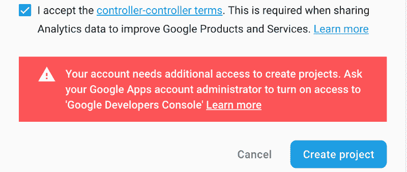

Request for Administrator Account

#### 4.1 查找 iOS 项目根文件夹并获取包 ID

1.从**发射台**发射 **Xcode** 。

2.选择提示屏幕底部的**“打开另一个项目…”**。

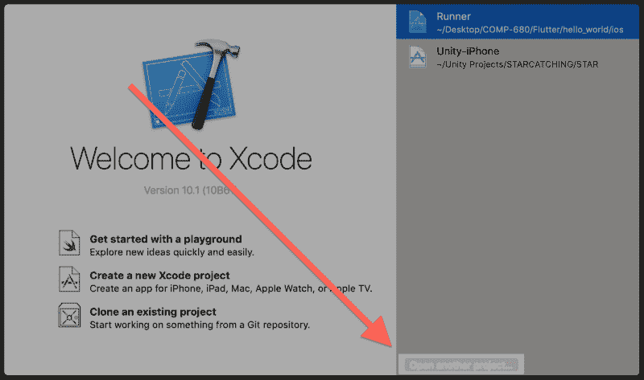

3.导航到你的 Flutter 项目文件夹，打开**“IOs”**文件夹，选择**“runner . xcode proj”**。这应该会自动在 Xcode 中打开项目。

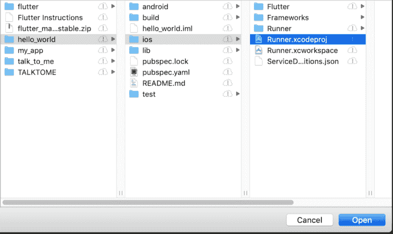

4.选择左边的 **Runner** 项目，你现在应该看到**标识**下的 **Bundle 标识**。

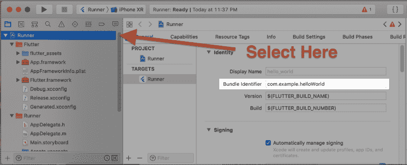

#### **4.2 安装 CocoaPods 和 Firebase SDK**

如果安装向导中的说明不起作用，您必须删除现有的 Podfile 以便正确地重新安装它们。

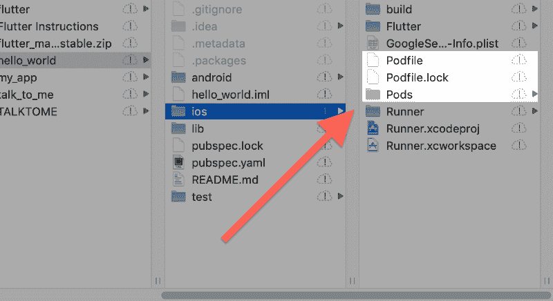

1. **CocoaPods** 由 **Ruby** 构建，可安装默认 **Ruby** 在 **MacOS** 上可用。使用以下命令安装它。

```
sudo gem install cocoapods
```

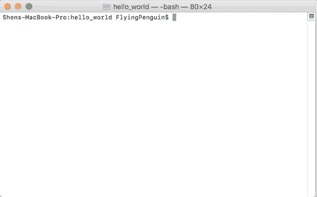

2.用以下命令初始化 ***Podfile*** 。

```
pod init
```

3.然后，将下面的代码添加到初始化后的 ***Podfile*** 中。

```
pod 'Firebase/Core'
```


4.完成后，保存对 ***Podfile*** 所做的更改，并使用以下命令安装 **Firebase SDK** 。

```
pod install
```

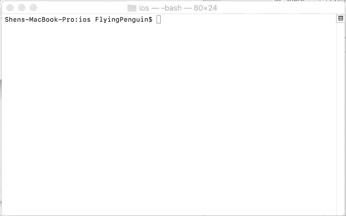

5.安装完成后，您可能需要配置**。*xc config*文件。首先你必须将文件从***Pods/目标支持文件/Pods-Runner*** 文件夹复制到 ***Flutter*** 文件夹。**

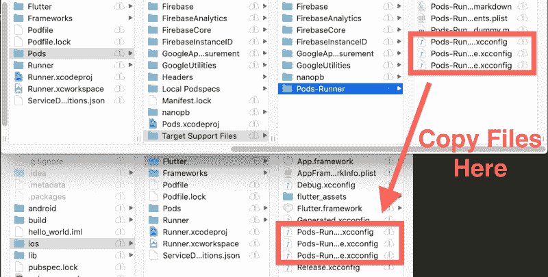

6.然后你必须将它们包含到 ***Flutter*** 文件夹中的 ***Debug.xcconfig*** 和 ***Release.xcconfig*** 文件中。

在 ***Debug.xcconfig*** 中:

```
#include "Pods-Runner.debug.xcconfig"
```

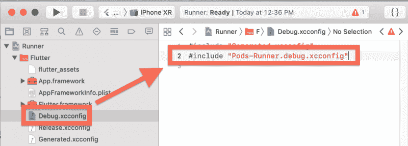

在 ***Release.xcconfig*** :

```
#include "Pods-Runner.profile.xcconfig"
#include "Pods-Runner.release.xcconfig"
```

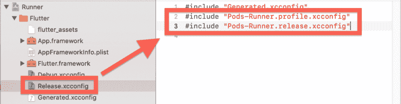