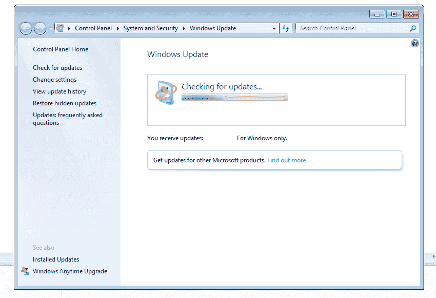

# 如何在 Windows Update 检查更新时修复 Windows 7 Service Pack 1 (SP1)

> 原文：<https://www.freecodecamp.org/news/how-to-fix-windows-7-service-pack-1-sp1-when-windows-update-is-stuck-checking-for-updates/>

有时，当您最近安装了 Windows 7 Service Pack 1 (SP1)，并希望使用 Windows Update 将其更新到最新版本时，它会卡住。它只会永远挂在“正在检查更新…”，像这样:

你可以这样度过这个难关:

请务必在遵循本指南之前安装 Service Pack 1。

微软最近在 2016 年 7 月发布了 Windows Update 客户端更新，作为其更新汇总的一部分。这将修复 Windows Update 扫描。此更新包含对 Windows 7 Service Pack 1 (SP1)中的 Windows Update 客户端的一些改进。

您可以在此下载更新:

32 位版本

64 位版本

如果这不起作用，我会在微软搜索 Service Pack 1 的更新。

请务必阅读微软的 Windows Update 指南。