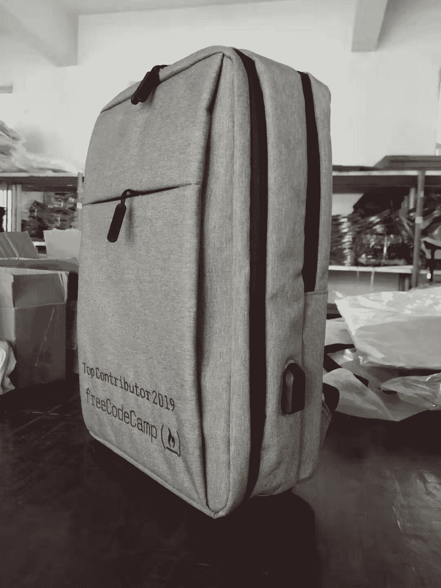

# 介绍 freeCodeCamp 2019 顶级贡献者

> 原文：<https://www.freecodecamp.org/news/fcc100-top-contributors-2019/>

2019 年对于全球免费代码营社区来说是重要的一年。

*   更多的人在论坛上回答问题。
*   我们的出版物有几个新的、冉冉升起的作者。
*   我们的社区已经对我们的课程和学习平台进行了数百次改进。

2019 年，人们使用 freeCodeCamp 的总时间超过 11 亿分钟。那是 2000 年，或者说在任何给定的时刻平均有 2000 人使用 freeCodeCamp。

freeCodeCamp 是一个由捐助者支持的小型非营利组织，只有 7 名全职员工，预算只有 373，119 美元。

然而，我们能够用数百万美元的预算完成一个 100 人的非营利组织的使命。

我们如何做到这一点？

因为我们有一个全球性的志愿者社区。

这些年来，我见过所有这些人，我可以毫不犹豫地说:这些贡献者是我见过的最善良、最体贴的人。

在 2019 年的最后一周，我想表彰他们令人难以置信的努力以及他们今年取得的所有成就。

事不宜迟，这里是 2019 年的顶级贡献者，他们使 freeCodeCamp 帮助世界各地的人们免费学习编码的雄心勃勃的使命成为可能。

一些快速注释:这个列表关注的是通过以下方式做出贡献的人:

*   开源代码库和课程
*   社区出版物
*   社区论坛
*   社区 YouTube 频道

我们给这些顶级贡献者每人发了一个特别版的[限量版 freeCodeCamp 背包](https://www.freecodecamp.org/news/2019-freecodecamp-backpack/)。

一些人已经开始接受他们的。

> 来自 [@freeCodeCamp](https://twitter.com/freeCodeCamp?ref_src=twsrc%5Etfw) 的不错的笔记本电脑背包。非常感谢， [@ossia](https://twitter.com/ossia?ref_src=twsrc%5Etfw) ！【pic.twitter.com/1dXd4zIZ9j 
> 
> — willjw3 (@willjw3) [December 23, 2019](https://twitter.com/willjw3/status/1208966048336072706?ref_src=twsrc%5Etfw)