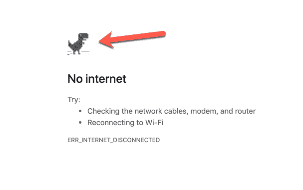
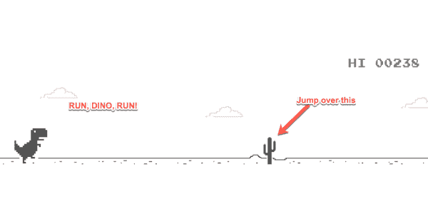
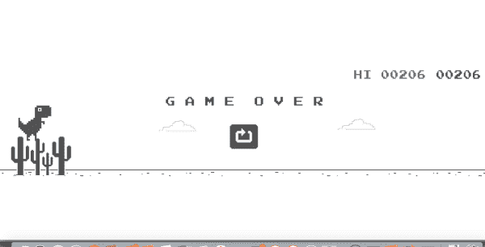
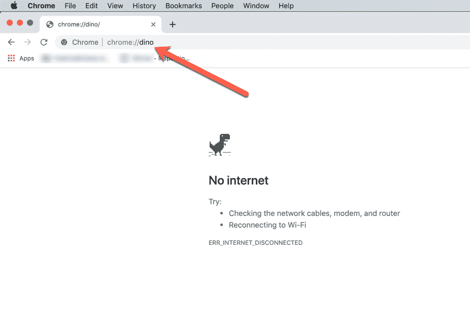
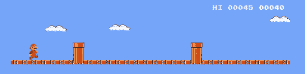
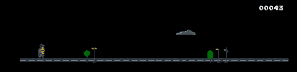
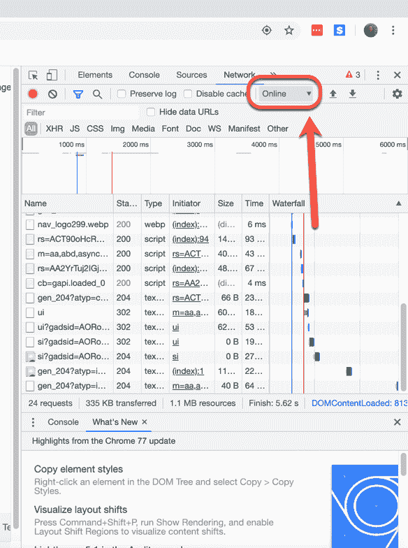
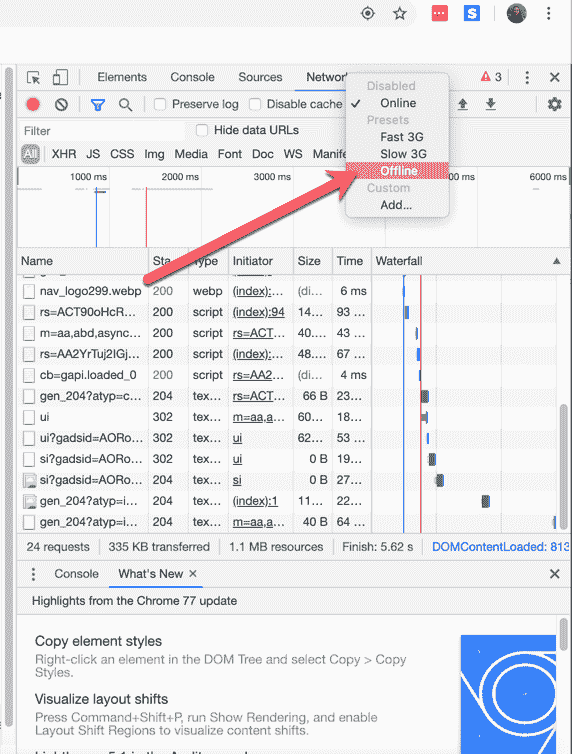
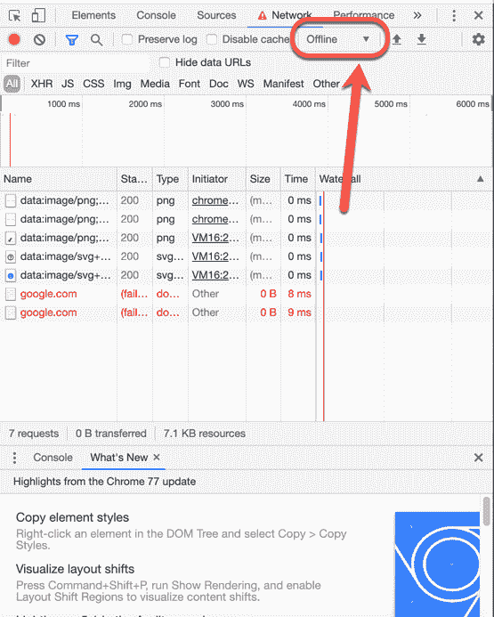

# 如何玩没有互联网的谷歌铬恐龙游戏-在线和离线

> 原文：<https://www.freecodecamp.org/news/how-to-play-the-no-internet-google-chrome-dinosaur-game-both-online-and-offline/>

几年前，谷歌在 Chrome 上添加了一个有趣的小复活节彩蛋:如果你的互联网出现故障，你试图访问一个网页，你会看到“无法连接到互联网”或“没有互联网”的消息，旁边有一只小恐龙。

Dino says no internet today

许多人可能只是认为恐龙是一个可爱的小图标，可以在他们的连接中断时陪伴他们。但是后来有人按了空格键。恐龙开始奔跑。

这个小小的复活节彩蛋已经成为一个受人喜爱的游戏。但是如果你只是想在上网需要休息的时候玩(小心，会上瘾)呢？在这篇文章中，你将学习如何在离线和在线时玩这个游戏。

## 如何离线玩 Chrome dino 或 Trex 游戏

如果你的网络中断了，就打开 Chrome。或者，如果你已经在使用 Chrome，尝试访问任何网页。你会在错误信息旁边看到那个小恐龙。

只需按下空格键(或向上箭头)，恐龙将开始运行。按向上箭头跳过你前进道路上的障碍(如仙人掌)。按住向上箭头的时间越长，迪诺跳得越高。

如果你需要躲在什么东西下面，按向下箭头。

你玩得越久，恐龙跑得越快/地面移动得越快。一旦你撞上了什么东西，游戏就结束了，你必须重新开始(你的分数也会重置)。按空格键可以再玩一次。

## 如何在线玩 Chrome dino 或 Trex 游戏

太好了，你可以在等待网络恢复的时候娱乐一下。但是如果你想在网上玩呢？有几种方法可以做到这一点。

### 访问恐龙网址

在线玩游戏最简单的方法就是访问这个 URL: [chrome://dino/](chrome://dino/) 。只要进入那个链接，瞧，就有你的小恐龙和“没有互联网”的信息。

一旦你看到这条信息，只要按空格键，开始跳过仙人掌。

还有一个非官方的 [Chrome Dino 网站](https://chromedino.com/)，你可以在那里玩一个带有不同声音和图形主题的游戏副本，比如这个《超级马里奥兄弟》主题:

或者这个蝙蝠侠主题加上 20 世纪 60 年代的蝙蝠侠音效:

### 奖励:找到游戏的另一种方法

也许当您的网络中断时，您没有收到 dino 错误信息。也可能你不想故意关掉 wifi 来玩游戏。

因此，如果你有互联网，但想在 Chrome 开发工具中禁用连接，请按 F12 打开开发工具。

单击顶部右侧的“网络”选项卡，然后查找第二行下面的“在线/离线”选项卡:

Look for the little dropdown arrow next to where it says "online".

寻找小下拉箭头，点击它，并选择“离线”(而不是“在线”，如果您当前有连接，应该在这里设置)。

Toggle to "Offline"

一旦你这样做了，如果你试图访问一个网页，你会得到恐龙！你可以像往常一样退出开发工具并点击空格键，让 dino 运行起来。

Play away!

现在您知道如何在没有互联网连接和有互联网连接的情况下找到 dino/Trex 游戏。玩得开心！