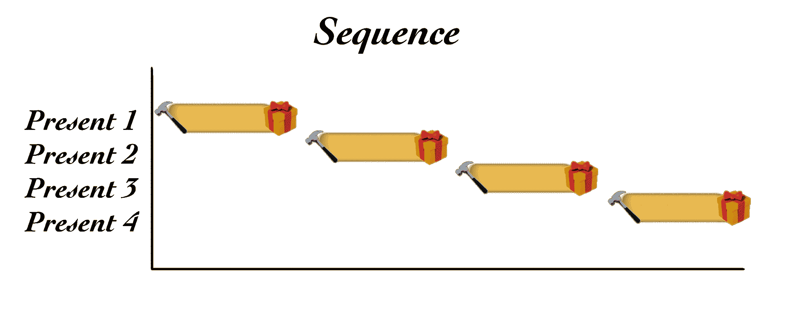
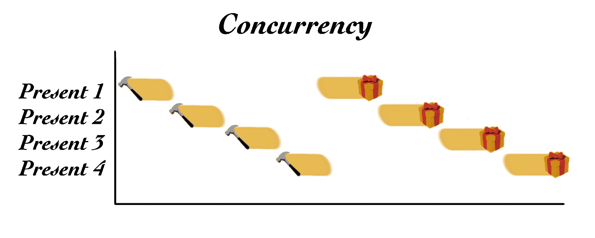
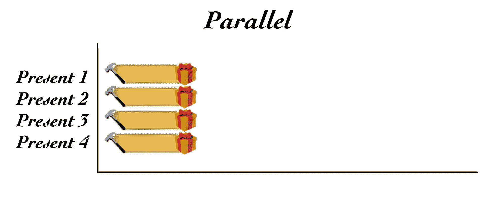

# 并发性、并行性和圣诞老人的多线程？

> 原文：<https://www.freecodecamp.org/news/concurrency-parallelism-and-the-many-threads-of-santa-claus/>

考虑以下情况:圣诞老人给所有的好女孩和男孩带来玩具。

2019 年全球[771.34681 万人](https://en.wikipedia.org/wiki/Demographics_of_the_world#Current_population_distribution)，[约 26.3%](https://en.wikipedia.org/wiki/Demographics_of_the_world#Age_structure)15 岁以下。这相当于今年全世界有 2，028，642，110 名儿童(15 岁以下)。

圣诞老人似乎不会拜访每个宗教的孩子，所以我们将进行归纳，只包括基督徒和不信教的人。总的来说，他们约占总人口的 44.72%。如果我们假设所有的孩子都像他们的父母，那么有 907，208，751.6 个孩子符合圣诞老人的条件。

那些孩子中有百分之多少是好的？不可能知道；然而，我们可以做一些假设。一个是圣诞老人更多的是基于乐观主义而不是经济因素，并且可能已经为每个孩子在任何一年都是好孩子的可能性做好了准备。因此，他准备给每个孩子一个玩具。让我们假设这是很棒的一年，所有 907，208，751.6 个孩子都得到了玩具。

这是一大堆礼物，而且，正如我们所知，它们都是圣诞老人的小精灵们在他的中国北极工作室制作的。假设一年有 365 天，其中一天是圣诞节，让我们假设圣诞老人的精灵们总共有 364 天来制作和包装 907，208，752 份(四舍五入)礼物。这相当于每天 2，492，331.74 份礼物。

几乎每天 250 万份礼物对任何工作室来说都是一项繁重的工作量。让我们来看看 Santa 可能用来实现这个目标的两个范例:并发性和并行性。

## 连续的过程

假设圣诞老人的工作间正好有一个工作非常努力、非常疲惫的小精灵。一件礼物的制作包括四个步骤:

1.  插条
2.  组装和胶合
3.  绘画
4.  礼品包装

对于一个 elf 来说，在任何时候，一个当下只能发生一步。如果 elf 从头到尾一次生产一个礼物，那么这个过程将按顺序执行*。这不是每天生产 250 万份礼物的最有效方法；例如，在进入下一步之前，当礼物上的胶水变干时，小精灵将不得不无所事事地等待。*

**

## *并发*

*为了提高效率，elf 同时处理所有的 present*和*。*

*小精灵不是一次完成一件礼物，而是先把所有玩具的木头都砍了，一个接一个。当所有的东西都被切割后，小精灵就把玩具一个接一个地组装并粘在一起。这个[并发处理](https://en.wikipedia.org/wiki/Concurrent_computing)意味着第一个玩具的胶水有时间变干(不需要小精灵更多的关注)，而剩余的玩具被粘在一起。绘画也是一样，一次一个玩具，最后包装。*

**

*因为一个精灵一次只能做一件事，所以一个精灵通过同时制作礼物来尽可能高效地利用一天的时间。*

## *平行*

*希望圣诞老人的工作室不止有一个小精灵。有了更多的精灵，一天之内就可以同时制造更多的玩具。这种同时进行的工作意味着礼物是以*并行*的方式生产的。[多个精灵执行的并行处理](https://en.wikipedia.org/wiki/Parallel_computing)意味着更多的工作同时发生。*

**

*并行工作的精灵也可以使用并发。一个精灵仍然一次只能处理一个任务，所以让多个精灵同时制作礼物是最有效率的。*

*当然，如果圣诞老人的工作室有 250 万个精灵，那么每个精灵每天最多只需要完成一件礼物。在这种情况下，顺序工作不会降低车间的效率。仍然会有 7668.26 个精灵留下来取咖啡和午餐。*

## *圣诞老人和穿线*

*所有小精灵的辛苦工作完成后，就轮到圣诞老人来送礼物了——总共 907，208，752 个。*

*圣诞老人不需要拜访每个孩子；只对着一棵树。那么圣诞老人需要拜访多少棵树呢？同样广义地说，根据今年的预测生育率，全球每户家庭的平均子女数量为 [2.45。这样就有 370，289，286.4 个房子可供参观。让我们把它四舍五入到 370，289，287。](https://en.wikipedia.org/wiki/Demographics_of_the_world#Total_fertility_rate)*

*圣诞老人有多长时间？传说中说是一个晚上，意思是地球自转一周，因此是 24 小时。北美防空司令部确认了。*

*这意味着圣诞老人必须在 24 小时(86，400 秒)内以每秒 4，285.75 个家庭的速度访问 370，289，287 个家庭，更不用说把礼物放在树下和拿饼干所需的时间了。*

*很明显，圣诞老人不存在于我们的空间。考虑到尽管他胖乎乎的，胖胖的，但他从烟囱里下来(点燃了火，却没有受伤),背着一大袋玩具，里面装着给家里所有孩子的礼物，这种情况尤其可能发生。我们甚至没有考虑到这样一个事实:他的雪橇为全世界每个有信仰的男孩和女孩带去了足够多的玩具，还能飞起来。*

*圣诞老人存在于我们的物理规则之外吗？一个实体如何能够以每秒 4285.75 个家庭的速度在不到 24 小时内环游世界，递送包裹，同时还有时间喝牛奶、吃饼干和亲吻妈妈？*

*有一点是肯定的:圣诞老人使用互联网。还没有其他技术能让包裹走得如此之远、如此之快。即便如此，即使拥有北极所能提供的最好的千兆位互联网连接，试图达到每秒超过 4000 个家庭也不是一个小任务。圣诞老人如何提高效率？*

*这个谜团显然只有一个合乎逻辑的结论:圣诞老人是一个多线程进程。*

## *一根线*

*让我们向外努力。把一个[线程](https://en.wikipedia.org/wiki/Thread_(computing))想象成一个特定的任务，或者圣诞老人可能执行的最细粒度的指令序列。一个线程可以执行任务`put present under tree`。线程是流程的一个组成部分，在本例中，是圣诞老人递送礼物的流程。*

*如果圣诞老人是单线程的，那么作为一个进程，他一次只能完成一项任务。由于他年纪大了，有点健忘，他可能有一套送礼物的说明，以及一个需要遵守的时间表。这两件事引导着圣诞老人的思路，直到他的过程完成。*

**

*单线程圣诞老人可能会这样工作:*

1.  *在提米家降落雪橇*
2.  *从雪橇上拿提米的礼物*
3.  *通过烟囱进入房屋*
4.  *找到圣诞树*
5.  *把提米的礼物放在圣诞树下*
6.  *通过烟囱离开房屋*
7.  *乘雪橇起飞*

*冲洗，重复…再 370，289，286 次。*

## *多线程操作*

*[多线程](https://en.wikipedia.org/wiki/Thread_(computing)#Multithreading)相比之下，圣诞老人是北极的[曼哈顿博士](https://dc.fandom.com/wiki/Jonathan_Osterman_(Watchmen))。世界上仍然只有一个圣诞老人；然而，他拥有惊人的能力，可以成倍增加他的意识，同时完成多个指令集的任务。这些额外的任务工作者或工作者线程是由圣诞老人递送礼物的主进程创建和控制的。*

**

*每个工作线程独立地完成它的指令。由于他们都属于圣诞老人的意识，他们分享圣诞老人的记忆，知道圣诞老人知道的一切，包括他们在哪个星球上跑来跑去，从哪里得到礼物。*

*有了这种共享的知识，每个线程都能够与其他线程并行执行其指令集。这种多线程并行性使得独一无二的圣诞老人尽可能高效。*

*如果平均一次礼物递送运行需要一个小时，那么圣诞老人只需要产生 4286 个工作线程。每个人每小时运送一次，圣诞老人将在晚上结束时完成所有 370，289，287 次旅行。*

*当然，从理论上讲，圣诞老人甚至可以产生 370，289，287 个工作线程，每个线程飞到一户人家，给里面所有的孩子送去礼物！这将使圣诞老人的过程变得非常高效，也解释了他是如何设法吃完所有的牛奶饼干而不感到饱的。？？？？*

## *高效快乐的多线程圣诞节*

*多亏了现代计算机，我们现在终于明白了圣诞老人是如何完成这个看似不可能完成的任务的，那就是给全世界的好孩子送玩具。从我的家庭到你的，我希望你有一个美好的圣诞节。别忘了把你的袜子挂在路由器架上。*

*当然，这些都无法解释驯鹿是如何飞起来的。*