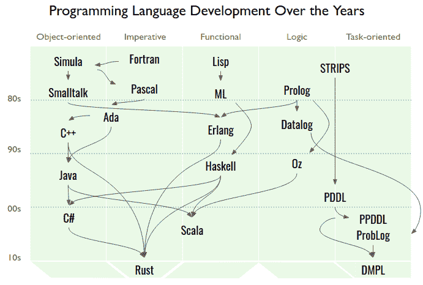
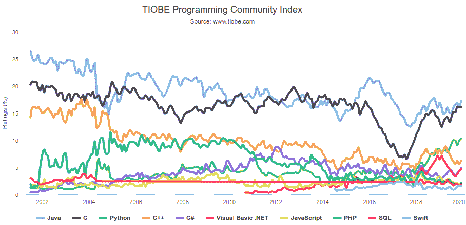

# 面向任务编程导论

> 原文：<https://www.freecodecamp.org/news/dmpl/>

火星上的车辆使用封装在数百万行 C 语言中的软件自动调节、规划和导航。现在，如果硬件限制不是一个问题，你会选择什么语言来编写外星机器人的逻辑、决策流程和推理？

一些人喜欢 Python 的简洁，而另一些人欣赏 Rust 的健壮，但是为一个项目选择一种语言有着深远的影响。问问任何一位语言学家就知道了:

> "语言塑造了我们的思维方式，并决定了我们能思考什么."本杰明·李·沃尔夫；开创了语言相对论

> "我的语言的限制意味着我的世界的限制."
> ——路德维希·维特斯坦根；数学家、逻辑学家和哲学家

> "一种不影响你思考编程方式的语言是不值得了解的."艾伦·珀利斯；图灵奖的第一位获奖者

对于编程语言来说，没有放之四海而皆准的标准，所以通过研究现有的东西来扩展我们的视野是值得的。

对现存的成千上万种编程语言进行分类不是一件容易的事情，但是多年来的软件趋势已经揭示了两种独占框架:命令式(面向对象)和声明式(函数式)语言。

*   **命令式** : 程序员定义如何执行算法，如何访问内存。例子包括 C++、JavaScript 和 Python。

*   **声明式** : 程序员定义函数的组成，让运行时优化算法。例子包括 Haskell、Erlang 和 OCaml。

描述声明式和命令式编程区别的经典方式是，声明式语言让程序员描述**做什么**做什么，而命令式语言让程序员定义**如何做**做什么。

如果我们将这个想法扩展到第三种类型的语言，让程序员定义**为什么做出**选择，那么我们就发现了面向任务的编程语言。

*   **面向任务** : 程序员定义想要的状态，让运行时解析动作的组合。例子包括 DMPL、PDDL 和 DTProbLog。

下图总结了这些范例，并详细描述了这些年来语言是如何相互影响的。语言的种类比比皆是，而这一切都是从不到一个世纪前开始的！



Arrows between languages represent influence. Languages are placed in columns corresponding to their primary paradigm, even though some languages are multi-paradigm. For a more robust breakdown, please see *Figure 1\. Genealogy of Programming Languages*, from Farooq et. al. ([https://doi.org/10.1371/journal.pone.0088941](https://doi.org/10.1371/journal.pone.0088941))

面向任务的语言给我们思考代码的方式带来了一个新的视角。在本文中，我们将详细介绍其含义。

下面的部分提炼了是什么让一些语言在今天如此受欢迎(以及为什么受欢迎程度可能不是选择一种语言而不是另一种语言的好指标)。

接下来的部分将介绍如何在不同的范例中实现一个算法。

最后，我们讨论了每种范式在哪些方面做得特别好。

## 为什么要坚持使用一种语言？

在成千上万种编程语言中，你可能想知道是什么将你最喜欢的语言与一种新创造的语言区分开来。通常，将开发人员束缚住的是以下因素的组合:

*   APIs 框架:有时候你真的需要使用一个在许多语言中并不常见的库。例如，OpenCV 是一个计算机视觉库，与 C++或 Python 配合得非常好，但对其他一些语言的支持有限，如 Elixir。
*   学习曲线:有些语言需要多年的学习才能掌握，比如 Haskell，而其他语言，比如 Python，让你通过反复试验偶然发现想要的行为。
*   文档:较老的语言，如 C，由于多年的改进，通常有成熟的文档。然而，在达到稳定之前，新的语言可能会很快超越其原始规范。
*   **社区:**例如，Stack Overflow 让您安心，因为您并不是一个人在解决一些最困难的编程挑战。较新的语言可能没有已建立的社区，所以有时你只能靠自己。
*   **性能:** C/C++是编译成机器代码，执行某些算法比 JavaScript 等更高级的解释语言更高效的语言。
*   优雅:如果你是一个真正的浪漫主义者，那么这种语言的语法和哲学可能是你选择坚持使用一种语言的关键因素。
*   健壮性:类型安全、提供信息的错误消息和直观的内存管理，这些都是语言的方方面面，让程序员不用担心手头的任务。
*   遗产:有时“事情总是这样做的”这一论点往往是保持传统的唯一理由。

事实上，命令式语言无疑是工业界最受欢迎的语言(见下图)，也许是因为这些语言已经成功地满足了上述大部分标准。然而，你已经读到了本文的这一点，所以我打赌你愿意尝试一些新的东西。



Source: [https://www.tiobe.com/tiobe-index/](https://www.tiobe.com/tiobe-index/)

我们将要深入一些具体的例子，所以抓紧了，系好安全带，请把你的手臂放在车内。

## 比较语言

假设你想为火星探测器编写一个算法，智能地将视频记录发送回地球上的任务控制中心。行星之间没有高速光纤连接，所以视频发送的顺序真的很重要。

视频记录列表可以定义如下:

```
videos = [
    {name: "Excavation", minutes: 22, anomaly: true},
    {name: "Sky panoramic", minutes: 11, anomaly: false}
]
```

Each video has a name, duration, and anomaly indicator.

假设 mission control 只对检索运行时间少于 20 分钟的视频感兴趣，那么您将编写一个算法来相应地对视频进行排序。在接下来的几节中，我们将看到不同的语言范例如何实现这个简单的任务。

### 强制性实施

如果通过`videos`数组的`for`循环是你的第一直觉，那么你就像命令式程序员一样思考。例如，您可能想在循环中使用一个`if`语句，有选择地将短于 20 分钟的视频添加到一个队列中，如下所示:

```
 queue = []
for (var i = 0; i < videos.length; i++) {
    if (videos[i].minutes < 20) {
        queue.push(items[i])
    }
} 
```

Imperative languages look a lot like this. Although this code is valid JavaScript, read it as pseudo-code for your favorite imperative language. 

变量`queue`和`i`分别用初始值`[]`和`0`声明。然后剩下的代码指定 ***如何*** 更新变量。

### 功能实现

函数式程序员傻笑着，并向我们展示了一个优雅的一行程序:

```
queue = videos.filter(x => x.minutes < 20)
```

Functional languages look like this. This example is in JavaScript again, but the general idea of passing functions as arguments is what matters here.

这里，`filter`是一个基于谓词缩小数组的函数。焦点不再是关于变量如何通过算法更新，而是关于 ***什么*** 数据转换需要发生以产生期望的结果。

### 面向任务的实现

在面向任务的语言中，你定义目标和可能的动作。在我们的例子中，目标是挑选短于 20 分钟的视频。

制定目标的一种方法是按照偏好顺序列出情况，比如`[{minutes: 10}, {minutes: 40}]`，它宣称`minutes == 10`比`minutes == 40`更有利。

```
preference = [{minutes: 10}, {minutes: 40}]
```

This is how we define that a smaller duration of time is preferred over a larger duration.

操作是从`videos`列表中选择一个视频。我们使用的是`fork`语句，这是一个一般化的`if`语句。传统的`if`语句执行第一个满足的进入条件，但是`fork`语句考虑所有满足的进入条件，并通过及时向前搜索(例如深度优先搜索)来选择最符合我们偏好的一个。


A `fork` in the road. (Photo by [Jens Lelie](https://unsplash.com/@leliejens?utm_source=ghost&utm_medium=referral&utm_campaign=api-credit))

程序员列出候选选项，并让运行时解决可能采取的最佳路径。这样，定义系统行为的一些认知负荷就从程序员身上卸下来了。

```
#{model: [preference]}
fork {
    _ {
        name, minutes, anomaly = videos[0]
        print name
    }
    _ {
        name, minutes, anomaly = videos[1]
        print name
    }
}
```

This fork statement contains two candidate blocks. The `_` before each block is a shortcut to say the entry-condition of that block is trivially true. The `#{model: ...}` decorator above the `fork` informs the run-time about how to resolve a fork. (For pedagogical purposes, the above example is written in a verbose way.)

该语言的运行时通过挑选一个候选块来解决分叉，这将增加情况的效用。在这种情况下，运行时将选择持续时间较短的视频。

## 理解每种范式的力量

让我们面对它，为了让代码保持相关性，它需要被持续地维护。重构、增强和扩展有时会变得有点可怕。这就是为什么这三种范式都支持自己的机制来处理不断变化的需求。

**命令式语言中的面向对象设计**:程序员不是直接访问数据，而是定义接口，接口隐藏了数据如何变化的实现细节。这样，你就可以用新的问题即插即用这些*对象*，而不需要用所有的小细节来淹没自己。

**纯函数**在函数式语言中:一个纯函数稍微像一个查找表(像字典或者地图)。它保证了无论软件如何演化，纯函数都不会意外地更新超出其作用域的变量。将纯函数链接在一起会创建更复杂的纯函数，让您可以轻松地进行重构，而不用担心全局变量。

面向任务语言中的任务:任务让你解释想要的行为，而不需要详述具体的计划。例如，定义一个人晚餐可能想吃什么不同于写一份食谱来概述厨房中的精确步骤。语言的运行时负责汇编完成任务的指令，而程序员负责仔细定义理想的状态。

例如，在我们的火星漫游者的例子中，假设需求已经改变:任务控制现在只想检索有异常的视频。考虑如何重写命令式、函数式和面向任务的代码。

我会让你考虑前两个，但是在面向任务的语言中，简单地改变目标来改变程序行为:

```
preference = [{anomaly: true}, {anomaly: false}]
```

This says anomalous videos are preferred.

随着系统在复杂性方面的成熟，面向任务的语言揭示了强大的抽象，允许程序员更有效地扩展和改变他们系统的行为。程序员专注于定义**为什么**，而运行时编写**如何** *。*这种目标与行动的明确分离有助于减轻由于不可预见的边缘情况而导致的软件失败。

这些面向任务的语言可能有一天会成为创作视频游戏代理(NPC)、工业机器人、聊天机器人或任何决策系统的行为的事实标准。编程语言设计的技术成熟度甚至还没有达到青春期——例如，与汽车的历史相比，我们甚至还没有开发出福特 t 型车。现在是冒险者探索新的基本软件原理的时候了。

如果你想尝试一下 [DMPL](http://w3.org/2019/11/dms) ，加入 [W3C](https://www.w3.org/community/conv/) 对话界面社区群组，关注 [@binroot](https://twitter.com/binroot) 了解更多公告、新闻和讨论。