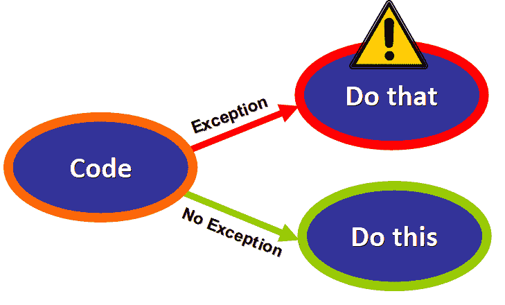
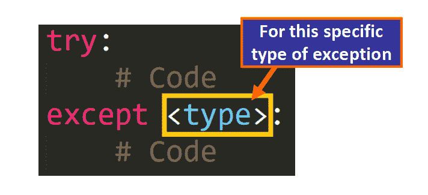
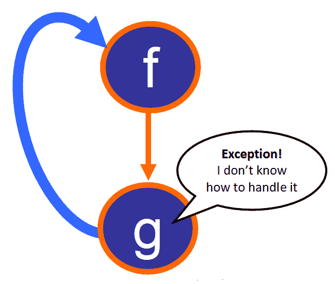
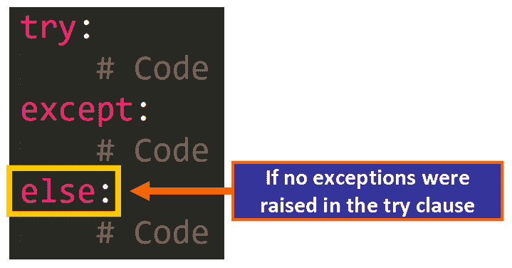
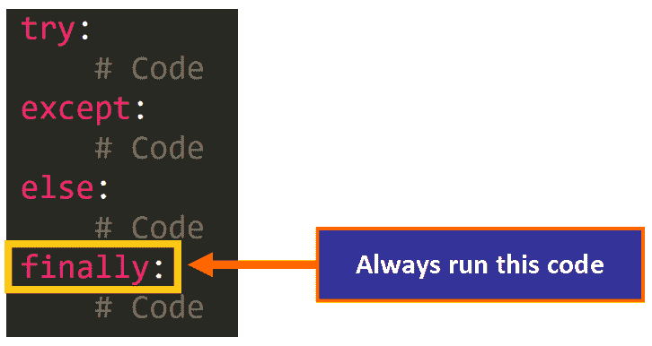
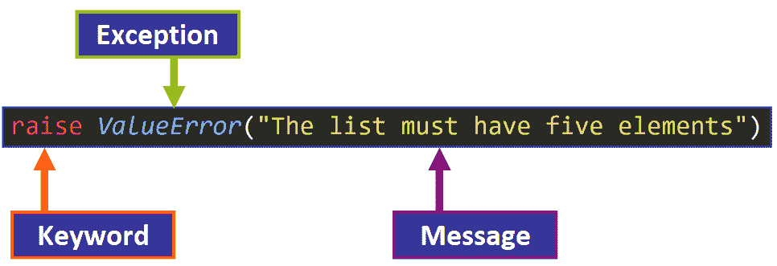

# 如何在 Python 中处理异常:详细的可视化介绍

> 原文：<https://www.freecodecamp.org/news/exception-handling-python/>

欢迎光临！在本文中，您将学习如何在 Python 中处理异常。

**我们将特别介绍:**

*   例外
*   异常处理的目的
*   try 子句
*   例外条款
*   else 子句
*   finally 子句
*   如何引发异常

你准备好了吗？我们开始吧！😀

## 1️⃣例外介绍

我们将从例外情况开始:

*   它们是什么？
*   **为什么**它们相关吗？
*   **为什么**你应该处理它们？

根据 [Python 文档](https://docs.python.org/3/tutorial/errors.html#exceptions):

> 在执行过程中检测到的错误被称为 ***异常*** ，并且不是无条件致命的。

当程序在执行过程中遇到错误时，就会引发异常。它们扰乱了程序的正常流程，通常会突然终止。为了避免这种情况，您可以抓住它们并适当地处理它们。

您可能在您的编程项目中见过它们。

如果您曾经尝试在 Python 中被零除，您一定会看到以下错误消息:

```
>>> a = 5/0
Traceback (most recent call last):
  File "<pyshell#1>", line 1, in <module>
    a = 5/0
ZeroDivisionError: division by zero
```

如果您试图用一个无效的索引来索引一个字符串，您肯定会得到这个错误消息:

```
>>> a = "Hello, World"
>>> a[456]
Traceback (most recent call last):
  File "<pyshell#3>", line 1, in <module>
    a[456]
IndexError: string index out of range
```

这些是例外的例子。

### 🔹常见例外

有许多不同类型的异常，它们都是在特定情况下出现的。在项目工作中，您最有可能看到的一些例外情况是:

*   **IndexError**——当你试图索引一个列表、元组或字符串超出允许的界限时引发。例如:

```
>>> num = [1, 2, 6, 5]
>>> num[56546546]
Traceback (most recent call last):
  File "<pyshell#7>", line 1, in <module>
    num[56546546]
IndexError: list index out of range
```

*   当你试图访问一个字典中不存在的键值时引发。例如:

```
>>> students = {"Nora": 15, "Gino": 30}
>>> students["Lisa"]
Traceback (most recent call last):
  File "<pyshell#9>", line 1, in <module>
    students["Lisa"]
KeyError: 'Lisa'
```

*   **NameError** -当代码中引用的名称不存在时引发。例如:

```
>>> a = b
Traceback (most recent call last):
  File "<pyshell#10>", line 1, in <module>
    a = b
NameError: name 'b' is not defined
```

*   当一个操作或函数被应用到一个不合适类型的对象时引发。例如:

```
>>> (5, 6, 7) * (1, 2, 3)
Traceback (most recent call last):
  File "<pyshell#12>", line 1, in <module>
    (5, 6, 7) * (1, 2, 3)
TypeError: can't multiply sequence by non-int of type 'tuple'
```

*   当你试图被零除时引发。

```
>>> a = 5/0
Traceback (most recent call last):
  File "<pyshell#13>", line 1, in <module>
    a = 5/0
ZeroDivisionError: division by zero
```

💡**提示:**要了解更多关于其他类型的内置异常，请[参考 Python 文档中的这篇文章](https://docs.python.org/3/library/exceptions.html)。

### 🔸**解剖异常**

我相信您一定注意到了这些错误消息中的一般模式。让我们一点一点地分解它们的一般结构:


首先，我们找到这条线(见下文)。一个**回溯**基本上是一个列表，详细列出了在异常发生之前进行的函数调用。

回溯在调试过程中会对您有所帮助，因为您可以分析导致异常的函数调用序列:

```
Traceback (most recent call last):
```

然后，我们会看到这一行(见下文)以及文件的路径和引发异常的行。在本例中，路径是 Python shell <pyshell>,因为该示例是在空闲状态下直接执行的。</pyshell>

```
File "<pyshell#0>", line 1, in <module>
   a - 5/0
```

**💡提示:**如果引发异常的行属于一个函数，<模块>被替换为函数名。

最后，我们会看到一条描述性消息，详细说明异常的类型，并提供额外的信息来帮助我们调试代码:

```
NameError: name 'a' is not defined
```

## 2️⃣异常处理:目的和背景

你可能会问:为什么我要处理异常？为什么这对我有帮助？通过处理异常，您可以提供另一种执行流程来避免程序意外崩溃。

### 🔹示例:用户输入

想象一下，如果使用你的程序的用户输入了一个无效的输入，会发生什么。这将引发异常，因为在此过程中执行了无效的操作。

如果你的程序不能正确处理这个问题，它会突然崩溃，用户会对你的产品感到非常失望。

但是如果你处理了这个异常，你将能够提供一个替代方案来改善用户的体验。

也许您可以显示一条描述性消息，要求用户输入一个有效的输入，或者您可以为输入提供一个默认值。根据上下文，当发生这种情况时，您可以选择做什么，这就是错误处理的魔力。可以在意想不到的事情发生时化险为夷。⭐️

### 🔸幕后发生了什么？

基本上，当我们处理一个异常时，我们是在告诉程序如果出现异常该做什么。在这种情况下，执行的“替代”流程将会拯救我们。如果没有引发异常，代码将按预期运行。



## 3️⃣时间编码:尝试...except 语句

既然您已经知道了什么是异常以及为什么我们应该处理它们，我们将开始深入研究 Python 语言为此提供的内置工具。

首先，我们有一个最基本的说法:尝试...除了。

让我们用一个简单的例子来说明这个问题。我们有一个小程序，要求用户输入学生的名字来显示他/她的年龄:

```
students = {"Nora": 15, "Gino": 30}

def print_student_age():
    name = input("Please enter the name of the student: ")
    print(students[name])

print_student_age()
```

请注意，我们此时没有验证用户输入，因此用户可能会输入无效的值(字典中没有的名称),其后果将是灾难性的，因为如果出现 KeyError，程序将会崩溃:

```
# User Input
Please enter the name of the student: "Daniel"

# Error Message
Traceback (most recent call last):
  File "<path>", line 15, in <module>
    print_student_age()
  File "<path>", line 13, in print_student_age
    print(students[name])
KeyError: '"Daniel"'
```

### 🔹句法

我们可以使用 try 很好地处理这个问题...除了。这是基本语法:


在我们的示例中，我们将添加 try...函数中的 except 语句。让我们一点一点地分解它:

```
students = {"Nora": 15, "Gino": 30}

def print_student_age():
    while True:
        try:
            name = input("Please enter the name of the student: ")
            print(students[name])
            break
        except:
            print("This name is not registered")

print_student_age()
```

如果我们“放大”，我们会看到尝试...except 语句:

```
try:
	name = input("Please enter the name of the student: ")
	print(students[name])
	break
except:
	print("This name is not registered")
```

*   当调用该函数时，try 子句将运行。如果没有引发异常，程序将按预期运行。
*   但是如果 try 子句中出现异常，执行流将立即跳转到 except 子句来处理该异常。

**💡注意:**这段代码包含在一个 while 循环中，如果值无效，它将继续请求用户输入。这是一个例子:

```
Please enter the name of the student: "Lulu"
This name is not registered
Please enter the name of the student: 
```

这很棒，对吧？现在，如果值无效，我们可以继续要求用户输入。

目前，我们正在用同一个 except 子句处理所有可能的异常。但是如果我们只想处理特定类型的异常呢？让我们来看看如何做到这一点。

### 🔸捕捉特定异常

由于不是所有类型的异常都以相同的方式处理，我们可以使用以下语法指定我们想要处理的异常:



这是一个例子。我们正在处理 ZeroDivisionError 异常，以防用户输入零作为分母:

```
def divide_integers():
    while True:
        try:
            a = int(input("Please enter the numerator: "))
            b = int(input("Please enter the denominator: "))
            print(a / b)
        except ZeroDivisionError:
            print("Please enter a valid denominator.")

divide_integers()
```

这将是结果:

```
# First iteration
Please enter the numerator: 5
Please enter the denominator: 0
Please enter a valid denominator. 

# Second iteration
Please enter the numerator: 5
Please enter the denominator: 2
2.5
```

我们正在正确地处理这件事。但是...如果引发了另一种类型的异常，程序将不会优雅地处理它。

这里我们有一个 ValueError 的例子，因为其中一个值是 float，而不是 int:

```
Please enter the numerator: 5
Please enter the denominator: 0.5
Traceback (most recent call last):
  File "<path>", line 53, in <module>
    divide_integers()
  File "<path>", line 47, in divide_integers
    b = int(input("Please enter the denominator: "))
ValueError: invalid literal for int() with base 10: '0.5'
```

我们可以定制如何处理不同类型的异常。

### 🔹多重 Except 子句

为此，我们需要添加多个`except`子句来不同地处理不同类型的异常。

根据 [Python 文档](https://docs.python.org/3/tutorial/errors.html#handling-exceptions):

> 一个 try 语句可能有不止一个 except 子句，为不同的异常指定处理程序。**最多执行一个句柄**。

在这个例子中，我们有两个 except 子句。其中一个处理 ZeroDivisionError，另一个处理 ValueError，这两种类型的异常都可能在这个 try 块中引发。

```
def divide_integers():
    while True:
        try:
            a = int(input("Please enter the numerator: "))
            b = int(input("Please enter the denominator: "))
            print(a / b)
        except ZeroDivisionError:
            print("Please enter a valid denominator.")
        except ValueError:
            print("Both values have to be integers.")

divide_integers() 
```

💡提示:您必须确定在 try 块中可能会引发哪些类型的异常，以便适当地处理它们。

### 🔸多个异常，一个 Except 子句

您还可以选择用同一个 except 子句处理不同类型的异常。

根据 [Python 文档](https://docs.python.org/3/tutorial/errors.html#handling-exceptions):

> except 子句可以将多个异常命名为带括号的元组。

在这个例子中，我们用同一个`except`子句捕获了两个异常(ZeroDivisionError 和 ValueError ):

```
def divide_integers():
    while True:
        try:
            a = int(input("Please enter the numerator: "))
            b = int(input("Please enter the denominator: "))
            print(a / b)
        except (ZeroDivisionError, ValueError):
            print("Please enter valid integers.")

divide_integers()
```

这两种类型的异常的输出将是相同的，因为它们由相同的 except 子句处理:

```
Please enter the numerator: 5
Please enter the denominator: 0
Please enter valid integers.
```

```
Please enter the numerator: 0.5
Please enter valid integers.
Please enter the numerator: 
```

### 🔹处理 try 子句中调用的函数引发的异常

异常处理的一个有趣的方面是，如果一个函数在另一个函数的 try 子句中调用了一个异常，而该函数本身并不处理它，那么如果有适当的 except 子句，调用方就会处理它。

根据 [Python 文档](https://docs.python.org/3/tutorial/errors.html#handling-exceptions):

> 异常处理程序不仅处理 try 子句中立即出现的异常，还处理 try 子句中调用(甚至是间接调用)的函数内部出现的异常。

让我们看一个例子来说明这一点:

```
def f(i):
    try:
        g(i)
    except IndexError:
        print("Please enter a valid index")

def g(i):
    a = "Hello"
    return a[i]

f(50)
```

我们有`f`函数和`g`函数。`f`在 try 子句中调用`g`。对于参数 50，`g`将引发一个 IndexError，因为索引 50 对于字符串 a 无效

但是`g`本身并不处理异常。注意没有尝试...`g`函数中的 except 语句。因为它不处理异常，所以它将异常“发送”给`f`,看看它是否能处理异常，如下图所示:



由于 f *知道如何处理 IndexError，这种情况得到了很好的处理，输出如下:*

```
Please enter a valid index
```

**💡注意:**如果`f`没有处理这个异常，程序会突然结束，并显示一个 IndexError 的默认错误消息。

### 🔸访问异常的特定详细信息

异常是 Python 中的对象，因此您可以将引发的异常赋给变量。这样，您可以打印异常的默认描述并访问其参数。

根据 [Python 文档](https://docs.python.org/3/tutorial/errors.html#handling-exceptions):

> except 子句**可以在异常名**后指定一个变量。该变量绑定到一个异常实例，其参数存储在 instance.args 中。

这里我们有一个例子(见下文),我们将`ZeroDivisionError`的实例赋给了变量`e`。然后，我们可以在 except 子句中使用这个变量来访问异常的类型、消息和参数。

```
def divide_integers():
    while True:
        try:
            a = int(input("Please enter the numerator: "))
            b = int(input("Please enter the denominator: "))
            print(a / b)
        # Here we assign the exception to the variable e
        except ZeroDivisionError as e:
            print(type(e))
            print(e)
            print(e.args)

divide_integers()
```

相应的输出将是:

```
Please enter the numerator: 5
Please enter the denominator: 0

# Type
<class 'ZeroDivisionError'>

# Message
division by zero

# Args
('division by zero',)
```

**💡提示:**如果你熟悉特殊方法，根据 [Python 文档](https://docs.python.org/3/tutorial/errors.html#handling-exceptions):“为了方便起见，异常实例定义了`[__str__()](https://docs.python.org/3/reference/datamodel.html#object.__str__)`，所以参数可以直接打印出来，而不必引用`.args`。”

## 4️⃣:现在让我们加上“else”从句

`else`子句是可选的，但它是一个很好的工具，因为它让我们执行只有在 try 子句中没有出现异常时才应该运行的代码。



根据 [Python 文档](https://docs.python.org/3/tutorial/errors.html#handling-exceptions):

> [`try`](https://docs.python.org/3/reference/compound_stmts.html#try) … [`except`](https://docs.python.org/3/reference/compound_stmts.html#except) 语句有一个**可选的** *else 子句*，当出现该子句时，必须跟在所有 except 子句之后。如果 try 子句没有引发异常，这对于必须执行的代码**很有用。**

下面是一个使用`else`子句的例子:

```
def divide_integers():
    while True:
        try:
            a = int(input("Please enter the numerator: "))
            b = int(input("Please enter the denominator: "))
            result = a / b
        except (ZeroDivisionError, ValueError):
            print("Please enter valid integers. The denominator can't be zero")
        else:
            print(result)

divide_integers()
```

如果没有引发异常，则打印结果:

```
Please enter the numerator: 5
Please enter the denominator: 5
1.0
```

但是，如果引发了异常，则不会打印结果:

```
Please enter the numerator: 5
Please enter the denominator: 0
Please enter valid integers. The denominator can't be zero
```

💡**提示:**根据 [Python 文档](https://docs.python.org/3/tutorial/errors.html#handling-exceptions):

> 使用`else`子句比在 [`try`](https://docs.python.org/3/reference/compound_stmts.html#try) 子句中添加额外的代码更好，因为它避免了意外捕获一个不是由受`try` … `except`语句保护的代码引发的异常。

## 5️⃣“最后”条款

finally 子句是这个序列中的最后一个子句。它是可选的，但是如果你包含它，它必须是序列中的最后一个子句。即使 try 子句中出现异常，也总是执行`finally`子句**。**

****

**根据 [Python 文档](https://docs.python.org/3/tutorial/errors.html#defining-clean-up-actions):**

> **如果存在 [`finally`](https://docs.python.org/3/reference/compound_stmts.html#finally) 子句，则 [`finally`](https://docs.python.org/3/reference/compound_stmts.html#finally) 子句将作为 [`try`](https://docs.python.org/3/reference/compound_stmts.html#try) 语句完成之前的最后一个任务执行。无论 [`try`](https://docs.python.org/3/reference/compound_stmts.html#try) 语句是否产生异常，都会运行 [`finally`](https://docs.python.org/3/reference/compound_stmts.html#finally) 子句**。****

**finally 子句通常用于执行应该始终完成的“清理”操作。例如，如果我们在 try 子句中处理一个文件，我们将总是需要关闭该文件，即使在我们处理数据时出现了异常。**

**以下是 finally 子句的示例:**

```
`def divide_integers():
    while True:
        try:
            a = int(input("Please enter the numerator: "))
            b = int(input("Please enter the denominator: "))
            result = a / b
        except (ZeroDivisionError, ValueError):
            print("Please enter valid integers. The denominator can't be zero")
        else:
            print(result)
        finally:
            print("Inside the finally clause")

divide_integers()`
```

**这是没有引发异常时的输出:**

```
`Please enter the numerator: 5
Please enter the denominator: 5
1.0
Inside the finally clause`
```

**这是引发异常时的输出:**

```
`Please enter the numerator: 5
Please enter the denominator: 0
Please enter valid integers. The denominator can't be zero
Inside the finally clause`
```

**注意`finally`子句**总是**是如何运行的。**

****❗️Important:** 记住`else`子句和`finally`子句是可选的，但是如果你决定两个都包括，finally 子句必须是序列中的最后一个子句。**

## **6️⃣提出例外**

**既然你已经知道如何在 Python 中处理异常，我想和你分享这个有用的技巧:**你也可以选择何时在代码中引发异常。****

**这在某些情况下会很有帮助。让我们来看看您是如何做到这一点的:**

****

**该行将引发一个带有自定义消息的 ValueError。**

**这里我们有一个函数的例子(见下面),它打印列表或元组的值，或者字符串中的字符。但是您决定让列表、元组或字符串的长度为 5。您用 if 语句开始该函数，该语句检查参数`data`的长度是否为 5。否则，将引发 ValueError 异常:**

```
`def print_five_items(data):

    if len(data) != 5:
        raise ValueError("The argument must have five elements")

    for item in data:
        print(item)

print_five_items([5, 2])`
```

**输出将是:**

```
`Traceback (most recent call last):
  File "<path>", line 122, in <module>
    print_five_items([5, 2])
  File "<path>", line 117, in print_five_items
    raise ValueError("The argument must have five elements")
ValueError: The argument must have five elements`
```

**注意最后一行是如何显示描述性消息的:**

```
`ValueError: The argument must have five elements`
```

**然后，您可以尝试选择如何处理异常...except 语句。您可以添加 else 子句和/或 finally 子句。您可以定制它来满足您的需求。**

### **🔹有用的资源**

*   **[异常情况](https://docs.python.org/3/tutorial/errors.html#exceptions)**
*   **[处理异常](https://docs.python.org/3/tutorial/errors.html#handling-exceptions)**
*   **[定义清理动作](https://docs.python.org/3/tutorial/errors.html#defining-clean-up-actions)**

**我希望你喜欢阅读我的文章，并发现它很有帮助。现在你已经有了在 Python 中处理异常的必要工具，你可以在编写 Python 代码时利用它们。？[查看我的在线课程](https://www.udemy.com/user/estefania-cn/)。你可以在[推特](https://twitter.com/EstefaniaCassN)上关注我。**

**⭐️你可能会喜欢我的其他免费代码营/新闻文章:**

*   **[Python 中的@property 装饰器:它的用例、优点和语法](https://www.freecodecamp.org/news/python-property-decorator/)**
*   **数据结构 101:图表——初学者的直观介绍**
*   **数据结构 101:数组——初学者的直观介绍**