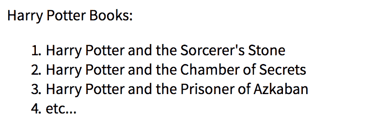
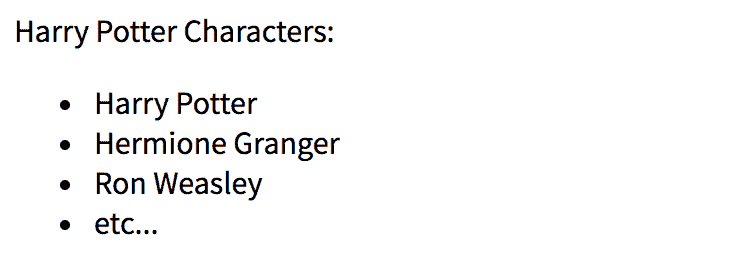
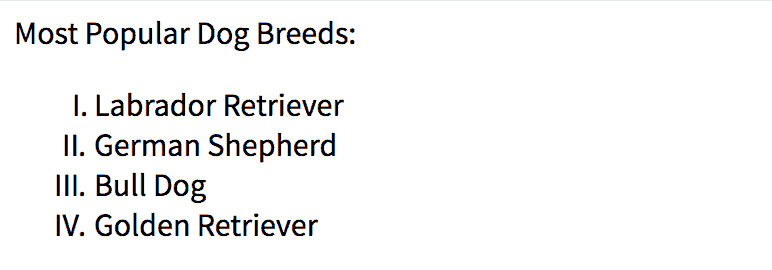
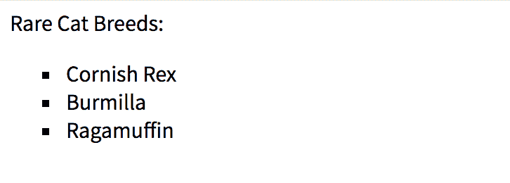
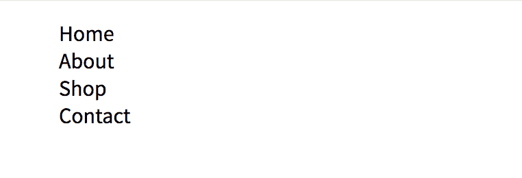
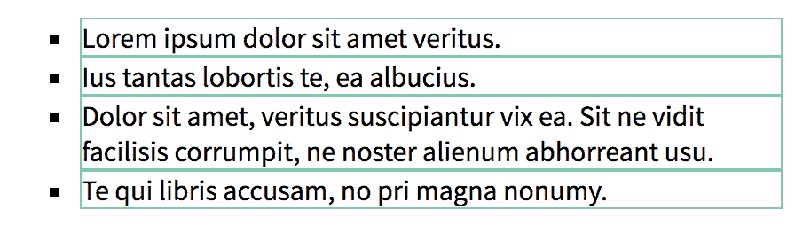
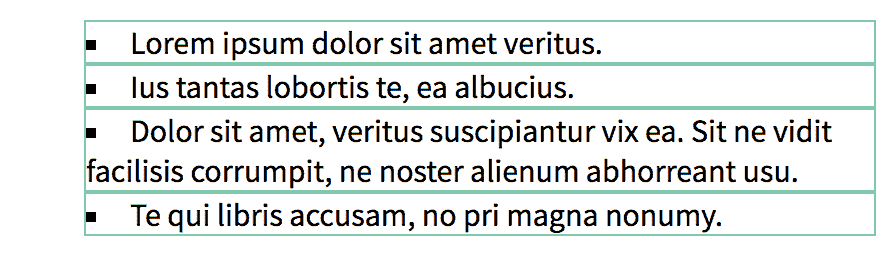
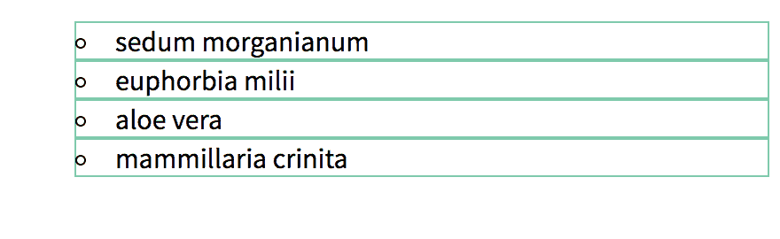
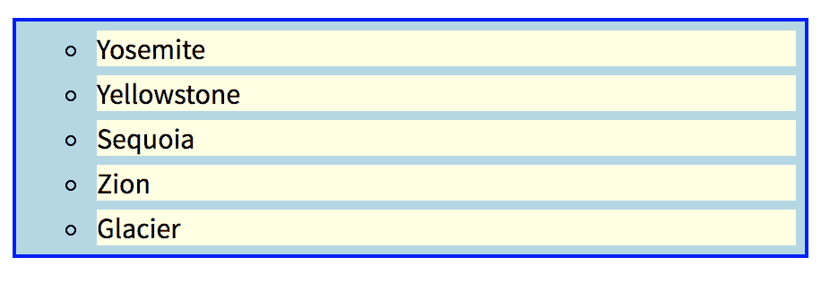
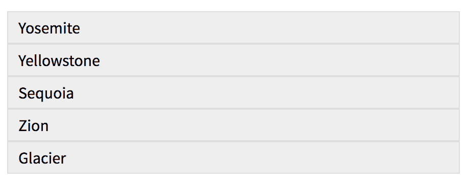

# 如何用 CSS 设计列表样式

> 原文：<https://www.freecodecamp.org/news/how-to-style-lists-with-css/>

### **HTML 列表摘要**

HTML 中的列表主要有两种类型——****有序**** 和 ****无序**** 。

在 ****有序**** 列表(`<ol></ol>`)中，列表项的顺序很重要。这些项目可以按数字、罗马数字、字母数字或其他类型的标记的顺序出现。有序列表的默认标记是一个数字(或`decimal`):



在 ****无序**** 列表(`<ul></ul>`)中，列表项的顺序无关紧要。这些项目以项目符号格式显示。无序列表的默认标记是一个圆形的项目符号点或`disc`。



有序或无序列表中的每个列表项都是用`<li></li>`标签创建的。

### **特定于列表的样式**

有三个特定于样式列表的公共属性:`list-style-type`、`list-style-position`和`list-style-image`。还有一个速记属性包含了这三个属性。

#### **T2`list-style-type`**

有序和无序列表中出现的标记(或项目符号)可以用多种方式进行样式化。用于设置标记类型样式的 CSS 属性是`list-style-type`。有序列表的默认值`list-style-type`是`decimal`，而无序列表的默认值是`disc`。

有序列表示例:

```
/* css */
ol {
  list-style-type: upper-roman;
}
```



无序列表示例:

```
/* css */
ul {
  list-style-type: square;
}
```



无标记示例:

```
/* css */
ul {
  list-style-type: none;
}
```



`list-style-type`属性的可接受值包括:

*无序:*

*   光盘(*默认*)
*   圆
*   平方

*已订购:*

*   十进制(*默认*)
*   十进制前导零
*   下罗马
*   上罗马
*   下希腊语
*   下拉丁语
*   上层拉丁语
*   亚美尼亚人
*   乔治亚的
*   低α
*   上阿尔法

*其他:*

*   没有人

注意:上面列出的所有属性值都可以用于设计有序列表和无序列表(例如:带有`square`列表标记的有序列表)。

#### **T2`list-style-position`**

`list-style-position`控制列表标记是出现在每个列表项元素的内部还是外部(`<li></li>`)。该属性接受两个值，`outside`(默认值)或`inside`。

定位列表项元素的标记`outside`，每个列表项的所有文本行和子行将垂直对齐:

```
/* css */
ul {
  list-style-position: outside; /* default */
}
```



定位标记`inside`，每个列表项的第一个文本行将缩进以给标记腾出空间。同一列表项的任何子行都将与标记对齐，而不是与第一个文本行对齐:

```
/* css */
ul {
  list-style-position: inside;
}
```



#### **T2`list-style-image`**

属性接受一个图像 url 来代替列表标记。该属性的默认值是`none`。

```
/* css */
ul {
  list-style-image: url(https://url-to-image);
}
```

#### **`list-style`速记**

`list-style`是上面列出的三个样式属性的简写属性。`list-style`接受的值的顺序是`list-style-type`、`list-style-position`和`list-style-image`。如果省略任何值，将使用该属性的默认值。

示例:

```
/* css */
ul {
  list-style: circle inside none;
}
```



#### **更多特定于列表的样式**

有序列表标签还接受控制其列表项的流量、计数或特定标记值的属性。这些属性包括`start`、`reversed`和`value`属性。请参阅下面列出的 MDN 资源，了解更多详细信息。

### **一般造型**

列表内容可以像其他`p`或`div`元素一样进行样式化。`color`、`font-family`、`margin`、`padding`或`border`只是可以添加到`ul`、`ol`或`li`元素的属性的几个例子。

注意，添加到`ul`或`ol`元素的任何样式都会影响整个列表。直接添加到`li`元素的样式会影响单个列表项。在下面的示例中，列表和列表项元素的边框和背景色属性的样式不同:

```
/* css */
ul {
  list-style-type: circle;
  border: 2px solid blue;
  background-color: lightblue;
}
li {
  margin: 5px;
  background-color: lightyellow;
}
```



#### **列表间距**

当`list-style-type`设置为`none`时，您可能会注意到列表项前面有额外的间距。将列表元素上的`padding`设置为`0`(或者任何首选的间距)将覆盖这个默认填充。

```
/* css */
ul {
  list-style: none;
  padding: 0;
}
li {
  padding: 5px 10px;
  background-color: #EEEEEE;
  border: 1px solid #DDDDDD;
}
```



#### **来源:**

在编译本文中的信息时引用了下面的链接。请访问他们了解更多关于这个话题的细节。

#### **更多信息:**

[MDN 样式列表](https://developer.mozilla.org/en-US/docs/Learn/CSS/Styling_text/Styling_lists)

[W3Schools - CSS 列表](https://www.w3schools.com/css/css_list.asp)

[CSS Tricks - list-style](https://css-tricks.com/almanac/properties/l/list-style/)